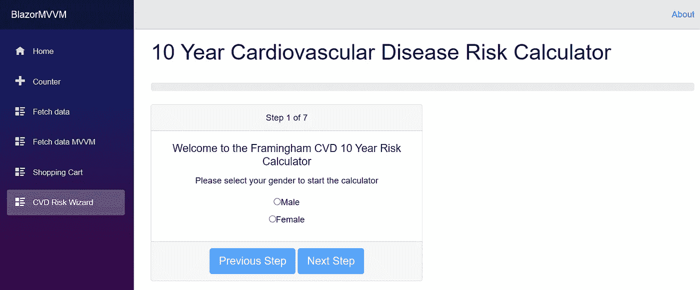
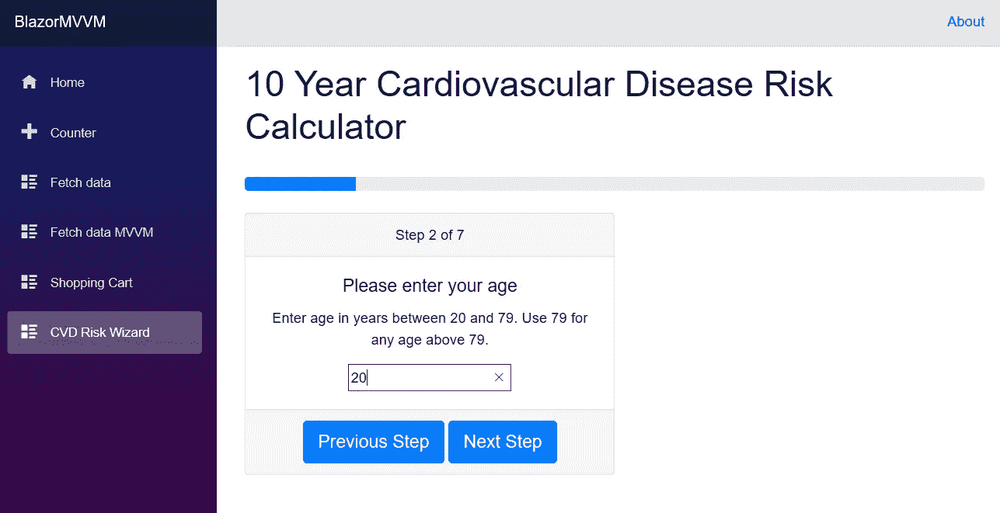

# 用组件和 MVVM 在 Blazor 中构建向导。

> 原文：<https://itnext.io/building-a-wizard-in-blazor-with-components-and-mvvm-96219a7b221c?source=collection_archive---------6----------------------->

这是关于在客户端 Blazor 中实现 MVVM 的一种方法的系列文章中的第七篇。如果您想从头开始阅读所有文章，请从这里开始:

 [## 客户端 Blazor 中一个简单的 MVVM 实现。

### 本文是我将介绍我目前计划如何创建 Blazor 客户端的系列文章的第一篇…

itnext.io](/a-simple-mvvm-implementation-in-client-side-blazor-8c875c365435) 

本文的所有代码都位于我的 Github 存储库中。该向导第一个版本的完整代码可以作为 ArticleSeven 分支或 4.7 版本进行访问。

 [## lchendrick s/blazormvm

### 一个客户端 Blazor MVVM 实现。通过在…上创建帐户，为 lchendricks/BlazorMVVM 的开发做出贡献

github.com](https://github.com/lchendricks/BlazorMVVM) 

在这篇文章中，我们将看看如何在客户端 Blazor 中构建一个向导。这是一个很常见的任务，几乎在我工作过的每一家公司，我都不得不这么做。我们将使用 MVVM，但重点将是建立一个工作向导，所以我们只会有一个单一的模型和一个单一的视图模型。这篇文章的代码变得比前面的例子长得多，所以 100%的代码没有在这篇文章中显示，但是它们都可以在资源库中找到。

# 弗雷明汉风险评分

在这篇文章中，我们将构建一个向导，向用户提出一系列问题，然后计算未来十年患心血管疾病的几率。如果你有兴趣了解更多这方面的知识或一步一步地了解它是如何计算的，你可以在维基百科上阅读:

 [## 弗雷明汉风险评分-维基百科

### Framingham 风险评分是一种性别特异性算法，用于估计心血管疾病的 10 年风险。

en.wikipedia.org](https://en.wikipedia.org/wiki/Framingham_Risk_Score#Scoring) 

该算法获取一系列问题的答案，并使用它们来计算分数。最后，将点数加在一起，总数用于确定十年风险。每个问题的分数以及最终的计算对男性和女性来说都是不同的。

为了封装存储答案和计算风险所需的所有逻辑，我们将创建一个名为`CvdRisk_Model.cs`的新模型。这个模型的类和接口产生了将近 800 行代码，所以我将链接到它，而不是在文章中嵌入整个类。

 [## lchendrick s/blazormvm

### 一个客户端 Blazor MVVM 实现。通过在…上创建帐户，为 lchendricks/BlazorMVVM 的开发做出贡献

github.com](https://github.com/lchendricks/BlazorMVVM/blob/master/BlazorMVVM.Client/Models/CvdRisk_Model.cs) 

首先，我们来看看这个模型的界面，它确实适合屏幕。

查看界面，有一个可以调用的`Func`委托以在流程结束时检索风险分数，一个`CalulateRiskScore()`方法汇总所有已回答问题的分数，然后调用七个方法来设置与模型相关的每个已提问问题的答案。

模型中的大多数方法都充满了`Switch`语句，这些语句根据每个问题的答案来分配分数。正如我们之前所讨论的，点数以及测量点数的方式对于男性和女性来说是不同的，因此构建模型时考虑到了这一点。如果我们查看模型的第 34 行到第 65 行，我们会看到:

对于每一个评估男女答案值不同的方法，我们都声明了一个`Func<T>`。我们问用户的第一个问题将是性别，然后我们将使用这个为每个问题的代表分配正确的方法。这将允许我们工作的其余代码不必关心用户的性别。

# 启动向导

现在我们已经有了一个完全编码的模型，让我们开始构建一个向导，用计算风险分值所需的数据填充它。首先在视图模型文件夹中创建`CvdRisk_ViewModel.cs`。我们希望我们的向导显示一个进度条，让用户知道他们正在进行的当前步骤，并让他们能够在步骤之间导航。让我们从在 ViewModel 中放一些我们可以绑定的代码开始。

我们已经注入了我们的模型，并在 0%完成时开始了步骤 1 中的向导。我们还设置了禁用“上一步”和“下一步”按钮来开始我们的用户，因为他们将处于第一步，还没有回答问题。将这些公共属性放到接口上后，我们现在可以使用 ViewModel 开始构建我们的视图。

在我们的视图文件夹中创建一个名为`CvdRisk.razor`的新视图。更新共享文件夹中的 NavMenu.razor，使新视图可从导航中访问。我们将通过注入我们的视图模型并设置引导进度条来开始视图:

现在，我们将进度条绑定到了视图模型中的公共属性，因此，只要我们正确地更新该值，我们就可以为用户提供一个可视指示器，显示他们离完成还有多远。

为了使向导的构建尽可能简单，我们将在视图中使用一个`switch`语句来显示向导中的正确步骤。我们将把完整的标记放在每个步骤中，这样会给我们的视图增加一些长度和重复的标记。在下一篇文章中，我们将研究如何重构我们的向导，使其更加优雅。

我们将使用引导卡为我们的向导添加一些布局。当我们将我们的`switch`语句和向导的第一步添加到视图中时，我们将看到:

我们已经为我们的用户建立了一个显示信息的卡片，表明他们在过程中的位置并给出第一个指令。它还有“上一步”和“下一步”按钮，以及一个事件，如果该按钮被启用，则允许导航到第二步。我们所需要的是用户能够通过一些输入控件提供他们的性别。

# 构建单选按钮组件

单选按钮似乎是一个让用户选择性别的好选择。他们必须选择女性或男性，不能两者都选。然而，Bootstrap 单选按钮有一个小障碍，我们需要清除它才能在我们的向导中使用。要设置单选按钮 Bootstrap 的初始状态，只需使用`checked`属性，该属性的值只能设置为 empty 或 checked，这两种情况都会导致按钮被选中。由于这个原因，我们不能将一个值绑定到该属性，所以如果我们离开向导步骤，然后再回到向导步骤，我们不能让 ViewModel 直接告诉单选按钮组应该选中哪个按钮。我们如何解决这个问题？我们将创建一个组件来呈现我们的单选按钮组，并正确显示选中的按钮。

在我们的组件文件夹中创建一个新组件`RadioButtonList.razor`。我们将传递按钮组需要作为参数呈现的所有数据，以及我们将用作`EventCallback`的委托方法。这将确保当组件中发生操作时，我们的向导会正确地更新它的显示。下面是我们组件的代码:

我们已经将所有的选择作为一个`List<string>`传入，并使用一个`foreach`循环写出我们按钮组中的所有单选按钮。我们使用一些条件逻辑，只有在循环中的当前选择与之前已经选择的相匹配时，单选按钮上才会出现选中的属性。`MakeChoice`将是当我们单击组中的一个单选按钮时被调用的方法的代表。

为了利用这些参数，我们需要在视图模型中添加更多的属性。将这些成员添加到视图模型，并将公共成员拉至接口:

我们还需要更新我们的构造函数，以做出适当的选择来传递给组件:

我们现在可以更新视图中的案例 1，以使用这个新组件:

如果我们启动我们的应用程序，我们现在将能够在浏览器中看到向导的步骤 1:

# 向向导添加第二步

现在，一旦用户选择了性别，我们就可以让他们进行下一步了。我们已经看到，一旦用户单击一个单选按钮，性别就被保存到 ViewModel 并传递给模型。在那之后，我们打电话给`SetNavButtons`。这个方法还没有做任何事情，但是现在我们需要一些代码。

`SetNavButtons`的目的是确保上一个和下一个按钮在适当的时间被启用和禁用。这意味着在步骤 1 上禁用上一步，并且当计算器完成以及在当前步骤上没有接收到输入时禁用下一步。让我们为这个方法添加一个`switch`语句:

当我们选择性别时，添加的逻辑现在启用下一步按钮，并允许我们进入第二步。

第 2 步要求用户输入他们的年龄，因此我们将向视图模型添加成员，以 int 形式处理年龄。

该公式从 20 开始，一直到 79，因此我们对用户实施了该限制。将它添加到视图模型后，我们可以将案例 2 添加到视图中。因为我们正在抓取一个整数，所以这次我们将使用一个数字输入:

随着视图的更新，我们可以向`SetNavButtons()`添加更多的逻辑来处理向导的第二步。就像我们在步骤 1 中所做的那样，我们只有在收到有效输入时才启用下一步按钮。

如果我们再次启动我们的应用程序，我们现在可以输入我们的性别，导航到步骤 2 并输入我们的年龄。我们甚至会看到进度条在更新。我们还可以在阶段 2 和阶段 1 之间来回导航。

第 3 步到第 7 步与第 1 步和第 2 步完全相同。根据输入，我们使用单选按钮列表或数字输入从用户那里获得所需的信息。这些步骤的所有代码都在 GitHub 存储库中。

# 完成向导

一旦用户回答了所有的问题，我们需要向他们展示从模型中计算出的风险百分比。我们希望用户能够返回并更改数字，如果他们愿意，可以重新计算风险，所以我们将在`SetNavButtons()`调用计算。首先，我们将添加所需的成员来保存结果

然后更新`SetNavButtons()`，以便导航到步骤 8 总是重新计算 CVD 风险。

有了风险评分，我们可以将最终案例添加到我们的视图中，以完成我们的向导:

有了 ViewModel 和视图的完整代码，我们可以再次启动我们的应用程序，回答所有问题并计算风险分数。

我们也可以回去修改我们的答案，并在每次结束时重新计算结果。

# 包扎

在本文中，我们研究了如何使用 MVVM 在客户端 Blazor 中构建向导。我们创建了一个独立的模型，实现了弗雷明汉风险评分算法。然后，我们使用一条`switch`语句在 Razor 视图中创建了一个向导，并构建了必要的视图模型来连接一切。我们还构建了一个自包含的单选按钮组件来满足我们的向导需求。

在我们的视图中有许多剪切和粘贴的重复标记。在下一篇文章中，我们将寻找一种方法来改善我们的观点。