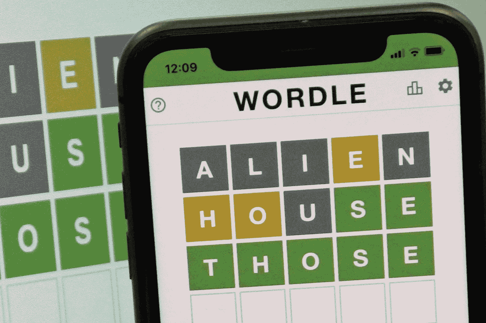
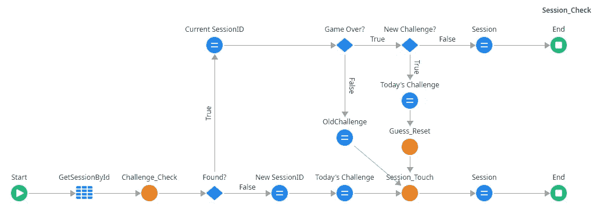
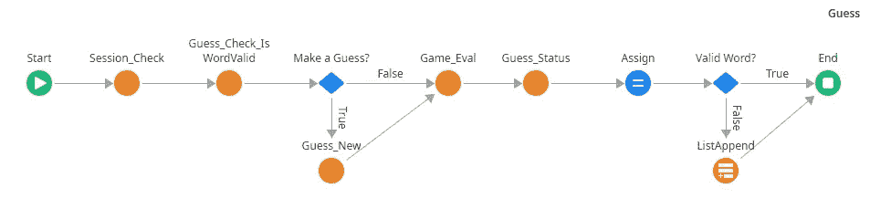
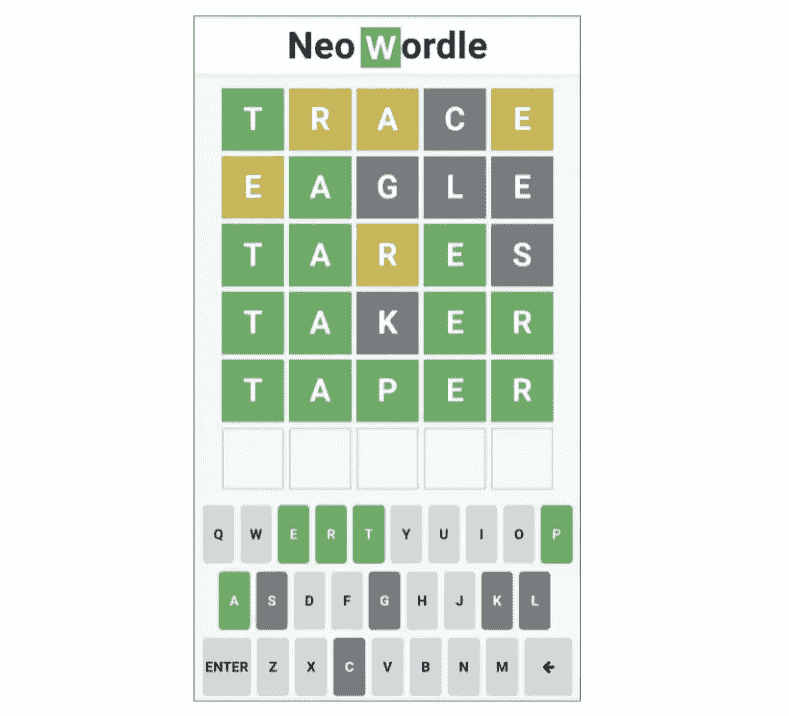
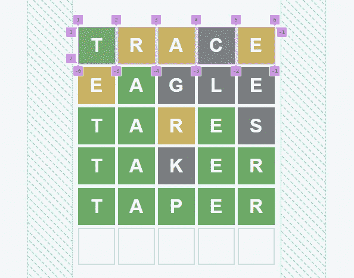
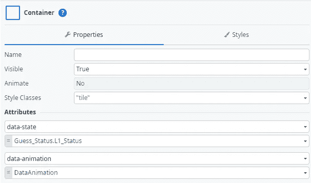
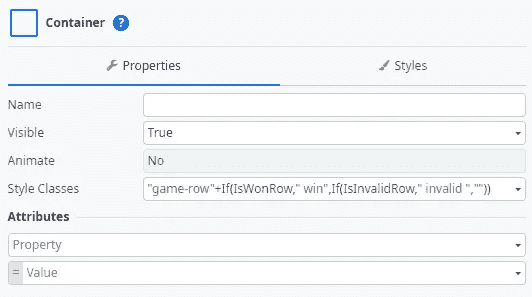
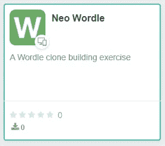

# 使用外部系统构建 Wordle 克隆

> 原文：<https://itnext.io/building-a-wordle-clone-using-outsystems-bd705fe6971?source=collection_archive---------0----------------------->

图片来自纽约邮报[的一篇文章](https://nypost.com/2022/02/11/wordle-allegedly-hacked-viral-game-spoiled-in-ny-times-shift/)

> Wordle 是一款基于网络的文字游戏，由 Josh Wardle 开发。玩家有六次机会猜测一个五个字母的单词，每次猜测都会以彩色瓷砖的形式给出反馈，指示字母何时匹配或占据正确的位置。Wordle 有一个单一的每日解决方案，所有玩家都试图猜出同一个单词。

有趣的是，大约 5000 年后，人类仍然喜欢玩文字游戏，并称赞沃德尔夫妇发明了如此有趣的游戏。它勾选了所有现代的复选框，每个人都有相同的词，导致竞争和分享你的分数的吹嘘权利，更不用说一个伟大的思想挑战。

所以我在想，用外部系统创建一个 Wordle 克隆体需要什么。

我试图实现游戏接近原来，这里是一些亮点。

## 不要在客户端暴露解决方案和词表。

单词列表、当前解决方案和所有未来解决方案都显示在客户端应用程序上(至少在《纽约时报》改变它之前)，作为一名技术专家，环顾四周是非常诱人的。

也是应用安全的基石，不要在客户端暴露信息。任何人都可以访问它。

因此，我们需要一个简单的会话 id 存储在客户端，并将所有其他信息保存在服务器端。这将允许应用程序识别客户端和游戏停止的位置。

从这里开始，服务器接管并处理游戏会话流。

服务器还处理 UI 汇总的每个猜测。

## 用户界面

试图尽可能地接近原版游戏，甚至放弃传统的外部系统布局，直接使用 flex。

另一个有趣的地方是 CSS 类和属性的结合使用。

与在 Style Class 属性上使用表达式相比，这是一种更简洁的方法。

该游戏仍然缺少一些功能，如得分，分享你的分数，配置和当你失败时结束游戏。

规则也有很大的修改空间，比如输了之后再试一次，或者玩另一个单词，而不是等到第二天，甚至设置一些难度来使用更难猜的单词。

另一个引人入胜的观点是用信息论来构建一个解决 Wordle 的机器人。看看这些:[用信息论解单词](https://www.youtube.com/watch?v=v68zYyaEmEA&t=3s&ab_channel=3Blue1Brown)和[哦，等等，实际上最好的单词开瓶器不是“起重机”](https://www.youtube.com/watch?v=fRed0Xmc2Wg&ab_channel=3Blue1Brown)

想玩一局新单词游戏吗？

像往常一样，这个演示可以在[锻造](https://www.outsystems.com/forge/component-overview/12563/neo-wordle)上获得！

玩得开心，去构建那些应用吧！

还有一个关于这个的视频…