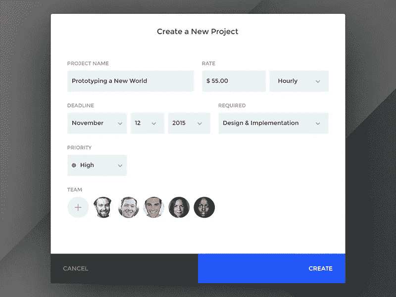

# 在 React 中构建可访问且一致的表单

> 原文：<https://itnext.io/building-accessible-and-consistent-forms-in-react-22f3551e38a4?source=collection_archive---------0----------------------->

由 Paul Flavius Nechita 创建一个新的项目模型

作为开发人员，我们花费大量时间构建表单、设计验证策略并确保提交数据的一致性。[表单是 UI/UX 人](https://uxdesign.cc/search?q=better%20forms)的热门话题，他们写了无数文章剖析完美表单领域，讨论它的解剖结构并细致记录它的行为。然而，开发商在好日子里翻白眼，在其余时间里想掐死他们的 UX 同行。表格很难，表格很无聊，表格很乏味。

我认为问题的一部分是我们开发人员在处理表单元素时看不到模式——它们看起来都非常不同，每个都有自己的一套要求和行为，除此之外，我们还为多种状态获得了一套像素级的完美设计，这对于一个简单的表单输入来说似乎是一种巨大的努力。许多界面元素，比如卡片、菜单、标签，都有可预测的模式，并且可以隔离成数据结构，然后映射到特定的组件。然而，当涉及到表单时，我们变得非常有表现力，编写了 200 行 HTML 来呈现标签、输入和帮助文本，然后我们开始添加验证逻辑，然后我们意识到我们需要处理错误状态，然后我们需要实现各种状态之间的转换，然后我们需要找出键盘可访问性，等等。如果您从一开始就没有一个策略，您的表单就会变得一团糟，并且您很难在不破坏其他东西的情况下引入修改，并且对标记的任何更改都会变成对大量视图和组件的耗时的演练。

那么，作为开发人员，我们该如何改进我们的表单工作流程呢？我最近在 React 上看到了几篇关于[数据驱动表单方法的文章，所以我想分享一下我在这方面的知识:我将展示我如何隔离字段模式，使我的表单干燥，同时保持视觉一致性、可访问性和数据完整性。](https://medium.com/javascript-in-plain-english/data-driven-approach-to-forms-with-react-c69fd4ea7923?source=bookmarks---------5------------------)

让我们从识别组成表单域的单个元素开始。在这样做的同时，让我们也考虑一下可访问性，尤其是 HTML 规范给我们带来的机会和需求。

# 野外解剖学

## 输入元素

为了实现一致性，我们需要做的第一件事是放弃本地浏览器输入事件。我们希望所有字段一致地处理输入事件，也就是将更新后的值传递给更改处理程序，而不是在事件属性中挖掘目标值和状态。最终，我们不关心触发了什么事件，我们关心输入的新值。如果需要的话，您总是可以持久化事件，并通过处理程序参数传递它(我还没有遇到过这种需要)。

如果我们同意我们所有的输入元素总是接受两个道具:`onChange`和`value`，我们就可以构建任意数量的以相同方式运行的自定义输入，从而允许我们在表单中一般化数据流。

## 标签元素

`<label>`标签是走向现场可及性的重要一步。浏览器和屏幕阅读器识别标签和输入元素之间的关系。因此，让我们确保我们的字段有一个惟一的 **id** 。

同时，让我们也允许传递一些帮助文本，让用户知道我们对他们的期望。

我们现在有了一个通用的字段组件，它接受输入组件的元素类型，并将其与字段标签和帮助文本一起呈现。

关于标签的问题，让我们记住我们可以将我们的`<input>`嵌套在`<label>`标签中，这样它就可以在没有 id 的情况下对键盘/鼠标触发做出反应。这在使用单选按钮、复选框和自定义文件输入时很方便。

# 现场可达性

当谈到自定义输入的可访问性时，我们希望确保:

*   我们的输入有一个`tabindex`，可以通过使用键盘`tab`键来实现
*   我们的输入有一个明确的焦点状态
*   我们的输入值可以使用鼠标和键盘来更改(例如，按下复选框上的`space`键)

让我们创建一个拨动开关:

不幸的是，这个开关只能用鼠标来切换。不管出于什么原因，如果用 React 呈现，标签是不可聚焦的，它们的行为也不像在普通 HTML 中那样。尝试仅使用键盘在 [w3schools](https://www.w3schools.com/howto/howto_css_switch.asp) 切换开关，然后在 React 组件中做同样的操作。

我使用的解决方法是在父组件上设置一个`tabIndex`,并将点击和键盘事件绑定到元素:

接下来，您可能希望能够以编程方式关注自定义 input 元素。所以，让我们用`useImperativeHandle`来实现它。我们可以将自定义输入的焦点方法代理到自定义输入组件树中的特定元素。

# 现场验证

我们的字段需要的另一个重要功能是验证。在实现表单验证时要记住的一件事是，有些字段不能自行验证，例如，重复密码字段需要知道原始密码输入的值才能评估其条件。因此，我更喜欢在表单级别验证我的字段，而不是在单个输入中。

[React Hook Form](https://react-hook-form.com/) 是我在工作中一直使用的一个神奇工具，我真的很高兴它给了我灵活性。

让我们设置一个表单组件，它将接受一组字段并呈现一个表单。

注意，我的表单有一个可选的`formName`。我使用这个值来生成特定于表单的错误消息，我将在后面演示。

现在，让我们更新我们的字段组件以支持验证和错误消息。React Hook 表单库提供了一个`Controller`组件，我们可以使用它将我们的自定义输入与他们的验证 API 集成在一起。

我们的字段组件可以基于表单名称、规则名称和字段名称的组合来确定要显示的错误消息，从而为我们提供了很大的灵活性来定位要显示给用户的错误。

我们现在要做的就是将我们的字段传递给表单组件，瞧，我们有了一个可访问的表单，带有同步和异步验证，以及多语言上下文特定的错误。

今天到此为止。如果你有问题，请告诉我。