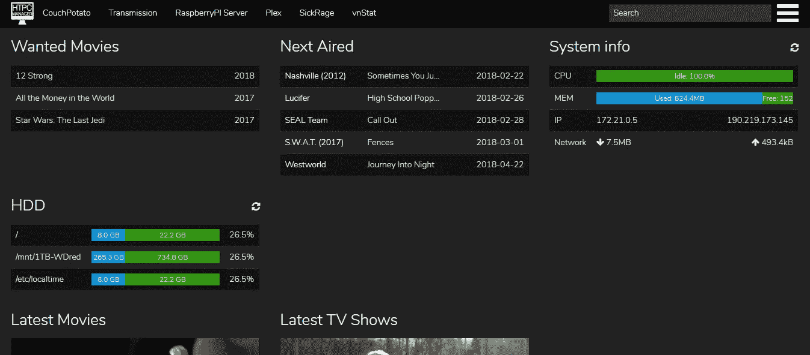
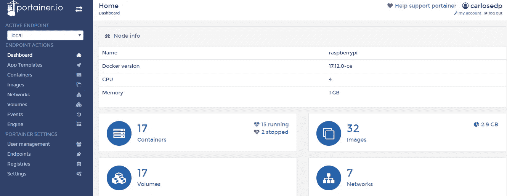
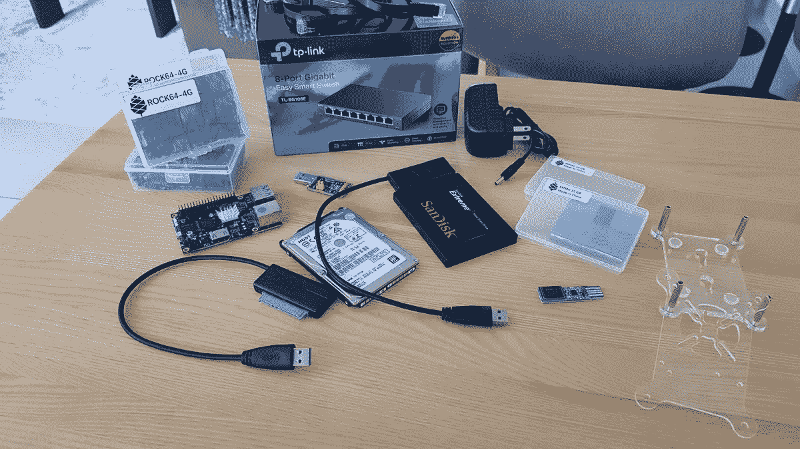
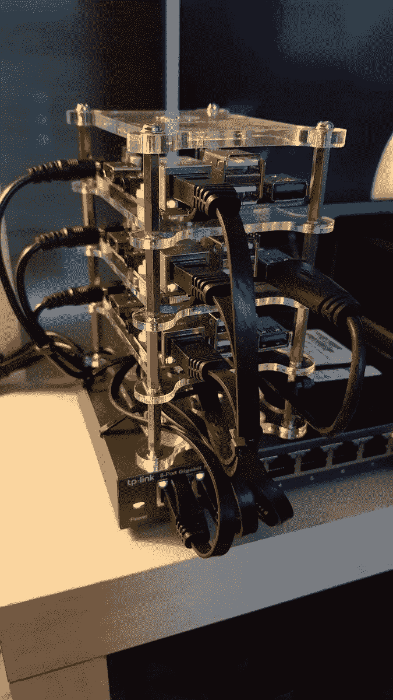
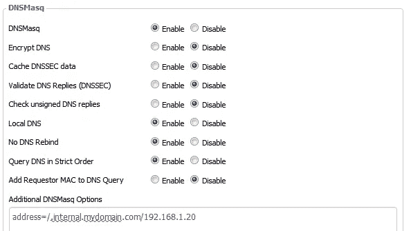
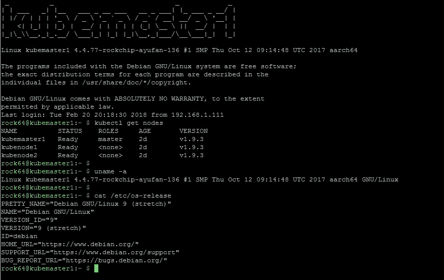
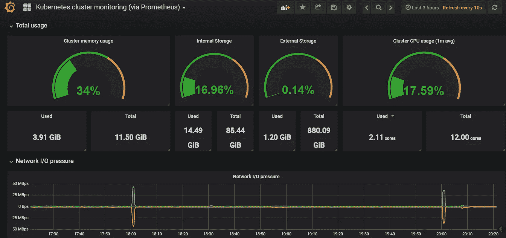
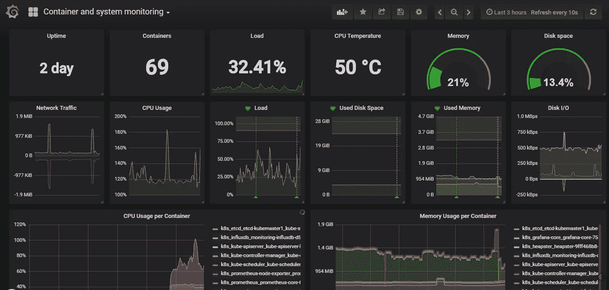

# 构建 ARM Kubernetes 集群

> 原文：<https://itnext.io/building-an-arm-kubernetes-cluster-ef31032636f9?source=collection_archive---------0----------------------->

> 自从我发布了这篇文章，我已经有超过 30k 的浏览量和大量的反馈。我最近写了一篇关于部署 Kubernetes 1.13 和一些新增内容的更新文章。请查阅[https://medium . com/@ carlosedp/building-a-hybrid-x86-64-and-arm-kubernetes-cluster-e 7 f 94 ff 6 e 51d](https://medium.com/@carlosedp/building-a-hybrid-x86-64-and-arm-kubernetes-cluster-e7f94ff6e51d)并以此为参考了解更多详情。

在本指南中，我想分享我使用 Rock64 板和 SBC(如 Raspberry Pi 等单板计算机)构建完整的 Kubernetes 集群(具有负载平衡器、入口和外部存储)的经验及其背后的历史。我学到了一些经验，对于拥有一个完全集成的环境，避免我在这个过程中遇到的一些问题可能会有帮助。

## 树莓 Pi 3 首发

在我开始玩我的第一个 SBC，一个 Raspberry Pi 3 之后，我部署了一个完整的[媒体服务器栈](https://github.com/carlosedp/rpi-media-server)，由 Transmission、SickRage、CouchPotato、Plex 和 HTPCmanager 组成(基于来自 [HTPCGuides](https://www.htpcguides.com/arm-pi-media-server-installer-images-download-page/) 的漂亮包)。工作之后，我开始将所有这些应用程序转换成 Docker 容器，并使用 docker-compose 文件自动部署。后来我部署了一套完整的[监控解决方案](https://github.com/carlosedp/arm-monitoring)和[管理](https://github.com/carlosedp/container-mgmt)，由 [Portainer](https://portainer.io/) 、cAdvisor、 [Prometheus](https://prometheus.io/) 、 [Grafana](https://grafana.com) 甚至 [Traefik](https://traefik.io/) 组成，将一些 app 作为入口和 HTTPS 前端(带 Letsencrypt 证书)暴露在互联网上。



在这个过程中，我学到了很多东西，我必须构建许多映像来运行这些应用程序，组成部署，甚至在 Travis 上设置一个 [CI 来自动交叉构建 AMD64/ARM32/ARM64](https://travis-ci.org/carlosedp/) 的 [Docker 映像。](https://hub.docker.com/r/carlosedp/)



但是它并没有就此停止，在阅读了大量关于用这些 Pi 构建家庭集群的文章之后，我真的想要一个。但是更强大。

## 硬件选择

我最终选择了 Pine64 的 [Rock64](https://www.pine64.org/?page_id=7147) SBC，这是一款四核 A53 ARM 板，可以运行 64 位 Linux，4GB RAM 和一个 eMMC 连接器，使用这种内存来代替 Pi 上使用的缓慢的 sd 卡。这是我的购物清单:

*   3 个 Rock64 4GB SBCs，带电源和散热器
*   3 张 32GB eMMC 存储卡
*   USB3 转 SATA 适配器，用于运行外部存储驱动器
*   1 个外部 SATA 磁盘，用于通过 NFS 存储部署数据
*   [串行转 USB 适配器](https://www.pine64.org/?product=padi-serial-console)(对调试和初始配置很重要)
*   [USB 转 eMMC 适配器](https://www.pine64.org/?product=usb-adapter-for-emmc-module)将图像刷新到 eMMC 模块
*   [TP-Link 8 端口](http://amzn.to/2F0IzJ6)千兆以太网 Easy 智能交换机
*   一个[可堆叠机箱](http://amzn.to/2F2udYC)和扁平[以太网电缆](http://amzn.to/2COZ7l8)

一切都到了，准备好享受一个愉快的周末。



## 规划和安装

由于我已经在规划集群，所以我为我的家庭网络做了一个简单的 IP 规划。这对于设置用于客户端的 DHCP 范围、负载平衡器范围和固定 IP 非常重要。

```
Network: 192.168.1.0/24Gateway: 192.168.1.1
DNS: 192.168.1.1 (running dnsmasq on DD-WRT Router)
Router DHCP range: 192.168.1.101 - 192.168.1.200Reserved: 192.168.1.2 - 192.168.1.15* 192.168.1.1 - Router
* 192.168.1.3 - Managed Switch
* 192.168.1.4 - RPi3 (media server)Kubernetes Nodes:
    - Master1: 192.168.1.50
    - Node1: 192.168.1.55
    - Node2: 192.168.1.56MetalLB CIDR: 192.168.1.16/28
    - 192.168.1.17 - 192.168.1.30Traefik Internal Ingress IP: 192.168.1.20
Traefik External Ingress IP: 192.168.1.21
```

起初，我从 [Ayufan 的存储库](https://github.com/ayufan-rock64/linux-build/releases)下载了 Debian Stretch 映像。他负责为这些主板维护最新的 Linux 版本。我用的是最新版本(在撰写本文时是 0.6.20 ),它被标记为预发布版本(它崩溃了，稍后会详细介绍)。

非常简单，我使用 eMMC USB 适配器上的[蚀刻机](https://etcher.io/)将图像刷新到 eMMC 模块，将卡插入板中，[通过串行 USB 适配器(GND-GND、Rx-Tx、Tx-Rx)将其连接到我的计算机，并将串行控制台(Windows 上的 *Putty* 或 Mac/Linux 上的*屏幕*)设置为正确的 COM 端口和速度 *1500000。*您也可以连接 HDMI 显示器和键盘，而不是串口。](https://forum.pine64.org/showthread.php?tid=5029)

我检查了所有的[基本配置](https://gist.github.com/carlosedp/4df3cd58a489a3c4022f97a474439b90)板，主机名，IP，[安装 Docker/Kubernetes](https://gist.github.com/carlosedp/0e72aab68c89ca5accc6ad9c14d11a87#file-install_container_service-sh) 实用程序等(检查链接的要点和我使用的步骤脚本)。

起初，一切都很完美，但是在安装了 Kubernetes 和 MetalLB(稍后会有更多介绍)之后，我立刻遇到了[内核崩溃](https://gist.github.com/carlosedp/6ea80434782604a80242b06f358329b4)。用以前的 0.6.15 版本再试一次，但是现在用 Ubuntu Xenial 我遇到了同样的问题。[发行](https://github.com/ayufan-rock64/linux-build/issues/106)已满。

为了避免急躁，我下载了 Debian Strech 的最后一个稳定版本 [0.5.15](https://github.com/ayufan-rock64/linux-build/releases/tag/0.5.15) ，一切都很好，所以暂时坚持这个版本。过了一段时间，我把板组装好并安装好了。



## Kubernetes 集群堆栈

*   Kubernetes 1.9.3 (kubeadm 安装最新的稳定版本，您可以使用参数指定不同的版本)
*   编织网作为覆盖网
*   MetalLB 负载平衡器—它与 Kubernetes 完美集成，您可以像使用云提供商一样请求 LB 服务
*   Traefik 作为入口控制器，能够将 URL 映射到内部 Kubernetes 部署(例如，dashboard.yourdomain.com 可以指向特定的 pod 服务)。还有另一个 Traefik 实例，用于通过 Letsencrypt 的外部入口和外部证书
*   DNS 服务器，用于将我的内部名称解析为 Traefik 或其他可能创建的服务上的负载平衡器的 IP

对于内部 DNS 服务器，我首先考虑在基础设施中的容器上运行 Bind，但是我在 Kubernetes 上发现了一个“设计决策”,它避免在同一服务中使用 TCP 和 UDP 端口(DNS 在端口 53 上使用 TCP 和 UDP)。这可能会在未来被 MetalLB 缓解。

最后，我决定采用一种更可靠的方式，将 DD-WRT 闪存到我的 Netgear R7000P 路由器中，以便能够配置它的内部 dnsmasq 守护程序。简单的任务，全部配置完毕，只需向 DD-WRT 添加一行。现在我的路由器是我网络上的内部 DNS 服务器和缓存。



如果您无法部署内部 DNS，请将所有将用于您计算机“主机”文件上的应用程序的域映射到已配置的 Traefik 入口 IP。

```
cat /etc/hosts192.168.1.20 application.internal.mydomain.com
192.168.1.20 grafana.internal.mydomain.com
192.168.1.20 dashboard.internal.mydomain.com...
```

## Kubernetes 部署

我跟随官方 [kubeam 指南](https://kubernetes.io/docs/setup/independent/create-cluster-kubeadm/):

```
sudo kubeadm init# After init is finished
mkdir -p $HOME/.kube
sudo cp -i /etc/kubernetes/admin.conf $HOME/.kube/config
sudo chown $(id -u):$(id -g) $HOME/.kube/config# Install Weave Net as overlay network
export kubever=$(kubectl version | base64 | tr -d '\n')
kubectl apply -f "[https://cloud.weave.works/k8s/net?k8s-version=$kubever](https://cloud.weave.works/k8s/net?k8s-version=$kubever)"# Taint the master node so application pods can run on it too
kubectl taint nodes --all node-role.kubernetes.io/master-# Join other nodes (Get the command from kubeadm init command)
kubeadm join --token secret.yourtoken 192.168.1.50:6443 --discovery-token-ca-cert-hash sha256:a57508843sdasdas6303d879722885710dsdsdacb502f9d8370ef5c354
```

这将为您提供一个非常实用的 Kubernetes 集群，它具有一个覆盖网络，允许所有节点上的所有 pods 相互通信，但我添加了一些其他模块来获得一个更完整的集群。

**要跟进下一个任务，从** [**GitHub**](https://github.com/carlosedp/kubernetes-arm) **克隆我的回购更容易。**

*如果您需要重置您的部署并重新开始(发生在我身上)，您需要清理添加到您的节点的每个规则 kubernetes 和 Weave。我用需要的步骤做了一个* [*要诀*](https://gist.github.com/carlosedp/5040f4a1b2c97c1fa260a3409b5f14f9) *。遵循这一点，以避免你的吊舱在重新部署后不互相交谈。*



## 负载平衡器和入口

[**MetalLB**](https://metallb.universe.tf/) 是一个直接集成到 API 的 Kubernetes 负载平衡器。这样，您可以使用*类型:LoadBalancer* 请求服务，您的服务将从 MetalLB 中配置的池中分配一个 IP。查看他们的网站了解更多信息。

对于安装和配置，运行脚本`install_metallb.sh`并从 [1-MetalLB](https://github.com/carlosedp/kubernetes-arm/tree/master/1-MetalLB) 目录部署清单`kubectl apply -f metallb-conf.yaml`。调整网络清单上的 IP CIDR。

[**Traefik**](https://traefik.io/)**是一个入口控制器，可以在 Kubernetes 的服务层充当反向代理/负载平衡器。**

****

**有了 Traefik，任何应用程序部署都可以在网络的一个子域上公开其服务。Traefik 使用负载平衡器服务类型和固定 IP 进行自我部署。此 IP 在我的内部 DNS 上被映射为通配符，因此所有对`*.internal.mydomain.com`的调用都将转到此 IP，并根据入口规则将 Traefik 转发到正确的 pod。如果你没有域名系统，使用*主机*文件。例如:**

```
myapp.internal.mydomain.com -> Internal DNS -> resolved to the MetalLB IP allocated to Traefik -> Traefik matches the called domain to the associated service -> traffic is sent to the pod.
```

**Traefik 有两种部署，一种用于内部入口(在 domain *.internal.mydomain.com 上)，另一种用于外部入口(在 domain *.cloud.mydomain.com 上)。这些部署有两个由负载平衡器分配的不同 IP。这种分离是由于外部 Traefik 处理 Letsencrypt 上的证书生成。**

**为此，您需要使用路由器上的端口转发功能，将您的 HTTP 和 HTTPS 端口指向外部 Traefik 上分配的负载平衡器 IP。**

**调整 [2-Traefik](https://github.com/carlosedp/kubernetes-arm/tree/master/2-Traefik) 目录上的配置文件(主要是 *configmaps* 和 *services* 上的 LoadbalancerIP)以适应您的域和 IPs，并使用`*kubectl apply -f traefik**` 部署所有内容。如果您不使用外部访问并且不需要证书，请不要部署 *external-traefik** 清单。**

## **Kubernetes 储物和仪表板**

**为了在应用程序上实现数据持久性，您需要在 Kubernetes 上创建持久性卷。实现这一点最灵活的方法是设置一个存储类，允许您的部署请求卷来存储数据。**

**我选择通过 USB3 将一个外部磁盘连接到我的一个节点(我选择了 *kubenode1* )并在该节点上通过 NFS 共享该卷。格式化并安装外部驱动器，并安装 NFS 服务器(调整安装路径和网络):**

```
sudo apt-get install nfs-kernel-server nfs-common
sudo systemctl enable nfs-kernel-server# Add following like to /etc/exports/mnt/extssd1/kube/ 192.168.1.*(rw,sync,no_subtree_check,no_root_squash)sudo exportfs -a
```

**然后，我使用 [nfs-client-provisioner](https://github.com/kubernetes-incubator/external-storage/tree/master/nfs-client) 使用[3-nfs _ 存储](https://github.com/carlosedp/kubernetes-arm/tree/master/3-NFS_Storage)上的文件在指向 NFS 服务器的 Kubernetes 上创建 StorageClass(调整 *deployment-arm.yaml* 上的 IP 和挂载点)。**

```
kubectl apply -f auth/*
kubectl apply -f deployment-arm.yaml
kubectl apply -f class.yaml
```

**检查您的存储类别是否为默认类别:**

```
rock64@kubemaster1:~/kube $ kubectl get storageclass
NAME                      PROVISIONER       AGE
nfs-ssd-node1 (default)   fuseim.pri/ssd1   2d
```

**如果没有，请使用命令**

```
kubectl patch storageclass nfs-ssd-node1 -p '{"metadata":{"annotations": {"storageclass.kubernetes.io/is-default-class": "true"}}}'
```

## **仪表板、heapster 和 InfluxDB**

**Heapster 和 InfluxDB 从集群中收集一些统计数据，并在 web GUI 上显示它们。仪表板允许使用 web 控制台管理集群。**

**从 [4-Dashboard](https://github.com/carlosedp/kubernetes-arm/tree/master/4-Dashboard) 和[5-heap ster-influence](https://github.com/carlosedp/kubernetes-arm/tree/master/5-Heapster-Influx)目录安装清单。可以选择使用 HTTPS 和身份验证在外部部署仪表板，这取决于外部 Traefik。使用 *generate_auth.sh* 生成您的认证，并应用 *external-ingress.yaml* 清单。**

```
cd 4-Dashboard
kubectl apply -f dashboard*cd 5-Heapster-Influx
kubectl apply -f *
```

****

**你有一个很好的仪表板来管理你的豆荚。**

## **监控堆栈**

**自从部署集群以来，我使用 Prometheus-operator 将解决方案迁移到了一个更复杂的版本。**

**我为此写了一篇新文章，有详细的解释，请遵循指南，因为我将只保留以下关于历史事件的信息:**

**[https://medium . com/@ carlosedp/creating-a-full-monitoring-solution-for-arm-kubernetes-cluster-53b 3671186 CB](https://medium.com/@carlosedp/creating-a-full-monitoring-solution-for-arm-kubernetes-cluster-53b3671186cb)**

> **作为一个选项，您可以部署一个很好的监控堆栈，与 Prometheus、Grafana 及其支持应用程序一起使用。我建议这是有点沉重的资源，但视觉效果和定制是伟大的。从 [6-Monitoring](https://github.com/carlosedp/kubernetes-arm/tree/master/6-Monitoring) 目录部署所有清单。记得调整 *grafana/ingress.yaml* 和*Prometheus/ingress . YAML*的入口域。**
> 
> **之后，您需要在 grafana 中配置 Prometheus datasource(添加 URL 为 [http://prometheus:9090](http://prometheus:9090) 的数据源)并从 Grafana 中的 *dashboards* 目录导入仪表板。**
> 
> **进入你的入口域名:[http://grafana.internal.mydomain.com](http://grafana.internal.mydomain.com)。**

****

**Kubernetes 仪表板**

****

**系统和容器仪表板**

**从这里开始，您就拥有了一个功能齐全的集群，可以随时部署您的应用程序或使用不同的堆栈。 [OpenFaaS](https://github.com/openfaas/faas) 、 [Helm](http://7-Helm) 以及更多选项尽在你的掌握之中。请记住，您需要找到(或构建)ARM32 或 ARM64 映像来部署在这个集群上。**

**用于安装的所有配置脚本和清单都托管在[https://github.com/carlosedp/kubernetes-arm](https://github.com/carlosedp/kubernetes-arm)中。**

**To keep up on news or send suggestions, follow me on [Twitter @carlosedp](https://twitter.com/carlosedp)**

## **References:**

*   **[https://blog.alexellis.io/serverless-kubernetes-on-raspberry-pi/](https://blog.alexellis.io/serverless-kubernetes-on-raspberry-pi/)**
*   **[WEB //blog.kars7e.io/2018/01/14/Kubernetes-cluster-on-ARM-using-Asus-Tinkerboard](http://blog.kars7e.io/2018/01/14/Kubernetes-cluster-on-ARM-using-Asus-Tinkerboard/?utm_content=buffer69682&utm_medium=social&utm_source=twitter.com&utm_campaign=buffer)**
*   **[https://www.hanselman.com/blog/HowToBuildAKubernetesClusterWithARMRaspberryPiThenRunNETCoreOnOpenFaas.aspx](https://www.hanselman.com/blog/HowToBuildAKubernetesClusterWithARMRaspberryPiThenRunNETCoreOnOpenFaas.aspx)**
*   **[https://github.com/carlosedp/kubernetes-arm](https://github.com/carlosedp/kubernetes-arm)**
*   **[https://github.com/carlosedp/kubernetes-kit](https://github.com/carlosedp/kubernetes-kit)**