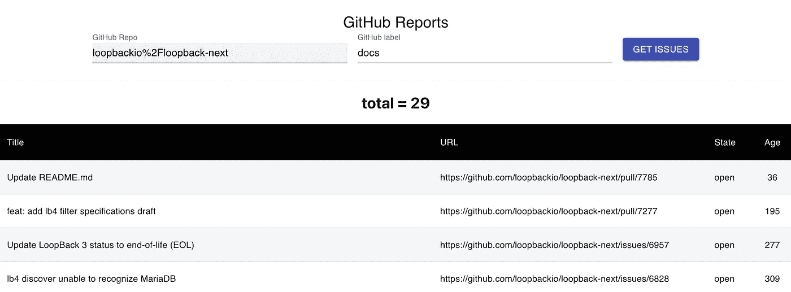
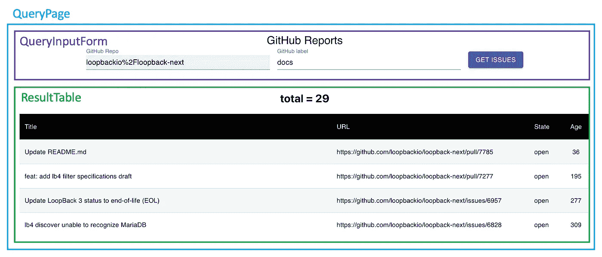

# 使用 LoopBack & React.js 构建端到端应用程序—第 4 部分:构建一个简单的 React.js 应用程序

> 原文：<https://itnext.io/building-an-end-to-end-application-with-loopback-react-js-62b2315bda17?source=collection_archive---------3----------------------->


HalGatewood.com 在 [Unsplash](https://unsplash.com/s/photos/website?utm_source=unsplash&utm_medium=referral&utm_content=creditCopyText) 上[的照片](https://unsplash.com/@halacious?utm_source=unsplash&utm_medium=referral&utm_content=creditCopyText)

在我之前的博文中，我展示了如何创建与 GitHub APIs 交互的 REST APIs。我们的 API 是通过指定 GitHub repo 和一个标签来返回一个开放问题列表。现在是时候创建一个前端应用程序来显示结果集，作为我们的第一个 hello world 端到端场景。我将使用`[openapi-typescript-codegen](https://www.npmjs.com/package/openapi-typescript-codegen)`来生成将在 React.js 应用程序中使用的模型和服务。如果你不熟悉 React.js，我建议你浏览一下 [React.js 入门页面](https://reactjs.org/docs/getting-started.html)。

以下是我对这个博客系列的 GitHub 回复:

*   [loopback 4-example-GitHub](https://github.com/dhmlau/loopback4-example-github):loopback 4 应用程序，它拥有调用 GitHub APIs 的 REST APIs
*   [loopback 4-example-github-react](https://github.com/dhmlau/loopback4-example-github-react):调用 REST APIs 的 React.js 应用程序

*注:我不是 React.js 专家。我选择 React.js 只是因为我想学习这个 UI 框架，并分享我是如何做到的。如果你找到了更好的方法来创建/设计 React.js 应用程序，请在这里发表评论！*

# 对我们将要构建的应用程序做出反应

我们正在构建的前端应用程序非常简单。它将 GitHub repo 和一个标签作为输入，然后它将显示带有指定标签的所有未解决的问题。下面是它的样子:



我们开始吧！

# 环回应用程序的 OpenAPI 3.0 规范

在开始创建 React 应用程序之前，让我们先来看看 LoopBack 应用程序的 OpenAPI 规范。通过运行`npm start`启动 LoopBack 应用程序，并在浏览器中转至[http://localhost:3000/openapi . JSON](http://localhost:3000,)，您将看到该应用程序的 open API 规范。

保持应用程序运行，因为我们将需要这个 OpenAPI 规范用于 React 应用程序中的模型和服务生成。

*提示:你不一定需要记住网址。你可以简单的进入*[*http://localhost:3000*](http://localhost:3000)*，首页会显示 2 个链接——一个是 API explorer，一个是 OpenAPI spec。*

# 创建 React.js 应用程序

假设您已经全局安装了`create-react-app` Node.js 模块，您可以使用下面的命令创建一个 React.js 应用程序，其中`loopback4-example-github-react`是项目名称:

`npx create-react-app loopback4-example-github-react`

# 在 React.js 应用程序中生成模型

我们将使用`[openapi-typescript-codegen](https://www.npmjs.com/package/openapi-typescript-codegen)`在 React 应用程序中生成模型和服务，因此我们将运行 2 个命令。

*   第一个命令是安装`openapi-typescript-codegen`作为 React 应用程序的开发依赖项。
*   第二个命令是运行 codegen 命令，其中输入是我们前面检查过的 OpenAPI 规范，输出是 React 应用程序的`src`文件夹。

```
$ npm install openapi-typescript-codegen --save-dev
$ npx openapi-typescript-codegen --input http://localhost:3000/openapi.json --output ./src/services/openapi
```

之后，你会看到在`src/services/openapi` — `core`、`models`和`services`下创建了 3 个文件夹。您的 React 组件将与这些模型和服务进行交互，以调用我们之前使用 LoopBack 创建的 REST APIs。

# 创建 React 组件

在本文的开头，它展示了 React 应用程序的样子。顶部有一个输入组件，接受 GitHub repo 名称和标签。在它下面，有一个结果表。

我们将创建 3 个组件，如图所示。



我不想详细介绍创建每个组件的细节，而是想把您指向[我的报告](https://github.com/dhmlau/loopback4-example-github-react/tree/master/src/components)的组件文件夹。毕竟不是 React 教程；-).

# 运行应用程序

创建组件后，让我们试着运行它。在此之前，默认的端点基础 url 被设置为`http://localhost:3000`。如果 REST APIs 运行在不同的主机名或端口上，请确保更新了 [OpenAPI.ts](https://github.com/dhmlau/loopback4-example-github-react/blob/master/src/services/openapi/core/OpenAPI.ts#L20) 中的`BASE`属性。

现在，确保环回应用程序正在运行，然后通过运行`npm start`命令启动 React 应用程序。

输入你感兴趣的 GitHub 回购，格式为 <github org="">%2F <github repo="">。`%2F`是`/`的 html 编码值。(将在下一次迭代中使其更加用户友好)。</github></github>

# 结论

就是这个！在本文中，我们创建了一个 React.js 应用程序，它调用来自我们之前创建的回送应用程序的 REST APIs。

*   [第 1 部分:为 GitHub API 创建数据源](https://mobilediana.medium.com/building-an-end-to-end-application-with-loopback-react-js-7a22d726c35d)
*   [第 2 部分:创建服务代理](https://mobilediana.medium.com/building-an-end-to-end-application-with-loopback-react-js-part-2-creating-service-proxy-7ffac2bd7980)
*   [第 3 部分:GitHub API 结果中的分页](https://mobilediana.medium.com/building-an-end-to-end-application-with-loopback-react-js-90cfd7a4813c)