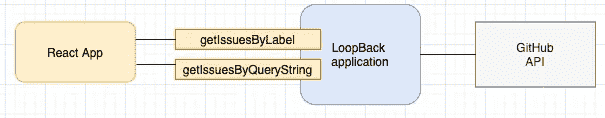
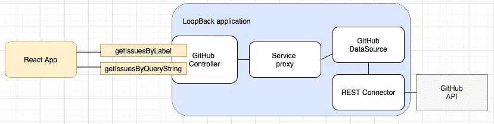
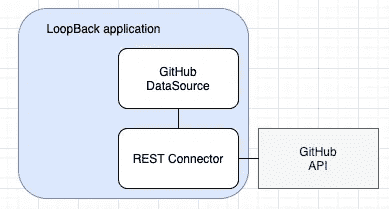

# 使用 LoopBack & React.js 构建端到端应用程序—第 1 部分:创建 GitHub API 的数据源

> 原文：<https://itnext.io/building-an-end-to-end-application-with-loopback-react-js-7a22d726c35d?source=collection_archive---------3----------------------->


[https://www.pexels.com/photo/flight-sky-earth-space-2159/](https://www.pexels.com/photo/flight-sky-earth-space-2159/)

你可能已经知道了，我已经在 [LoopBack](https://loopback.io/) 上写了[几篇博文](https://mobilediana.medium.com/)，这些博文大多是基于 [Todo 教程](https://loopback.io/doc/en/lb4/todo-tutorial.html)之上的。这是因为这些博客的主要目的是展示如何添加某些功能，而不是基础应用程序本身。

在这一系列的博客文章中，我将创建一个端到端的应用程序——一个使用 React 的前端应用程序和一个带有 LoopBack 的 API 层，该 API 层与 GitHub APIs 进行交互。目的是在这个过程中深入一些特定的领域，所以如果你是环回的新手，我建议你看一看适合初学者的 [Todo 教程](https://loopback.io/doc/en/lb4/todo-tutorial.html)。

# 申请是关于什么的？

在这个应用程序中，我希望能够通过调用一些[GitHub REST API](https://docs.github.com/en/rest)并进行一些操作来对 GitHub repo 进行一些报告/度量。整个应用程序可在[本报告](https://github.com/dhmlau/loopback4-example-github)中找到。



应用概述

# 在这个博客中

在 LoopBack 应用程序中，涉及到几个组件——控制器、服务代理、数据源和连接器。



在这篇博客中，我们将首先关注访问 GitHub APIs。我们将创建一个连接到 GitHub APIs 的数据源，如下图所示。我将介绍一些配置数据源的细节。



# 开始之前

使用`lb4 app`命令搭建回送应用程序。我通常保留所有默认选项。

*提示:只需运行* `*lb app <appName> --yes*` *即可。它会让你跳过所有的提示！*

# 我们开始吧！

使用`lb4 datasource`命令创建一个数据源。按照下面的提示操作:

```
$ lb4 datasource
? Datasource name: githubds
? Select the connector for githubds: REST services (supported by StrongLoop)
? Base URL for the REST service: [https://api.github.ibm.com](https://api.github.ibm.com)
? Default options for the request:
? An array of operation templates:
? Use default CRUD mapping: No
 create src/datasources/githubds.datasource.ts
```

让我们仔细看看我们在提示中选择了什么。

*   **选择 githubds 的连接器**:因为我们将调用一些 GitHub REST APIs，所以选择`REST services`。在幕后，这个数据源将使用 [LoopBack REST 连接器](https://github.com/strongloop/loopback-connector-rest)来调用 GitHub APIs。如果你想了解关于这个 REST 数据源配置的更多细节，你可以去[https://github.com/strongloop/loopback-connector-rest](https://github.com/strongloop/loopback-connector-rest)。
*   REST 服务的基本 URL:我认为这是不言自明的。
*   **请求的默认选项**:这是关于你可以为请求设置的选项，例如表头信息。我更喜欢让它为空(通过按 Enter 键)，因为在。ts 文件以后。
*   **一组操作模板:**这是指您希望应用程序的其余部分调用的操作。再说一次，我更喜欢让它暂时空着。

# **填写详细信息—选项**

运行 CLI 命令后，数据源文件`githubds.datasource.ts`中的`config`应该类似于:

```
const config = {
  name: 'githubds',
  connector: 'rest',
  baseURL: '[https://api.github.ibm.com'](https://api.github.ibm.com'),
  crud: false
};
```

我们将在之前跳过的`options`属性中添加标题信息。在`config`常量中添加以下代码片段。

```
options: {
    headers: {
      accept: 'application/json',
      Authorization: process.env.TOKEN,
      'User-Agent': 'loopback4-example-github',
      'X-RateLimit-Limit': 5000,
      'content-type': 'application/json'
    }
  },
```

这里需要注意一些事情:

*   `Authorization: process.env.TOKEN`:如果有密码、访问令牌等值，可以设置为环境变量。
*   `'User-Agent': 'loopback4-example-github'`:调用 GitHub APIs 时，这是必须的。

# 填写细节—操作

在`operations`属性中，可以添加一组`template`和`functions`。`template`定义 API 结构，而`functions`定义应用程序的其余部分可以调用的 TypeScript 函数。

将下面的片段添加到与我们刚刚创建的`options`处于同一级别的`config`常量中。

```
operations: [
    {
      template: {
        method: 'GET',
        fullResponse: true,
        url: '[https://api.github.com/search/issues?q=repo:{repo}+label:"{label}"'](https://api.github.com/search/issues?q=repo:{repo}+label:{label}')
      },
      functions: {
        getIssuesByLabel: ['repo','label']
      }
    }, {
      template: {
        method: 'GET',
        fullResponse: true,
        url: '{url}'
      },
      functions: {
        getIssuesByURL: ['url']
      }
    }, {
      template: {
        method: 'GET',
        fullResponse: true,
        url: '[https://api.github.com/search/issues?q=repo:{repo}+{querystring}'](https://api.github.com/search/issues?q=repo:{repo}+{querystring}')
      },
      functions: {
        getIssuesWithQueryString: ['repo','querystring']
      }
    }
  ]
```

如您所见，上面有 3 个功能:

*   **getIssuesByLabel** :通过指定 GH org+repo 和一个标签来获取 GitHub 问题
*   getIssuesByURL :你可以在这里调用任何你想调用的东西。我们可能希望以后对它进行改进，但是为了节省一些工作，我们让它保持原样。稍后我将向您展示为什么我们要这样做(提示:分页！)
*   **getissuesswithquerystring**:通过指定 GH org+repo 和查询字符串获取 GitHub 问题。“查询字符串”可以是在 [GitHub 搜索 API](https://docs.github.com/en/rest/reference/search) 中指定的任何内容。

让我们仔细看看第一组，看看我们在这里要做什么:

```
{
      template: {
        method: 'GET',
        fullResponse: true,
        url: '[https://api.github.com/search/issues?q=repo:{repo}+label:{label}'](https://api.github.com/search/issues?q=repo:{repo}+label:{label}')
      },
      functions: {
        getIssuesByLabel: ['repo','label']
      }
    }
```

*   `url`:`{repo}`和`{label}`代表 url 的参数。确保函数具有匹配的参数名。
*   `fullResponse`:我在这里将它设置为`true`，因为我需要响应头来知道我是否需要为 GitHub API 检索其他页面的结果。根据 API 和您的使用情况，您可能只需要获得响应体。
*   `headers`:上面的片段里没有`headers`。所有 GitHub API 调用都需要授权令牌和其他头信息。但既然已经有了顶层，这里就不需要赘述了。

如果您要添加不使用相同 url“模板”的其他功能，您可以在`operations`下添加另一组。

还可以找到`template`的其他属性以及更多细节:[https://github . com/strong loop/loopback-connector-rest # defining-a-custom-method-using-a-template](https://github.com/strongloop/loopback-connector-rest#defining-a-custom-method-using-a-template)。

# 当它完成时…

最后，您的`config`常量应该如下所示:

# 下一步是什么？

在这篇博客中，我浏览了应用程序概述，并讨论了创建可以与 GitHub APIs 交互的数据源时的一些细节。接下来，我们将创建一个服务代理来公开这些功能。