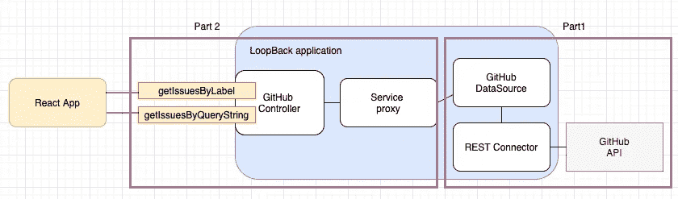
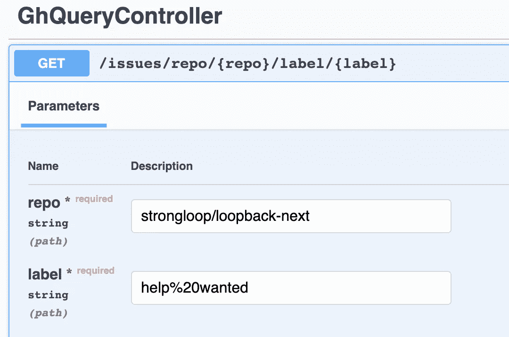
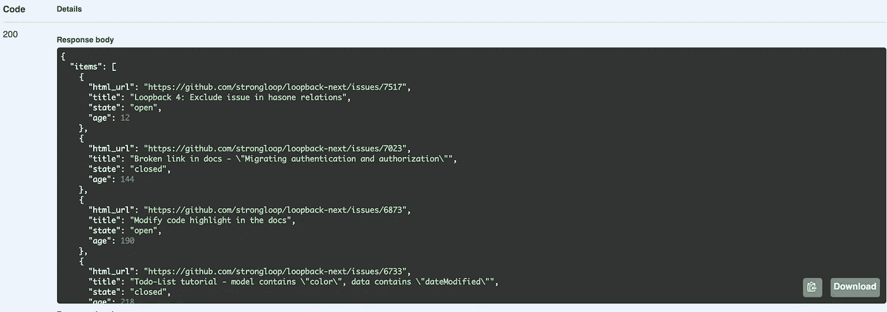

# 使用 LoopBack & React.js 构建端到端应用程序—第 2 部分:创建服务代理

> 原文：<https://itnext.io/building-an-end-to-end-application-with-loopback-react-js-part-2-creating-service-proxy-7ffac2bd7980?source=collection_archive---------3----------------------->


照片由[以色列宫](https://unsplash.com/@othentikisra?utm_source=unsplash&utm_medium=referral&utm_content=creditCopyText)在 [Unsplash](https://unsplash.com/s/photos/connection?utm_source=unsplash&utm_medium=referral&utm_content=creditCopyText) 上拍摄

在我的[前一篇博客](https://mobilediana.medium.com/building-an-end-to-end-application-with-loopback-react-js-7a22d726c35d)中，我介绍了应用程序可以做什么，并且创建了连接到 GitHub REST API 的数据源。在本文中，我将创建 LoopBack 应用程序的其余部分的框架:

*   创建调用我们在数据源中定义的函数的服务代理
*   通过创建一个控制器来公开回送应用程序的 REST APIs

回到我们的图表，它显示了我们在第 1 部分已经做了什么，以及我们将在第 2 部分做什么。



如果你想看看完成的 LoopBack 应用程序是什么样子，你可以点击[这里](https://github.com/dhmlau/loopback4-example-github)。

# 服务代理

[服务](https://loopback.io/doc/en/lb4/Service.html)是一个环回的概念，指的是一个具有执行本地或远程操作的方法的对象。

要创建服务代理，运行`lb4 service`命令:

```
$ lb4 service
? Service type: Remote service proxy backed by a data source
? Please select the datasource GithubdsDatasource
? Service name: GHQueryService
   create src/services/gh-query-service.service.ts
   update src/services/index.tsService GhQueryService was/were created in src/services
```

下一步，我们将把 GitHubDataSource 中定义的函数映射到新创建的`GhQueryService`中的方法。

在`services/gh-query-service.service.ts`中，更新`GhQueryService`界面，增加 3 个界面。

现在，服务代理完成了！让我们转向控制器。

# 控制器

C [ontroller](https://loopback.io/doc/en/lb4/Controller.html) 是另一个公开 REST APIs 的环回概念。你可以使用`lb4 controller`命令来创建控制器。您将被询问是否想要创建一个空的控制器或带有 CRUD 功能的 REST 控制器。如果您创建控制器来连接到一个存储库，那么选择 CRUD 选项来节省您的一些输入可能是好的。然而，在我们的例子中，我们只需要一个空的控制器。

```
$ lb4 controller
? Controller class name: GHQuery
Controller GhQuery will be created in src/controllers/gh-query.controller.ts? What kind of controller would you like to generate? Empty Controller
   create src/controllers/gh-query.controller.ts
   update src/controllers/index.tsController GhQuery was/were created in src/controllers
```

*注意:环回控制器 CLI 将字符串“Controller”附加到您在提示中指定的控制器类名上。*

在该控制器中，我们将:

*   注入我们刚刚创建的 GhQueryService 服务代理
*   添加一个暴露为`/issues/repo/{repo}/label/{label}`的函数。

装饰器意味着它是一个 GET 方法。有关更多细节，请参见 [OpenAPI 装饰器](https://loopback.io/doc/en/lb4/Decorators_openapi.html)文档。另一个技巧是查看 [ToDo 教程](https://loopback.io/doc/en/lb4/todo-tutorial.html)中的 [TodoController](https://github.com/strongloop/loopback-next/blob/master/examples/todo/src/controllers/todo.controller.ts) 。

# 正在创建个人访问令牌

还记得当我们创建数据源时，我们指定使用环境变量`TOKEN`作为`Authorization`头吗？如果您还没有这个令牌，我们现在需要生成它。这将是我们测试它之前的最后一步。

为了生成个人访问令牌，

*   登录 GitHub 后，进入设置>开发者设置或简单的[https://github.com/settings/apps](https://github.com/settings/apps)
*   点击左侧的**个人访问令牌**
*   点击**生成新令牌**。
*   选中“回购”和“用户”复选框。这对于本申请的目的来说已经足够了
*   生成后，请确保将其存储在安全的地方，因为您将无法再次看到令牌值。如果丢失了，需要撤销。

在用于启动应用程序的终端中，设置`TOKEN`环境变量。运行下面的命令:

```
export TOKEN='token <your_personal_access_token>'
```

# 测试它

我们准备好出发了！在同一终端中，启动应用程序:

```
npm start
```

看到`Server is running at [http://[::1]:3000](/[::1]:3000S)`后，去[http://localhost:3000/explorer。](http://localhost:3000/explorer.)

你可以放入任何你想测试的东西。对我来说，我有这个:



运行/issues/repo/{ repo }/label/{ label }端点

您应该会看到类似下面的响应:



样本结果

# 下一步是什么？

你可能意识到少了些什么。返回的项目数总是小于 30，即使`total_count`表示更大的数量。这是因为默认情况下 GitHub APIs 一次只返回 30 个项目。我们可以将每个页面增加到最多 100 个结果，但是之后，我们仍然需要遍历页面来获得所有结果。我将在下一篇文章中展示如何做到这一点。敬请期待！