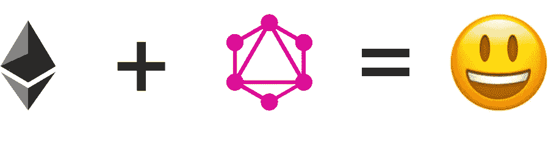

# 用 GraphQL 构建以太坊 Dapp

> 原文：<https://itnext.io/building-an-ethereum-dapp-with-graphql-e8987ede4e7f?source=collection_archive---------5----------------------->

## 使用 GraphQL 作为智能合约的查询语言



即使是最简单的分散式应用程序也涉及到分散在许多不同来源的信息。最重要的是，除非我们非常小心，否则我们的组件很容易与应用程序的架构细节紧密联系在一起。在这篇博文中，我将向您展示如何使用 GraphQL 作为一个强大的契约抽象，最终简化 dapp 用户界面的构建和维护。

***注意:*** *这篇文章不是为了介绍以太坊、智能合约或 GraphQL。也就是说，我会尽量解释清楚，你不需要对这两者有太多概念上的了解就能理解。为了很好的介绍去中心化应用的基础知识，我推荐* [*这篇文章*](https://medium.com/@mvmurthy/ethereum-for-web-developers-890be23d1d0c) *。关于 GraphQL 的介绍我推荐* [*从这里开始*](https://graphql.org/learn/) *。*

在这篇文章中，我们将建立一个类似于易贝 T21 的拍卖平台，用户可以在这里张贴待售物品。为了简洁起见，我们的示例将只触发一个查询，该查询列出了我们平台上可用的拍卖。因为我们可以向我们的模式发送任何类型的查询，所以您可以轻松地插入您喜欢的 GraphQL 框架，并按照您想要的方式工作。

# 以太坊和 GraphQL

当您第一次听说 GraphQL 时，它很可能是作为远程服务器 API 的查询语言。在去中心化的世界中，没有像传统架构中那样的中央服务器。然而，这并不意味着我们不能利用 GraphQL 社区开发的所有令人惊叹的工具。

通过定义一个只存在于我们的客户机中的模式，我们可以使用 GraphQL 作为我们的契约集合的抽象层。这允许我们查询我们的平台的当前状态，就像它是一个传统的服务器一样，并根据区块链解决查询。

# 我们的合同

这篇文章的代码存在于 GitHub 上[。该平台由两个不同的合同组成。一个叫做`AuctionHub`，它维护一个地址列表，指向另一个叫做`Auction`的契约的实例。第二个合同只有一个公共字段:待售商品的名称。](https://github.com/AlecAivazis/ethereum-graphql-demo)

让我们从部署一些契约开始，这样我们就可以在 UI 中查询一些东西。克隆演示项目并安装项目依赖项。只是提醒一下:这可能需要一点时间。

```
git clone git@github.com:AlecAivazis/ethereum-graphql-demo.git \ 
    && cd ethereum-graphql-demo \ 
    && npm i
```

一旦完成，开始一个本地以太坊区块链我们可以测试:

```
npm run testnet
```

注意`Available Accounts`下的账户列表。我们以后会需要他们中的一个。在另一个终端中，编译合同:

```
npm run build:contracts
```

这将为`contracts/*`下的每个合同生成两个文件。`*.bin`文件是每个契约的编译版本，`*.abi`是描述契约内容(属性、方法等)的 json 文件。).

演示项目附带一个脚本，该脚本将引导一些合同并打印中心的地址。在您运行它之前，您必须在这里更新您想要在创建我们的测试合同[时使用的钱包地址。更新后，您可以使用以下内容创建演示合同:](https://github.com/AlecAivazis/ethereum-graphql-demo/blob/master/scripts/init.js#L10)

```
npm run init
```

如果一切按计划进行，您应该会看到我们刚刚部署的集线器的地址。记下这个地址。我们稍后在定义模式时会用到它。随着我们的契约的部署，我们现在准备开始用 GraphQL 查询它们。

# 打造我们的客户

repo 已经包含了一个非常基本的 UI，我们可以直接使用它，而不用太担心它是如何工作的。只需知道，如果您更新了组件正在触发的查询或 GraphQL 模式，您必须使用`npm run relay`重新运行编译器，以使更改生效。

# 定义模式

构建我们的客户端 GraphQL 层的第一步与传统领域相同:定义一个表示我们领域的模式。不管产品的持久性和执行细节如何，这种表示都应该适用。然而，在模式充当服务器和客户机之间的协议之前，在我们的去中心化世界中，这个模式编码了我们的 UI 和契约之间的内部 API。它甚至可以作为负责区块链和 UI 开发的独立团队之间的交接(如果这种分离对你有意义的话)。

让我们看看这是如何工作的。首先在`src/`目录下添加一个名为`schema.js`的文件，内容如下:

如果你有使用`graphql-tools`包的经验，那么这个应该看起来很熟悉。我们在这里所做的是定义一个 GraphQL 模式，让我们查询系统中的所有拍卖。

# 指定解析器

模式本身不足以解决查询。我们还需要告诉运行时如何解析请求的字段。这是通过定义一个对象来实现的，该对象的键是类型名，其值是另一个具有解析每个字段的函数的对象:

如你所见，我们已经告诉运行时，解析`Auction`对象类型上的`itemName`字段需要调用拍卖合同实例上的`itemName`方法。这将返回一个带有常量方法值的承诺，它将给出我们想要的字符串。类似地，我们通过查看我们之前创建的拍卖中心来解析所有可用拍卖的列表，并为中心中存储的每个地址返回一个拍卖合同实例。

通过这样做，我们已经从用户界面中完全抽象出了中枢的存在。如果我们确实有独立的团队在 UI 和区块链基础设施上工作，UI 团队不需要理解如何找到每个拍卖。他们所要做的就是启动一个类似`{ allAuctions { itemName } }`的查询。

# 查询我们的模式

有了我们的模式，我们现在准备开始连接用户界面和我们的合同。在 Apollo(演示项目使用的 graphql 框架)中，您可以提供一个叫做“链接”的东西，它负责处理查询。如果你打开演示项目中的`src/client.js`,你会看到它已经包含了许多定义自定义链接所必需的样板文件。但是，缺少一个核心部分——解析查询的实际逻辑。现在让我们补充一点:

正如您所看到的，解决我们的查询并不像在集中式情况下那样需要触发网络请求。相反，我们只是将查询字符串和变量传递给`graphql`函数，该函数使用我们之前定义的解析器来处理查询。

有了这两个文件，我们现在应该能够运行我们的客户端，并在我们的平台中看到拍卖列表。使用以下命令启动开发服务器:

```
npm run relay && npm run dev
```

并导航到 [http://localhost:8000](http://localhost:8000/) 。如果一切顺利，您现在应该会看到一个物品列表——我们在 init 脚本中创建的三个拍卖中的一个。

# 为什么这样更好？

到现在，你可能会问自己，经历所有这些努力是否值得。如果你有使用`web3`的经验，那么你就会知道，如果没有某种特定领域的抽象层，命令式 API 会变得极其重复。举个例子，在我们的平台中获取一个拍卖列表所需的代码(从上面复制):

当试图找出将这种逻辑抽象成可重用的东西的最佳方式时，有许多问题需要回答。这其中的一些部分是针对我们的拍卖/中心细分的。其他部分是样板文件，你可以在任何时候找到，你想建立一个清单的东西。一旦我们把它分解了，我们如何以一种使我们的 UI 易于使用的方式包装逻辑呢？虽然没有解决所有这些问题的灵丹妙药，但每个解决方案都有其优点和缺点。通过使用 GraphQL 作为智能合约的数据层，您可以为 UI 组件提供一个健壮的集成，它抽象了声明性 API 背后的检索逻辑的细节。然而，这是以应用程序中额外的逻辑层为代价的。

一旦您完成了将合同封装在单一模式中的工作，您就可以利用 graphql 社区开发的所有优秀工具了。最重要的是，这种模型也使得半分散方法的故事非常流畅，其中信息来自链上和链下的来源。我们可以[将我们的模式与远程服务](https://www.apollographql.com/docs/graphql-tools/schema-stitching.html)结合起来，构建一个统一的抽象，让我们不用担心信息来自哪里就能构建我们的接口。我在我的一个 dapps 中使用了类似的方法来集成一个流行的 oauth 提供者。

# 结论和下一步措施

在这篇文章中，我向您展示了如何构建一个客户端的 GraphQL 模式来解析运行在以太坊区块链上的智能合约。然后，我们将模式连接到我们的用户界面，这样我们就可以轻松地查询我们的合同状态。这为我们的 UI 查询合同提供了一个很好的抽象，而不用担心如何检索所请求的数据。

为了保持重点，我们只讨论了如何解决针对区块链的单个查询。然而，有很多东西可以添加到上面，使开发者的体验和你的应用[加上超](https://www.quora.com/What-does-plus-ultra-mean-in-the-My-Hero-Academia-anime)。其中包括:

*   整合一个客户端[游乐场](https://github.com/prisma/graphql-playground)以便你可以轻松地浏览你的合同
*   将[合同事件](https://web3js.readthedocs.io/en/1.0/web3-eth-contract.html#events)绑定到 [GraphQL 订阅](https://graphql.org/blog/subscriptions-in-graphql-and-relay/)中，用于实时用户界面。
*   从模式定义生成实体类型，反之亦然

这就是现在——感谢阅读！我原本打算开始一个多篇文章的系列，涵盖我提到的一些额外内容，但不确定是否有兴趣。如果你想看那样的东西，请在[这个博客的回购](https://github.com/AlecAivazis/homepage)上告诉我。

如果你认为这是一个可怕的想法，如果你喜欢它，如果你尝试接下来的步骤，或者你做了完全不同的事情，我想知道！请在 twitter 上表达你的想法。

一如既往，如果这是我们分手的地方，我希望你有一个愉快的休息。

*原载于*[*alec.aivazis.com*](https://alec.aivazis.com/blog/ethereum-and-graphql)*。*