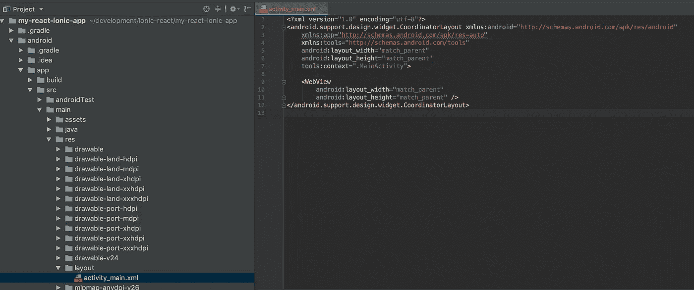
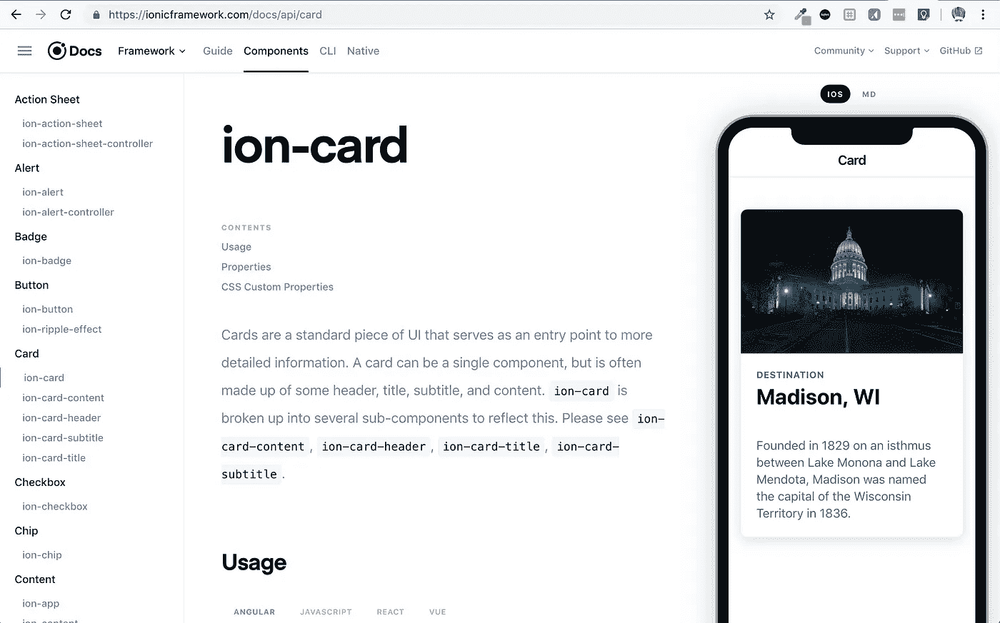
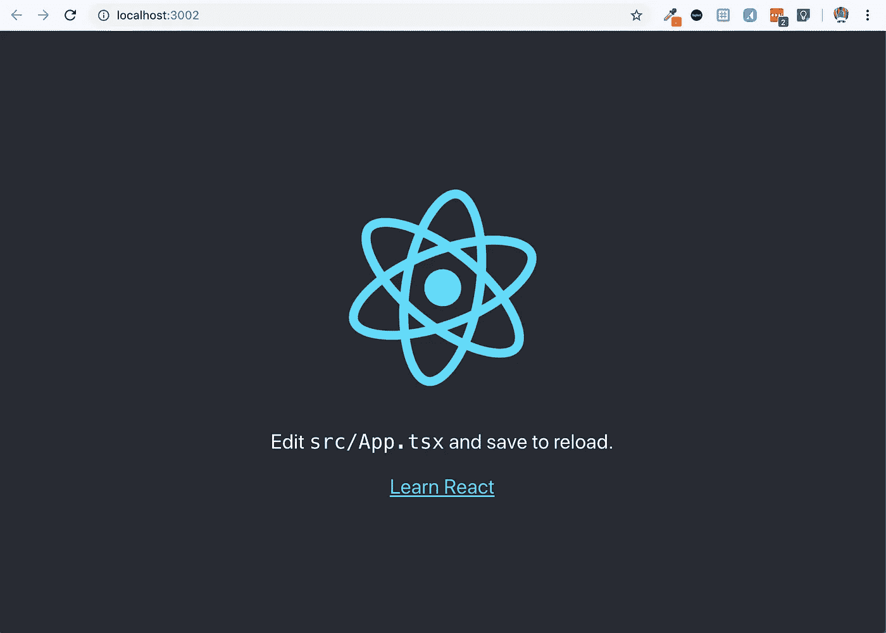
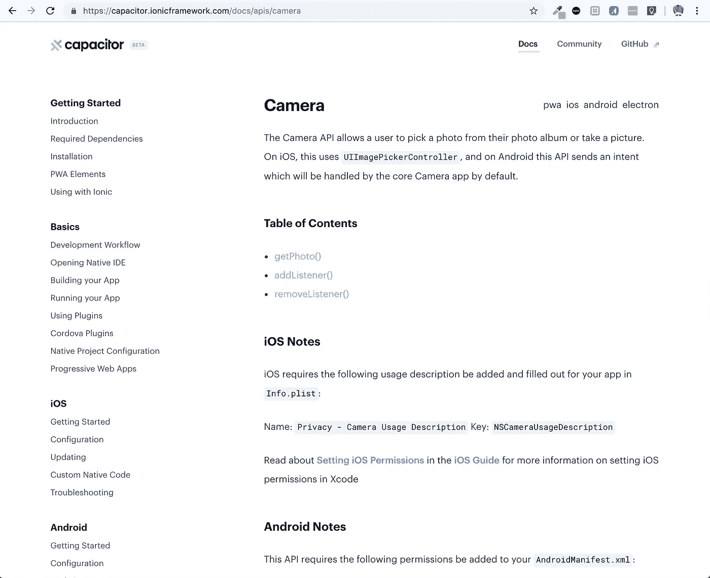
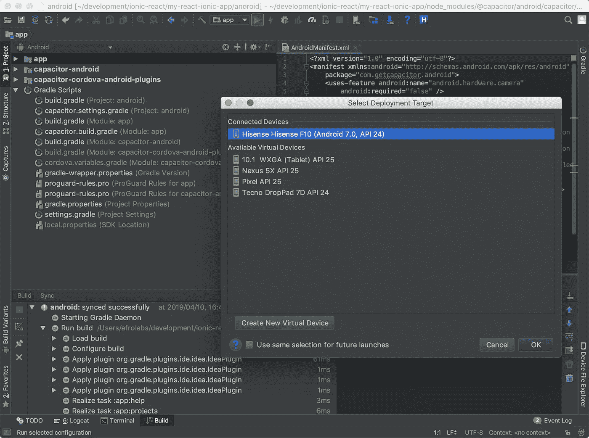
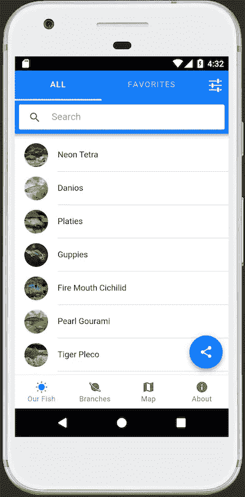

# 使用 React 构建离子应用程序

> 原文：<https://itnext.io/building-an-ionic-application-using-react-61dc60c59e7b?source=collection_archive---------3----------------------->


Ionic 团队最近宣布了一些令人兴奋的消息:Ionic 框架的新版本 V4 现在是框架不可知的，这意味着它可以与任何 JavaScript 框架一起工作。

在本帖中，我们将深入探讨如何使用 Ionic 和 React。

Ionic 采用开源框架，允许使用 HTML、CSS 和 Javascript 开发**跨平台混合应用**。

它允许开发人员构建单个应用程序，然后轻松地部署到多个平台，所有这些都来自单个代码案例，并且在不同的平台上保持相同的外观和感觉。

直到最近，爱奥尼亚还被强绑在 [**角**](https://angular.io/) 上。虽然 Angular 是一个优秀的框架，但 Ionic 对该框架的依赖证明是采用该平台的一个障碍。

此外，在过去的几年里，浏览器已经融合在一个标准化的组件模型上，被称为 [**Web 组件**](https://www.webcomponents.org/introduction) **。** Web 组件基于现有的 Web 标准，允许开发人员创建自定义组件和小部件，这些组件和小部件可用于任何 JavaScript 库或支持 HTML 的框架。

这些因素促使 Ionic 团队将 Ionic 框架作为一组使用标准 web APIs 的**定制 Web 组件进行分发。**这意味着开发人员现在可以轻松地将 Ionic 的**自定义 HTML 标签**嵌入到他们在移动、桌面和 p[progressive web 应用](https://developers.google.com/web/progressive-web-apps/)上的应用中，安全地知道这些组件完全受用户浏览器的支持，并将随着时间的推移保持稳定。

将用户界面控件置于 Web 组件 API 之下也允许 Ionic 支持一个**“自带框架”**模型，由此应用程序中用于**构建、**和**路由**的所有工具都可以由您选择的框架来执行。

因此，Ionic 现在可以无缝地与所有主要的前端框架(Angular、React、Vue 等)一起工作。)

# 爱奥尼亚是如何在引擎盖下工作的？

基于 Ionic 的智能手机应用程序本质上是本地应用程序。它们可以从平台的应用商店下载，并访问与任何使用原生 SDK 构建的应用相同的原生功能和硬件。

然而，Ionic 应用程序运行在一个全屏浏览器中，称为**网络视图**，用户看不见。

通过**可定制的本地插件**，Ionic 应用还可以访问特定手机的本地功能，而无需将核心代码绑定到该设备。



当为 Android 构建时，这个 Ionic 应用程序包含一个**单个**活动，该活动包含一个**单个** WebView。所有 Ionic 应用程序的 UI 和逻辑都在这个 WebView 中运行。

# 爱奥尼亚的优缺点是什么？

Ionic(以及其他类似的混合平台)的主要优势可以概括为:

1.  支持**快速应用开发。**
2.  允许**轻松部署到多个平台** (iOS、Android、桌面、渐进式网络应用)。
3.  允许重用熟悉的 HTML、CSS 和 Javascript 技术。
4.  提供**丰富的组件套件和原生插件**，允许访问智能手机设备硬件，如摄像头、文件系统、GPS、touchID)。



Ionic 有一个非常漂亮的 UI 组件的综合库

像任何软件平台一样，Ionic 并不是在每个场景中都是理想的。在某些情况下，原生开发智能手机应用程序可能更有意义。可能不利于选择 Ionic 进行应用程序开发的因素包括:

1.  **性能:**与本机相比，使用 web 视图可能会带来一定程度的开销。对于大多数应用程序，性能上的差异可以忽略不计，但对于 3D 游戏和其他性能密集型应用程序，混合可能不是最佳选择。
2.  **第三方插件:**依赖插件来访问设备上的本机功能会增加开发的复杂性。然而，随着本机插件向[电容器](https://capacitor.ionicframework.com/)的融合(稍后讨论)，这似乎比往年更不是问题。
3.  **框架依赖性:**虽然 Ionic 是开源的，但你本质上是信任框架及其贡献者，以跟上每个移动平台的最新本地特性和设计模式。

# 离子和打字稿

Ionic 的一个重要特点是与 [**TypeScript**](https://www.typescriptlang.org/) 配合使用效果最好，Ionic 基金会推荐所有 Ionic 项目都使用 TypeScript。

Typescript 是 Javascript 的超集，可以编译成普通的 Javascript。Typescript 的主要好处是它允许**静态类型检查**(普通 Javascript 不允许)，从而允许 Typescript 预编译器在构建之前捕捉错误，并允许复杂的代码库伸缩。

我们将在代码示例中使用 TypeScript。

# 反应一下，它是什么，为什么这么受欢迎？

如果你已经读到这里，你可能知道 React 是什么，但如果不知道，React 是一个用于构建用户界面的开源 JavaScript 库，由脸书开发和维护。

事实证明，它非常受开发社区的欢迎，因为它优雅简单的基于组件的架构，允许构建管理自己状态的封装组件。

# 开始使用爱奥尼亚和 React

好了，让我们使用 React 构建一个离子应用程序。

1.  *安装*[*create-react-app*](https://github.com/facebook/create-react-app)*命令行工具:*

```
**npm install -g create-react-app**
```

2.*创建一个支持类型脚本的 React 应用程序(用您的应用程序的名称替换“mytest app”):*

```
**create-react-app mytestapp — typescript**
```

3.*切换到新建的 app 目录:*

```
**cd mytestapp**
```

4.*为****React*******React-Router****，以及必要的* ***类型定义*** *:**

```
***npm install -s @ionic/react react-router react-router-dom @types/react-router @types/react-router-dom @types/react @types/react-redux @types/node***
```

*5.***如果你打算使用 Redux 进行状态管理:*** *安装****Redux****和****React-Redux****:**

```
***npm install -s redux react-redux redux-devtools***
```

*6. ***如果你打算使用 Redux:*** *安装* ***类型安全工具*** *用于动作创建者:**

```
***npm install -s typesafe-actions***
```

*7.*在浏览器中运行您的应用程序:**

```
***npm run start***
```

*瞧！*

**

*哇哦，那很简单*

# *将您的应用部署到 iOS 和 Android*

*为了将你的 Ionic 应用程序部署到智能手机和 PWA 上，Ionic 建议使用 [**电容器**](https://capacitor.ionicframework.com/) **。***

*Capacitor 是一个跨平台的应用程序运行时，允许创建在 iOS、Android、electronic 和 web 上本地运行的 web 应用程序。它的 API 集允许在支持它们的平台上访问丰富的本地设备特性。*

**

*例如，Capacitor 的摄像头 API 允许应用程序访问 iOS 和 Android 设备的摄像头。*

*让我们使用 Capacitor 构建一个 Android 版本的 Ionic 应用程序:*

1.  **在你的 Ionic 项目目录下，安装电容:**

```
***npm install — save** [**@capacitor/core**](http://twitter.com/capacitor/core)[**@capacitor/cli**](http://twitter.com/capacitor/cli)*
```

*2.初始化电容器。它会询问你的应用名称和包名称:*

```
***npx cap init***
```

*3.*为生产构建您的 Ionic 项目。这一点很重要，因为在智能手机应用程序中运行之前，必须正确清理所有本地链接:**

```
***npm run build***
```

*4.*将 Android 添加到您的项目:**

```
***npx cap add android***
```

**确保****capacitor . config . JSON****文件的“webDir”属性指向运行* ***npm 运行构建*** 时创建的“ ***构建*** *”文件夹**

```
*{
  "appId": "com.test.app",
  "appName": "My Test App",
  "bundledWebRuntime": false,
  "webDir": "**build**"
}*
```

*5.*使用以下命令在*[*Android Studio*](https://developer.android.com/studio/?gclid=EAIaIQobChMIue7-5uvH4QIVw7TtCh3D7g3lEAAYASAAEgJ6v_D_BwE)*中打开你的项目:**

```
***npx cap open android***
```

*Android Studio 将根据 build.gradle 定义自动构建您的应用程序。从这里，您可以点击“ **Play** ”按钮在 Android 中运行应用程序，可以使用虚拟设备，也可以通过 USB 连接到您的开发计算机的物理 Android 设备。*

**

# *史蒂夫的鱼商场:React 应用的一个例子*

*基于 [Ionic 会议示例应用](https://ionic-react-conference-app.firebaseapp.com/schedule)模板，这个应用展示了 Ionic 必须提供的一些令人敬畏的 UI 组件。该应用程序还使用 Capacitor 检索用户的位置。*

*此处 有 [**的回购。**](https://github.com/StevenConradEllis/react-ionic-medium-demo)*

**请注意，在运行应用程序之前，必须在 public/index.html 的第 30 行*提供一个 ***Google Maps API 密钥****

****

**热带鱼爱好者的绝佳应用**

## **以下是该应用程序的一些代码片段:**

**☝️ *应用程序使用 React 路由，并被封装在 React-Redux 提供程序中，用于应用程序级的状态管理。***

**☝️ *这是一个使用 Ionic web 组件(页面、标签、标签栏)和 React routing 的例子。***

**☝️ *该应用程序使用*[*redux reducer*](https://redux.js.org/basics/reducers)*作为其全局状态管理*的一部分**

**☝️*app 使用电容* [*从设备中检索用户的位置*](https://capacitor.ionicframework.com/docs/apis/geolocation) *并添加到地图中。***

**最后，我想对 Ionic 的[团队表示敬意，感谢他们为让 Ionic 被不同的 Javascript 框架和库使用所做的努力。](https://ionicframework.com/team)**

**这是一个令人兴奋的发展，预计该平台的采用将稳步增长。这的确是一个开发人员的大好时机。**

**感谢您的阅读！🙏**

# **参考**

**[](https://blog.ionicframework.com/introducing-ionic-4-ionic-for-everyone/) [## 介绍 Ionic 4:面向所有人的 Ionic

### 今天，我很高兴地宣布 Ionic Framework 的 4.0 版本，被亲切地称为“面向所有人的 Ionic”

blog.ionicframework.com](https://blog.ionicframework.com/introducing-ionic-4-ionic-for-everyone/) [](https://www.npmjs.com/package/@ionic/react) [## @ionic/react

### @ionic/core 的 React 特定包装

www.npmjs.com](https://www.npmjs.com/package/@ionic/react)  [## 离子模板会议应用程序

### Ionic 会议应用的 React 版本

ionic-react-conference-app.firebaseapp.com](https://ionic-react-conference-app.firebaseapp.com/schedule) [](https://blog.ionicframework.com/how-to-use-typescript-in-react/) [## 如何在 React 中使用 TypeScript

### 阅读我们最新的博客文章，获得如何在 React 中使用 Typescript 的小教程。

blog.ionicframework.com](https://blog.ionicframework.com/how-to-use-typescript-in-react/)**