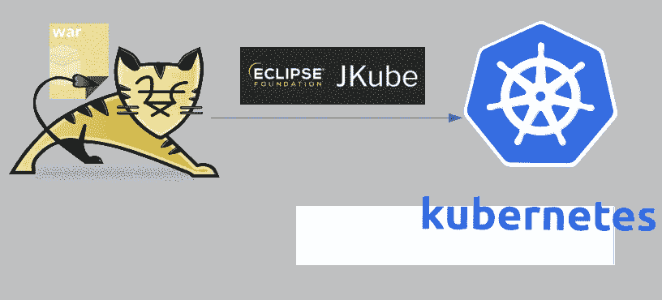
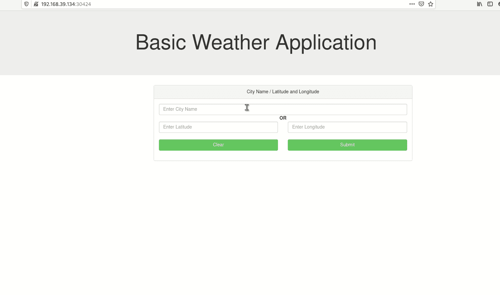
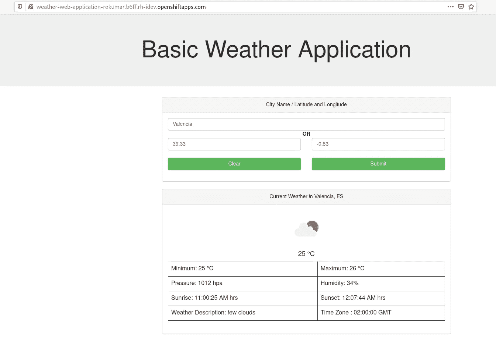

# 使用 Eclipse JKube 在 Kubernetes/Red Hat OpenShift 上构建和部署天气 Web 应用程序

> 原文：<https://itnext.io/building-and-deploying-a-weather-web-application-onto-kubernetes-red-hat-openshift-using-eclipse-62bf7c924be4?source=collection_archive---------1----------------------->

> 注意:这篇博客是博客系列的一部分:[使用 Eclipse JKube 在 Kubernetes 上部署 Java 应用程序](https://medium.com/@rohaan/deploying-java-applications-onto-kubernetes-using-eclipse-jkube-c2ad83a7d98a)



使用 Eclipse JKube 在 Kubernetes 上部署基于 tomcat 的 web 应用程序

我最近在 IBM Developer 上看到一篇[博客文章](https://developer.ibm.com/components/cloud-pak-for-applications/patterns/build-deploy-cloud-native-java-applications-using-ibm-cloud-pak-for-applications/)，内容是关于使用 [Eclipse Codewind](https://www.eclipse.org/codewind/) 在 Kubernetes 上部署一个 OpenLiberty 云原生应用。我认为展示与 Eclipse JKube 类似的东西是个不错的主意，关于我们如何从本地开发的角度实现同样的目标。

我已经写了一篇关于使用 Eclipse JKube 在 Kubernetes 上部署 OpenLiberty 应用程序的博文。所以我使用 [Jboss Servlet API 4.0](https://access.redhat.com/articles/113373) 将其迁移到一个非常基本的 web 应用程序，以演示 Eclipse JKube 如何将 web 应用程序平稳地部署到[Kubernetes](https://kubernetes.io/)/[Red Hat open shift](https://www.openshift.com/)上。

[](https://github.com/rohanKanojia/weather-web-application) [## rohanKanojia/天气-网络-应用

### 这个快速入门演示了 CDI 和 Servlet 3 的使用，是了解如何创建一个…

github.com](https://github.com/rohanKanojia/weather-web-application) 

这个应用是[IBM/build-deploy-cloud-native-application-using-cp4a](https://github.com/IBM/build-deploy-cloud-native-application-using-cp4a)的一个端口。它与那个应用程序做同样的事情，但是使用基于 [Jboss Servlet API 4.0](https://mvnrepository.com/artifact/org.jboss.spec.javax.servlet/jboss-servlet-api_4.0_spec) 的基本`HttpServlet`。它显示了一个获取天气细节的基本 html 表单，为了获取天气细节，它使用 REST API 查询 [OpenWeatherMap](https://home.openweathermap.org/) 。

我的项目和他们的项目的一个显著区别是如何处理 OpenWeatherMap REST API 访问令牌。我看到 IBM Codewind 博客中使用的项目在其源代码中有硬编码的 API 令牌(在我看来，这并不是云原生的😉 ).理想情况下，我们应该使用 Kubernetes Secrets 来存储这些敏感信息。另一个不同是，我将使用 [Eclipse JKube](https://www.eclipse.org/jkube/) 将其部署到 [Kubernetes](https://kubernetes.io/) 和 [Red Hat OpenShift](https://www.openshift.com/) 。

# **项目结构:**

好了，让我们看看项目结构。我有两个源文件`APIKeyService`和`WeatherServlet`，它们包含了应用程序的所有逻辑。另一个值得注意的文件是`src/main/webapp`中的`index.html`，它显示了应用程序根端点上的默认页面。`src/main/jkube`里面有两个 yaml 文件。我将在稍后部署到 Kubernetes 部分时解释它们。

```
weather-web-application : $ tree src/
src/
└── main
    ├── java
    │   └── org
    │       └── jboss
    │           └── as
    │               └── quickstarts
    │                   └── helloworld
    │                       └── WeatherServlet.java
    ├── jkube
    │   ├── apikey-secret.yml
    │   └── deployment.yml
    └── webapp
        ├── index.html
        └── WEB-INF
            ├── beans.xml
            └── web.xml10 directories, 6 files
```

让我们看看`WeatherServlet.java`它是端点`/getWeather`的处理程序，基本上`index.html`调用这个端点来获取指定位置的天气细节，它只是从查询参数中获取城市、经度和纬度，并使用这些参数调用 OpenWeather API。在请求 OpenWeatherAPI 时，它从`APIKeyService`获取令牌:

[](https://github.com/rohanKanojia/weather-web-application/blob/master/src/main/java/org/jboss/as/quickstarts/helloworld/WeatherServlet.java)****:****

**气象服务程序，见代码[WeatherServlet.java](https://gist.github.com/rohanKanojia/377464773138b0ecfcadfe5910e9ccf5)**

# ****部署到 Kubernetes** :**

**好了，我们现在知道了应用程序的结构，所以我们可以继续将它部署到 Kubernetes 上。您可能需要从 OpenWeatherMap 网站获取一个 [API 密钥](https://home.openweathermap.org/api_keys)。我们将把我们的 API 密匙存储在一个 [Kubernetes Secret](https://kubernetes.io/docs/concepts/configuration/secret/) 中，我们将配置我们项目的`Deployment`来选择这个`Secret`。Eclipse JKube 提供了一个非常强大的 Kubernetes 资源配置机制，称为[资源片段](https://www.eclipse.org/jkube/docs/kubernetes-maven-plugin#_resource_fragments)。您可以将任何 Kubernetes YAML 清单或它的一部分放在`src/main/jkube`目录中，它将在资源创建阶段由 Eclipse JKube 合并/创建。所以首先我们要把我们的秘密文件放在 jkube 目录中:**

**[**src/main/jkube/API key-secret . yml:**](https://github.com/rohanKanojia/weather-web-application/blob/master/src/main/jkube/apikey-secret.yml)**

**好的，有了这个 Eclipse，JKube 会在资源应用阶段和应用程序的`Deployment`一起创建一个秘密。但是我们也需要告诉 Eclipse JKube 在我们的`Deployment`中使用这个`Secret`。所以我们将只提供我们的`Deployment` YAML 规范的一个片段来添加`Secret`作为一个环境变量(参见关于这个主题的 [kubernetes 文档](https://kubernetes.io/docs/concepts/configuration/secret/#using-secrets-as-environment-variables))。下面是我们的`Deployment`片段看起来的样子(注意，我们没有提供任何额外的东西，我们只提供了我们想要在结果`Deployment`片段中覆盖的部分:**

**[**src/main/jkube/deployment . yml:**](https://github.com/rohanKanojia/weather-web-application/blob/master/src/main/jkube/deployment.yml)**

**这样，现在我们的应用程序 Pods 将拥有名为`OPENWEATHER_API_KEY`的环境变量，该变量将包含用于与 OpenWeatherMap API 交互的 Api 键。**

**好了，我们已经准备好将我们的应用程序部署到 Kubernetes 上，我已经在 pom.xml 的`<plugins>`部分提供了 Eclipse JKube:**

**现在，我可以开始发布创建 docker 映像、创建 Kubernetes 清单并将它们应用到 Kubernetes 集群的 JKube 目标了**

> **mvn k8s:构建 k8s:资源 k8s:应用**

**注意，Eclipse JKube 检测到它是一个 web 应用程序，并使用 Apache Tomcat 作为应用程序的基础映像。它还创造了一个固执己见的`Deployment`和`Service`(在`src/main/jkube`片段中提供了次要配置)。一旦目标完成执行，您可以检查所有创建的 Kubernetes 资源:**

**一旦您的应用程序`Pods`处于`Running`状态，您就可以期待您的应用程序为服务请求做好准备。Eclipse JKube 还会生成一个`Service`来展示您的应用程序容器。默认情况下，它创建一个类型为`ClusterIP`的`Service`，但是我在我的项目`jkube.enricher.jkube-service.type=NodePort`中添加了一个属性来覆盖它。这样，我们将能够从 minikube 外部访问应用程序:**

**如果一切按预期进行，您可以看到您的应用程序在浏览器中运行，如下所示:**

****

**Minikube 中运行的基本天气应用程序**

**您可以清理使用[Eclipse JKube undeploy goal](https://www.eclipse.org/jkube/docs/kubernetes-maven-plugin#jkube:undeploy)创建的所有资源:**

# ****部署到 Red Hat OpenShift:****

**将应用程序部署到 [Red Hat OpenShift](http://openshift.com/) 上与部署到 Kubernetes 上没有什么不同。Eclipse JKube 为 OpenShift 提供了一个独立的插件，其工作方式与 Kubernetes 插件类似。**

> **mvn oc:构建 oc:资源 oc:应用**

**目标完成后，您可以查看您的窗格:**

**一旦 pod 处于`Running`状态，您就可以期望您应用程序准备好接收请求。Eclipse JKube 生成一个 OpenShift `[Route](https://docs.openshift.com/container-platform/3.11/dev_guide/routes.html)`,使用它您可以轻松地访问您的应用程序:**

**如果一切按预期进行，您可以看到这样的应用程序页面，并开始测试应用程序。**

****

**天气 Web 应用程序部署到 Red Hat OpenShift 中。**

**您可以使用[Eclipse JKube undeploy goal for open shift](https://www.eclipse.org/jkube/docs/openshift-maven-plugin#jkube:undeploy)清理所有已创建的资源:**

> **mvn oc:取消部署**

**它的输出类似于`k8s:undeploy` go，我跳过它。**

# ****结论:****

**今天的博客到此结束。我希望它能对那些想轻松地在 Kubernetes 上部署 web 应用程序的人有所帮助。您可以在这里找到博客中使用的项目:**

**[](https://github.com/rohanKanojia/weather-web-application) [## rohanKanojia/天气-网络-应用

### 这个快速入门演示了 CDI 和 Servlet 3 的使用，是了解如何创建一个…

github.com](https://github.com/rohanKanojia/weather-web-application) 

# 来加入我们吧:

我们非常重视您的反馈，所以请报告错误，要求改进…让我们一起创建一些伟大的东西！

如果你是一个 [Eclipse JKube](https://github.com/eclipse/jkube) 用户或者只是好奇，不要害羞，加入我们的欢迎社区:

*   对 [GitHub](https://github.com/eclipse/jkube/issues) 提供反馈；
*   工艺一些代码和[推](https://github.com/quarkusio/quarkus/pulls) [一](https://github.com/eclipse/jkube/pulls) [](https://github.com/quarkusio/quarkus/pulls)[公关](https://github.com/eclipse/jkube/pulls)；
*   在 [Gitter](https://gitter.im/eclipse/jkube) 和[邮件列表](https://accounts.eclipse.org/mailing-list/jkube-dev)上与我们讨论；
*   在[堆栈溢出](https://stackoverflow.com/questions/tagged/jkube)上提问。

最初发表于 [Wordpress](https://r0haan.wordpress.com/2020/08/30/building-and-deploying-a-weather-web-application-onto-kubernetes-red-hat-openshift-using-eclipse-jkube/) 。**