# 为 Kubernetes 构建和部署基于云原生 Quarkus 的 Java 应用程序

> 原文：<https://itnext.io/building-and-deploying-cloud-native-quarkus-applications-to-kubernetes-a4c494e3a843?source=collection_archive---------0----------------------->

## 使用 GitOps 为 AWS 上的 Kubernetes 开发、测试、构建和部署基于 Quarkus 的本地 Java 微服务

# 介绍

尽管它可能不再是无可争议的编程语言领导者，但根据许多开发者调查，Java 仍然与 Go、Python、C/C++和 JavaScript 并列。鉴于 Java 的持续流行，尤其是在企业中，以及云原生软件开发的同时兴起，供应商们已经专注于创建专门构建的、现代的基于 JVM 的框架、工具和标准来开发应用程序，特别是微服务。

领先的基于 JVM 的微服务应用程序框架通常提供一些功能，例如对[反应式编程模型](https://www.baeldung.com/java-reactive-systems)、[微文件](http://microprofile.io/)、 [GraalVM 本机映像](https://www.graalvm.org/22.0/reference-manual/native-image/)、 [OpenAPI](https://www.openapis.org/) 和 Swagger 定义生成、 [GraphQL](https://graphql.org/) 、 [CORS](https://developer.mozilla.org/en-US/docs/Web/HTTP/CORS) (跨源资源共享)、 [gRPC](https://en.wikipedia.org/wiki/GRPC) (gRPC 远程过程调用)、 [CDI](https://www.cdi-spec.org/) (上下文和依赖注入)、服务发现

# 领先的基于 JVM 的微服务框架

回顾一下最受欢迎的 Java 云原生微服务框架列表，你肯定会发现 [Spring Boot 和 Spring Cloud](https://spring.io/) 、 [Micronaut](https://micronaut.io/) 、 [Helidon](https://helidon.io/) 和 [Quarkus](https://quarkus.io/) 位于或接近顶部。

## 春云 Spring Boot

根据他们网站的说法， [Spring](https://spring.io/) 让每个人编写 Java 变得更快、更容易、更安全。Spring 对速度、简单性和生产力的关注使它成为了[世界上最受欢迎的](https://snyk.io/blog/jvm-ecosystem-report-2018-platform-application/) Java 框架。 [Spring Boot](https://spring.io/projects/spring-boot) 使得创建独立的、生产级的基于 Spring 的应用程序变得容易，你可以*直接运行*。Spring Boot 的许多专门构建的功能使得在生产中大规模构建和运行您的微服务变得非常容易。然而，微服务的分布式特性带来了挑战。Spring Cloud 可以帮助服务发现、负载平衡、断路、分布式跟踪，以及使用几个现成的云模式进行监控。它甚至可以充当 API 网关。

## 赫利登

Oracle 的 [Helidon](https://helidon.io/) 是一套云原生的开源 Java 库，用于编写运行在由 [Netty](https://netty.io/) 支持的快速 web 核心上的微服务。Helidon 支持 [MicroProfile](http://microprofile.io/) ，这是一种反应式编程模型，并且与 Micronaut、Spring 和 Quarkus 类似，它支持 [GraalVM 本地映像](https://www.graalvm.org/22.0/reference-manual/native-image/)。

## 微型机器人

根据他们的网站介绍， [Micronaut](https://micronaut.io/) 框架是一个现代的、开源的、基于 JVM 的、全栈的工具包，用于构建模块化的、易于测试的微服务和无服务器应用。Micronaut 支持多语言编程模型、发现服务、分布式跟踪和面向方面编程(AOP)。此外，Micronaut 提供快速启动时间、极快的吞吐量和最小的内存占用。

## 夸库斯

由 RedHat 开发并赞助的 Quarkus 自称是“超音速亚原子 Java”。Quarkus 是一个云原生、Kubernetes 原生、[Linux]容器优先、微服务优先的框架，用于编写 Java 应用程序。Quarkus 是一个为 OpenJDK HotSpot 和 GraalVM 定制的 Kubernetes 原生 Java 栈，由 50 多个同类最佳的 Java 库和标准精心制作而成。

# 开发原生 Quarkus 微服务

在接下来的文章中，我们将为 Kubernetes 开发、构建、测试、部署和监控一个本地 Quarkus 微服务应用程序。RESTful 服务将公开一个丰富的应用程序编程接口(API ),并与后端的 PostgreSQL 数据库进行交互。

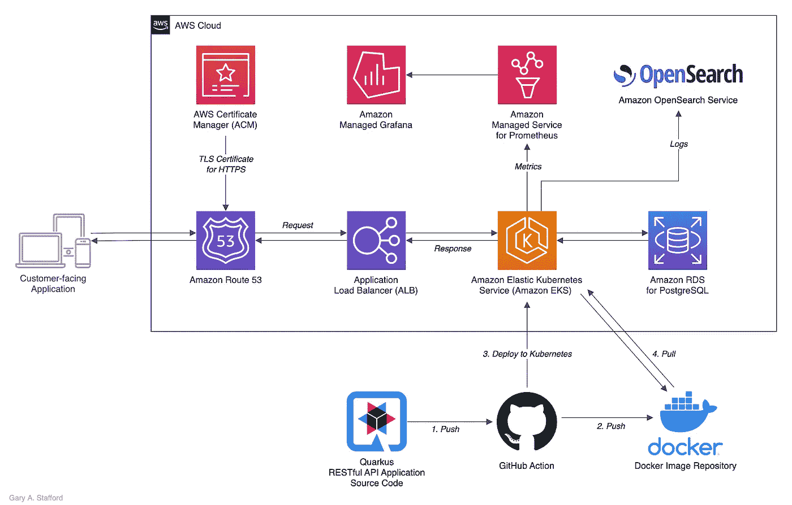

Quarkus 应用程序生产环境的高级 AWS 架构图

本文中 Quarkus 应用程序的一些特性包括:

*   Hibernate 对象关系映射器(ORM)，事实上的 [Jakarta 持久性 API](https://en.wikipedia.org/wiki/Jakarta_Persistence) (以前的 Java 持久性 API)实现
*   [Hibernate Reactive with Panache](https://quarkus.io/guides/hibernate-reactive-panache)，这是一个 Quarkus 特有的库，简化了 Hibernate Reactive 实体的开发
*   [RESTEasy 反应式](https://quarkus.io/guides/resteasy-reactive)，一个新的 [JAX-RS](https://quarkus.io/specs/jaxrs/2.1/index.html) 实现，与通用[垂直 x](https://vertx.io/) 层一起工作，因此是完全反应式的
*   高级 RESTEasy 反应式 [Jackson 支持](https://github.com/FasterXML/jackson)JSON 序列化
*   [反应式 PostgreSQL 客户端](https://quarkus.io/guides/reactive-sql-clients)
*   构建在[心轴](https://github.com/graalvm/mandrel)，[上的 GraalVM 社区版的下游发行版](https://developers.redhat.com/blog/2020/06/05/mandrel-a-community-distribution-of-graalvm-for-the-red-hat-build-of-quarkus/)
*   使用 Gradle 构建的现代开源构建自动化工具专注于灵活性和性能

# TL；速度三角形定位法(dead reckoning)

在阅读全文之前，您想探索一下这篇文章的 Quarkus 微服务应用程序的源代码，还是将其部署到 Kubernetes？所有的源代码和 Kubernetes 资源都是开源的，可以在 GitHub 上获得:

```
git clone --depth 1 -b main \
    https://github.com/garystafford/tickit-srv.git
```

最新的 Docker 图片可在 [docker.io](https://hub.docker.com/r/garystafford/tickit-srv) 上获得:

```
docker pull garystafford/tickit-srv:<latest-tag>
```

# 具有智能的 Quarkus 项目

尽管不是必需的，我还是使用了[JetBrains IntelliJ IDEA 2022](https://www.jetbrains.com/idea/)(终极版)来开发和测试 post 的 Quarkus 应用程序。用 IntelliJ 引导 Quarkus 项目很容易。使用终极版附带的 Quarkus 插件，开发人员可以快速创建一个 Quarkus 项目。


JetBrains IntelliJ IDEA 对 Quarkus 项目的本地支持

Quarkus 插件的项目创建向导基于 [code.quarkus.io](https://code.quarkus.io/) 。如果您已经引导了一个 Spring Initializr 项目， [code.quarkus.io](https://code.quarkus.io/) 的工作方式与 [start.spring.io](https://start.spring.io/) 非常相似。

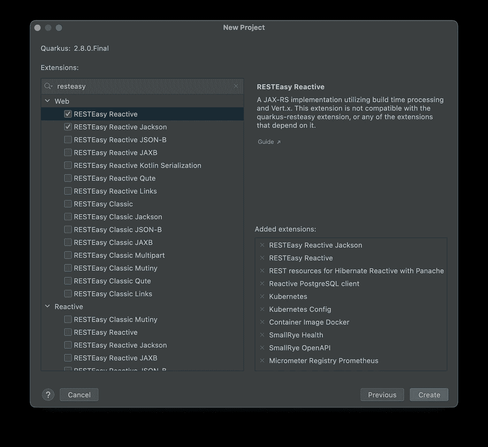

在 IntelliJ 中为新的 Quarkus 项目添加扩展

## Visual Studio 代码

RedHat 还为流行的 Visual Studio 代码 IDE 提供了一个 Quarkus 扩展。

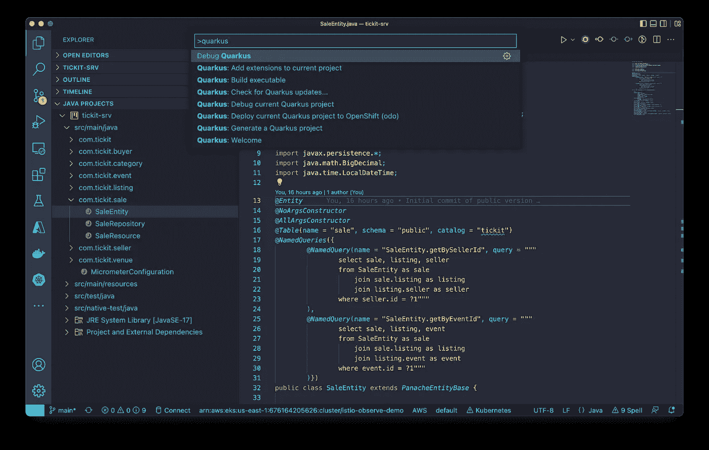

安装了 Quarkus 扩展的 Visual Studio 代码 IDE

# 格拉德勒

这篇文章使用 Gradle 代替 Maven 来开发、测试、构建、打包和部署 Kubernetes 的 Quarkus 应用程序。基于上面显示的新项目设置中选择的包，Quarkus 插件的项目创建向导创建以下`build.gradle`文件( [Lombak](https://projectlombok.org/) 单独添加)。

向导还创建了下面的`gradle.properties`文件，该文件已经更新到本文发布时可用的 Quarkus 的[最新版本](https://github.com/quarkusio/quarkus/releases)2 . 9 . 2。

## 格拉德和夸库斯

你可以使用 [Quarkus CLI](https://quarkus.io/guides/cli-tooling) 或者 Quarkus Maven 插件来搭建一个 Gradle 项目。依赖 Quarkus 插件会给 Gradle 增加几个额外的 Quarkus 任务。我们将使用 Gradle 来开发、测试、构建、封装 Quarkus 微服务应用程序，并将其部署到 Kubernetes。在这篇文章中，`quarkusDev`、`quarkusTest`和`quarkusBuild`任务将特别有用。

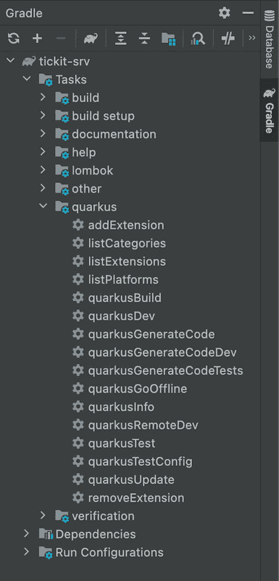

在 IntelliJ 中看到的附加 Quarkus 梯度任务

# Java 编译

本文中的 Quarkus 应用程序是用最新的 Java 17 版本的 [Mandrel](https://github.com/graalvm/mandrel) ，[GraalVM community edition](https://developers.redhat.com/blog/2020/06/05/mandrel-a-community-distribution-of-graalvm-for-the-red-hat-build-of-quarkus/)的下游发行版编译成原生映像的。

## GraalVM 和本机映像

根据[文档](https://www.graalvm.org/22.1/docs/getting-started/)，GraalVM 是一个高性能的 JDK 发行版。它旨在加速用 Java 和其他 JVM 语言编写的应用程序的执行，同时还为 JavaScript、Ruby、Python 和其他流行语言提供运行时。

此外，根据 GraalVM 的说法，原生映像是一种提前将 Java 代码编译成独立可执行文件的技术，称为原生映像。该可执行文件包括应用程序类、其依赖项中的类、运行时库类以及 JDK 中静态链接的本机代码。Native Image builder ( `native-image`)是一个实用程序，它处理应用程序的所有类及其依赖项，包括来自 JDK 的类。它静态地分析数据，以确定在应用程序执行期间哪些类和方法是可访问的。

## 心轴

mandrel[是 GraalVM 社区版](https://developers.redhat.com/blog/2020/06/05/mandrel-a-community-distribution-of-graalvm-for-the-red-hat-build-of-quarkus/)的下游发行版。Mandrel 的主要目标是提供一个专门支持 Quarkus 的`native-image`版本。目的是将 GraalVM 的`native-image`功能与 [OpenJDK](https://openjdk.java.net/) 和 Red Hat Enterprise Linux 库结合起来，以提高原生 Quarkus 应用程序的可维护性。Mandrel 最好被描述为一个带有特殊打包的 GraalVM 原生映像构建器的常规 OpenJDK 的发行版(`native-image`)。

# Docker 图像

一旦编译完成，本地 Quarkus 可执行文件将在部署到 Kubernetes 的`quarkus-micro-image:1.0`基础运行时映像中运行。Quarkus 提供了这个[基础映像](https://quarkus.io/guides/quarkus-runtime-base-image)来简化本地可执行文件的容器化。与其他图像相比，它的占用空间最小(压缩后为 10.9 MB/未压缩后为 29.5 MB)。比如最新的 UBI(通用基础镜像)Quarkus 心轴镜像(`[ubi-quarkus-mandrel:22.1.0.0-Final-java17](https://quay.io/repository/quarkus/ubi-quarkus-mandrel?tab=tags)`)是 714 MB 未压缩，而 OpenJDK 17 镜像(`[openjdk:17-jdk](https://hub.docker.com/layers/openjdk/library/openjdk/17.0.2-jdk/images/sha256-98f0304b3a3b7c12ce641177a99d1f3be56f532473a528fda38d53d519cafb13?context=explore)`)是 471 MB 未压缩。即使是 RedHat 的通用基础映像 Minimal image ( `[ubi-minimal:8.6](https://catalog.redhat.com/software/containers/ubi8/ubi-minimal/5c359a62bed8bd75a2c3fba8?tag=8.6-751&push_date=1652217593000)`)也是 93.4 MB 未压缩。

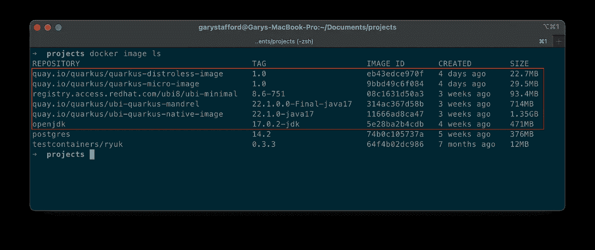

用于大小比较的未压缩 Quarkus 相关 Docker 图像

来自 Quarkus 的一个更小的选项是一个[无发行版基础映像](https://quarkus.io/guides/building-native-image#using-a-distroless-base-image) ( `[quarkus-distroless-image](https://quay.io/repository/quarkus/quarkus-distroless-image?tab=tags&tag=1.0):1.0)`只有 9.2 MB 压缩/ 22.7 MB 未压缩)。Quarkus 小心翼翼地指出，distroless 映像支持是实验性的，在没有经过严格测试的情况下，不应该用于生产。

# PostgreSQL 数据库

对于 Quarkus 应用程序的后端数据持久层，我们将使用 PostgreSQL。帖子中使用的所有 DDL(数据定义语言)和 DML(数据操作语言)语句都用最新版本的 [PostgreSQL 14](https://www.postgresql.org/docs/current/index.html) 进行了测试。

有许多 PostgreSQL 兼容的示例数据库可用于本文。我正在使用由 AWS 提供的、为 Amazon Redshift(AWS 的云数据仓库服务)设计的 [TICKIT 样本数据库](https://docs.aws.amazon.com/redshift/latest/dg/c_sampledb.html)。在传统的数据仓库[星型模式](https://en.wikipedia.org/wiki/Star_schema)中，数据库由七个表组成——两个事实表和五个维度表。

在这篇文章中，我将 TICKIT 数据库的星型模式重新建模为一个针对 Quarkus 应用程序优化的规范化关系数据模型。数据库最显著的变化是将原来的`Users`维度表分成两个独立的表——`buyer`和`seller`。这一改变将允许更好的关注点分离(SoC)、可扩展性和对个人可识别信息的增强保护(PII)。

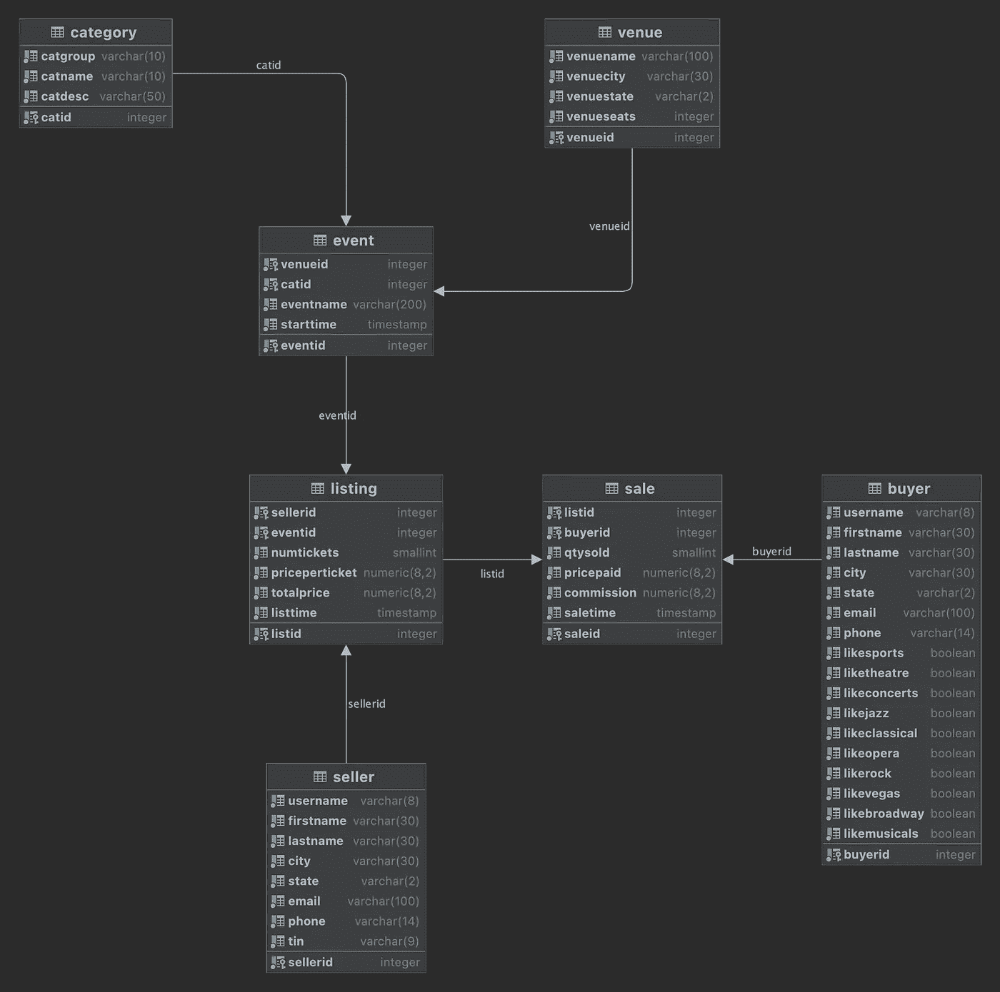

邮政中使用的 TICKIT 数据库关系数据模型

# 源代码

PostgreSQL TICKIT 数据库中六个表中的每一个都由一个实体、存储库和资源 Java 类表示。

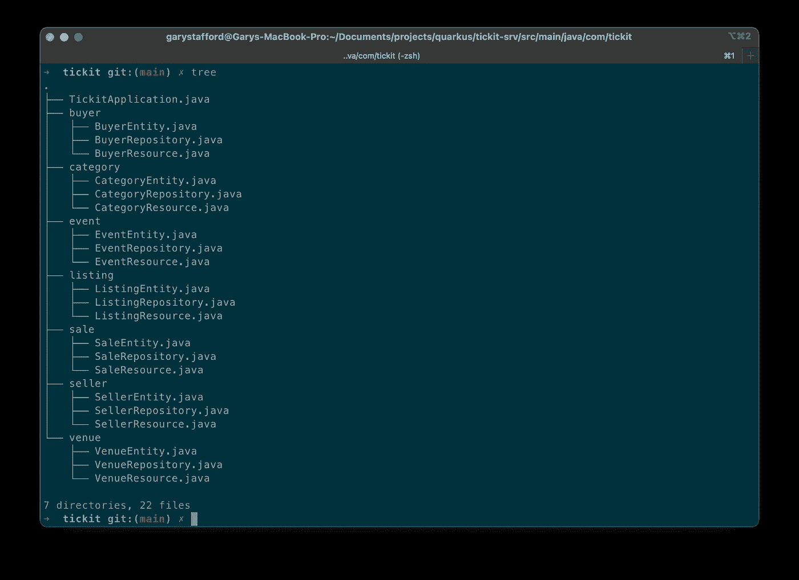

查看 Quarkus 应用程序的源代码

## 实体类

Java 持久性是用于管理持久性和对象/关系映射的 API。Java 持久性 API (JPA)为 Java 开发人员提供了一个对象/关系映射工具，用于管理 Java 应用程序中的关系数据。PostgreSQL TICKIT 数据库中的每个表都由一个 [Java 持久性](https://docs.oracle.com/javaee/7/api/javax/persistence/package-summary.html)实体表示，如类声明上的`Entity`注释所示。注释指定该类是一个实体。

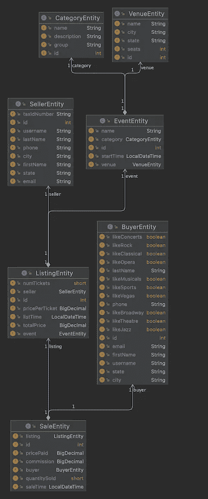

JPA 实体关系，镜像数据库的数据模型

每个实体类都扩展了`[io.quarkus.hibernate.orm.panache](https://javadoc.io/static/io.quarkus/quarkus-hibernate-orm-panache/2.9.1.Final/io/quarkus/hibernate/orm/panache/package-summary.html)`包中的`PanacheEntityBase`类。根据 Quarkus 文档，您可以通过扩展`PanacheEntityBase`而不是`PanacheEntity`来指定您自己的定制 ID 策略，在本文的示例中就是这样做的。

如果你不想为你的实体定义 getter/setter，我们在文章的例子中没有，扩展`PanacheEntityBase`，Quarkus 将为你生成它们。或者，扩展`PanacheEntity`并利用它提供的默认 ID，如果您没有使用定制 ID 策略的话。

下面显示的示例`SaleEntity`类是 Quarkus 应用程序的典型实体。除了`Entity`之外，实体类还包含几个额外的 JPA 注释，包括`Table`、`NamedQueries`、`Id`、`SequenceGenerator`、`GeneratedValue`和`Column`。实体类还利用了 [Project Lombok](https://projectlombok.org/) 注释。Lombok 生成两个样板构造函数，一个不带参数(`NoArgsConstructor`)，另一个为每个字段带一个参数(`AllArgsConstructor`)。

`SaleEntity`类还定义了两个多对一关系，分别是`ListingEntity`和`BuyerEntity`实体类。这种关系反映了数据库的数据模型，如上面的模式图所示。使用`ManyToOne`和`JoinColumn` JPA 注释定义关系。

给定实体之间的关系，一个表示为嵌套 JSON 对象的`saleEntity`对象将如下所示:

## 知识库类

PostgreSQL TICKIT 数据库中的每个表都有一个对应的存储库类，通常称为“存储库模式”repository 类实现了`[PanacheRepositoryBase](https://javadoc.io/static/io.quarkus/quarkus-hibernate-orm-panache/0.19.0/io/quarkus/hibernate/orm/panache/PanacheRepositoryBase.html)`接口，它是`[io.quarkus.hibernate.orm.panache](https://javadoc.io/static/io.quarkus/quarkus-hibernate-orm-panache/2.9.1.Final/io/quarkus/hibernate/orm/panache/package-summary.html)`包的一部分。`[PanacheRepositoryBase](https://javadoc.io/static/io.quarkus/quarkus-hibernate-orm-panache/0.19.0/io/quarkus/hibernate/orm/panache/PanacheRepositoryBase.html)` Java 接口代表特定类型实体的存储库。根据[文档](https://quarkus.io/guides/hibernate-orm-panache#custom-ids)，如果您正在使用存储库并且有一个定制的 ID 策略，那么您将想要扩展`PanacheRepositoryBase`而不是`PanacheRepository`，并且将您的 ID 类型指定为一个额外的类型参数。实现`PanacheRepositoryBase`将在`PanacheEntityBase`上给你同样的方法。

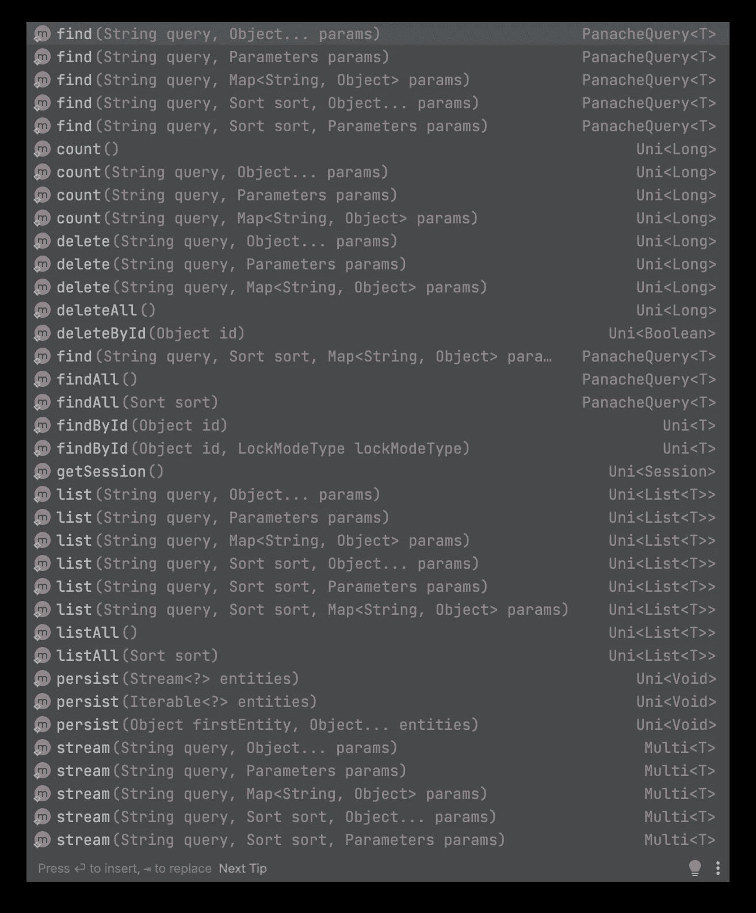

PanacheRepositoryBase 公开的方法的部分列表

repository 类允许我们利用通过`PanacheEntityBase`已经可用的方法，并添加额外的定制方法。例如，repository 类包含一个定制方法`listWithPaging`。该方法检索(`GET`)一个`SaleEntity`对象列表，其额外的好处是能够指示页码、页面大小、按字段排序和排序方向。

由于在`SaleEntity`类与`ListingEntity`和`BuyerEntity`实体类之间存在多对一的关系，我们也有两个定制方法，通过`BuyerEntity` ID 或`EventEntity` ID 检索所有的`SaleEntity`对象。这两个方法调用 SaleEntity 中的 SQL 查询，在类声明中用 JPA `NamedQueries` / `NamedQuery`注释进行了注释。

## 斯莫尔莱兵变

repository 类中定义的每个方法都返回一个 SmallRye 哗变`[Uni<T>](https://smallrye.io/smallrye-mutiny/getting-started/creating-unis)`。据[网站](https://smallrye.io/smallrye-mutiny/index.html)报道，哗变是一个直观的、事件驱动的反应式 Java 编程库。哗变提供了一个简单但强大的异步开发模型，让您构建反应式应用程序。manturity 可以用在任何表现出异步的 Java 应用程序中，包括反应式微服务、数据流、事件处理、API 网关和网络实用程序。

## 大学

同样，根据兵变的[文档](https://smallrye.io/smallrye-mutiny/getting-started/creating-unis)，一个`Uni`代表一个*流*，它只能发出一个项目或者一个失败事件。一个`Uni<T>`是一个专门的流，它只发出一个项目或一个失败。通常，`Uni<T>`非常适合表示异步动作，比如远程过程调用、HTTP 请求或产生单一结果的操作。一个`Uni`代表一个懒惰的异步动作。它遵循订阅模式，这意味着只有当一个`UniSubscriber`订阅了`Uni`时才会触发该动作。

## 资源类

最后，PostgreSQL TICKIT 数据库中的每个表都有一个相应的资源类。根据 Quarkus [文档](https://quarkus.io/guides/hibernate-orm-panache#defining-your-repository)，在`PanacheEntityBase`中定义的所有操作在您的存储库中都是可用的，因此使用它与使用活动记录模式完全相同，除了您需要注入它。我们将相应的存储库类注入到资源类中，公开存储库和`[PanacheRepositoryBase](https://javadoc.io/static/io.quarkus/quarkus-hibernate-orm-panache/0.19.0/io/quarkus/hibernate/orm/panache/PanacheRepositoryBase.html)`的所有可用方法。例如，注意下面的自定义`listWithPaging`方法，它是在`SaleRepository`类中声明的。

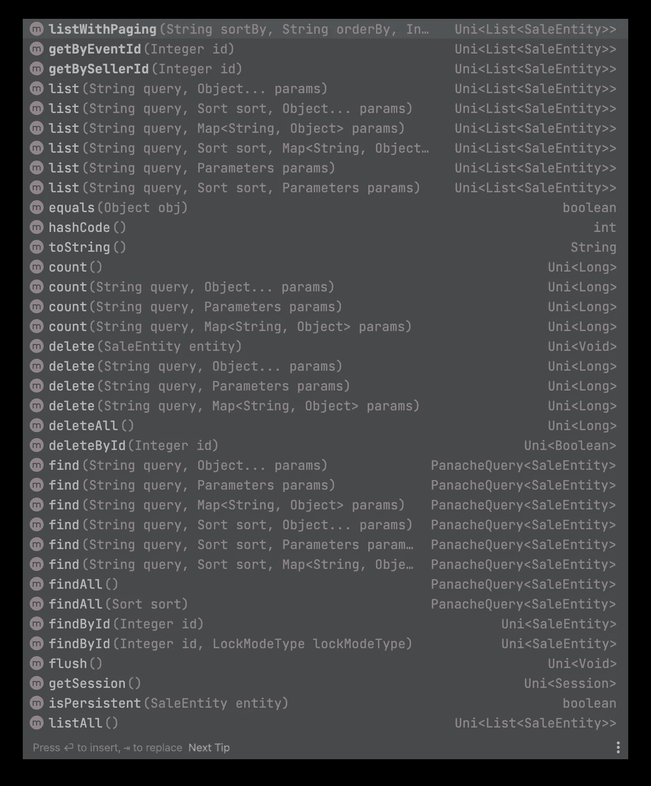

通过将存储库类注入资源类而公开的方法的部分列表

与 repository 类类似，resource 类中定义的每个方法也返回一个 SmallRye 哗变(`io.smallrye.mutiny` ) `Uni<T>`。

存储库定义了与数据库上的 CRUD 操作(创建、读取、更新和删除)相对应的 HTTP 方法(`POST`、`GET`、`PUT`和`DELETE`)。这些方法用相应的`javax.ws.rs`注释进行了注释，表明它们响应的 HTTP 请求的类型。`javax.ws.rs`包包含用于创建 RESTful 服务资源的高级接口和注释，比如我们的 Quarkus 应用程序。

带注释的`POST`、`PUT`和`DELETE`方法都有与它们相关联的`io.quarkus.hibernate.reactive.panache.common.runtime`包的`ReactiveTransactional`注释。我们在方法上使用这种注释来在反应式`Mutiny.Session.Transation`中运行它们。如果带注释的方法返回一个`Uni`，他们确实这样做了，这与方法包含在对`Mutiny.Session.withTransaction(java.util.function.Function)`的调用中的行为完全相同。如果方法调用失败，则回滚整个事务。

# 开发者体验

Quarkus 有几个特性可以增强开发人员的体验。特性包括[开发服务](https://quarkus.io/guides/dev-mode-differences#dev-services)、[开发 UI](https://quarkus.io/guides/dev-mode-differences#dev-ui) 、[无需重新构建和重启应用程序即可实时重新加载](https://quarkus.io/guides/dev-mode-differences#live-reload)代码、[持续测试](https://quarkus.io/guides/continuous-testing#introduction)在保存代码更改后立即运行测试、配置文件、Hibernate ORM、JUnit 和放心集成。使用这些 Quarkus 特性，很容易开发和测试 Quarkus 应用程序。

## 配置描述文件

类似于 Spring，Quarkus 使用配置文件。根据 [RedHat](https://access.redhat.com/documentation/en-us/red_hat_build_of_quarkus/quarkus-2-7/guide/34313937-d855-48cd-b793-8db36fe92a8d#proc_using-configuration-profiles_quarkus-configuration-guide) ，您可以根据您的环境使用不同的配置文件。配置文件使您能够在同一个`application.properties`文件中拥有多个配置，并使用一个配置文件名在它们之间进行选择。Quarkus 可识别三种默认配置文件:

*   开发:在开发模式下激活
*   测试:运行测试时激活
*   prod:不在开发或测试模式下运行时的默认概要文件

在`application.properties`文件中，概要文件使用`%environment.`格式作为前缀。例如，当定义 Quarkus 的日志级别为`INFO`时，您添加了公共的`quarkus.log.level=INFO`属性。然而，为了只将测试环境的日志级别更改为`DEBUG`，对应于`test`概要文件，您可以添加一个带有`%test.`前缀的属性，比如`%test.quarkus.log.level=DEBUG`。

## 开发服务

Quarkus 支持在开发和测试模式下自动提供未配置的服务，称为[开发服务](https://quarkus.io/guides/dev-services)。如果您包含了一个扩展，但没有对其进行配置，那么 Quarkus 将在后台使用测试容器自动启动相关服务，并连接您的应用程序以使用该服务。

在开发 Quarkus 应用程序时，您可以创建自己的本地 PostgreSQL 数据库，例如，使用 Docker:

以及相应的应用程序配置属性:

## 零配置数据库

或者，我们可以依靠[开发服务](https://quarkus.io/guides/dev-services)，使用被称为[零配置设置](https://quarkus.io/guides/datasource#dev-services)的特性。Quarkus 为您提供开箱即用的零配置数据库；不需要数据库配置。Quarkus 负责提供数据库，运行 DDL 和 DML 语句来创建数据库对象，并用测试数据填充数据库，最后，当开发或测试会话完成时，取消提供数据库容器。当应用程序中存在反应式或 JDBC 数据源扩展且尚未配置数据库 URL 时，将启用数据库开发服务。

使用`quarkusDev` Gradle 任务，我们可以启动应用程序运行，如下面的视频所示。请注意创建的两个新 Docker 容器。另外，注意项目的`import.sql` SQL 脚本是自动运行的，执行所有 DDL 和 DML 语句来准备和填充数据库。

使用“quarkusDev”Gradle 任务在本地启动 Quarkus 应用程序的 API

## 引导 TICKIT 数据库

当使用带有 Quarkus 的 Hibernate ORM 时，我们有几个选项可以选择当 Quarkus 应用程序启动时如何处理数据库。这些是在 application.properties 文件中定义的。`[quarkus.hibernate-orm.database.generation](https://quarkus.io/guides/hibernate-orm#quarkus-hibernate-orm_quarkus.hibernate-orm.database.generation)`属性决定是否生成数据库模式。`drop-and-create`是理想的开发模式，如上图。这个属性默认为`none`，但是，如果 Dev Services 正在使用，并且没有其他管理模式的扩展，那么这个属性将默认为`drop-and-create`。接受值:`none`、`create`、`drop-and-create`、`drop`、`update`、`validate`。对于开发和测试模式，我们使用默认值为`drop-and-create`的开发服务。对于这篇文章，我们假设数据库和模式已经存在于产品中。

第二个属性`[quarkus.hibernate-orm.sql-load-script](https://quarkus.io/guides/hibernate-orm#quarkus-hibernate-orm_quarkus.hibernate-orm.sql-load-script)`提供了一个文件的路径，该文件包含 Hibernate ORM 启动时要执行的 SQL 语句。在开发和测试模式下，默认为`import.sql`。只需在 resources 目录的根目录下添加一个`import.sql`文件，Hibernate 就会被启动，而无需设置这个属性。该项目包含一个`import.sql`脚本来创建所有数据库对象和少量测试数据。您还可以为不同的配置文件显式设置不同的文件，并为属性添加配置文件前缀(例如，`%dev.`或`%test.`)。

```
%dev.quarkus.hibernate-orm.database.generation=drop-and-create
%dev.quarkus.hibernate-orm.sql-load-script=import.sql
```

另一个选择是 [Flyway](https://quarkus.io/guides/flyway) ，这是 JVM 环境中常用的流行数据库迁移工具。Quarkus 为使用 Flyway 提供了一流的支持。

# 开发用户界面

根据[文档](https://quarkus.io/guides/dev-ui)，Quarkus 现在附带了一个新的实验开发 UI，默认情况下在`/q/dev`的开发模式下可用(当你用 Gradle 的 quarkusDev 任务启动 Quarkus 时)。它允许您快速可视化当前加载的所有扩展，查看它们的状态并直接进入它们的文档。除了访问加载的扩展，您还可以在 Dev UI 中查看日志和运行测试。

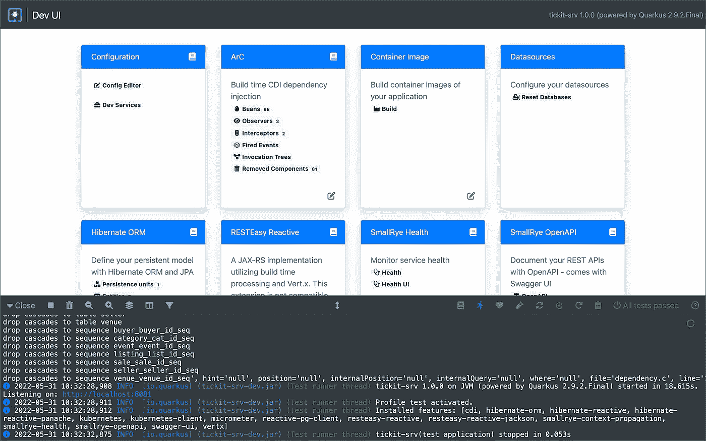

Quarkus 开发 UI 显示日志和测试

## 配置

从 Dev UI 中，您可以访问和修改 Quarkus 应用程序的应用程序配置。

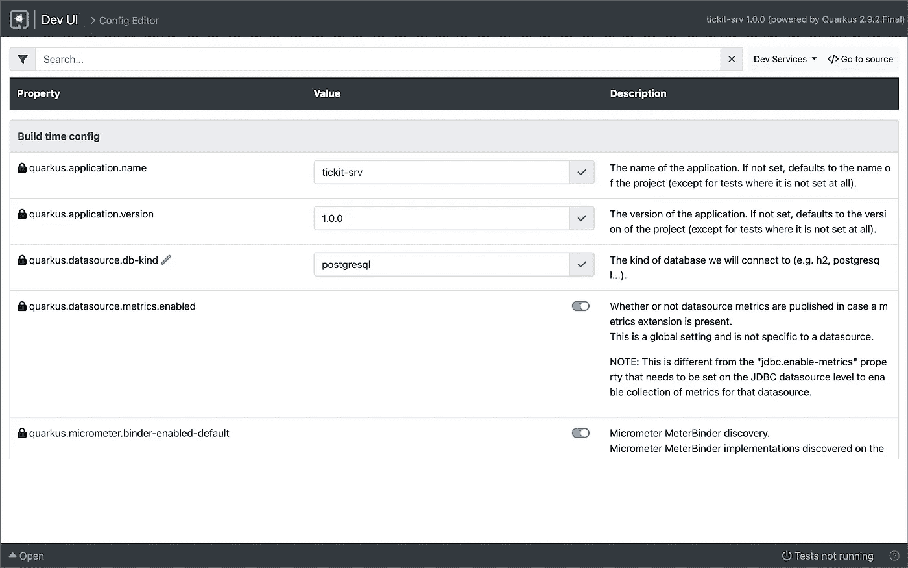

Quarkus 开发 UI 的配置编辑器

您还可以查看开发服务的配置，包括正在运行的容器和无配置数据库配置。

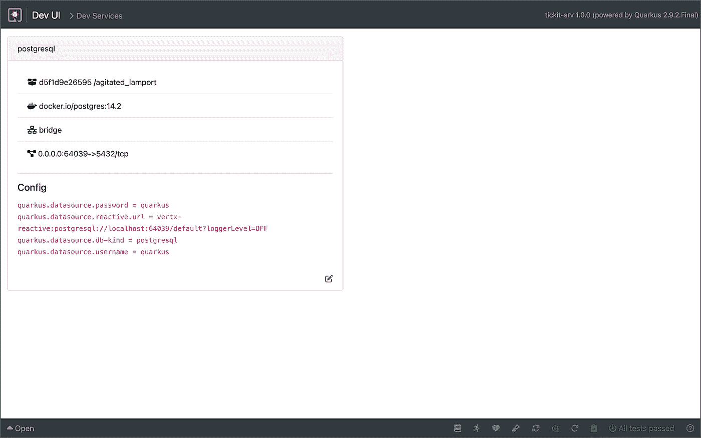

开发服务配置控制台

## Quarkus REST 乐谱控制台

加载 RESTEasy Reactive 扩展后，您可以从开发 UI 访问 Quarkus REST Score 控制台。REST 分数控制台通过分数和颜色编码显示端点性能:绿色、黄色或红色。RedHat 最近发表了一篇博客，讨论评分过程以及如何优化性能端点。三项测量显示了 REST 反应式应用是否可以进一步优化。

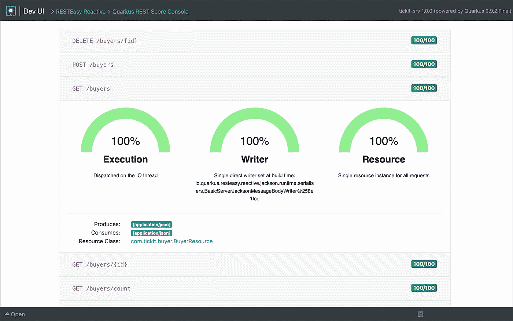

REST 反应性应用终点的测量

# 应用测试

Quarkus 通过为[集成](https://quarkus.io/guides/getting-started-testing)提供通用测试框架，例如包括 [JUnit](https://junit.org/junit5/) 、 [Mockito](https://site.mockito.org/) 和[放心](https://rest-assured.io/)，来支持健壮的基于 JVM 的本地连续测试。Quarkus 的许多测试特性都是通过注释实现的，比如`QuarkusTestResource`、`QuarkusTest`、`QuarkusIntegrationTest`和`TransactionalQuarkusTest`。

Quarkus 通过两种不同的方法支持模拟对象的使用。您可以使用 CDI 替代方案来模拟所有测试类的 bean，或者使用`[QuarkusMock](https://quarkus.io/blog/mocking/)`来模拟每个测试的 bean。这包括与 [Mockito](https://site.mockito.org/) 的集成。

放心集成对于测试 Quarkus 微服务 API 应用程序特别有用。根据他们的[网站](https://rest-assured.io/)，restassure 是一个 Java DSL，用于简化基于 REST 的服务的测试。它支持最常见的 HTTP 请求方法，可用于验证这些请求的响应。放心使用作为[行为驱动开发](http://dannorth.net/introducing-bdd/) (BDD)的一部分而流行的`given()`、`when()`、`then()`测试方法。

放心测试方法示例

可以使用`quarkusTest` Gradle 任务运行测试。该应用程序包含少量的集成测试来演示这一特性。

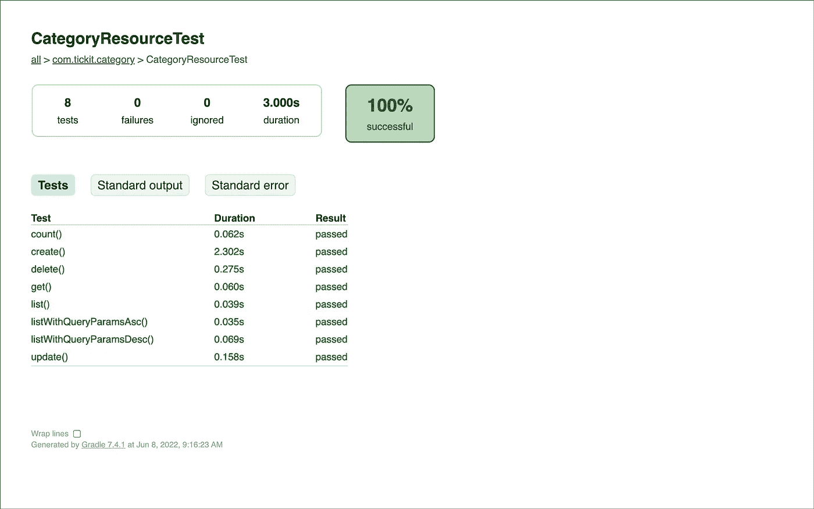

Quarkus 应用测试结果报告

# Swagger 和 OpenAPI

Quarkus 提供了符合 [MicroProfile OpenAPI](https://github.com/eclipse/microprofile-open-api/) 规范的 [Smallrye OpenAPI](https://github.com/smallrye/smallrye-open-api/) 扩展，允许您生成 API [OpenAPI v3 规范](https://github.com/OAI/OpenAPI-Specification/blob/main/versions/3.0.0.md)并公开 [Swagger UI](https://swagger.io/tools/swagger-ui/) 。 `/q/swagger-ui`资源公开了 Swagger UI，允许您可视化 Quarkus API 的资源并与之交互，而无需任何实现逻辑。


展示 Quarkus 应用程序的 API 资源的 Swagger UI

可以使用 Swagger UI 测试资源，而无需编写任何代码。

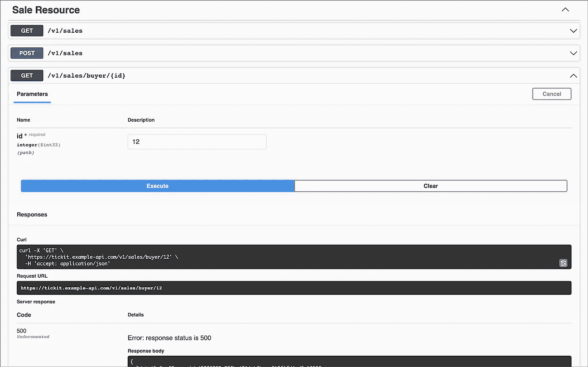

在 Swagger UI 中测试 Quarkus 应用程序的 API 资源

OpenAPI 规范(以前称为 Swagger 规范)是 REST APIs 的一种 API 描述格式。`/q/openapi`资源允许您生成一个 [OpenAPI v3 规范](https://github.com/OAI/OpenAPI-Specification/blob/main/versions/3.0.0.md)文件。OpenAPI 文件允许你描述你的整个 API。

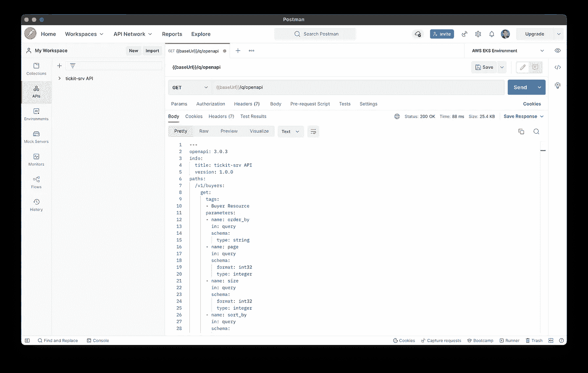

OpenAPI v3 规范可通过 Quarkus 应用程序的 API 资源访问

[OpenAPI v3 规范](https://github.com/OAI/OpenAPI-Specification/blob/main/versions/3.0.0.md)可以保存为文件，并导入到像 [Postman](https://www.postman.com/) 这样的应用程序中，这是一个用于构建和使用 API 的 API 平台。

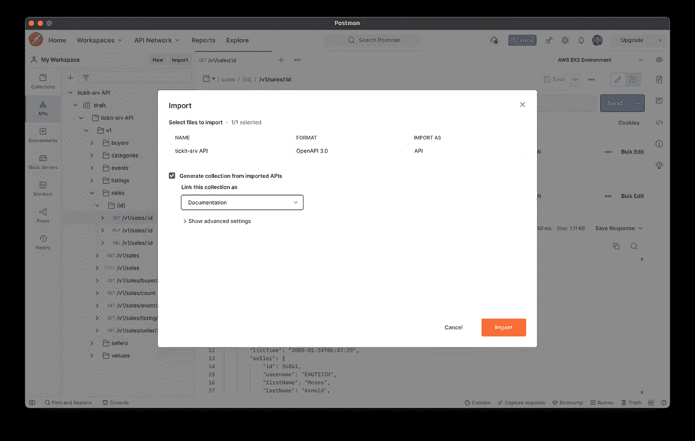

将 Quarkus 微服务的 OpenAPI 文件导入 Postman

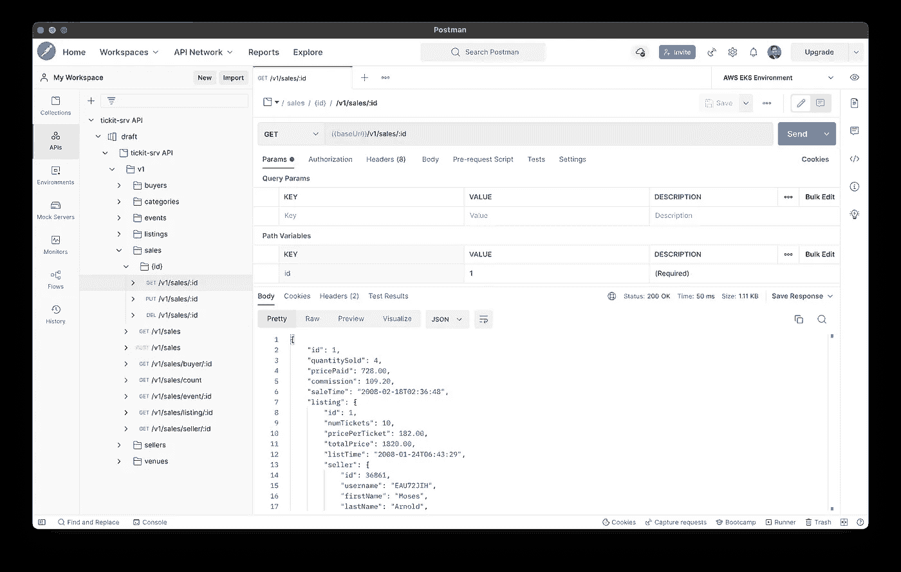

在 Postman 中使用 OpenAPI API 规范与 API 的资源进行交互

# 具有 GitHub 操作的 GitOps

在本文中， [GitOps](https://about.gitlab.com/topics/gitops/) 用于持续测试、构建、打包 Quarkus 微服务应用并将其部署到 Kubernetes。具体来说，帖子使用了 [GitHub 动作](https://docs.github.com/en/actions/learn-github-actions/understanding-github-actions)。GitHub Actions 是一个持续集成和持续交付(CI/CD)平台，允许您自动化您的构建、测试和部署管道。工作流是在存储库中的`.github/workflows`目录中定义的，一个存储库可以有多个工作流，每个工作流可以执行一组不同的任务。

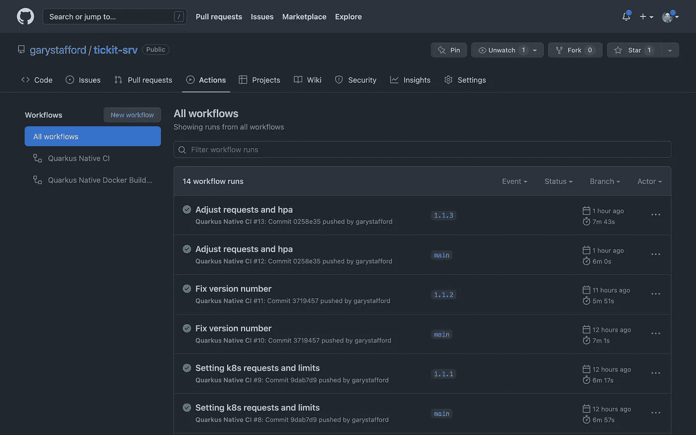

GitHub 行动工作流程的结果

两个 GitHub 动作与这篇文章的 GitHub 库相关联。第一个动作，`build-test.yml`，在每次推送 GitHub 时，在本地心轴容器中本地构建和测试源代码。第二个动作(*如下图所示*)，`docker-build-push.yml`，构建并封装本机构建的可执行文件，将其推送到 Docker 的容器注册表( [docker.io](https://hub.docker.com/r/garystafford/tickit-srv/tags) )，最后将应用程序部署到 Kubernetes。这个动作是通过将新的 [Git 标签](https://git-scm.com/book/en/v2/Git-Basics-Tagging)推送到 GitHub 来触发的。

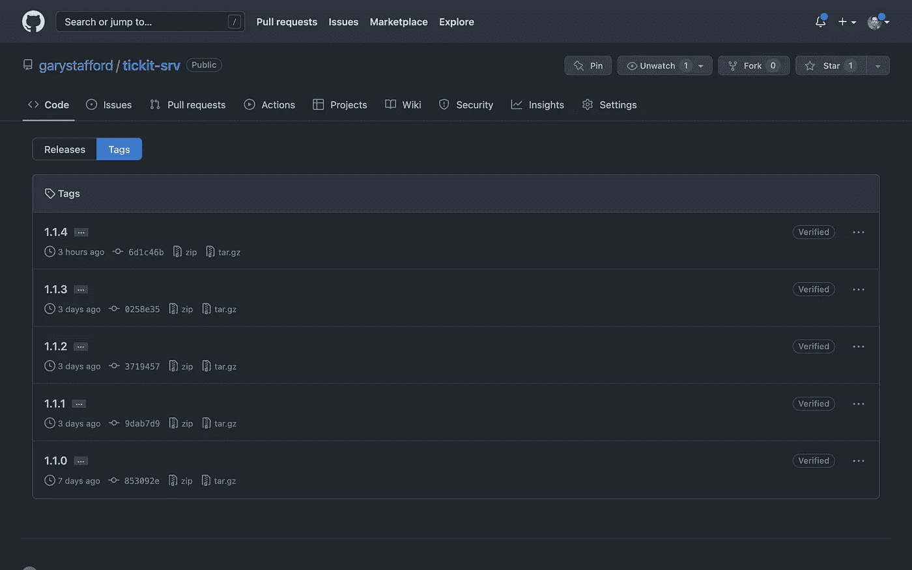

与触发部署的 Quarkus 应用程序相关联的 Git 标记

动作的构建步骤中包含了几个 Quarkus 配置属性。或者，这些属性可以在`application.properties`文件中定义。然而，我已经决定将它们作为 Gradle 构建任务的一部分，因为它们是特定于构建类型和容器注册表以及我正在推送到工件的 Kubernetes 平台的。

## 库伯内特资源公司

由 Quarkus build 创建的 Kubernetes resources YAML 文件也通过 GitHub 操作的最后一步上传并保存为 GitHub 中的工件。

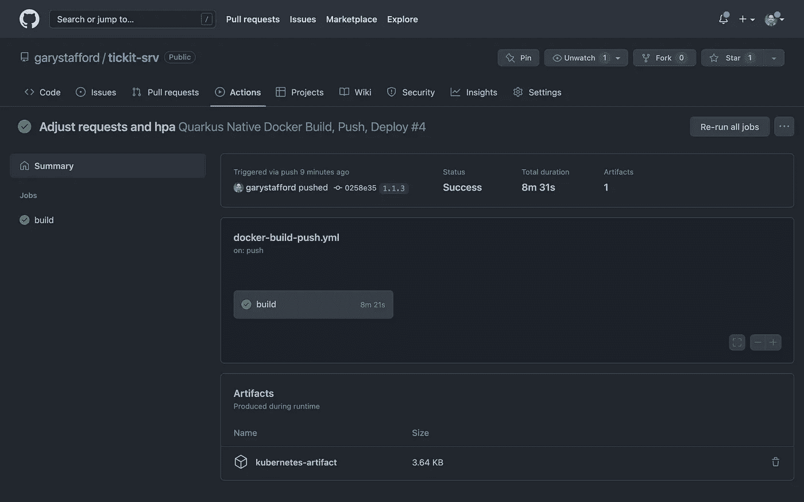

Kubernetes 文件保存为 GitHub 操作工件以供参考

Quarkus 自动生成`ServiceAccount`、`Role`、`RoleBinding`、`Service`、`Deployment`资源。

Kubernetes 资源 YAML 文件由 Quarkus 自动生成

## 选择 Kubernetes 平台

唯一特定于云提供商的代码在第二个 GitHub 动作中。

在这种情况下，应用程序被部署到现有的 [Amazon Elastic Kubernetes 服务](https://aws.amazon.com/eks/) (Amazon EKS)，这是 AWS 提供的一个完全托管的、经过认证的符合 Kubernetes 的服务。这些步骤可以很容易地替换为部署到其他云平台的步骤，如微软的 Azure Kubernetes 服务或谷歌云的谷歌 Kubernetes 引擎。

## GitHub 秘密

一些属性使用 GitHub 环境变量，其他属性使用安全的 GitHub [存储库加密秘密](https://docs.github.com/en/actions/security-guides/encrypted-secrets#creating-encrypted-secrets-for-a-repository)。使用`[kodermax/kubectl-aws-eks@master](https://github.com/kodermax/kubectl-aws-eks)` GitHub 操作时，使用秘密来保护 Docker 凭证(用于将 Quarkus 应用程序映像推送到 Docker 的映像存储库)、AWS IAM 凭证以及部署到 AWS 上的 Kubernetes 所需的`[kubeconfig](https://docs.aws.amazon.com/eks/latest/userguide/create-kubeconfig.html)`文件的 base64 编码内容。

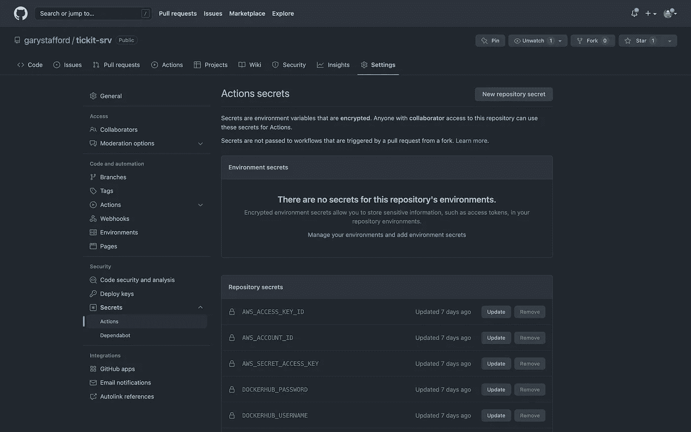

GitHub secure GitHub 为 GitHub 操作加密的存储库机密

## 码头工人

查看包含在动作构建步骤中的配置属性，注意用于构建本地 Quarkus 应用程序`[quay.io/quarkus/ubi-quarkus-mandrel:22.1.0.0-Final-java17](https://quay.io/repository/quarkus/ubi-quarkus-mandrel?tab=tags&tag=22.1.0.0-Final-java17)`的心轴容器。此外，请注意，项目的 Docker 文件用于构建最终的 Docker 映像，将其推送到映像存储库，然后用于在 Kubernetes，`src/main/docker/Dockerfile.native-micro`上提供容器。这个 Dockerfile 文件使用`[quay.io/quarkus/quarkus-micro-image:1.0](https://quay.io/repository/quarkus/quarkus-micro-image?tab=tags&tag=1.0)`基础映像来封装本地 Quarkus 应用程序。

这些属性还定义了图像的存储库名称和标签(例如`garystafford/tickit-srv:1.1.0`)。

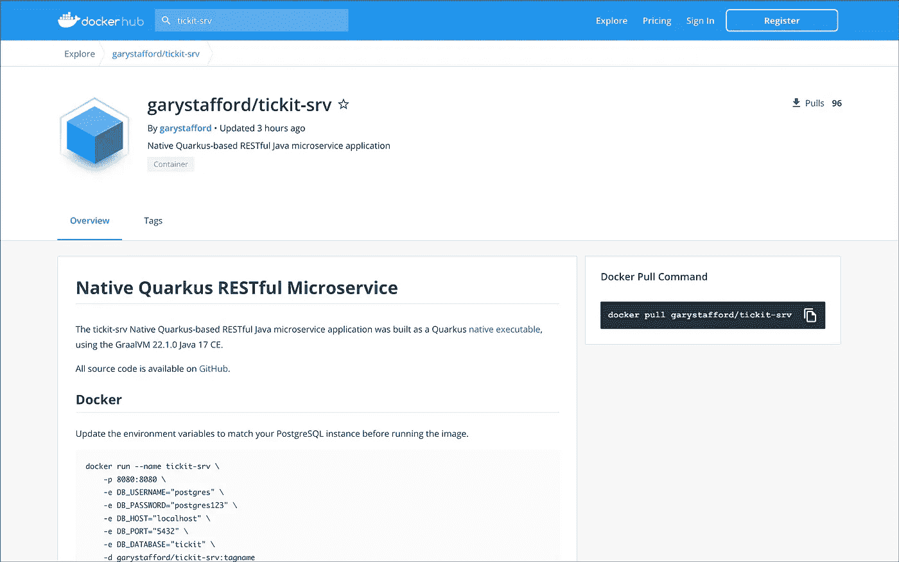

显示 Quarkus 应用程序映像的 Docker 映像注册表

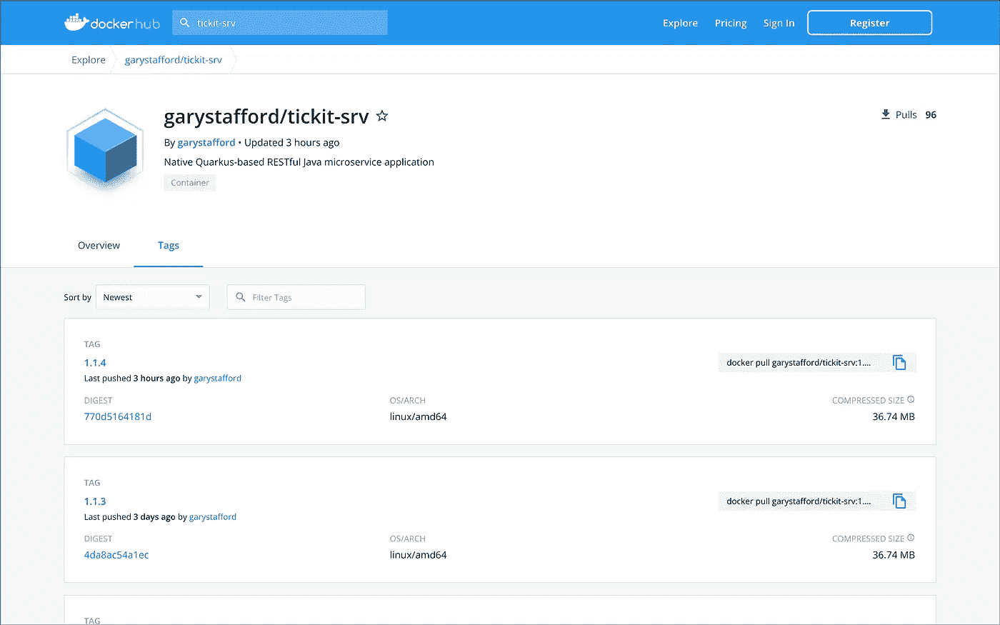

显示最新 Quarkus 应用程序图像标签的 Docker 图像注册表

# 库伯内特斯

除了预先创建`ticket`名称空间之外，Kubernetes 的一个秘密被预先部署到`ticket`名称空间。GitHub 动作还需要一个角色和角色绑定来将工作负载部署到 Kubernetes 集群。最后，HorizontalPodAutoscaler (HPA)用于自动扩展工作负载。

```
export NAMESPACE=tickit# Namespace
kubectl create namespace ${NAMESPACE}# Role and RoleBinding for GitHub Actions to deploy to Amazon EKS
kubectl apply -f kubernetes/github_actions_role.yml -n ${NAMESPACE}# Secret
kubectl apply -f kubernetes/secret.yml -n ${NAMESPACE}# HorizontalPodAutoscaler (HPA)
kubectl apply -f kubernetes/tickit-srv-hpa.yml -n ${NAMESPACE}
```

作为动作构建步骤中包含的配置属性的一部分，请注意使用了 [Kubernetes secrets](https://kubernetes.io/docs/concepts/configuration/secret/) 。

```
-Dquarkus.kubernetes-config.secrets=tickit
-Dquarkus.kubernetes-config.secrets.enabled=true
```

此机密包含 base64 编码的敏感凭据和连接值，用于连接到生产 PostgreSQL 数据库。对于这篇文章，我已经预先构建了一个用于 PostgreSQL 的[Amazon RDS](https://aws.amazon.com/rds/postgresql/?p=pm&c=rds&z=2)数据库实例，创建了门票数据库和所需的数据库对象，最后，导入 GitHub 存储库中包含的示例数据`[garystafford/tickit-srv-data](https://github.com/garystafford/tickit-srv-data)`。

帖子中使用的 Kubernetes 秘密示例

在 Secret 中看到的五个密钥在`application.properties`文件中使用，以提供从 Quakus 应用程序到生产 PostgreSQL 数据库的访问。

在亚马逊 EKS 上使用 Kubernetes secrets 的一个更好的替代方案是 [AWS Secrets 和为](https://github.com/aws/secrets-store-csi-driver-provider-aws) [Kubernetes Secrets Store CSI 驱动程序](https://secrets-store-csi-driver.sigs.k8s.io/)提供配置的提供商 (ASCP)。 [AWS Secrets Manager](https://aws.amazon.com/secrets-manager/) 将秘密作为文件存储在亚马逊 EKS pod 中。

# AWS 架构

GitHub 动作将应用程序的映像推送到 Docker 的容器注册表( [docker.io](https://hub.docker.com/r/garystafford/tickit-srv/tags) )，然后将应用程序部署到 Kubernetes。或者，您可以使用 AWS 的 Amazon 弹性容器注册中心(Amazon ECR)。亚马逊 EKS 在创建 Kubernetes Pod 容器时从 Docker 中提取图像。

有许多方法可以将流量从请求者路由到 Kubernetes 上运行的 Quarkus 应用程序。在这篇文章中，Quarkus 应用程序被公开为一个[节点端口](https://kubernetes.io/docs/concepts/services-networking/service/#type-nodeport)上的 [Kubernetes 服务](https://kubernetes.io/docs/concepts/services-networking/service/)。对于这篇文章，我已经用 [Amazon Route 53](https://aws.amazon.com/route53/) 注册了一个域名`example-api.com`，并用 [AWS 证书管理器](https://aws.amazon.com/certificate-manager/)注册了一个相应的 TLS 证书。使用 HTTPS 或端口 443 将 Quarkus 应用程序的入站请求定向到子域`ticket.example-api.com`。Amazon Route 53 将这些请求路由到第 7 层[应用负载平衡器](https://docs.aws.amazon.com/elasticloadbalancing/latest/application/introduction.html) (ALB)。然后，ALB 使用简单的循环负载平衡将这些请求路由到节点端口上的亚马逊 EKS Kubernetes 集群。Kubernetes 会自动将请求路由到适当的工作节点和 Kubernetes pod。然后，响应通过类似的路径返回给请求者。


Quarkus 应用程序生产环境的高级 AWS 架构图

# 结果

如果 GitHub 动作成功，任何对 GitHub 的代码修改都会导致应用程序部署到 Kubernetes。

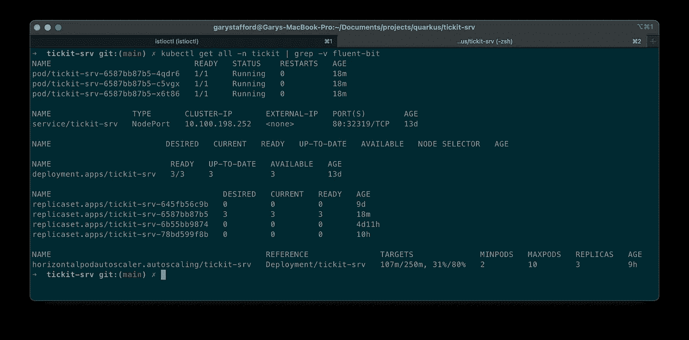

部署到 Kubernetes 集群中的票证名称空间的资源

我们还可以使用 Kubernetes 仪表板查看部署的 Quarkus 应用程序资源。

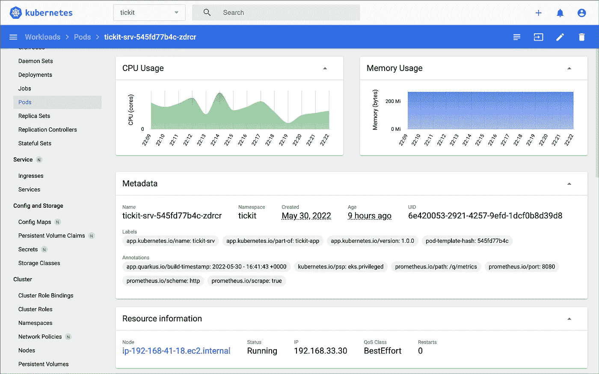

在 Kubernetes 仪表板中查看的 Quarkus 应用程序窗格

# 韵律学

post 的 Quarkus 应用程序实现了`[micrometer-registry-prometheus](https://quarkus.io/guides/micrometer)`扩展。微米度量库公开了运行时和应用度量。[千分尺](https://micrometer.io/)定义了一个核心库，提供了度量和核心度量类型的注册机制。

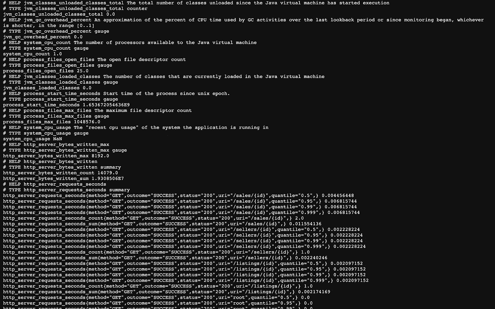

Quarkus 应用程序 API 的指标资源公开的指标示例

使用千分尺扩展，度量资源在`/q/metrics`被暴露，它可以被工具如[普罗米修斯](https://prometheus.io/)抓取和可视化。AWS 为 Prometheus (AMP) 提供完全托管的[亚马逊托管服务，可以轻松与亚马逊 EKS 整合。](https://docs.aws.amazon.com/grafana/latest/userguide/prometheus-data-source.html)

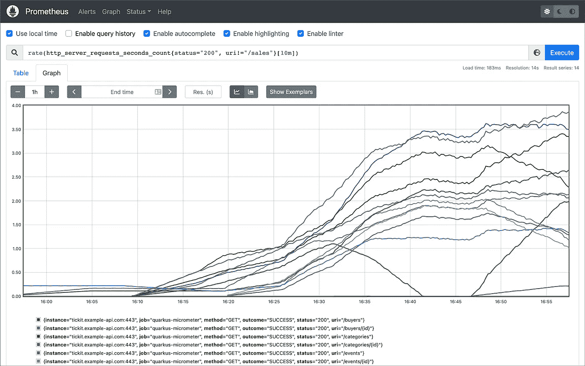

Prometheus 从 Quarkus 应用程序中抓取的 HTTP 服务器请求图

使用 Prometheus 作为数据源，我们可以在 [Grafana](https://grafana.com/) 中构建仪表板来观察 Quarkus 应用程序指标。与 AMP 类似，AWS 提供其完全托管的[亚马逊托管的 Grafana](https://aws.amazon.com/grafana/) (AMG)。

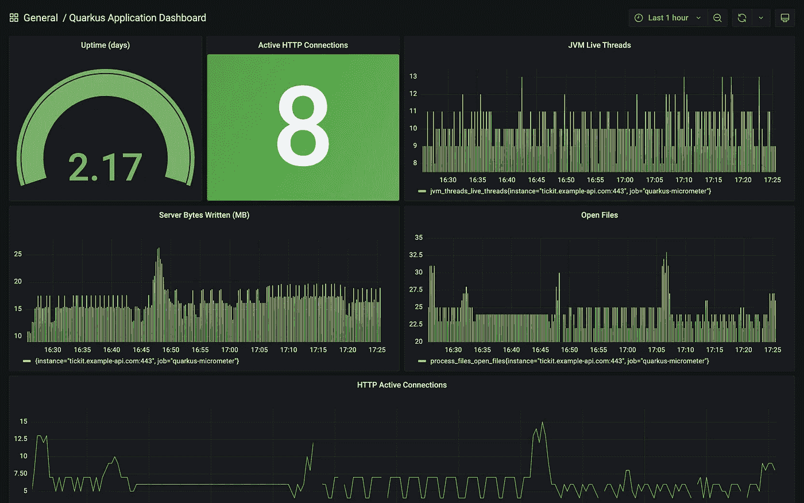

通过 Prometheus 利用 Quarkus 应用指标构建的 Grafana 仪表板示例

# 集中式日志管理

根据 Quarkus [文档](https://quarkus.io/guides/logging#logging-adapters)，在内部，Quarkus 使用 [JBoss 日志管理器](https://access.redhat.com/documentation/en-us/red_hat_build_of_quarkus/1.11/html/configuring_logging_with_quarkus/con-jboss-logmanager-and-supported-logging-frameworks_quarkus-configuring-logging)和 JBoss 日志门面。您可以在代码中使用 JBoss 日志 facade 或任何支持的日志 API，包括 JDK `java.util.logging`(又名 JUL)、 [JBoss 日志](https://github.com/jboss-logging/jboss-logging)、 [SLF4J](https://www.slf4j.org/) 和 [Apache Commons 日志](https://commons.apache.org/proper/commons-logging/)。Quarkus 会将它们发送给 JBoss 日志管理器。

有许多方法可以集中日志。例如，您可以将这些日志发送到开源的集中式日志管理系统，如 [Graylog](https://www.graylog.org/) 、 [Elastic Stack](https://www.elastic.co/elastic-stack/) 、fka [ELK](https://www.elastic.co/elastic-stack/) (Elasticsearch、Logstash、Kibana)、 [EFK](https://docs.fluentd.org/v/0.12/articles/docker-logging-efk-compose) (Elasticsearch、Fluentd、Kibana)，以及带有 [Fluent Bit](https://fluentbit.io/) 的 [OpenSearch](https://opensearch.org/) 。

如果您使用 Kubernetes，最简单的方法是将日志发送到控制台，并在集群中集成一个中央日志管理器。由于本文中的 Quarkus 应用程序运行在亚马逊 EKS 上，所以我选择了带有 [Fluent Bit](https://fluentbit.io/) 的[亚马逊 OpenSearch 服务](https://aws.amazon.com/opensearch-service)，这是一个开源的多平台日志处理器和转发器。Fluent Bit 完全兼容 Docker 和 Kubernetes 环境。亚马逊提供了一个关于使用 Fluent Bit 安装和配置亚马逊 OpenSearch 服务的[优秀研讨会](https://www.eksworkshop.com/intermediate/230_logging/)。

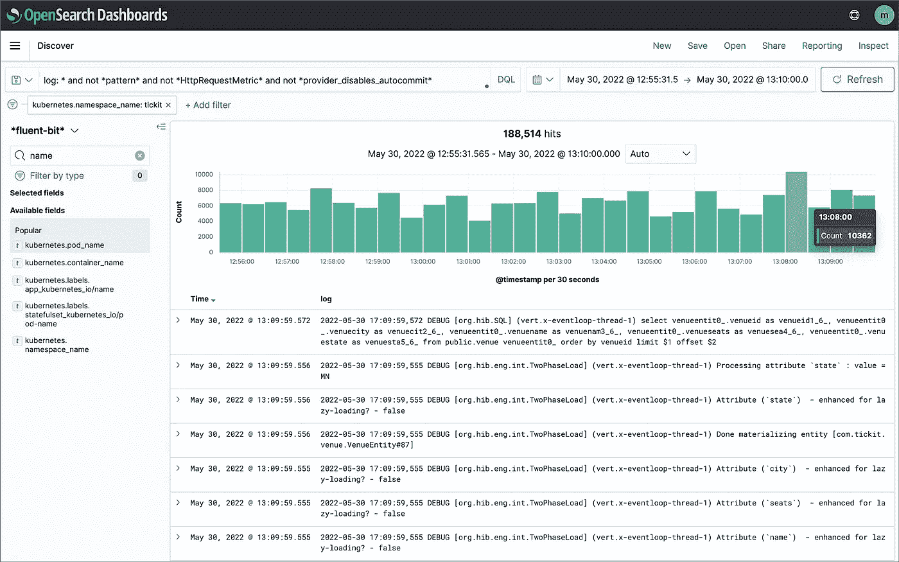

Amazon OpenSearch 显示了 Quarkus 应用程序的调试日志

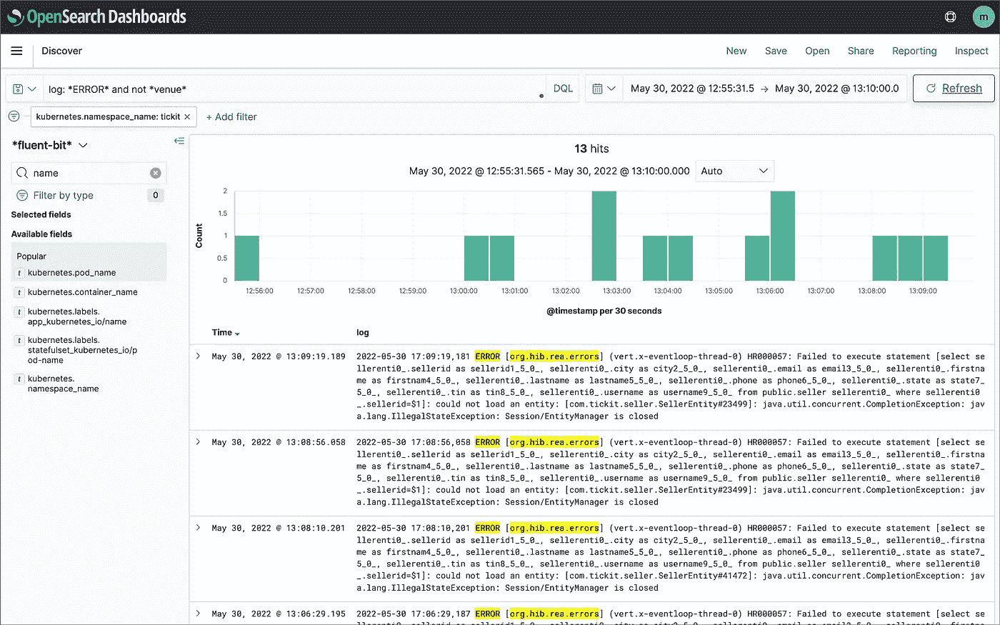

Amazon OpenSearch 日志过滤了 Quarkus 应用程序抛出的错误

# 结论

正如我们在这篇文章中了解到的，Quarkus，即“超音速亚原子 Java”框架，是一个用于编写 Java 应用程序的云原生、Kubernetes 原生、容器优先、微服务优先的框架。我们观察了如何构建、测试和部署一个 RESTful Quarkus 本地应用程序到 Kubernetes。

Quarkus 的功能和特性远远超出了本文的范围。在未来的帖子中，我们将探索 Quarkus 的其他功能，包括可观察性、GraphQL 集成、缓存、数据库代理、跟踪和调试、消息队列、数据管道和流分析。

本博客代表我自己的观点，不代表我的雇主亚马逊网络服务公司(AWS)的观点。所有产品名称、徽标和品牌都是其各自所有者的财产。所有图表和插图都是作者的财产。