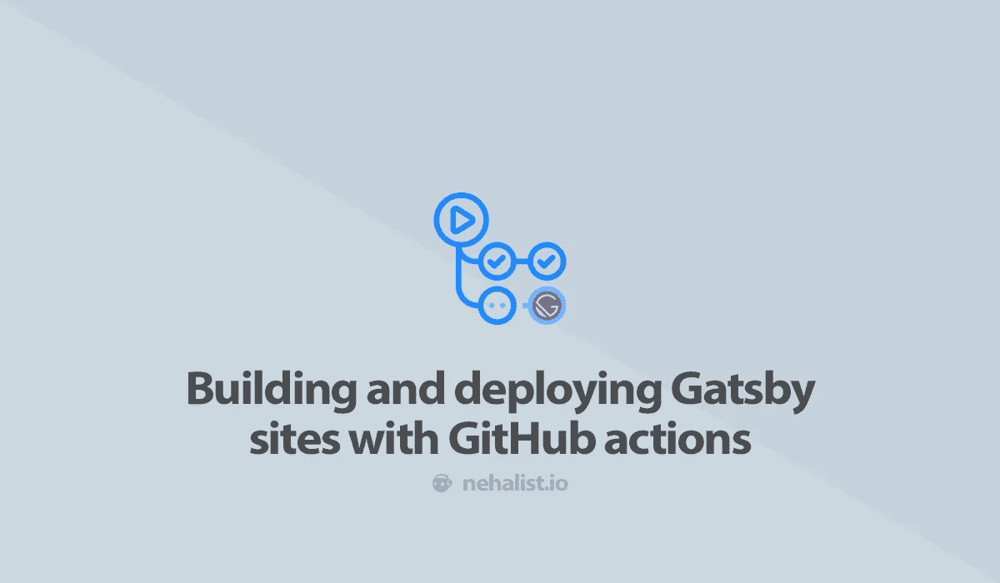
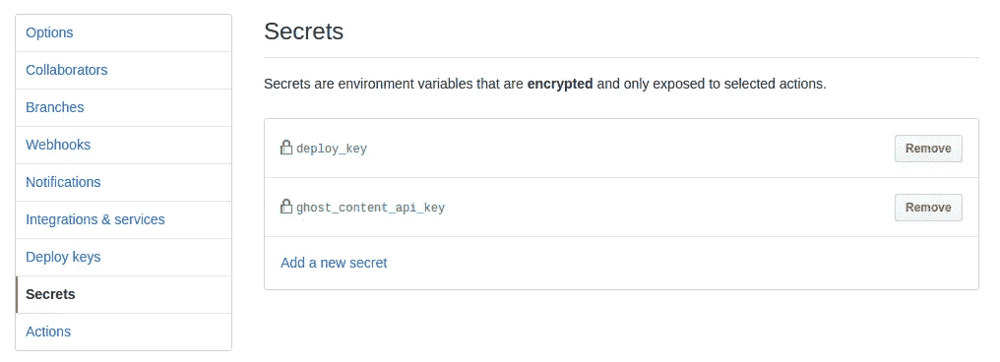
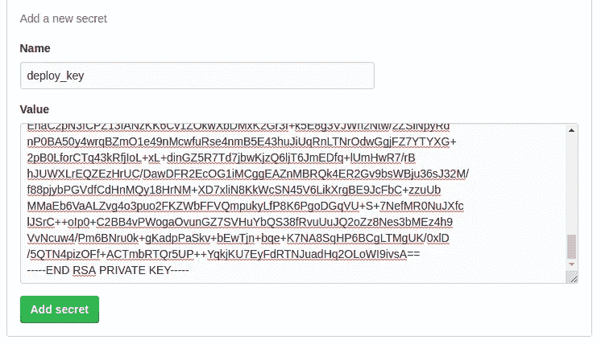

# 使用 GitHub 操作构建和部署 Gatsby 站点

> 原文：<https://itnext.io/building-and-deploying-gatsby-sites-with-github-actions-97f7387551ca?source=collection_archive---------6----------------------->



GitHub actions 目前处于 [beta](https://github.com/features/actions) 阶段，我是有幸获得 beta 版的人之一。出于各种原因，我决定将我的博客的整个构建过程切换到 GitHub actions——让我们来谈谈为什么以及如何用 actions 构建和部署 Gatsby 站点。

# 为什么呢？

如果你只是对实际的指南感兴趣，你可以跳过这一部分——但我想解释为什么彻底检查我的构建过程——和这篇文章——从来没有计划过，为什么它们仍然是强制性的。

已经一个多月没有新帖子了。但不是因为我没有写任何新帖子——事实上我甚至发布了一些新帖子——他们只是从未见过世面。*什么？！*

与许多 Gatsby 网站不同，我没有托管在 Netlify、GitHub 页面或任何其他官方文件中描述的托管选项上。我的博客和所有相关工具(评论系统，时事通讯等。)都托管在 [Uberspace](https://uberspace.de/en/) 上。我真的很喜欢他们，由于他们的大力支持，一个伟大的[定价模型](https://uberspace.de/en/product/#prices)可能会被采纳到你的预算中，事实上我可以用 SSH 访问服务器并且可以自己做很多事情。在控制你的服务器方面没有花哨的界面，大多数事情都是在你的控制台上完成的——我喜欢它。

当我换成盖茨比的时候，我需要做一些工作，以便在我发布新帖子的时候能够自动重建我的博客。这项工作包括一个 webhook，它触发了一个简单的 shell 脚本，该脚本在每次被调用时都会重新构建和部署我的站点。负责构建和部署站点的 shell 脚本非常简单:

```
#!/bin/bashset -o errexitcd ~/blog
rm -rf .cacheif [ "$1" == "fully" ]; then
  rm -rf node_modules
  git pull
  ~/.yarn/bin/yarn install --production=true --pure-lockfile
fi~/bin/gatsby build
rm -rf ~/blog_backup
cp -R <path>/html ~/blog_backup
rsync -avu --delete ~/blog/public/ ~/html
```

有时(主要是在添加新功能时)我需要完全重建博客，包括从 Git 获取新的源文件和安装新的依赖项。因为这需要很长时间，所以它是可选的，可以在执行脚本时通过可选的`fully`参数触发。

这个脚本是调用 webhook 时执行的脚本链的一部分。webhook 本身调用了一个脚本，该脚本将上述脚本的输出传送到一个文件中，该文件在完成后会给我发送一封邮件。这样，每当触发重建时，我可以很容易地检查是否一切正常。

对于现场控制台输出之类的东西来说，这不是一个花哨的解决方案，但它确实有效。

# 问题是

发布关于 [tmux](https://nehalist.io/software-spotlight-tmux) 的帖子一周后，我想发布一个新帖子。大多数时间，我点击“发布”按钮后大约十分钟，网络钩子就完成了，我收到了邮件，告诉我一切都很顺利，我的博客也更新了最新的帖子。

*这次不行。*

将近一个小时后，仍然没有邮件，我进入我的服务器，查看发生了什么。最后一次构建的输出是:

```
[<user>@<server> blog]$ ~/bin/gatsby build
success open and validate gatsby-configs - 1.622 s
success load plugins - 22.156 s
success onPreInit - 0.018 s
success delete html and css files from previous builds - 0.261 s
success initialize cache - 0.020 s
success copy gatsby files - 0.575 s
success onPreBootstrap - 0.098 s
success source and transform nodes - 0.861 s
success building schema - 1.085 s
success createPages - 0.284 s
success createPagesStatefully - 0.146 s
success onPreExtractQueries - 0.012 s
success update schema - 0.037 s
success extract queries from components - 0.432 s
success write out requires - 0.007 s
success write out redirect data - 0.003 s
success Build manifest and related icons - 0.921 s
success onPostBootstrap - 1.478 s
⠀
info bootstrap finished - 92.619 s
⠀
success run static queries - 0.036 s — 3/3 101.33 queries/second
⠼ Building production JavaScript and CSS bundles
Killed
```

*被杀？对不起，小家伙。*

经过一番[研究](https://manual.uberspace.de/basics-resources.html)后，我发现 Uberpsace 会杀死占用超过 1.5 GB 内存的进程。额外的研究表明，我的构建过程在这一点上占用了高达 1.7 GB 的内存，这也是它被终止的原因。

我联系了 Uberspace 的支持者，他们建议使用`--max-old-space-size=1024`标志来防止 Node 占用太多的内存——但遗憾的是，这没有成功。我明白一个主持人不能提供一个无止境的记忆来源-但这确实是一个大问题；此时我无法改变我博客上的任何东西。

我不得不重新思考我的整个构建过程。我查找了不同的选项，比如 AWS、GitHub 页面，甚至是本地构建和通过容器部署——但是它们都有一些我不习惯的缺点。

在某个时候，我想用 GitHub 的动作来建立我的博客并将其部署到 Uberspace。这将提供每月 2000 分钟的构建时间，以及高达 [7 GB 的内存](https://help.github.com/en/articles/virtual-environments-for-github-actions#supported-virtual-environments-and-hardware-resources)——这肯定可以完成任务。

经过一些工作，我的博客终于完成了:我的博客现在通过行动在 GitHub 上建立(并测试)，最后被部署到我的 Uberspace 上，这意味着我现在可以重新开始写内容了。*万岁！*

# GitHub 操作

我的 GitHub 操作包括一个多步骤的工作，从签出存储库到通过 Docker 和`rsnyc`部署构建的站点。

我们来看看工作流程(位于`.github/workflows/workflow.yml`):

```
name: Update blogon: [push, repository_dispatch]jobs:
  update:
    runs-on: ubuntu-latest
    steps:
      - uses: actions/checkout@v1- name: Set Node.js
        uses: actions/setup-node@master
        with:
          node-version: 10.x- name: Install dependencies
        run: yarn install --prod --pure-lockfile- name: Lint
        run: yarn run lint- name: Build
        run: yarn run build
        env:
          GHOST_API_URL: "[https://ghost.nehalist.io](https://ghost.nehalist.io)"
          GHOST_CONTENT_API_KEY: ${{ secrets.ghost_content_api_key }}
          GATSBY_ENV: "prod"
          GATSBY_CARRAWAY_URL: "[https://carraway.nehalist.io](https://carraway.nehalist.io)"
          GATSBY_COMMENTO_URL: "[http://comments.nehalist.io](http://comments.nehalist.io)"
          GA_TRACKING_ID: "UA-40873708-1"- name: Deploy
        run: docker-compose run deploy
        env:
          DEPLOY_KEY: ${{ secrets.deploy_key }}
```

步骤相当简单:

*   查看存储库
*   版本处的设置节点`10.x`
*   通过`yarn`安装依赖项
*   清理所有文件
*   构建网站
*   通过自定义容器进行部署

关键字`on`指定我们的动作何时被触发——在本例中，它在`push`和`repository_dispatch`被触发。

`repository_dispatch`乍一看可能不明显；但这是为了能够在外部调用它(比如 URL)。这将变得很重要，因为每当一个新帖子发布时，这个 webhook 就会被调用，它会向 GitHub 发送一个`cURL`请求，并触发`repository_dispatch`事件。

> ***重要*** *:仅在* `*master*` *分支上触发* `*repository_dispatch*` *(文档中提到的* ***不是*** *)。获得这种知识花费了我一生的大量时间。*

更有趣的事情发生在构建和部署步骤中。但是，在仔细研究它们是如何工作的之前，让我们简单地谈谈行动中的秘密。

# 秘密

秘密，比如你的 SSH 密钥或者你的 API 密钥，应该*永远不要*存储在你的存储库中。相反，您可以使用存储库机密(位于“机密”的存储库设置中)。



这些机密不会打印在您的操作控制台输出中，一旦添加，用户根本无法读取。当涉及到通过`rsync`进行部署时，这一点尤其重要:我们将使用 SSH 密钥来访问服务器，因此如果有人访问到这个秘密，那就真的*糟糕了。*

> 对于这样的事情，没有理由不使用秘密；即使你的网站是在一个私有的仓库里，只有你可以像我一样访问。

# 建设网站

让我们仔细看看构建步骤:

```
- name: Build
        run: yarn run build
        env:
          GHOST_API_URL: "[https://ghost.nehalist.io](https://ghost.nehalist.io)"
          GHOST_CONTENT_API_KEY: ${{ secrets.ghost_content_api_key }}
          GATSBY_ENV: "prod"
          GATSBY_CARRAWAY_URL: "[https://carraway.nehalist.io](https://carraway.nehalist.io)"
          GATSBY_COMMENTO_URL: "[https://comments.nehalist.io](https://comments.nehalist.io)"
          GA_TRACKING_ID: "UA-40873708-1"
```

我的站点使用了一堆环境变量(通过`process.env.<variable>`)——因为我为生产和开发环境使用了不同的源——这可以通过工作流步骤中的`env`键轻松设置。

要访问`env`变量中的秘密，你可以简单地使用`${{ secrets.<your-secret> }}`。

# 部署站点

更有趣的部分是站点是如何部署的。我们工作流程中的步骤非常简单:

```
- name: Deploy
        run: docker-compose run deploy
        if: github.ref == 'refs/heads/master'
        env:
          DEPLOY_KEY: ${{ secrets.deploy_key }}
```

该步骤仅在我们处于`master`时执行

但是正如你在`run`键中看到的，我们不只是调用一个简单的命令，而是使用`docker-compose`来运行我们自己的 docker 容器进行部署。让我们来分析一下，看看这里发生了什么！

> *你可能想去掉* `*if*` *子句，把不同的 refs 部署到不同的位置；但是这绝对超出了这篇文章的范围。*

# 码头工人

我们首先需要看的是我们的`docker-compose.yml`文件:

```
version: '3'services:
  deploy:
    image: "instrumentisto/rsync-ssh"
    volumes:
      - .:/home/site
    working_dir: /home/site
    environment:
      deploy_key: $DEPLOY_KEY
    command: sh scripts/deploy.sh
```

> *没有* `*docker-compose*` *你可能可以做所有的 docker 事情——但是我已经习惯了，基本上总是用 docker 和 Docker Compose。*

我们将在部署中使用的图像是`[instrumentisto/rsync-ssh](https://hub.docker.com/r/instrumentisto/rsync-ssh/)`，它提供了一个安装了`rsync`的小容器。

如果你不知道`rsync`:它基本上只是同步文件。在我们的例子中:它将我们在 GitHub 上构建的 Gatsby 站点中的`public`目录同步到我们自己的服务器上，该站点将在那里托管。

`volumes`和`working_dir`正是我们的站点将被安装在容器内的位置。

这里更有趣的部分是`environment`和`command`。使用的环境变量来自 [GitHub 本身](https://help.github.com/en/articles/virtual-environments-for-github-actions#default-environment-variables)，其中`deploy_key`是我们从`workflow.yml`中得到的。在看一看在`command`内调用的脚本之前，我们先来谈谈 SSH 密钥。

# SSH 密钥

如前所述，我们将利用 SSH 密钥进行部署。

我们要做的是生成一个 SSH 密钥对(由私有和公共密钥组成)。*公钥*将被添加到我们的服务器中，而*私钥*将在我们的 docker 容器中用于`rsync`。因为我们**从来不**想把私钥透露给别人，所以我们打算用 GitHub secrets 来做这件事。

让我们从生成密钥开始:

```
ssh-keygen -t rsa -b 4096 -C "<your mail>"
```

这将生成一个公共和私有的 ssh 密钥。因为您不会直接使用这些键(并且在我们完成后会被删除)，所以将它们放在默认 SSH 目录之外的其他地方可能会有用，以防止弄乱您现有的 SSH 键。

如果一切都解决了，你应该有两个文件:`id_rsa`和`id_rsa.pub`(或者你叫它们什么)。`id_rsa`是你的*私钥*，而`id_rsa.pub`是你的公钥。首先让我们把你的公钥添加到我们的服务器上；

复制您的*公共*密钥、`id_rsa.pub`文件的内容(例如通过`xclip -sel clip id_rsa.pub`)并将其添加到您的服务器`authorized_keys`文件中(在我的例子中，该文件位于`/home/$USER/.ssh`)。

然后将你的*私有*密钥`id_rsa`的内容复制到你的 GitHub secrets 中。



这个密钥将在 Docker 容器中用来访问您的服务器。

# 部署脚本

我们需要查看的最后一个文件是由我们工作流中的 Docker 容器调用的`deploy.sh`文件:

```
#!/bin/sh# Instantly exists our script whenever an error occurs
set -e# Pipe our environmental SSH key variable into a file
mkdir -p $HOME/.ssh
echo "${deploy_key}" > $HOME/.ssh/deploy_key
chmod 600 $HOME/.ssh/deploy_key # SSH keys need to be readonly# Where to deploy our site on our server
target="~/html"# The actual rsync
sh -c "rsync -azh -e 'ssh -i $HOME/.ssh/deploy_key -o StrictHostKeyChecking=no' public/* --rsync-path='mkdir -p ${target} && rsync' <user>@<server>:${target}"# Remove our deploy_key again since it's no longer needed
rm $HOME/.ssh/deploy_key
```

起初，`rsync`命令可能看起来有点疯狂；

*   `-azh`用于使用存档模式(`-a`)、传输过程中压缩数据(`-z`)、保留硬链接(`-h`)。所有参数见[此处](https://www.computerhope.com/unix/rsync.htm)。
*   `-e`用于设置`ssh`命令(使用我们的`deploy_key`，不进行严格的主机密钥检查，如果我们要信任服务器，主机密钥检查会提示我们)。
*   `--rsync-path`是一个创建缺失父目录的巧妙小技巧(参见这篇[帖子](http://www.schwertly.com/2013/07/forcing-rsync-to-create-a-remote-path-using-rsync-path/))。

现在，每次执行 GitHub 操作时，您的博客都会直接部署到您的主机上。我们还缺少的最后一件事是创建一个 webhook，每当有新帖子发布时触发我们的操作。

# 从外部触发动作

从外部触发动作实际上是利用`[repository_dispatch](https://help.github.com/en/articles/events-that-trigger-workflows#external-events-repository_dispatch)`事件来完成的。

> *别忘了:* `*repository_dispatch*` *事件只对* `*master*` *分支有效！*

触发该动作的最简单方法是通过 cURL:

```
curl -v -X POST -u "<username>:<access-token>" -H "Accept: application/vnd.github.everest-preview+json" -H "Content-Type: application/json" --data '{"event_type":"update"}' [https://api.github.com/repos/](https://api.github.com/repos/)<username>/<repo-name>/dispatches
```

如果——你肯定应该——你正在使用双因素认证，你将需要一个具有`repo`权限的[个人访问令牌](https://github.com/settings/tokens)。

调用这个命令将触发我们的操作，我们的站点将被重新构建和部署。

如果你正在使用 Ghost，你不能在一篇文章发表后执行`cURL`命令，而是发送一个[文章请求到一个用户定义的 URL](https://ghost.org/docs/api/v2/webhooks/) 。在这种情况下，编写一个非常小的 PHP 脚本来执行`cURL`命令并触发动作是非常简单的；

```
<?php$key = $_GET['key'];if ($key !== 'f4aOLlmN3') {
    exit('Nope.');
}$curl = curl_init();
curl_setopt($curl, CURLOPT_URL, '[https://api.github.com/repos/](https://api.github.com/repos/)<username>/<repository>/dispatches');
curl_setopt($curl, CURLOPT_RETURNTRANSFER, true);
curl_setopt($curl, CURLOPT_HTTPAUTH, CURLAUTH_BASIC);
curl_setopt($curl, CURLOPT_HTTPHEADER, [
    'Authorization: token <access-token>',
    'Accept: application/vnd.github.everest-preview+json',
    'User-Agent: <username>',
]);
curl_setopt($curl, CURLOPT_POST, true);
curl_setopt($curl, CURLOPT_POSTFIELDS, json_encode([
    'event_type' => 'update'
]));$content = curl_exec($curl);
curl_close($curl);// we could var_dump($content) here or whatever
```

不要忘记替换脚本中的所有占位符

你可能注意到的第一件事是`$key`部分；这只是为了防止钩子被任何人触发。这是保护你的脚本的非常简单的方法。这个脚本只能通过`webhook.php?key=f4aOLlmN3`调用——其他的都不会触发动作。

其他一切都是基本的 PHP `cURL`疯狂。头部包含您的访问令牌，并将`User-Agent`设置为[您的用户名](https://developer.github.com/v3/#user-agent-required)，这是 GitHub 所要求的。

现在您可以设置您的 CMS 向该脚本发送请求(不要忘记 URL 中的`key`！)你的动作就会被触发。

# 结论

如果一切配置正确，你的站点现在可以在 GitHub 上构建，然后部署到你的服务器上。这就是花式酷炫，*不是吗？！*

由于 GitHub actions 仍处于测试阶段，未来可能会有所变化——但这篇文章的基本概念应该始终有效，应该在能力建设方面留出更多空间。

如果你喜欢这篇文章，请留下👏，关注我上 [*推特*](https://twitter.com/nehalist) *并订阅* [*我的快讯*](https://nehalist.io/newsletter/) *。本帖原载于*[*nehalist . io*](https://nehalist.io/building-and-deploying-gatsby-sites-with-github-actions)*。*