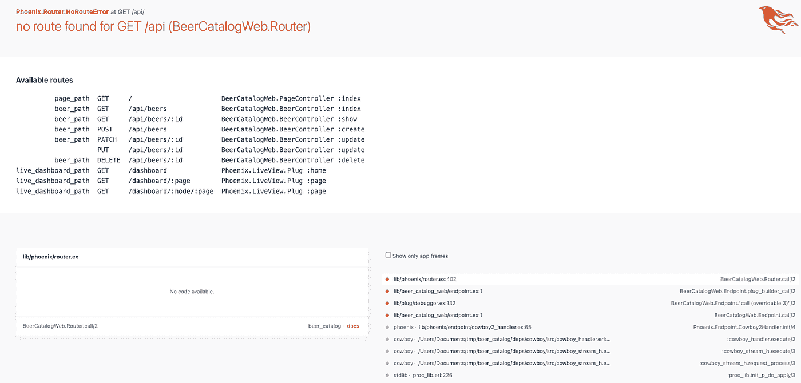
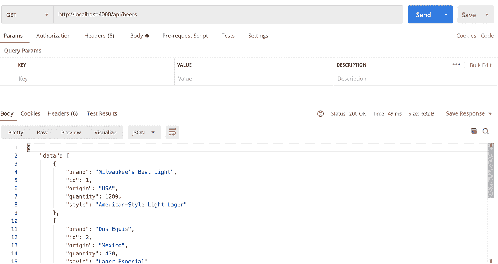
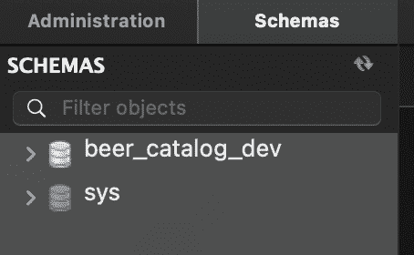
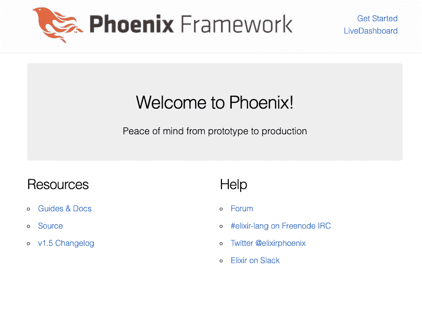
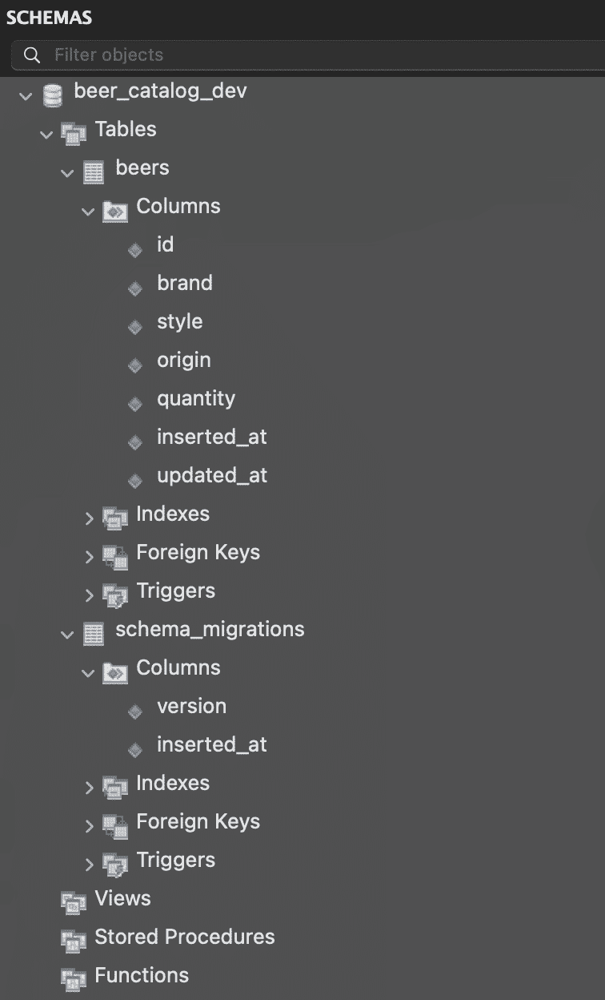
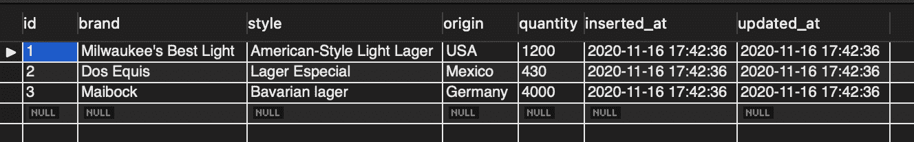

# 用 Phoenix 框架构建 API

> 原文：<https://itnext.io/building-apis-with-phoenix-framework-a7e280b7fa4a?source=collection_archive---------0----------------------->

许多早期的 Elixir 开发者都有这种感觉，以避免在项目中采用 Phoenix 时弄脏自己的手。不出所料，不仅接受 Phoenix 而且支持它的开发者数量正在快速上升。

但这不是白做的。Phoenix 是灵活的、健壮的，并且允许您以不同的方式自由决定如何构建 API。

# 但是，为什么是凤凰城？

在众多原因中，让 Phoenix 在 web 框架之战中保持领先的主要原因包括:

*   它是在 Elixir 的理念下诞生的:MVC 有界、简单明了、每上下文单个请求等。
*   它非常完整:它附带了默认的 ORM、路由器机制、测试工具和一个很棒的仪表盘来显示你的应用程序的健康状况(稍后会详细介绍)。
*   在撰写本文时，它已经被很好地记录下来，并且有一个强大的社区在 GitHub 上统计了 15.9k 颗星星。

例如，每当您得到一个 API 调用的错误时，Phoenix 希望确保您会收到尽可能多的信息，以了解问题的根源、代码行、堆栈跟踪、调用堆栈以及修复错误的可用选项。



*错误跟踪与凤凰号。*

除此之外，尽管 Phoenix 主要是为开发单片应用程序而设计的，但它确实非常适合微服务。

无论你的应用程序大小如何，你都可以轻松地创建它，公开路线，并将其放在基于集群的云服务下，Phoenix 将负责了解新的情况。

# 我们要在这里建什么？

因此，我们已经看到，Phoenix 是在 Elixir 中开发 API 的绝佳选择。但是怎么做呢？

让我们在这里探索生成 web API 来管理啤酒目录的步骤。

目标是通过搭建 Phoenix API 结构，让您了解它的方方面面。这将展示 Phoenix(及其工具)有多强大。

在本教程结束时，这应该是 GET /beers 端点结果:



*从凤凰城 API 获取啤酒列表。*

# 设置

首先，让我们分解一下创建这个 API 示例需要什么。我们需要在你的机器上安装灵药。

遵循[官方指导方针](https://elixir-lang.org/install.html)来完成任务。它就像运行下面的命令一样简单:

```
brew install elixir
```

对于本教程，我们将使用版本“ *Elixir 1.11.2(用 Erlang/OTP 23 编译)*”。如果你没有任何关于仙丹的知识，我建议你先去阅读官方的[仙丹学习](https://elixir-lang.org/learning.html)路径。

此外，我们将使用 MySQL 作为应用程序数据库。确保安装了 [MySQL 社区服务器](https://dev.mysql.com/downloads/mysql/)和一个 GUI 工具来管理它(我特别喜欢 [MySQL 工作台](https://dev.mysql.com/downloads/workbench/))。

Phoenix 使用 PostgreSQL 作为任何新应用程序的默认数据库。如果你觉得更舒服的话，可以随意使用。然而，为了简单起见，我们将坚持使用 MySQL。

您还需要一个 IDE。 [VS Code](https://code.visualstudio.com/) 是 Elixir 开发的最爱之一，它提供了一个名为 [vscode-elixir](https://marketplace.visualstudio.com/items?itemName=mjmcloug.vscode-elixir) 的强大扩展来帮助您完成代码补全、语法着色等。

# 创建项目

现在我们已经安装了所有的东西，让我们创建我们的 Phoenix web 项目。在您的计算机上选择一个文件夹，并运行以下命令:

```
mix archive.install hex phx_new
```

一旦安装了 Elixir，mix 命令就会自动可用。mix 是一个构建工具，帮助创建、管理依赖项、编译和测试 Elixir 项目。

上面的命令将把 Phoenix 应用程序项目安装到当前目录。然后，运行以下命令来创建 Phoenix 项目:

```
mix phx.new beer_catalog
```

就叫啤酒 _ 目录吧。命令完成后，您会注意到项目中有一个名为 *lib/beer_catalog* 的新文件夹。这是应用程序的主文件夹。

在前一个命令的末尾，会提示您是否希望预先获取并安装所有的依赖项。选择 yes，将执行以下命令:

```
mix deps.get
```

# 数据库配置

现在，我们需要将默认的 PostgreSQL 数据库改为 MySQL。为此，我们需要首先将位于根目录的 *mix.exs* 文件中的 Postgres 依赖项更改为:

```
# Specifies your project dependencies.
#
# Type `mix help deps` for examples and options.
defp deps do
  [
    ...{:myxql, ">= 0.0.0"},...
  ]
end
```

Elixir 使用 [Ecto](https://hexdocs.pm/ecto/Ecto.html) 项目作为其项目的默认 ORM。它为您提供了一系列存储库包装器、变更集、模式生成，以及其他特性来简化处理数据库的过程。

为了实现这一点，Ecto 希望接收它将用于每个特定数据库的适配器。换句话说，驱动程序 Elixir 需要理解如何与数据库通信。

例如，对于 MySQL，我们使用 [MyXQL](https://github.com/elixir-ecto/myxql) 。

完成设置后，我们需要运行以下命令，明确要求 Elixir 在物理 MySQL 服务器中创建所提供的数据库:

```
mix ecto.create
```

该命令还将验证连接 URL 和凭据。如果有任何问题，Pheonix 会将日志错误打印到控制台。

当命令完成时，您可能会看到生成的数据库显示在 Workbench 中:



*新创建的啤酒 _ 目录 _ 开发数据库。*

Ecto 还使用后缀来了解一次运行的环境:

*   *-dev* 用于本地开发执行
*   *-测试*用于测试执行
*   没有后缀是当你处理生产。

要执行这个项目，你只需要运行`mix phx.server`命令。菲尼克斯会考虑所有不最新的东西。因此，对于它要求更新的任何依赖项，比如 rebar3，一定要点击“Yes”。

当您在浏览器中点击 [http://localhost:4000/](http://localhost:4000/) 时，您可能会看到以下屏幕:



*凤凰欢迎页面。*

# 啤酒图式

让我们继续进行模式设置。在我们的例子中，只需要一个:啤酒模式。在 Phoenix 中可以自动生成一个简单的模式，如下所示:

```
mix phx.gen.schema Beer beers brand:string style:string origin:string quantity:integer
```

该命令将考虑每一个后续属性(及其类型)来生成模型和迁移脚本，并进一步将其保存到数据库中。

然而，在设计 API 的模型时，要确保一切都尽可能的整洁有序。

Phoenix 提供了[上下文](https://hexdocs.pm/phoenix/contexts.html)的概念，它定义了一组功能相关的模块。

例如，如果您考虑一个名为 User 的实体，它通常不是单独表示的。一个用户属于一个或多个帐户。考虑到这一点，Phoenix 要求您停下来思考一下您的模型，而不是直接创建用户模式。

比起单一的`User`接口，你最好使用`Account > User`分组接口。对吗？

对于我们的啤酒 API，让我们考虑啤酒属于一个目录。也就是说，我们要将该命令更改为以下内容:

```
mix phx.gen.context Catalog Beer beers brand:string style:string origin:string quantity:integer
```

这样，一个全新的文件世界将以一种有组织的方式自动创建，例如:

**-lib/beer _ catalog/catalog/beer . ex**:这是 beer 模式定义，这是自动生成的代码:

```
defmodule BeerCatalog.Catalog.Beer do
  use Ecto.Schema
  import Ecto.Changesetschema "beers" do
    field :brand, :string
    field :origin, :string
    field :quantity, :integer
    field :style, :stringtimestamps()
  end[@doc](http://twitter.com/doc) false
  def changeset(beer, attrs) do
    beer
    |> cast(attrs, [:brand, :style, :origin, :quantity])
    |> validate_required([:brand, :style, :origin, :quantity])
  end
end
```

您能发现代码清单顶部的调用链吗？等等，还有更好的…

**-lib/beer _ catalog/catalog . ex***:*如果你打开这个生成的文件，你可能会看到一堆预先生成的 CRUD 操作处理`Beer`域。换句话说，您的基本 CRUD 已经完成了！

你可以随心所欲地定制它们，但是已经进行到一半了。很酷，不是吗？

该命令还在*priv/repo/migrations/XXX _ create _ beers . exs*文件下生成了数据库迁移文件，以及一些针对模式和目录查询的 CRUD 测试。

# 迁移和播种数据库

在运行 CRUD API 之前，我们需要将更改迁移到物理数据库。为此，运行以下命令:

```
mix ecto.migrate
```

完成后，返回工作台并检查新创建的表:



*迁移过来的啤酒桌。*

Ecto 为每个表包含两列，以便在插入或更新新数据时保持跟踪。它还通过`schema_migrations`表跟踪迁移的历史。

如果您想用数据库中的一些数据启动 API，我们可以通过*播种*特性来实现。它允许您在启动应用程序之前插入数据。

为此，转到 *priv/repo/seeds.exs* 文件并添加以下内容:

```
BeerCatalog.Catalog.Repo.insert!(%BeerCatalog.Catalog.Beer{
    brand: "Milwaukee's Best Light",
    style: "American-Style Light Lager",
    origin: "USA",
    quantity: 1200
})BeerCatalog.Catalog.Repo.insert!(%BeerCatalog.Catalog.Beer{
    brand: "Dos Equis",
    style: "Lager Especial",
    origin: "Mexico",
    quantity: 430
})BeerCatalog.Catalog.Repo.insert!(%BeerCatalog.Catalog.Beer{
    brand: "Maibock",
    style: "Bavarian lager",
    origin: "Germany",
    quantity: 4000
})
```

然后，运行以下命令来执行播种:

```
mix run priv/repo/seeds.exs
```

命令完成后，您可以直接在表中看到数据:



*啤酒桌上的系统初始数据。*

# 创建 API 控制器

现在，我们需要生成控制器结构来连接数据库和 REST 端点。

为此，只需运行以下命令:

```
mix phx.gen.json Catalog Beer beers brand:string style:string origin:string quantity:integer — no-context — no-schema
```

该命令生成基于 JSON 的 REST 资源，通过专用端点处理 CRUD 操作。这些标志是必要的，因为我们之前已经创建了模式和上下文。

您可以在*lib/beer _ catalog _ web/controllers/beer _ controller . ex*文件下找到生成的文件。继续前进并浏览它。

最后，我们需要将新创建的资源映射到默认的路由系统，该系统仍然不能识别它。

打开*lib/beer _ catalog _ web/router . ex*文件，在`:api`范围设置下，添加下面一行:

```
resources “/beers”, BeerController, except: [:new, :edit]
```

它将所有 HTTP CRUD 操作映射到各自的函数。就是这样！我们都准备好了！

# 测试

正如我们所说，一些集成测试已经由 Phoenix 创建。要运行所有测试并验证您的整个 API 配置是否正常，请执行以下命令:

```
mix test
```

如果一切顺利，继续前进，通过[邮递员](https://www.postman.com/)测试你的端点。确保检查这些表，以查看操作是否被正确地持久化。

# 结论

作为奖励，Phoenix 还提供了一个名为 LiveDashboard 的指标仪表板，在控制台点击[http://localhost:4000/dashboard/home](http://localhost:4000/dashboard/home):


*凤凰 LiveDashboard 预览。*

这是监控 Phoenix 应用程序的健康状况、进程数量、内存使用、框架版本等的一个很好的方法。

Phoenix 已经被证明足够灵活，可以让您自由地设计应用程序。自动生成工具非常适合提高您的工作效率，同时为那些现在开始工作的人提供一些很好的提示。

我希望这篇文章能帮助您为这个令人惊叹的框架铺平道路，并展示它的主要特性。祝你好运！