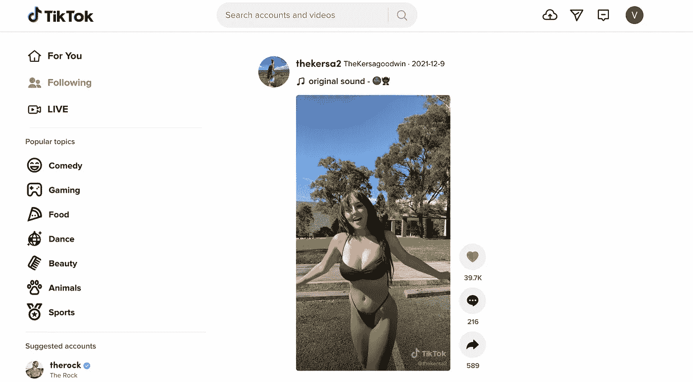

# 🔥第 1 部分:建立一个漂亮的抖音克隆体，有棱角和微前端

> 原文：<https://itnext.io/building-beautiful-tiktok-clone-with-angular-and-micro-frontend-part-1-bdd189425695?source=collection_archive---------0----------------------->

## 没有丑陋的教程了，只有美丽的，真实世界的例子，通过建立抖音学习微前端


# 内容

*   [**简介**](#82ba)
*   [**概念验证**](#dce5)
*   [**创建微前端骨架💀**](#e530)
*   [**设置共享库**](#b036)
*   [**Github 链接**](#38cb)
*   [**结论**](#31fd)
*   [**第二部分**](#9a3a)
*   [**你真棒❤️**](#98a7)
*   [**了解更多**](#f8ae)

# 介绍

你必须熟悉**微前端**的概念，以及如何用 **Angular** 构建一个微前端 app，如果没有，先查看这篇文章:

[](/how-micro-frontend-changes-the-future-of-angular-bb4deb2cfdad) [## 🔥微前端如何改变 Angular 的未来？

### 让我们看看为什么 Angular 最适合微前端

itnext.io](/how-micro-frontend-changes-the-future-of-angular-bb4deb2cfdad) [](/building-angular-micro-frontend-with-ngrx-state-sharing-and-nx-cli-7e9af10ebd03) [## 🔥利用 NgRx 状态共享和 NX cli 构建角度微前端

### 如何在几乎不编码的情况下构建健壮的微前端架构；)

itnext.io](/building-angular-micro-frontend-with-ngrx-state-sharing-and-nx-cli-7e9af10ebd03) 

今天我们要提高标准，实现一些更酷更有趣的东西。我们造一个漂亮的抖音克隆体怎么样🤔，是的，你没看错，让我们得到我们自己的炒作份额。你可能觉得太多了，不想在上面花太多时间。但我保证，我们将以最有效和最懒惰的方式，用最少的编码来构建它，并将学到很多关于现代前端开发的知识。让我们直入主题吧。🏃

# 概念证明

这个创意的灵感来自于官方**抖音**网页版，看起来是这样的。



我们的应用程序将接管类似的概念。它将显示不同的**抖音**帖子以及*赞*的数量👍和*注释*💬。用户可以使用*上一页*和*下一页*箭头在文章之间导航。最终产品将如下所示:


我们的要求如下:

*   大多数看起来很美👸；
*   必须简单，并且用最少的努力实现；
*   必须使用下一页和上一页按钮在文章之间导航；
*   必须建有**角**；
*   必须是**微前端**，其中 ***外壳*** 是 app 容器，**feed**——是一个 ***微 app* ，**各自独立托管；
*   必须使用真正的 API(我们将使用**Reddit**)；

一切就绪，让我们开始吧🏃‍♀!

# 创建微前端框架💀

首先，确保 **NX** 已安装并准备好:

```
**npm i -g nx**
```

然后创建一个我们 app 的工作区，默认选择一切*回车-回车-回车*。

```
**npx create-nx-workspace ng-tiktok-mf-app**
```

接下来安装**角度:**

```
**cd** **ng-tiktok-mf-app**/ 
**npm install --save-dev @nrwl/angular**
```

最后，我们需要生成 **shell** (我们的主容器 app)和 **feed micro app** (选择 **SCSS** 作为目标风格的框架)；

```
**npx nx g @nrwl/angular:app shell --mfe --mfeType=host --port=3000 --routing=true**
```

和**进给**:

```
**npx nx g @nrwl/angular:app feed --mfe --mfeType=remote --port=5000 --host=shell --routing=true**
```

当您提供应用程序时:

```
**nx run shell:serve-mfe**
```

它将在端口 **3000** 中运行一个**外壳**并在端口 **5000** 中运行**进给**。

# 设置可共享库

第一步是生成一个可共享的数据存储库，它将处理我们的 API 调用和状态。

```
**nx g @nrwl/angular:lib shared/data-store**
```

接下来，让我们创建一个 API 服务来调用[**Reddit TikTokCringe**](https://www.reddit.com/r/TikTokCringe/)组。在`**libs/shared/data-store/src/lib**`

```
**nx g @nrwl/angular:module feed-store/FeedStore
nx g @nrwl/angular:service feed-store/FeedStore
nx g @nrwl/angular:service feed-store/api/FeedApi**
```

太棒了，别忘了在`**libs/shared/data-store/src/index.ts**`中导出库

我们也将在 **shell** 和 **feed** 之间分享一些样式，继续生成 UI 库。

```
**nx g @nrwl/angular:lib shared/ui**
```

在`**libs/shared/ui/src/lib**`

```
mkdir styles
cd styles
touch _styles.scss
touch _index.scss
```

在`_styles.scss`中，我们将 [**重置默认浏览器样式**](https://meyerweb.com/eric/tools/css/reset/) 并应用我们自己的全局样式。

为了公开共享库，确保在`tsconfig.base.json`中导出正确的路径

在`**apps/feed/webpack.config.js**` 和`**apps/shell/webpack.config.js**`中添加别名:

并将样式导入`**apps/shell/src/styles.scss**`和`**app/apps/feed/src/styles.scss**`

# 结论

希望你喜欢第 1 部分，我们已经完成了一半。在第 2 部分中，我们将有更多的乐趣，并将实现设计和业务逻辑，正如所承诺的，用最少的努力😉。**如果你学到了新东西，请关注我并订阅媒体**。

[](https://medium.com/@easy-web/subscribe) [## 每当维塔利·舍甫琴科发表文章时，就收到一封电子邮件。

### 每当维塔利·舍甫琴科发表文章时，就收到一封电子邮件。通过注册，您将创建一个中型帐户，如果您还没有…

medium.com](https://medium.com/@easy-web/subscribe) [](https://medium.com/@easy-web/membership) [## 通过我的推荐链接加入 Medium 维塔利·舍甫琴科

### 作为一个媒体会员，你的会员费的一部分会给你阅读的作家，你可以完全接触到每一个故事…

medium.com](https://medium.com/@easy-web/membership) 

# 第二部分

[](https://medium.com/@easy-web/building-beautiful-tiktok-clone-with-angular-and-micro-frontend-part-2-5cb69d5f599e) [## 🔥用棱角分明的微前端构建美丽的抖音克隆——第二部分

### 我们正在通过应用设计和业务逻辑完成构建一个漂亮的微前端抖音克隆

medium.com](https://medium.com/@easy-web/building-beautiful-tiktok-clone-with-angular-and-micro-frontend-part-2-5cb69d5f599e) 

# Github 链接

[](https://github.com/Vitashev/ng-tiktok-mf-app) [## GitHub-Vitashev/ng-tiktok-MF-app

### 在 GitHub 上创建一个帐户，为 Vitashev/ng-tiktok-mf-app 开发做贡献。

github.com](https://github.com/Vitashev/ng-tiktok-mf-app) 

# 你是令人敬畏的❤️

节日快乐，圣诞快乐，新年快乐！祝你一年的决心都能实现，国家安全，敬请期待，更多有见地的内容即将到来。订阅我的博客，你将会收到更多令人兴奋的帖子:

[](https://medium.com/@easy-web/subscribe) [## 每当维塔利·舍甫琴科发表文章时，就收到一封电子邮件。

### 每当维塔利·舍甫琴科发表文章时，就收到一封电子邮件。通过注册，您将创建一个中型帐户，如果您还没有…

medium.com](https://medium.com/@easy-web/subscribe) 

非常尊重你的贡献，❤️

[Zackkhan](https://medium.com/u/1371230a5ea0?source=post_page-----bdd189425695--------------------------------), [PA-TH](https://medium.com/u/158cd5ec40c1?source=post_page-----bdd189425695--------------------------------), [Isaac Sneddon-Jenkins](https://medium.com/u/161a76c4a7b1?source=post_page-----bdd189425695--------------------------------), [Omid Heidari](https://medium.com/u/1b0d76c1a030?source=post_page-----bdd189425695--------------------------------), [Alessandro Lausdei](https://medium.com/u/1b94d57031c?source=post_page-----bdd189425695--------------------------------), [Golam Kibria](https://medium.com/u/1f803a8606ec?source=post_page-----bdd189425695--------------------------------), [sudhir meena](https://medium.com/u/21d66616fecd?source=post_page-----bdd189425695--------------------------------), [吳昊諶](https://medium.com/u/2254e587c8bf?source=post_page-----bdd189425695--------------------------------), [Thao Phung](https://medium.com/u/2302688bedd6?source=post_page-----bdd189425695--------------------------------), [Valerii Grygoriev](https://medium.com/u/2341eb4242e1?source=post_page-----bdd189425695--------------------------------), [Natalia Kosareva](https://medium.com/u/2468c4b7d7dd?source=post_page-----bdd189425695--------------------------------), [Sivaprasad EV](https://medium.com/u/26b2e15abf09?source=post_page-----bdd189425695--------------------------------), [Sujay Das](https://medium.com/u/32b4491f234b?source=post_page-----bdd189425695--------------------------------), [Igor Toghunts](https://medium.com/u/3482f1f25557?source=post_page-----bdd189425695--------------------------------), [Gülcan Baran](https://medium.com/u/392ecc9046fc?source=post_page-----bdd189425695--------------------------------), [Yusuf BAHADIR](https://medium.com/u/3b5466022b70?source=post_page-----bdd189425695--------------------------------), [David Pawlus](https://medium.com/u/3c1e88191298?source=post_page-----bdd189425695--------------------------------), [SAINATH](https://medium.com/u/3c6d8f4228ad?source=post_page-----bdd189425695--------------------------------), [Omair Siddiqui](https://medium.com/u/3ca4666c58ef?source=post_page-----bdd189425695--------------------------------), [Saurabh Siddhu](https://medium.com/u/3d7a92e11aa?source=post_page-----bdd189425695--------------------------------), [Rohit Yadav](https://medium.com/u/3fa7320b80af?source=post_page-----bdd189425695--------------------------------), [Brian Cantrell](https://medium.com/u/40557fc8d2c7?source=post_page-----bdd189425695--------------------------------), [Aditya Dev S](https://medium.com/u/41590bfd319f?source=post_page-----bdd189425695--------------------------------), [Jordi Bassaganas](https://medium.com/u/4302d177f565?source=post_page-----bdd189425695--------------------------------), [Red Robin](https://medium.com/u/446b443533cb?source=post_page-----bdd189425695--------------------------------), [Hemjynem](https://medium.com/u/490c40d65f4a?source=post_page-----bdd189425695--------------------------------), [Sameer Mohiuddin](https://medium.com/u/49c771864b85?source=post_page-----bdd189425695--------------------------------), [Heechang Yang](https://medium.com/u/4b0ccf26ab7e?source=post_page-----bdd189425695--------------------------------), [Mark Savol](https://medium.com/u/4c8b93f7412?source=post_page-----bdd189425695--------------------------------), [Ci Gimenez](https://medium.com/u/4d13f3a0c2fc?source=post_page-----bdd189425695--------------------------------), [Ras Suleimanov](https://medium.com/u/502299c3651a?source=post_page-----bdd189425695--------------------------------), [Swapnil Bawkar](https://medium.com/u/508c414a4e09?source=post_page-----bdd189425695--------------------------------), [Bponder](https://medium.com/u/50dd09c3cd3b?source=post_page-----bdd189425695--------------------------------), [Gülay YALLI](https://medium.com/u/56b59c84495b?source=post_page-----bdd189425695--------------------------------), [Tushar Khanna](https://medium.com/u/590ee2ea7688?source=post_page-----bdd189425695--------------------------------), [Kirk Clarke](https://medium.com/u/5a3d7678f016?source=post_page-----bdd189425695--------------------------------), [Simone Sinagra](https://medium.com/u/5a49f9536524?source=post_page-----bdd189425695--------------------------------), [Esh](https://medium.com/u/5b12f207667e?source=post_page-----bdd189425695--------------------------------), [Ashwin Kumar](https://medium.com/u/5be1266d5a93?source=post_page-----bdd189425695--------------------------------), [Paul Nike](https://medium.com/u/5d17c3c295de?source=post_page-----bdd189425695--------------------------------), [Chetankirange](https://medium.com/u/5ddb4737e916?source=post_page-----bdd189425695--------------------------------), [Adam Salfinger](https://medium.com/u/5eef3f554072?source=post_page-----bdd189425695--------------------------------), [Ngoc Vu](https://medium.com/u/5fddb6d71a9c?source=post_page-----bdd189425695--------------------------------), [Elias](https://medium.com/u/662c76b4c7c7?source=post_page-----bdd189425695--------------------------------), [Dinesh](https://medium.com/u/66650478b1cb?source=post_page-----bdd189425695--------------------------------), [Swarnim Bhardwaj](https://medium.com/u/67cdb442a2b?source=post_page-----bdd189425695--------------------------------), [Nurudeen Soremekun](https://medium.com/u/680989974eb6?source=post_page-----bdd189425695--------------------------------), [Prateek Pandey](https://medium.com/u/6add3ab0612c?source=post_page-----bdd189425695--------------------------------), [Özer Öztürk](https://medium.com/u/6b72893b6b83?source=post_page-----bdd189425695--------------------------------), [Barik Jyoti](https://medium.com/u/6e26553ec15b?source=post_page-----bdd189425695--------------------------------), [Deep Space](https://medium.com/u/7204c74d7e46?source=post_page-----bdd189425695--------------------------------), [Sudoofe](https://medium.com/u/775bc5f37810?source=post_page-----bdd189425695--------------------------------), [Matt Prabu](https://medium.com/u/7814faea0a16?source=post_page-----bdd189425695--------------------------------), [Mark Reynolds](https://medium.com/u/7988ea1635b1?source=post_page-----bdd189425695--------------------------------), [Sofia Bento](https://medium.com/u/7b2e20dfd090?source=post_page-----bdd189425695--------------------------------), [Denis](https://medium.com/u/7b51f5aa6d4a?source=post_page-----bdd189425695--------------------------------), [Thomas](https://medium.com/u/7b8ece3b271b?source=post_page-----bdd189425695--------------------------------), [Fernando Huerta](https://medium.com/u/7bf29a2e8f1c?source=post_page-----bdd189425695--------------------------------), [Lương Như Toàn](https://medium.com/u/7f89de208df5?source=post_page-----bdd189425695--------------------------------), [Tanmay Jauhari](https://medium.com/u/82b6525edd95?source=post_page-----bdd189425695--------------------------------), [Chris Anderson](https://medium.com/u/84bf52744d89?source=post_page-----bdd189425695--------------------------------), [amey pai](https://medium.com/u/8979153743f9?source=post_page-----bdd189425695--------------------------------), [Mhhasan](https://medium.com/u/8a060b88e1d4?source=post_page-----bdd189425695--------------------------------), [Rajat Explains](https://medium.com/u/8b0dc517d79f?source=post_page-----bdd189425695--------------------------------),

# 了解更多信息

[](/frontend-interview-cheatsheet-that-helped-me-to-get-offer-on-amazon-and-linkedin-cba9584e33c7) [## 🔥帮助我获得亚马逊和 LinkedIn 录用通知的前端面试备忘单

### 如果你正在准备一个前端面试，想快速更新你的领域知识，这个备忘单将…

itnext.io](/frontend-interview-cheatsheet-that-helped-me-to-get-offer-on-amazon-and-linkedin-cba9584e33c7) [](/how-micro-frontend-changes-the-future-of-angular-bb4deb2cfdad) [## 🔥微前端如何改变 Angular 的未来？

### 让我们看看为什么 Angular 最适合微前端

itnext.io](/how-micro-frontend-changes-the-future-of-angular-bb4deb2cfdad) [](/building-angular-micro-frontend-with-ngrx-state-sharing-and-nx-cli-7e9af10ebd03) [## 🔥利用 NgRx 状态共享和 NX cli 构建角度微前端

### 如何在几乎不编码的情况下构建健壮的微前端架构；)

itnext.io](/building-angular-micro-frontend-with-ngrx-state-sharing-and-nx-cli-7e9af10ebd03)