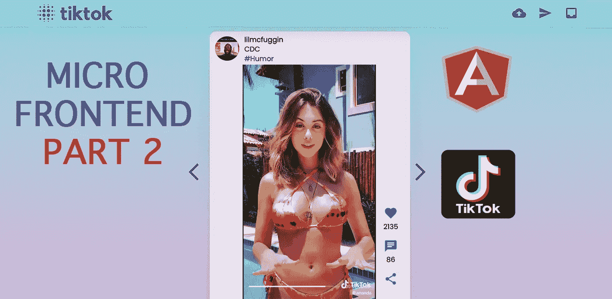
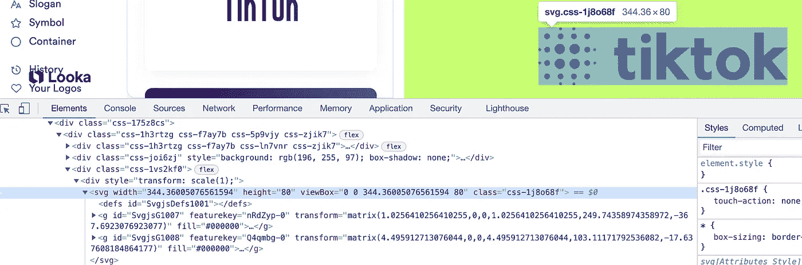
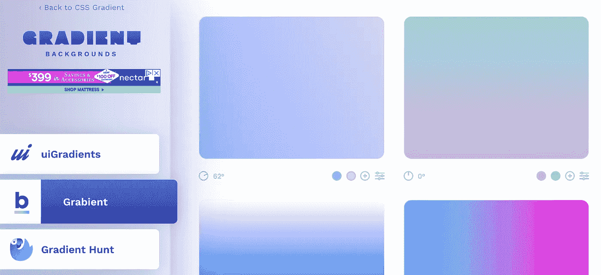
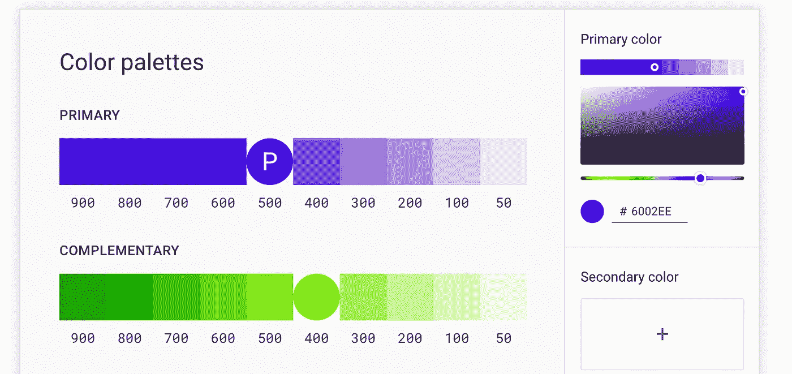
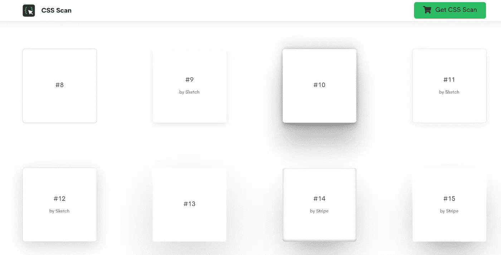
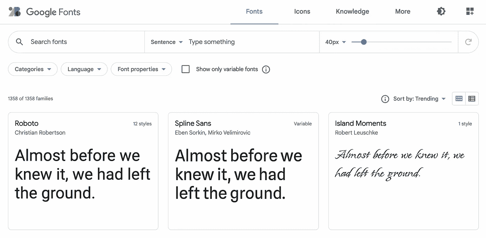
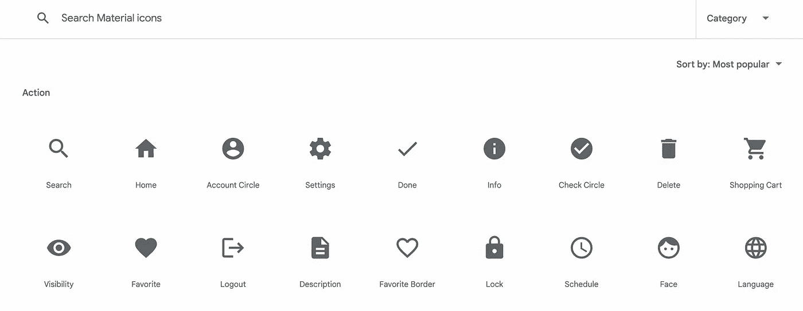
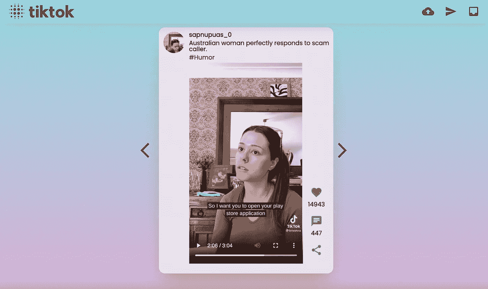

# 🔥第 2 部分:建立一个漂亮的抖音克隆体，有棱角和微前端

> 原文：<https://itnext.io/building-beautiful-tiktok-clone-with-angular-and-micro-frontend-part-2-5cb69d5f599e?source=collection_archive---------1----------------------->

## 我们正在通过应用设计和业务逻辑完成构建一个漂亮的微前端抖音克隆



# **内容**

*   [**第一部**](#5705)
*   [**简介**](#e24c)
*   [**标志**](#8953)
*   [**颜色**](#9861)
*   [**阴影**](#6728)
*   [**字体和图标**](#f8a9)
*   [**在外壳 app 中实现表头**](#92fe)
*   [**Feed app 中 Feed 特征的整理**](#d55e)
*   [**检查结果**](#e555)
*   [**结论**](#918c)
*   [**Github 链接**](#cd8a)
*   [**你是牛逼的❤️**](#3de2)
*   [**了解更多**](#c9e6)

# 第一部分

[](https://medium.com/@easy-web/building-beautiful-tiktok-clone-with-angular-and-micro-frontend-part-1-bdd189425695) [## 🔥用棱角分明的微前端构建美丽的抖音克隆——第一部分

### 没有丑陋的教程了，只有美丽的，真实世界的例子，通过建立抖音学习微前端

medium.com](https://medium.com/@easy-web/building-beautiful-tiktok-clone-with-angular-and-micro-frontend-part-1-bdd189425695) 

# **简介**

在第二部分中，我们将重点总结设计和主要逻辑。我们已经构建了主框架，剩下的就是迭代它了。我们准备好了。

# 标志；徽标

每个设计都以一个**标志**开始。你可能会发现大量的免费在线服务，会为你生成一个标志。我会选择第一个好看的，逻辑是:如果网站本身好看，那么它必须生成一个漂亮的标志🤔，让我们试试[https://looka.com/](https://looka.com/)。这是我点击几下后得到的结果:


足够好了，这里我只**检查一个元素**和**复制** **SVG** 。



# 颜色；色彩；色调

你已经看到在可共享的**库** **UI 样式中添加了**颜色**变量。我偷偷借鉴了 https://cssgradient.io/gradient-backgrounds/的渐变和颜色。**



使用**材质设计颜色挑选工具**[https://material . io/design/color/the-color-system . html # tools-for-picking-colors](https://material.io/design/color/the-color-system.html#tools-for-picking-colors)总是可以找到其他颜色



# 阴影

**阴影**是美丽设计的主要元素之一。当然，您不必亲自实现它。这方面有很好的网站，比如 https://getcssscan.com/css-box-shadow-examples



# 字体和图标

不要忘记字体和图标。你可以随时从谷歌字体网站[https://fonts.google.com/](https://fonts.google.com/)选择漂亮的免费字体。



我们也将使用默认的材料设计图标包[https://fonts.google.com/icons?selected=Material+Icons](https://fonts.google.com/icons?selected=Material+Icons)



和集成`libs/shared/ui/src/lib/styles/_styles.scss`

```
@import url(https://fonts.googleapis.com/css?family=Poppins);
@import url(https://fonts.googleapis.com/css?family=Material+Icons);
```

# 在 shell 应用程序中实现标题

一切都准备好包装一个设计，让我们开始添加标题。转到`apps/shell/src/app`:

```
**nx g @nrwl/angular:component components/Header**
```

并应用以下代码:

别忘了更新`apps/shell/src/app`里的**外壳 app**

# 订阅源应用程序中订阅源功能的完成

我们将把 **feed micro app** 分成两部分，**滑块**——负责将视频帖子从上一个移动到下一个。以及**卡** —视频发布的 UI。在`apps/feed/src/app/remote-entry`中:

```
**nx g @nrwl/angular:component components/slider/Slider
nx g @nrwl/angular:component components/card/Card**
```

*   **卡片:**

*   **滑块:**

*   **录入组件:**

# 检查结果

确保你已经更新了`app/package.json`中的任务命令:

然后简单地运行:

```
npm run start
```

您将看到用户界面:



**外壳**在`http://localhost:3000`和**进给**上运行`http://localhost:5000`如果打开端口 5000 看起来会是这样，只有滑块组件:


# 结论

有了这样一个 Google 驱动的开发方法，每个人都可以在几分钟内构建现代 web 应用程序。现代的构建工具现在非常强大，并且提供了没有压力的开发体验。我希望你现在能够轻松地构建一个微前端应用程序，并度过了一段美好的时光。如果你很懒，可以看看下面的 GitHub 项目。如果你今天学到了新的东西，**关注我，订阅媒体。如果我们收集到 2000👏，我们将像这样实现👍和评论**💬**五官端正。**

[](https://medium.com/@easy-web/subscribe) [## 每当维塔利·舍甫琴科发表文章时，就收到一封电子邮件。

### 每当维塔利·舍甫琴科发表文章时，就收到一封电子邮件。通过注册，您将创建一个中型帐户，如果您还没有…

medium.com](https://medium.com/@easy-web/subscribe) [](https://medium.com/@easy-web/membership) [## 通过我的推荐链接加入 Medium 维塔利·舍甫琴科

### 作为一个媒体会员，你的会员费的一部分会给你阅读的作家，你可以完全接触到每一个故事…

medium.com](https://medium.com/@easy-web/membership) 

# Github 链接

[](https://github.com/Vitashev/ng-tiktok-mf-app) [## GitHub-Vitashev/ng-tiktok-MF-app

### 在 GitHub 上创建一个帐户，为 Vitashev/ng-tiktok-mf-app 开发做贡献。

github.com](https://github.com/Vitashev/ng-tiktok-mf-app) 

# 你是令人敬畏的❤️

收到你这么多的支持和爱，我无法保持冷静。感谢您参与建设博客，爱，和平和保持安全。

[](https://medium.com/@easy-web/subscribe) [## 每当维塔利·舍甫琴科发表文章时，就收到一封电子邮件。

### 每当维塔利·舍甫琴科发表文章时，就收到一封电子邮件。通过注册，您将创建一个中型帐户，如果您还没有…

medium.com](https://medium.com/@easy-web/subscribe) 

)(他)(们)(都)(不)(知)(道)(,)(他)(们)(还)(不)(知)(道)(,)(他)(们)(还)(不)(知)(道)(,)(他)(们)(还)(不)(知)(道)(,)(他)(们)(还)(不)(知)(道)(,)(他)(们)(还)(不)(知)(道)(,)(他)(们)(还)(不)(知)(道)(,)(他)(们)(还)(不)(知)(道)(,)(还)(不)(知)(道)(,)(他)(们)(还)(不)(知)(道)(,)(他)(们)(们)(还)(不)(知)(道)(,)(他)(们)(还)(还)(不)(知)(道)(,)(他)(们)(们)(还)(不)(知)(道)(道)(,)(他)(们)(们)(还)(还)(有)( )(她)(们)(都)(不)(知)(道)(,)(她)(们)(还)(不)(知)(道)(,)(她)(们)(还)(不)(知)(道)(,)(她)(们)(还)(不)(知)(道)(吗)(,)(她)(们)(还)(有)(些)(不)(知)(道)(吗)(,)(她)(们)(还)(是)(不)(知)(道)(,)(她)(们)(们)(还)(是)(不)(知)(道)(,)(她)(们)(们)(还)(是)(不)(知)(道)(,)(她)(们)(们)(还)(是)(不)(知)(道)(道)(,)(她)(们)(们)(还)(不)(知)(道)(道)(,)(她)(们)(们)(还)(不)(知)(道)(道)(,)(她)(们)(们)(们)(还)(是)( )(她)(们)(都)(不)(知)(道)(,)(她)(们)(还)(不)(知)(道)(,)(她)(们)(还)(不)(知)(道)(,)(她)(们)(还)(不)(知)(道)(,)(她)(们)(还)(有)(些)(不)(知)(道)(吗)(,)(她)(们)(还)(是)(不)(知)(道)(,)(她)(们)(还)(不)(知)(道)(,)(她)(们)(们)(还)(有)(些)(不)(知)(道)(,)(她)(们)(还)(不)(知)(道)(,)(她)(们)(们)(们)(还)(有)(些)(不)(知)(道)(理)(,)(她)(们)(们)(们)(还)(不)(知)(道)(道)(,)(她)(们)(们)(们)(还)(有)(些)( )(她)(们)(都)(不)(知)(道)(,)(她)(们)(还)(不)(知)(道)(,)(她)(们)(还)(不)(知)(道)(,)(她)(们)(还)(不)(知)(道)(,)(她)(们)(还)(有)(些)(不)(知)(道)(吗)(,)(她)(们)(还)(不)(知)(道)(,)(她)(们)(还)(有)(些)(不)(知)(道)(,)(她)(们)(还)(不)(知)(道)(,)(她)(们)(们)(还)(不)(知)(道)(,)(她)(们)(们)(们)(还)(有)(些)(不)(知)(道)(道)(理)(,)(她)(们)(们)(们)(还)(不)(知)(道)(道)(,)(她)(们)(们)(们)(们)(还)(有)( )(她)(们)(都)(不)(知)(道)(,)(她)(们)(还)(不)(知)(道)(,)(她)(们)(还)(不)(知)(道)(,)(她)(们)(还)(不)(知)(道)(,)(她)(们)(还)(有)(些)(不)(知)(道)(吗)(,)(她)(们)(还)(是)(不)(知)(道)(,)(她)(们)(还)(不)(知)(道)(,)(她)(们)(们)(还)(有)(些)(不)(知)(道)(,)(她)(们)(还)(不)(知)(道)(,)(她)(们)(们)(们)(还)(有)(些)(不)(知)(道)(道)(,)(她)(们)(们)(们)(还)(不)(知)(道)(道)(,)(她)(们)(们)(们)(还)(有)(些)(

# 了解更多信息

[](/frontend-interview-cheatsheet-that-helped-me-to-get-offer-on-amazon-and-linkedin-cba9584e33c7) [## 🔥帮助我获得亚马逊和 LinkedIn 录用通知的前端面试备忘单

### 如果你正在准备一个前端面试，想快速更新你的领域知识，这个备忘单将…

itnext.io](/frontend-interview-cheatsheet-that-helped-me-to-get-offer-on-amazon-and-linkedin-cba9584e33c7) [](/how-micro-frontend-changes-the-future-of-angular-bb4deb2cfdad) [## 🔥微前端如何改变 Angular 的未来？

### 让我们看看为什么 Angular 最适合微前端

itnext.io](/how-micro-frontend-changes-the-future-of-angular-bb4deb2cfdad) [](/building-angular-micro-frontend-with-ngrx-state-sharing-and-nx-cli-7e9af10ebd03) [## 🔥利用 NgRx 状态共享和 NX cli 构建角度微前端

### 如何在几乎不编码的情况下构建健壮的微前端架构；)

itnext.io](/building-angular-micro-frontend-with-ngrx-state-sharing-and-nx-cli-7e9af10ebd03)