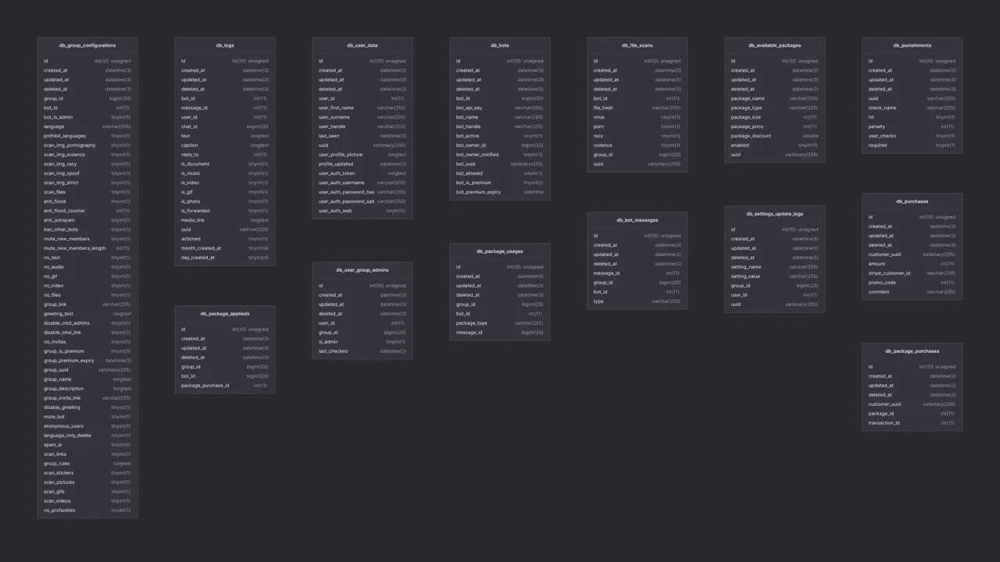
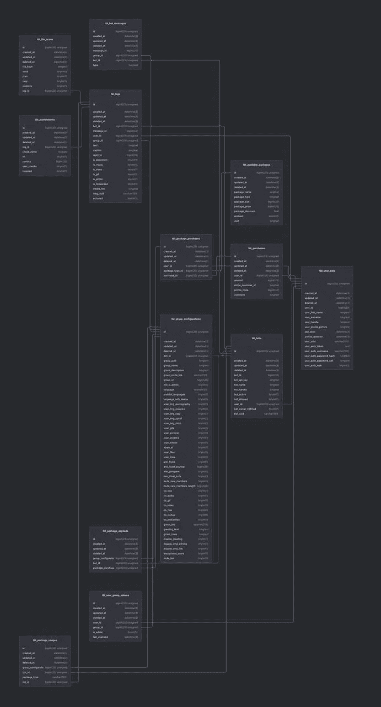
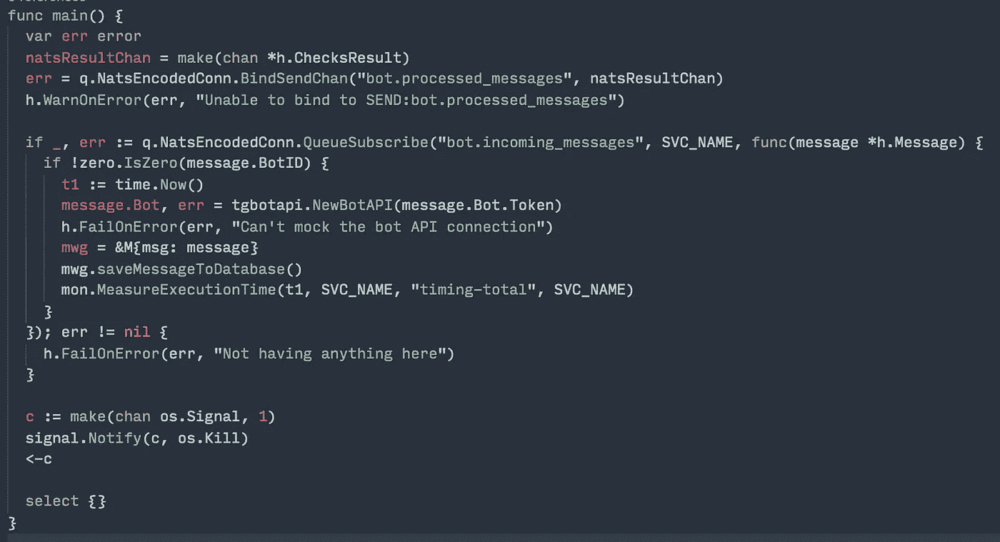
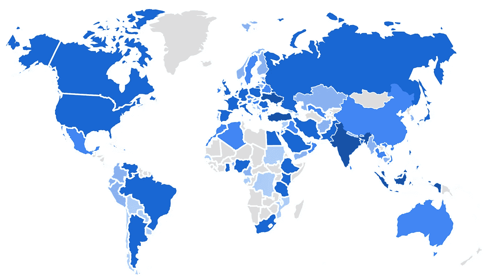
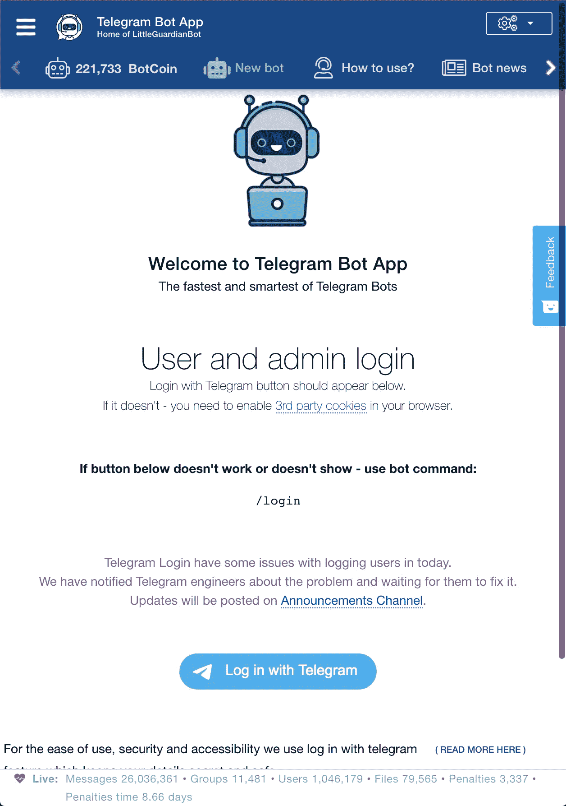
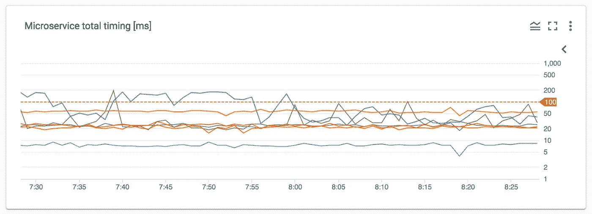
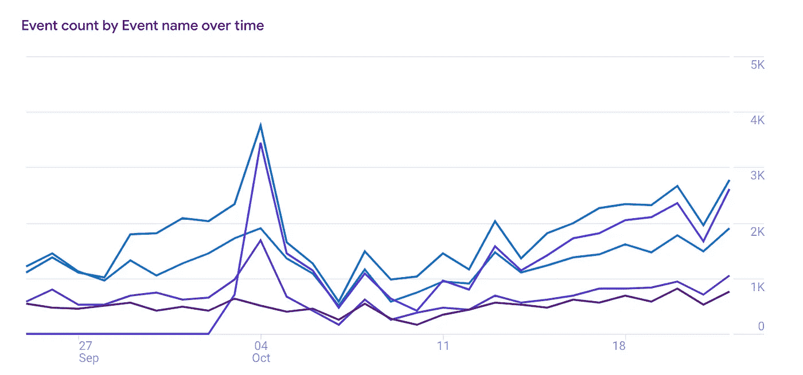
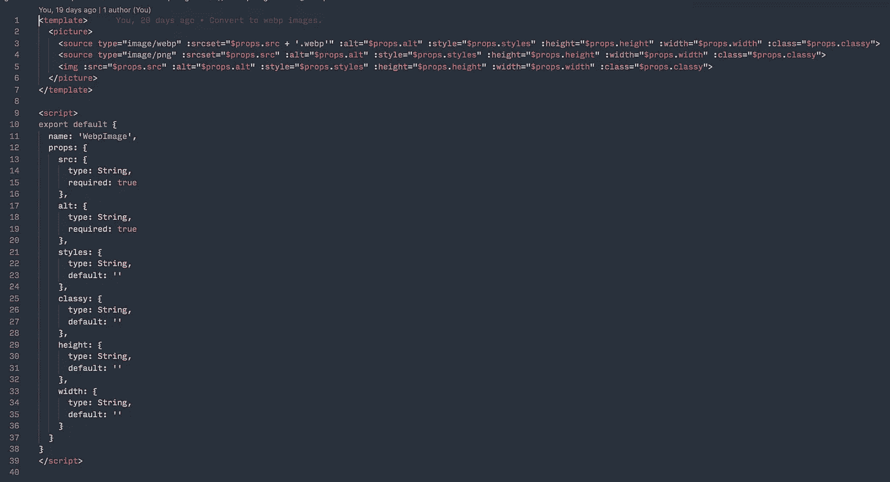
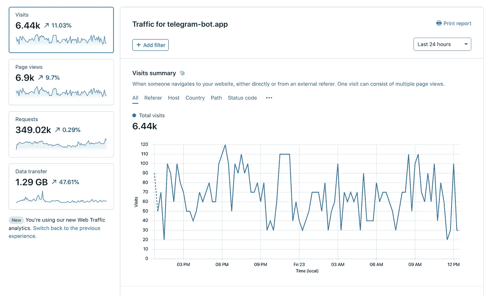
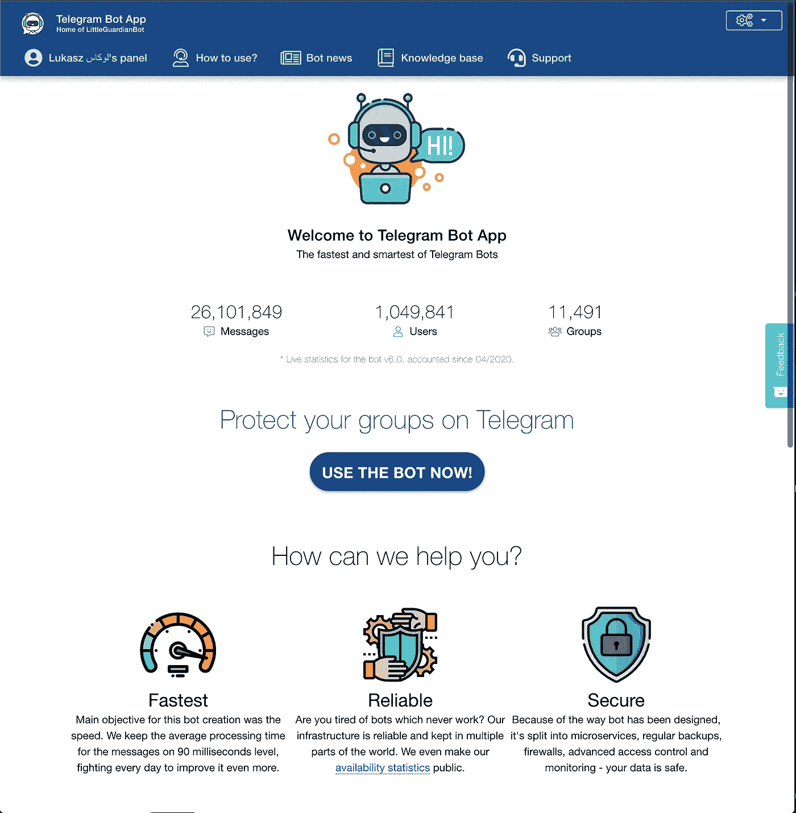

# 打造最好的电报机器人

> 原文：<https://itnext.io/building-best-telegram-bot-bbf905d09d74?source=collection_archive---------1----------------------->

我的宠物项目故事的延续，它在完成和准备好之前就像病毒一样传播开了。涉及许多不眠之夜，相关的压力，完全书呆子气的描述和曲折，但导致巨大的成就感和改善机器人和我自己的意愿。

如果你错过了报道我的“最快电报机器人”项目历史的第一篇文章，你可以在这里找到它。《小小守护者》已经五周年了，自从上一篇文章发表以来，很多事情都发生了变化。我将报道这些变化，但最重要的是——我学到了更多的教训。传奇达到[最佳电报反垃圾邮件和群组管理机器人](https://telegram-bot.app)状态继续。

# **数据库，还债。**

我必须承认，我最初创建的数据库与“最佳”数据库完全相反。因为我想让一切都难以猜测，但同时又易于识别——我决定在机器人配置表的任何地方使用 UUID，通过人工智能使用的消息日志来学习和识别垃圾邮件发送者的行为，群体设置，甚至用户配置文件——所有这些都在一个大 UUID 混乱中。责怪自己——我只是不假思索地为新函数添加新表，有时添加额外的列。

如何不设计数据库结构？

一切都进行得很顺利，直到日志表变成 50GB，其中一半是索引。查询变得非常慢，我需要升级 SQL server 两次来处理不断增加的流量。迁移到 MySQL 8 一夜之间总共造成了 8 小时的停机时间。这是远远不能接受的，同时压力极大，因为这个项目的主要目标是为用户提供最快的电报机器人，用户可以轻松地管理他们的团队。我花了两天时间和我的卓越，规划新的布局，映射关系，然后为新布局的所有迁移编码。

甜蜜的家和新的数据库设计。

如果您已经注意到不同的表名，那么您就对了。我一直在实时服务上执行迁移，舒适的微服务使用零碎的数据。表位于同一个数据库中，为期三天的测试服务使用两个版本来验证没有丢失任何东西，并且所有查询都在处理和接收它们应该处理的信息。我利用这段时间编写了适当的查询，以便在“时机成熟时”迁移最重要的数据。当我修复所有的错误时，翻转所有的微服务以使用新的数据库就像消除对一个文件的依赖一样简单，只需要 15 分钟。

下一步自然是观察微服务的行为，监控所有查询(传统上是缓慢的查询日志和不使用索引的查询)并做出相应的反应。所有这些工作使我能够再次缩减 SQL 实例，并保持每秒 600/100 读/写查询的利用率低于 40%。

**经验教训:**制定计划，规划速度，规划扩展。

# 队列和终极解决方案

在转移到机器人版本 6 的过程中，我决定使用 RabbitMQ，因为我对它有一些经验，它很快而且很容易管理。由于我一直在集群内的 docker 容器中运行 RMQ，我被迫重新考虑我的方法，原因如下:

*   糟糕的应用程序逻辑设计——一些微服务声明了队列或交换，但消费者需要它们。如果声明微服务失败，要求队列存在的消费者也会失败。是的，我本来可以使用持久队列和交换，但是由于列出的其他问题，我需要另一个解决方案。
*   我一直以 JSON 的形式传输消息——在发送方要求我将整个结构转换成 JSON，在接收方要求我将它解组回结构。小事情，但处理能力和内存消耗，特别是当每秒重复数百次的服务。
*   出于某种尴尬的原因，发送给同一种微服务的消息有时会被重复或处理多次——我已经浪费了相当长的时间来调试这一点——没有任何好处。
*   RabbitMQ 容器开始消耗比预期更多的 CPU 和 MEM，尤其是在试图增加集群的大小以在多个节点上运行之后。
*   最后——也是最重要的——持续的连接问题。出于某种无法解释的原因，k8s 集群内的连接随机关闭，消息耐心地等待传递，但等待时间却一飞冲天，RMQ 也随机拒绝连接。

一天，研究将我引向了 [NATS.io](https://nats.io) ，我决定尝试一下作为概念验证——主“机器人”微服务(来自 telegram APIs 的读取器)与日志微服务进行通信。易于检查，易于验证。我之前为处理连接、队列和交换声明的所有细微差别而编写的整个库被一个简单的函数所取代——连接和设置健康检查。消费者代码变得更加简单，自动映射到适当的结构，因此更容易控制和调试。

**NATS** 非常容易实现。

所有提到的问题都消失了，所有剩余的微服务从 RabbitMQ 到 NATS 的迁移是用古老的复制/粘贴方法在几个小时内以绝对无痛的方式完成的。

我唯一可能会错过的是 RMQ 的仪表板——我测试过几个适用于 NATS 的仪表板，但没有一个质量好或功能齐全。也许如果我有一些空闲时间，我会创造一些东西来开源它，但那是 2030 年的计划。

经验教训:最受欢迎并不总是最好的。

# 用户是你的真理之源。

你创建的任何服务都应该考虑用户的需求。实际上，通常你认为合乎逻辑和合理的东西并不重要，但是你的用户应该对设计和功能有最终决定权。我注意到大多数用户都有想法或有话要说，但他们不知道如何解释，或者在说“这没用”。

**第一步:**我已经创建了一个[机器人知识库](https://telegram-bot.app/documentation)，我正在努力更新这个知识库。用通俗易懂的语言描述特定功能的工作原理、设置和设计背后的概念。

**第二步:**我已经在页面代码中添加了 [hotjar](https://hotjar.com) 来查看用户在做什么，他们是如何做事情的，以及他们(或者说是我)在哪里失败了。由于用户的直接反馈和 hotjar 的研究，在过去的几周中发布了大量的修改。关于 app 本身的优秀媒体文章可以在[这里](https://medium.com/better-marketing/understanding-your-visitors-using-hotjar-practical-tips-3579fd4d7293)找到。

第三步:让你的用户参与进来。大多数企业都想展示自己的惊人之处，从不犯错，相信这能建立用户的信任。这就像你小时候，和父母一起去见他们的朋友——只带着你生命中最美好的部分。我很乐意公开承认错误，这样我的用户就知道我至少意识到了这些错误，更不用说持续的改进工作了。telegram 上有一个单独的页面，上面有机器人新闻，还有专门的公告频道，这个工作做得非常好。

**第四步:**经常被遗忘——Google Analytics 洞察 [telegram bot 用户面板](https://telegram-bot.app)的所作所为。我已经为所有可能出错的地方添加了自定义事件，以便对我所犯的最常见的问题和错误进行监督。是的——我已经做了。这很少是用户的错。这不是史蒂夫·乔布斯的名言“*你拿错了”*，更有可能的是——你给用户留下了他们可以做到的印象，这是最好的方法。

**第五步:**建立自动化的“维护模式”，从[状态页面](http://status.telegram-bot.app/)上的自动检查和端点开始(多亏了 FreshPing)，到自检网站监控端点和流量，并在检测到系统内任何可能的中断时，立即显示每个人都可以看到的关于工程的信息。这样做没有坏处，但肯定会减少他们的挫折感，让他们和你在一起。

**经验教训:**向用户开放自己。征求他们的意见并做研究。第一印象真的很重要。

# **走向世界？会有很多工作。**

新版本发布一个月后，多亏了谷歌分析平台，我对用户群有了一个很好的了解，那就是…自己看看。

截至 2020 年 10 月的 telegram-bot.app 用户群。

当然，我不能指望每个人都会说英语——但是在与我的好友 hipertracker 协商并采纳了他的建议后，本地化工作开始了。用 i18n 定义替换所有的文本无疑是耗时的，在那个阶段 [BabelEdit](https://www.codeandweb.com/babeledit) 给了我很大的帮助。在用英语、波兰语和波斯语设置好一切之后——我又在谷歌分析上看了一眼，看看我的用户使用的语言，让专业人员负责翻译成[阿拉伯语](https://www.fiverr.com/arab4translator)、[西班牙语](https://www.fiverr.com/mariasemideyr)、[印地语](https://www.fiverr.com/vishalpalve)、[印尼语](https://www.fiverr.com/tiobudiono)和[俄语](https://www.fiverr.com/swerklstudio)。我现实生活中的朋友，甚至是邻居(❤)会说土耳其语(埃米尔塔哈比尔根)和法语。这个项目是为美丽新世界准备的。

当涉及到付费和外部翻译时，我发现了一个问题。我的内容经常改变，有时我想重写文档以使其更容易理解。我不断开发新功能，同时处理多种语言在时间和预算上几乎是不可能的。我在网上测试了一些群体翻译应用程序，最终确定 localazy 是最好的解决方案。

[Localazy](https://localazy.com/) 似乎是我的项目需求的完美匹配——它对管理员、开发人员(神奇的 CLI——用一个命令拉你的翻译，提交并发送构建)和帮助翻译的人来说都很容易使用。他们的支持是我所见过的最好的支持之一——不仅积极响应，而且积极响应，非常有帮助。我计划和他们一起完成我即将开始的项目，其中一个助手描述道*“太棒了！它甚至是有趣的人”。*它还消除了 JSON 翻译文件的所有杂耍，解析问题，因为有人忘记放逗号或者他们的编辑在途中的某个地方放了奇怪的" "。

我已经向所有人开放了翻译——如果你想投稿，请随意访问。

**经验教训:**向你的用户靠拢。不是每个人都说英语。更不用说——英语好。找到有用的东西。

# 工作完成了吗？不是真的

我的项目和开始出现的竞争对手之间的真正区别(我其实很喜欢，因为这是一个健康的竞争，毕竟是新想法和向他人学习)——是对事件的反应时间。两周前，我的系统在 Telegram 正式发布之前就发现了它的问题。

本周— [用 Telegram](https://telegram.org/blog/login) 登录失败了(48 小时后，在我写这篇文章的时候仍在继续)。我在周三晚上午夜之前发现了它，经过 45 分钟的调试后，我联系了 telegram 支持部门(因为这个问题是全球性的，每个使用 Telegram 登录的网站都会受到影响)，通知他们这个问题，然后上床睡觉，希望在早上之前解决这个问题。不幸的是，这并没有发生，这让我重新思考我的授权方法。如果我的用户无法登录，他们就不会使用我的产品。我不能做任何事情，因为我强烈依赖第三方，在这种情况下，我能吗？

多亏了微服务方法以及添加新功能是多么容易——我对我一直使用的 telegram bot API 库做了一些修改，创建了命令 **/login** 并将其部署到我的实时机器人，用信息更新了网站(是的，我知道，它现在看起来有点不稳定)，用户流开始流动。据我所知，我的竞争对手直到现在才意识到有问题。

**经验教训:**积极主动，被动应对。

# **监控、预警、分析和改进。**

我正在尽一切努力将微服务保持在 100ms 线以下。唯一的例外是' **joiner** '微服务为每个加入小组的人做大量的计算，分析他们过去的行为，并将数据与模型进行比较，以提供给人工智能(显然，有一个改进它的计划！)这只是我关注的为数不多的图表之一，大多数应该提醒的事情都会触发文本和松弛消息。

微服务计时监控

在 Google Analytics 中，可以观察到将每个面向用户的更改部署到面板中。它是否增加了用户参与度、每次访问的行动、事件？页面上的时间怎么样？有多少用户登录并浏览了“限制”区域？网站统计不仅仅是为了知道你有多少访问者——这些是毫无意义的，尤其是当访问者在你的页面上停留几秒钟就离开的时候。

10 月 4 日达到峰值，随后下降。

10 月 4 日可以看到顶峰。我已经发布了新功能，但忘记了在用户端验证所有可能的配置(而且有相当多的配置)。这导致人们访问面板，但一些功能离线，这使流程与预期相反。我从这一点上学会了，与来自世界各地的最活跃的组管理员接触，他们成为了我的测试者。两天前的另一次下降是由我之前描述的电报登录问题引起的。

# 世界其他地方不是伦敦。

当你设计面向用户的网站时，你经常会尝试在这里或那里添加一些焰火，让它对所有的访问者来说更好、更现代。你已经检查过了——使用你的光纤连接在你的 Macbook 或 iPhone 上快速加载*。*

在这个优化阶段，我学到了以下几点:

*   我的网站 85%的访问者是移动用户。
*   流量来自世界各地，包括没有 4G 特权的国家。
*   每个字节和请求都很重要。

考虑到这些，我开始优化，删除不必要的查询，把重要的合并成一个。图片——好吧，如果没有图片，网站看起来会更糟——但是 webp 格式几乎无处不在，然而——并不是所有的浏览器都支持它。

有问题吗？这次不是因为...

组件的脏代码，允许我同时使用 webp/png/jpg。

现在用户浏览器可以自己决定需要哪个版本的图像。

寻找尽可能小的下载转移到 JS，CSS 和字面上任何我可以做得更小的东西。我几乎要放弃了，但后来我的朋友提到了 Cloudflare，我尝试了一下。我确实在这里和那里犯了一些错误，试图对事情进行太多的优化，但这很有效。对于每月的小额费用来说完全没问题，这绝对值得。我也强烈推荐看看他们的附加产品，我觉得非常棒。

这是一个单页应用程序(SPA ),所以我会在这里查看更多的请求…

用户肯定很高兴，访问量增加了，跳出率下降了，另外，CloudFlare 还允许来自通常在[谷歌云](https://medium.com/u/4f3f4ee0f977?source=post_page-----bbf905d09d74--------------------------------)上被默认阻止的国家的流量，因为我们知道每个数据包都走私一些违禁品。

**经验教训:**你绝对可以优化一切。

Telegram 上即将成为最快群组管理机器人的主页。

# **TL；灾难恢复—建议**

*   谷歌分析(网络+应用)-流量分析
*   CloudFlare —加快网站加载速度
*   [Localazy](http://localazy.com/) —任何与你的应用❤️本地化相关的事情
*   [NATS](https://nats.io) —快速可靠的云原生队列
*   [HotJar](https://www.hotjar.com/) —用户研究和行为分析
*   [刷新](https://freshping.io) —状态仪表盘

***免责声明*** *:我与我推荐的任何企业都没有关系。我觉得他们的产品很神奇，值得考虑。*