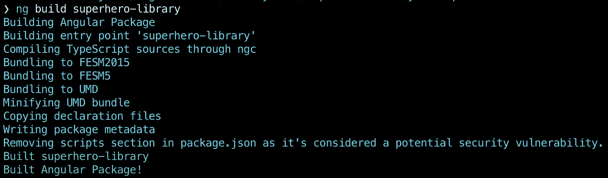
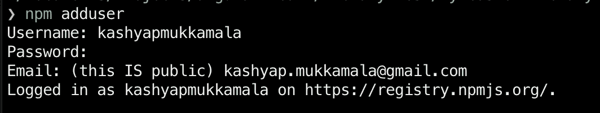
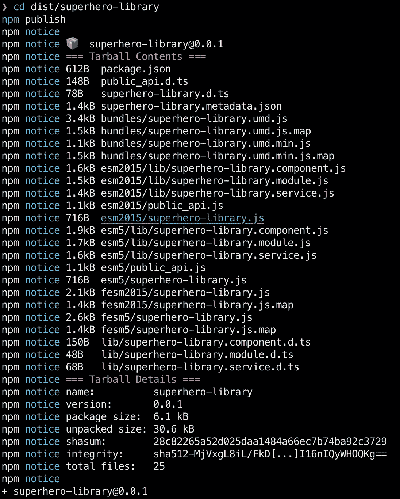
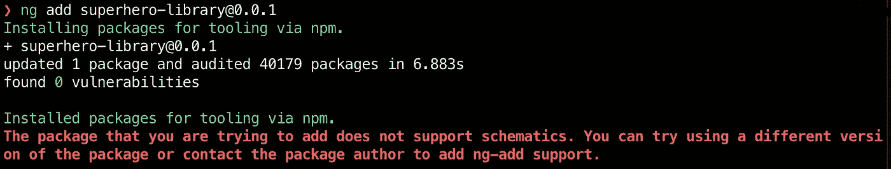
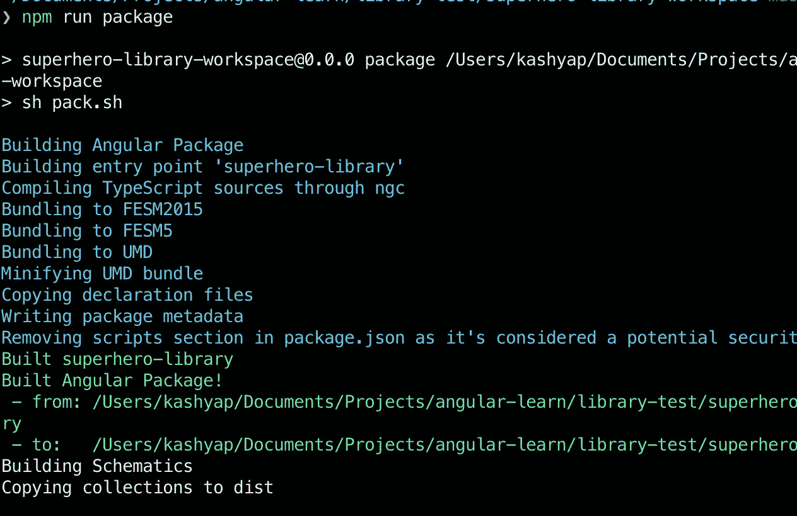
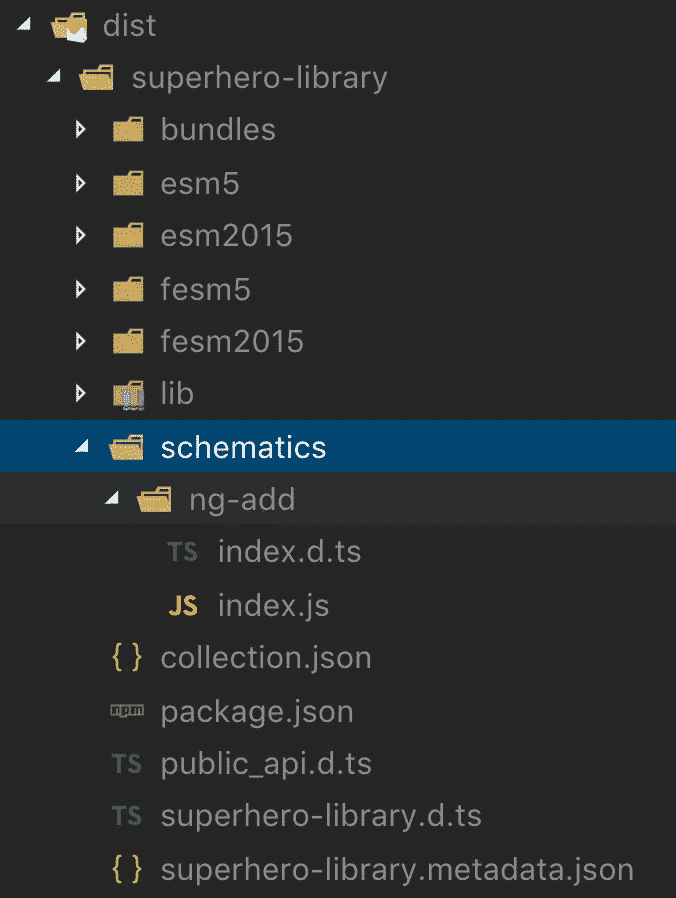
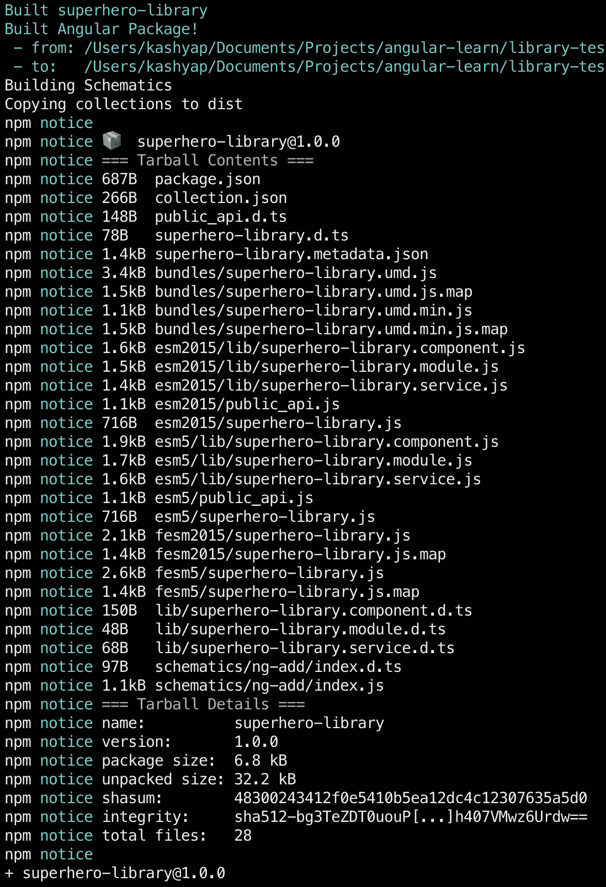
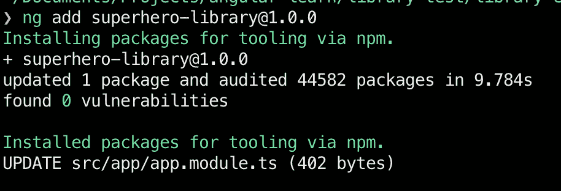
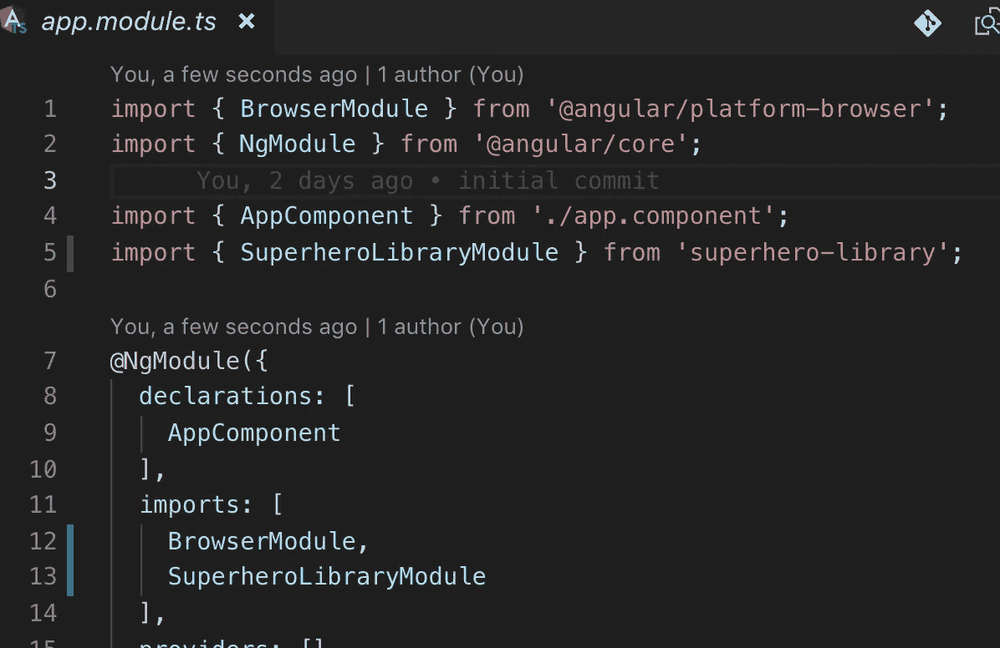

# 构建更好的角度库—第 1 部分

> 原文：<https://itnext.io/building-better-angular-libraries-part-1-217b3af7a3a1?source=collection_archive---------1----------------------->


你有没有想过，作为潜在的图书馆开发者，我们需要做些什么才能让我们的消费者方便地使用我们的图书馆？什么会让他们回来要求更多？在这篇文章中，我将试着强调一些简单的事情，我们可以做这些事情来使我们的图书馆获得巨大的成功。

当我们希望在 Angular 应用中使用第三方库时，我们通常会考虑以下几点:

1.  装置
2.  易用性
3.  功能丰富性
4.  可升级性
5.  易测性

#3 和#5 是图书馆最常见的吸引人的品质。

在这两篇文章中，我们将学习如何使用`@angular/cli`和`schematics`在安装、使用和升级过程中增强开发人员的体验。

在开始之前，让我们创建一个新的工作区。在此工作区中，我们将创建我们的库。我们还将创建另一个使用我们库的工作空间。

> 为什么我们有工作区和图书馆？从版本 6 开始，Angular 引入了 workspace，它能够处理多个项目，并在根目录下创建一个默认应用程序

# 先决条件

为了能够跟得上本文的内容，建议先熟悉 [Angular](https://angular.io) ，安装 [Angular CLI](https://cli.angular.io/) > v6。

# 建立

1.  创建一个文件夹，我们将在其中测试我们将在本文中探索的所有概念

```
mkdir library-test
cd library-test
```

2.创建库工作区

```
ng new superhero-library-workspace
```

> `*ng new workspace_name*`命令将提示一些关于我们将在默认项目中使用什么的问题(路由/样式表等)。选择你喜欢的任何东西。

3.为库的使用者创建另一个工作区

```
ng new library-consumer
```

4.在库工作区中创建库

```
cd superhero-library-workspace
ng generate library superhero-library
```

在第 2 步中，我们创建一个工作区，它的默认 web 应用程序可以作为我们的图书馆演示网站。在这个工作空间中，我们*生成了*一个类型为*库*的项目(步骤 4)。

如果我们想要创建一个库并将其发布到任何存储库(公共的或私有的)，这几乎就是我们所需要的全部。

# 建筑、出版和消费——传统的方式

在我们优化本库的可用性之前。让我们构建我们已经创建的库，将其发布到一个公共存储库(在本例中是 NPM ),并在另一个项目中使用它。

## 建筑物

为了简洁起见，我们假设库中的现成模块和组件足够好，可以投入生产。

我们已经准备好构建我们的`superhero-library`代码，我们可以导航到库(`superhero-library-workspace`)工作区的根文件夹，并运行下面的命令:

```
ng build superhero-library
```

> 当我们添加我们的库(步骤#4)时，`*@angular/cli*`创建了这个库并向`*angular.json*`文件添加了必要的配置，这允许我们构建、测试和 lint 我们新添加的库。



构建库

## 出版

由于我们想要将我们的库发布到 [NPM](http://npmjs.org) ，运行下面的命令，并在提示登录到存储库时提供 NPM 凭证(如果还没有完成，[创建一个 npmjs 帐户](https://www.npmjs.com/signup))。

```
npm adduser
```

> 这是一次性操作，如果您已经登录，可以跳过。



登录后，`cd`进入`build`命令生成的`dist/superhero-library`文件夹(来自上一步),运行下面的命令将库发布到 NPM。

```
cd dist/superhero-library
npm publish
```



npm 发布

## 强烈的

我们创建并出版的图书馆现在可以在这里找到。它非常精简，除了呈现我们生成库时创建的默认组件之外，目前没有做太多事情。

让我们在我们专门为此创建的`library-consumer`中使用`superhero-library`版本`0.0.1`。

```
cd library-consumernpm install --save superhero-library@0.0.1
```

这将从公共的 NPM 存储库中带来这个库，并将其安装在我们的用户中。


已安装的库

现在，通过将从`superhero-library`导出的模块包含在主模块的`imports`部分中，可以在`library-consumer`项目中使用这个模块。但这是常规流程，本文的目的是帮助我们制作更好的库，这样用户就不必手动执行这些和其他琐碎的任务。

接下来，让我们看看如何在每个接触点提升消费者体验。

# 装置

多亏了`@angular/cli`，我们不需要做太多事情来简化安装(这已经够简单了)。`ng add`命令是围绕`npm install`命令的功能包装器，有一些细微的区别。

1.  可以通过`angular.json`配置使用`yarn`代替`npm`
2.  一旦软件包安装完毕，默认执行`ng-add`原理图

> [此](https://blog.angular.io/schematics-an-introduction-dc1dfbc2a2b2)是深入了解原理图的绝佳资源。
> 
> 在本文中(以及后面的文章中)。我们将采取小步骤，仅讨论我们希望使用的部分原理图。

在`library-consumer`工作区中，如果我们尝试`ng add`我们现有的`superhero-library`我们会看到以下错误:



ng 添加示意图错误

上面我们看到的相当于我们之前运行的`npm install`命令，只是现在 Angular CLI 告诉我们`superhero-library`缺少 schematics 支持(因为它找不到 schematics 入口点)。

## 图表

在[主原理图包](https://www.npmjs.com/package/@angular-devkit/schematics)的 NPM 库中可以找到最简单、最简明的角度原理图描述。

> Schematics 是转换现有文件系统的生成器。他们可以创建文件、重构现有文件或移动文件。
> 
> schematics 与其他生成器(如 Yeoman 或 Yarn Create)的区别在于，Schematics 是纯描述性的；在一切准备好提交之前，不会对实际的文件系统应用任何更改。通过设计，在原理图中没有副作用。

什么是原理图:

—它们是生成器，即它们是函数

—它们是描述性的，即仅描述他们希望实现的目标，例如添加一个模块

哪些原理图不是:

—一种访问文件系统并直接修改文件的方法

# 易用性

能够容易地安装一个库关系到它的整体易用性。在本节中，我们将讨论角度示意图如何帮助我们实现同样的目标。

基于我们对 schematics 的简单了解，让我们探索一下 schematics 能为我们做什么(更具体地说是为我们的`superhero-library`)。

在继续之前，要知道`@angular-devkit`提供了`schematics-cli`，它可以用来手工生成我们将要做的事情。我们不使用 CLI，因为生成的 schematics 项目包含逻辑示意图的最终状态，并且我们正在尝试一步一步地实现这一点。

```
// optionally install the schematics-clinpm install -g @angular-devkit/schematics-cli
```

我们需要做的第一件事是为我们的应用程序创建一个 schematics 入口点。当使用`ng add`将库添加到工作区/项目时，`@angular/cli`解析库的`package.json`文件，并寻找由库支持的各种原理图组成的`schematics`文件。如果`@angular/cli`找到原理图，它执行`ng-add`原理图。

在我们项目的这个阶段，我们希望创建一个库，当通过`ng add`安装时，它可以自动将其主模块注入到消费应用程序中。

为此，我们首先创建一个名为`collection.json`的文件，它将包含我们所有的`schematics`，然后我们将它定义为`package.json`文件中的入口点。

```
cd projects/superhero-project
```

创建如下所示的`collection.json`文件:

该原理图文件仅包含一个`schematic`(此时)。它被命名为`ng-add`，它是在`ng add`操作期间被触发的原理图(注意原理图名称中的`—`，它是必需的)。

除此之外，我们还有定义文档结构的`$schema`。这特别有用，因为它在向`collection.json`文件添加不正确的属性时会警告我们。

我们现在需要用`collection.json`文件的路径更新`package.json`文件。

这使得我们的项目得到了支持。我们仍然需要实现通过`ng-add`命令安装库时执行的实际逻辑。

早些时候，我们在创建`ng-add`原理图时声明了一个`factory`。此`factory`在`ng-add`原理图被调用时执行。

该工厂可以访问传递给被调用的原理图的所有命令行参数(在本例中为`ng-add`),并返回一个`Rule`,它是一个生成器函数，告诉`@angular`我们希望在消费应用程序中进行什么更改。

由于 schematics 是声明性的，我们确实可以访问`Tree`——消费应用程序文件结构的当前状态，以及`SchematicContext`——当前执行环境中的原理图配置和设置。

在我们的例子中，我们希望创建一个`Rule`，它可以修改消费应用程序的`Tree`，并在`MainModule`中插入我们的`SuperHeroModule`。

因为这些操作非常常见，所以有一些库可以用来执行这些任务。我们将使用`[schematics-utilities](https://www.npmjs.com/package/schematics-utilities)`来实现这一点。

首先安装它:

```
cd projects/superhero-librarynpm install --save schematics-utilities
```

> 确保仅将逻辑示意图特定的依赖项添加到库 package.json，而不是工作空间 package.json

Angular 项目使用`ng-packagr`来构建项目，所以在我们的例子中，当我们添加`schematics-utilities`作为依赖项时，我们需要显式地将这个依赖项列入白名单。

这是必要的，因为它违背了在库上只有`peerDependencies`的惯例，并且我们要求我们的消费者也在他们的应用程序中安装`schematic-utilities`。这个白名单可以在`ng-package.json`文件中提供。

实用程序库还不能使用。它为我们提供了修改`Tree`的便捷方法，我们将使用其中一些方法将`superhero-library`模块导入到消费应用`MainModule`中。

我们可以在原理图描述的位置创建工厂，做了这些更改后，我们的`superhero-library/schematics/ng-add/index.ts`文件如下所示:

指示 ng-add 规则的注释代码

在发布更新后的库之前，我们需要做的最后一件事是将我们的`schematic`从`TypeScript`编译成`JavaScript`。

为此，我们可以创建一个`tsconfig.schematics.json`文件，用于编译我们的代码，并放在我们的`superhero-library`的`dist`文件夹中。

rootDir 和 outDir 表示我们的 TypeScript 编译器的输入和输出

就是这样！我们已经创建了启用示意图的库，并准备将其发布到 NPM 注册中心。

为此，我们需要执行以下步骤:

1.  撞上`superhero-library`版本号
2.  重建我们的`superhero-library`
3.  重建我们的示意图，放在`dist`
4.  将`collections.json`文件从项目复制到`dist`

> 每次我们改变和重建我们的库时，我们都需要重建我们的原理图，因为`*dist*`文件夹会被覆盖，`*schematics*`和`*collection.json*`文件会被删除。

为此，我们可以将下面的脚本放在`superhero-library-workspace`的根目录下，并通过`package.json`脚本调用它。

这可以从`superhero-library-workspace` `package.json`文件的`scripts`部分调用，如下所示:

```
{
    ... "scripts": {        "package": "sh pack.sh", }, ...
}
```

执行时，我们会看到以下内容:



建立图书馆，示意图和复制收藏

并且`dist`文件夹现在如预期的那样被重新创建。



生成的分发文件夹

我们现在准备将这个包发布到 NPM，并在我们的`library-consumer`工作空间中使用它。

> 记得在 libraries package.json 文件中添加库的主要/次要/补丁版本

为了发布，我们可以扩展我们的`pack.sh`文件并添加命令来代表我们发布(假设`npm adduser`已经成功运行)。

> 由于`*ng add*`支持对我们来说是一个很大的改变，所以在执行 package 命令之前，我将把`*superhero-library*`包中的项目版本提升到 1.0.0。

我们现在可以从`superhero-library-workspace`的根目录运行`npm run package`命令，我们的新版本发布了:



用更新版本发布的包

在这里[成功推包可用。现在，为了消费它，我们可以使用`ng add`命令将`superhero-library`添加到我们的`library-consumer`中。](https://www.npmjs.com/package/superhero-library/v/1.0.0)



超级英雄库 1.0.0 通过 ng add 安装

我们可以验证我们的`library-consumer`已经按预期更新:



基于 ng-add 示意图的更新模块

# 结论

现在我们已经有了基本的原理图，我们的项目也已经启动。我们准备继续学习更复杂的操作，这些操作可以使用`schematics`来执行，这反过来可以用来增强本文中列出的其他开发人员的体验。

本文中使用的全部代码可以在[这里](https://github.com/40x/ng-schematics-example)找到。

第 2 部分即将推出。

*如果你喜欢这个博客，一定要为它鼓掌，* [*阅读更多*](https://medium.com/@kashyap.mukkamala) *或者关注我的*[*LinkedIn*](https://www.linkedin.com/in/kashyap-mukkamala/)*和*[*Twitter*](https://twitter.com/JSSculptor)*。*