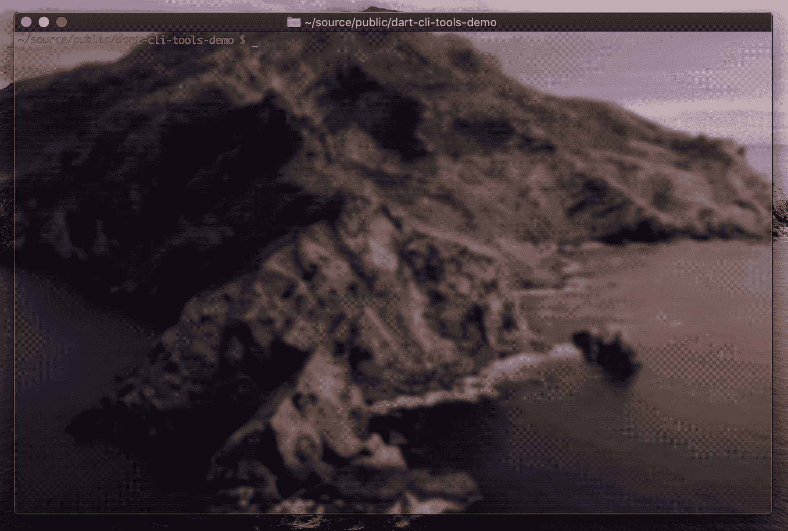

# 在 Dart 中构建 CLI 程序

> 原文：<https://itnext.io/building-cli-programs-in-dart-81aaa85caeee?source=collection_archive---------2----------------------->

## 如何使用 Dart 构建简单的命令行工具


## 介绍

在本文中，我们将研究用 Dart 构建简单命令行工具的过程。如果你还不熟悉 [Dart](https://dart.dev) ，它是一种优秀的语言，具有现代特性，适合构建易于维护和升级的高性能软件。

示例项目将演示典型 CLI 应用程序的简单功能，如参数解析和基本文件系统操作。

## 入门指南

如果您还没有 Dart 环境，请转到安装页面。要获得项目源代码的副本，请点击这里查看 GitHub repo。

这个项目是用 stagehand 创建的，stage hand 是一个很棒的 Dart 包，可以帮助设置 Dart 和 Flutter 项目。要使用 Dart 安装 stagehand 来构建您自己的命令行(和其他)应用程序:

```
$ pub global activate stagehand
```

Stagehand 为项目类型提供了几个选项，其中之一是`console-full`(这是用来创建这个项目的)。要使用 stagehand 创建命令行应用程序的基本起点，请执行以下操作:

```
$ stagehand console-full *your-project-name*
```

## 应用程序入口点

这个程序的主入口点是 **bin/main.dart:**

这是一个非常简单的应用程序，所以这里就不多说了。在更复杂的项目中，这是执行配置和初始化的地方。在这个例子中，参数被简单地传递给***demo . parse(****args****)***)。

## **演示类**

下一个要检查的文件是 **lib/demo.dart** ,在这里应用程序接受命令行参数并确定要执行的操作，或者在传入不正确的参数时显示使用信息:

在 **Demo** 类中有一些静态方法来处理一些简单的任务，例如在“hello world”示例中打印本地主机名，显示应用程序的使用信息，以及根据传递给应用程序的命令行参数来确定要执行的操作。有像 [args](https://pub.dev/packages/args) 这样的包可以用来处理参数解析，但是对于这个非常小的项目，我选择保持包的依赖性最小(零)。

如果在`scan`命令之后传入了第二个参数，那么这个参数将被传递给一个简单的文件系统扫描器(我们接下来将研究它),以对给定的*路径*执行基本的目录扫描并显示结果。

## 扫描仪类

我们项目中的最后一个文件是位于 **lib/scanner.dart** 中的 Scanner 类:

在**扫描器**类中，有一个静态的**扫描**方法，它采用一个*路径*并开始遍历位于该路径的目录结构。这使用了一个非常简化的[工厂方法](https://en.wikipedia.org/wiki/Factory_method_pattern)设计模式，因为它使用了一个静态方法在内部创建自己的实例。当然有许多设计模式存在，这只是其中的一个例子。

扫描仪的工作方式是从提供的路径开始，通过检索该路径的[File system ity](https://api.dartlang.org/stable/2.4.1/dart-io/FileSystemEntity-class.html)对象的列表来遍历该路径，对项目运行 **for** 循环，然后如果项目是[目录](https://api.dartlang.org/stable/2.4.1/dart-io/Directory-class.html)则遍历该项目，或者如果项目是[文件](https://api.dart.dev/stable/2.4.1/dart-io/File-class.html)则打印文件大小。这个条目也可以是一个[链接](https://api.dart.dev/stable/2.4.1/dart-io/Link-class.html)(我们的简单例子没有这样的案例，但是可以很容易地添加进去)。

这就是我们的基本文件系统**扫描器**及其操作。这个实用程序可以扩展为执行任意数量的文件系统任务(比如文件搜索或文件类型计数)，接受附加参数，或者处理其他类型的任务。



运行中的超级基本文件系统扫描器

## **结论**

我希望您喜欢这篇关于使用 Dart 创建简单命令行工具的文章，Dart 是一种功能强大、灵活且极具表现力的语言，同时也拥有[优秀的文档](https://api.dart.dev/stable/2.4.1/index.html)，对于许多不同的应用程序都很有用，包括 HTTP 服务、图像处理器、备份工具以及在现代开发和部署生态系统中运行良好的各种其他实用程序。例如，我的公司在 Heroku 上部署了一些用 Dart 开发的基本服务(有关在 Heroku 上配置构建包和部署 Dart 应用程序的更多信息，请参见本文)。

感谢您的阅读，祝您的下一个 Dart 项目好运！

> 肯尼斯·雷利( [8_bit_hacker](https://twitter.com/8_bit_hacker) )是 [LevelUP](https://lvl-up.tech/) 的 CTO