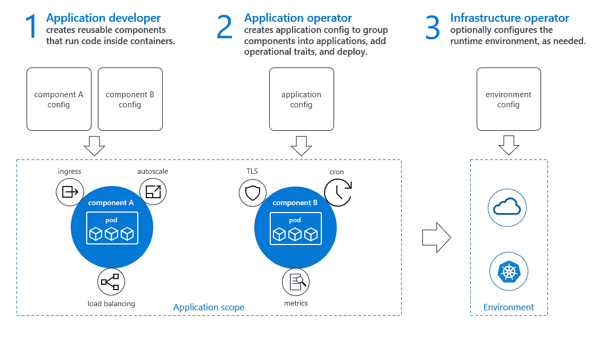
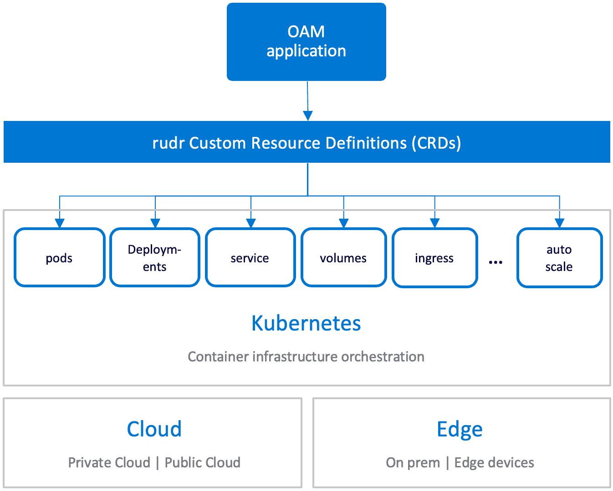

# 构建云原生应用:开放应用模型和 Rudr 简介

> 原文：<https://itnext.io/building-cloud-native-apps-intro-to-open-application-model-and-rudr-bd1b55df9bf3?source=collection_archive---------0----------------------->

生产级分布式云原生微服务通常由多个合作团队构建和运营。这说起来容易做起来难！考虑到规模和复杂性，问题会以多种方式出现(并不总是由于技术原因)。其他一些因素包括缺乏职责分离、角色/责任重叠等。，因此能够清楚地区分每个团队/小组负责的领域至关重要——一个典型的例子是应用程序开发人员和操作人员。

这是一篇介绍性的博文，帮助你熟悉云原生应用开发领域的几个项目:**开放应用模型**和 **Rudr** 。您将了解这些项目及其核心概念的概述。

> *(本系列中的)后续文章将建立在本文所讨论的概念之上，并涵盖实际例子*

# 开放应用模型:什么和为什么？

`[Open Application Model (OAM)](https://github.com/oam-dev/spec)`采用“关注点分离”原则试图解决这个问题。为了定义应用程序开发的规范，它考虑了以下角色和职责:

*   应用程序开发人员:他们的职责是构建、描述和配置应用程序。
*   应用操作员:在平台上工作，负责配置一个或多个微服务的运行时组件。
*   基础设施操作员:设置和维护运行这些应用程序的核心基础设施。



简单来说，`OAM`是一个构建云原生应用的规范。它提供了一种平台中立的方式来定义这些应用程序，通过抽象出许多因素，如云提供商、编排平台等。它定义的标准可以为不同的实现铺平道路

> *这种实现的一个例子是* `*Rudr*` *，这在 thig 博文*中有所涉及

# 开放式应用模型:核心概念

开放应用程序模型定义了以下组件——将它们视为可以有不同实现的抽象概念

*   *组件示意图*:开发者用来描述一个应用或服务。您可以将组件示意图视为一个“类”,因为这只是应用程序的蓝图
*   *应用配置*:由应用操作员定义的组件、特性和应用范围的组合。将应用程序配置视为创建一个类(组件示意图)的多个“实例”的方式，每个实例都具有不同的属性。
*   *特性*:应用操作员可以为组件分配附加特性，以满足横切需求
*   *工作负载*:用于定义特定组件的运行时类型
*   *应用范围*:它们提供了一种将具有共同特征的组件组合成松散耦合的应用程序的方法

现在我们对`OAM`及其术语有了一个基本的概念，让我们深入了解`Rudr`

# 你好，路德！

`[Rudr](https://github.com/oam-dev/rudr/)`是一个 [Kubernetes](https://kubernetes.io/) 规范的具体实现。它定义了更高级别的原语，在 Kubernetes 之上提供了一个抽象层。`Rudr`实现`OAM`概念(如组件、特质等。)使用 Kubernetes 资源，如`Deployment` s、`Service` s、`Ingress`等。`Rudr`允许您使用 YAML 清单定义`OAM`实体，它在内部映射到 Kubernetes 自定义资源定义(CRDs)



> *[*控制器/操作器模式*](https://kubernetes.io/docs/concepts/extend-kubernetes/operator/) *用于将这些 CRD 转换成具体的 Kubernetes 资源。**

*`Rudr`实现了`OAM`的承诺，为开发者提供了一种定义应用和其他对象的方式，比如应用配置、特征等。并让操作员定义操作能力。*

*由于上一节介绍了`OAM`概念，现在是从`Rudr`的角度深入了解其本质的好时机。*

# *Rudr 自定义资源定义(CRDs)*

*本节将概述`Rudr`使用的自定义资源定义。*

## *成分*

*组件描述了特定服务或应用程序的特征——它由`ComponentSchematic` CRD 表示。这里有一个例子:*

```
*apiVersion: core.oam.dev/v1alpha1
kind: ComponentSchematic
metadata:
  name: greeter-component
spec:
  workloadType: core.oam.dev/v1alpha1.Server
  containers:
    - name: greeter
      image: abhirockzz/greeter-go
      env:
        - name: GREETING
          fromParam: greeting
      ports:
        - protocol: TCP
          containerPort: 8080
          name: http
      resources:
        cpu:
          required: 0.1
        memory:
          required: "128"
  parameters:
    - name: greeting
      type: string
      default: abhi_tweeter*
```

*`ComponentSchematic` CRD 的各个部分是:*

*   *`metadata`:用于提供名称、标签、注释等基本信息*
*   *`workloadType`:用来表示开发者想要如何运行这个组件。有效选项包括:`Server`、`Singleton Server`、`Task`、`Singleton Task`、`Worker`、`Singleton Worker`*
*   *`containers`:类似于[ `Kubernetes`容器规范](TODO 规范链接)，用于定义运行组件的容器化工作负载所需的运行时配置*
*   *`parameters`:这是可选部分，用于提供组件的配置选项。*

## *工作量*

*如上所述，`Rudr`定义了六种核心工作负载类型。工作负载类型只是组件中的一个字段。除了核心工作负载，扩展类型可以通过[实现一个并将其直接添加到](https://github.com/oam-dev/rudr/blob/master/docs/tutorials/deploy_openfaas_workload.md) `[Rudr](https://github.com/oam-dev/rudr/blob/master/docs/tutorials/deploy_openfaas_workload.md)`(不那么灵活)或[使用 CRD 方法](https://github.com/oam-dev/rudr/blob/master/docs/tutorials/deploy_prometheus_workload.md)来避免对`Rudr`本身进行代码更改来定义。*

> **在上面的* `*ComponentSchematic*` *中，* `*workloadType*` *被定义为* `*core.oam.dev/v1alpha1.Server*`*

## *应用程序配置*

*A `ComponentSchematic`本身不做任何有意义的事情。使用与一个或多个组件相关联的`ApplicationConfiguration`来实现基于`Rudr`的服务，并定义如何实例化和配置应用，包括参数覆盖和附加特性。*

*这里有一个例子*

```
*apiVersion: core.oam.dev/v1alpha1
kind: ApplicationConfiguration
metadata:
  name: greeter-app-config
spec:
  components:
    - componentName: greeter-component
      instanceName: greeter-app*
```

*它有这些部分*

*   *`metadata`:用于提供名称、标签、注释等基本信息*
*   *`components`:用于引用一个或多个`ComponentSchematic`，覆盖它们的参数(可选)并定义附加特征*
*   *`traits`:您可以使用此部分对组件应用一个或多个功能，例如自动缩放、入口等。*
*   *`scopes`:您可以将多个组件归入一个范围*
*   *`variables`:可以替换到应用程序配置的多个其他位置的公共值*

## *特点*

*代表系统的特性，这些特性是操作上的关注点，而不是开发人员的关注点。您可以将它们与组件实例相关联，以提供额外的功能，如自动伸缩、持久性等。*

*这是一个特征的例子*

```
*apiVersion: core.oam.dev/v1alpha1
kind: ApplicationConfiguration
metadata:
  name: pv-example
spec:
  components:
    - componentName: rudr-pvc
      instanceName: rudr-pvc1
      traits:
        - name: volume-mounter
          properties:
            volumeName: config-data-vol
            storageClass: default*
```

*每个特征都有一组不同的属性，是`properties`部分的一部分。在撰写本文时，`Rudr`支持这些特性，并且每个特性都适用于特定的工作负载类型*

*   *手动缩放器—服务器，任务*
*   *自动缩放—服务器，任务*
*   *入口—服务器，SingletonServer*
*   *卷安装程序—所有核心工作负载*

> **使用* `*kubectl get traits*` *获取支持的特性列表**

## *范围*

*在撰写本文时，`Rudr`支持一个`Health`和`Network`作用域，您可以在`ApplicationConfiguration`文件中将该作用域分配给应用程序组件工作负载的实例，以定期检查应用程序内组件的总体健康状况。*

> **使用* `*kubectl get scopes*` *获取支持范围的列表**

*如果您对此感兴趣，并想深入了解，请查看以下资源:*

*   *[OAM 规范](https://github.com/oam-dev/spec/blob/master/1.purpose_and_goals.md)，以及，*
*   *[Rudr 文档](https://github.com/oam-dev/rudr/blob/master/docs/README.md)*

*这是目前足够的理论👍即将发布的帖子将通过具体的例子来帮助强化这些概念。敬请期待！*