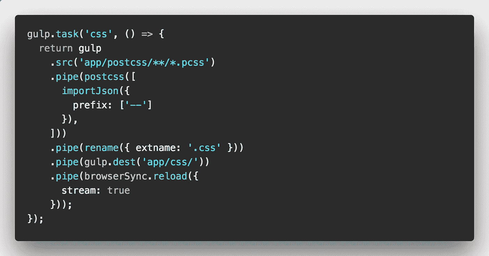
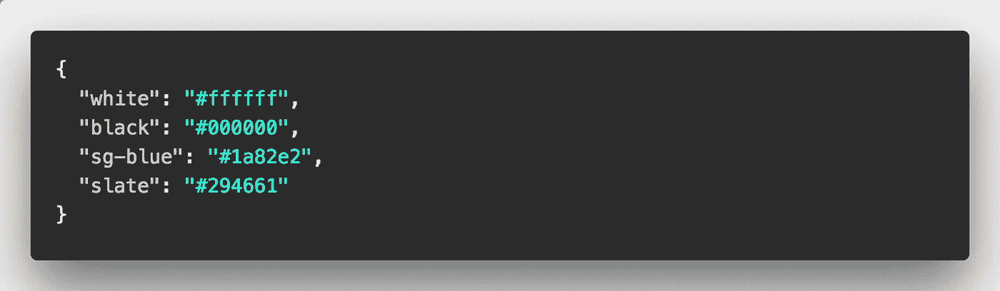
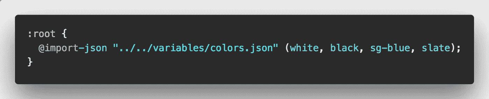
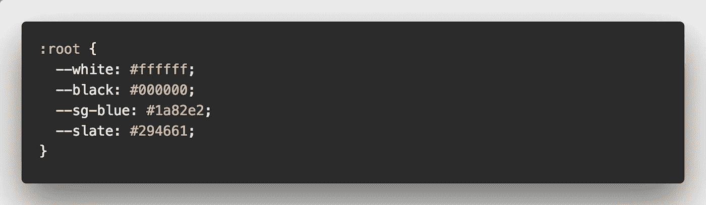

# 用 CSS 自定义属性& JSON 建立一致性

> 原文：<https://itnext.io/building-consistency-with-css-custom-properties-json-157578d633d3?source=collection_archive---------3----------------------->

为任何网站或应用程序创建 CSS 框架时，一致性是关键。无论多大或多小，使用一致的颜色、边距和悬停处理都很重要，这里仅举几例。旧闻了吧？

当在单个网站或应用上工作时，一致性可能是一件相当容易管理的事情。但是随着公司的成长会发生什么呢？网络的存在和团队也随之成长。现在，我们必须管理公共网站、各种内部网网站和产品之间的一致性。随着越来越多的开发人员在各自的 web 资产上工作，这可能是一个挑战。随着团队的成长，不一致性也会增加。

我们如何解决这个问题？CSS 自定义属性来拯救！但是等等，CSS 自定义属性是基于每个网站设置的。

JSON 来救援了！使用 JSON，我们可以建立一个包含所有公司网站使用的主属性的存储库。这个存储库可以包含任何最终将成为 CSS 自定义属性的内容。

有多种方法可以将 JSON 数据转换成可用的 CSS 自定义属性。我成功使用的一个方法是使用 [PostCSS](https://github.com/postcss/postcss) 和 [PostCSS-Import-JSON](https://github.com/m18ru/postcss-import-json) 插件。该插件导入 JSON 文件并将数据转换成 CSS 自定义属性。

让我们看一个基本的用例例子。首先，我们需要将 [PostCSS](https://github.com/postcss/postcss) 和插件添加到您的项目中。有关如何添加 [PostCSS](https://github.com/postcss/postcss) 的更多信息，请查看他们的[设置指南](https://github.com/postcss/postcss#usage)。

一旦安装了 [PostCSS](https://github.com/postcss/postcss) ，就可以安装 [PostCSS-Import-JSON](https://github.com/m18ru/postcss-import-json) 插件了。说明可以在[这里](https://github.com/m18ru/postcss-import-json)找到。

在 [PostCSS](https://github.com/postcss/postcss) 和插件设置好之后，是时候设置我们的构建任务来处理 JSON 文件的导入了。我在下面的例子中使用了 Gulp:

吞咽任务构建 CSS 文件(也包括重命名和 browsersync 任务)。

因此，让我们使用一个非常基本的例子，只是建立一个颜色的 JSON 文件。您的 JSON 文件可能如下所示:

包含颜色的 JSON 数据文件

现在我们的 JSON 文件包含了我们的配色方案，我们可以使用以下方法将这些颜色导入到我们的 PostCSS 文件中:

PostCSS 中的 JSON 导入

在构建过程中，导入插件将 JSON 数据转换成 CSS 自定义属性。JSON 文件可以导入到根目录或任何其他元素中。

CSS 输出— CSS 自定义属性

现在我们有了一组源自主 JSON 控制文件的 CSS 自定义属性。如果更新了 JSON 文件的颜色，那么在重新构建网站样式时，这些颜色也会改变。即使在这个简单的例子中，我们也可以看到这是如何帮助推动一致性的。

想象一下，公共网站、内部网和产品都使用相同的基本 JSON 文件来控制定制属性。这些属性应该是一致的。命名约定可以保持一致，团队中的开发人员可以更快地加入进来。

有关 CSS 自定义属性的更多信息，请查看这篇 [Smashing Magazine 帖子](https://www.smashingmagazine.com/2017/04/start-using-css-custom-properties/)。