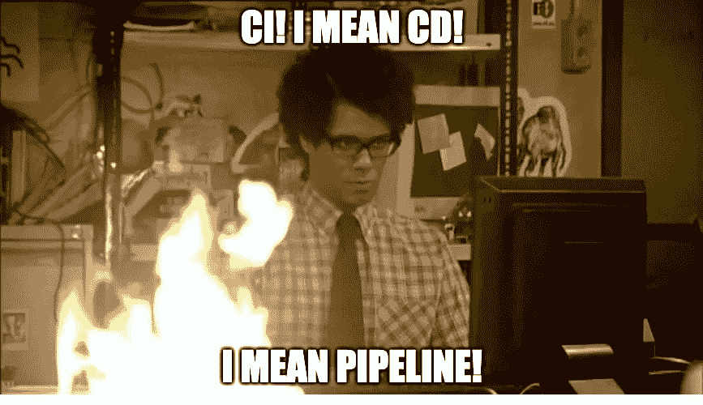
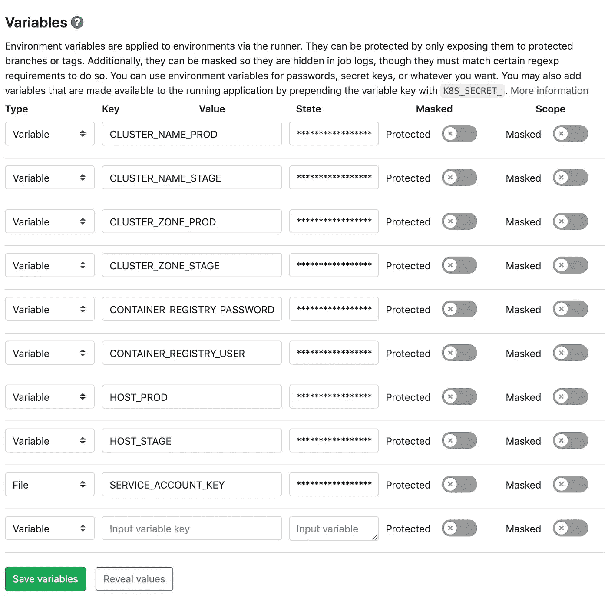
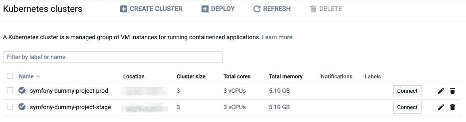
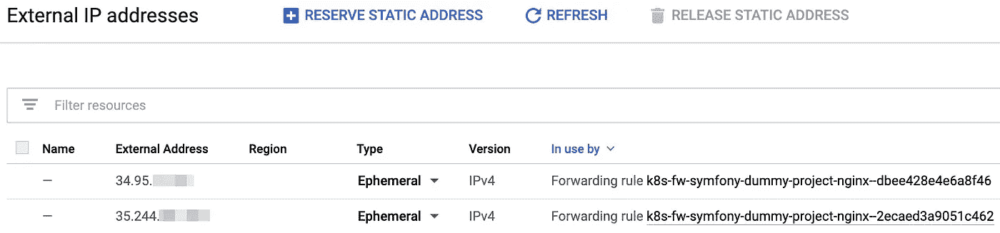
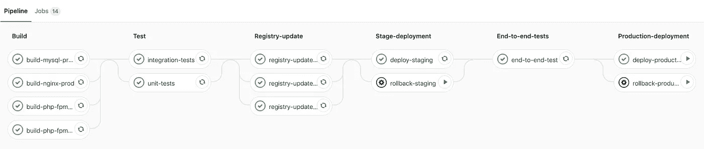

# 让我们将 Symfony 项目迁移到 Kubernetes！第 4 部分:构建连续的交付管道。

> 原文：<https://itnext.io/building-continuous-delivery-pipeline-2cc05e213935?source=collection_archive---------2----------------------->

# 关于这个系列

在这个系列中，我们将讨论现有 Symfony 项目到 Kubernetes (K8s)的迁移。无论您当前在何处以及如何发布您的应用程序:裸机、VM 或容器编排平台，通过遵循本指南，您将能够将其部署到 K8s 集群。
这些*how to*文章的目标读者是那些已经了解 Kubernetes、Docker 和持续集成(CI)的一些基础知识、想要学习新技巧或只想完成工作的人。
本系列的每一部分都致力于一个特定的主题:[构建 Docker 环境](/containerizing-symfony-application-a2a5a3bd5edc)，[在不同级别上测试应用](/testing-symfony-application-d02317d4018a)，[用 Helm](/publishing-symfony-application-with-helm-ecb525b34289) 将应用部署到 Kubernetes，构建 CI 管道。

# 关于第 4 部分

在这一部分，我们将讨论自动化。我们将利用在前面部分中获得的所有知识，创建一个可持续和可靠的持续交付(CD)渠道。

有大量的工具可以帮助你进行持续开发:Jenkins、Travis CI、GitLab CI 等。在本教程中，我选择了 GitLab CI，因为它是市场上最先进、文档完善且易于使用的解决方案之一。

在本系列的最后一篇文章中，我将指导您完成将虚拟项目交付到生产环境的所有阶段。

# 关于虚拟项目

我为这个系列准备了一个简单的 Symfony 4 应用程序。它需要 PHP-FPM，Nginx 和 MySQL 来运行。更多详情，请参考[第 1 部分](/containerizing-symfony-application-a2a5a3bd5edc)。

# 码头工人执行人

GitLab 使用 Runner 执行管道作业并收集结果。您可以从多个执行器中选择:SSH、Shell、Docker 等。我们将坚持使用 Docker executor，因为它最适合我们的用例。

使用 Docker executor，您可以配置默认图像和服务，这些将用于运行您的作业。因为我们要操作管道中的图像和容器，所以将 docker 中的 **docker 设置为默认配置是个好主意。**

让我们创建**。gitlab-ci.yml** 文件，并声明管道的基础:

# 阶段

流水线阶段对作业进行分组，并定义执行顺序。此外，如果在 GitLab Runner 中配置了并发性，同一阶段中的所有作业将并行运行。

我们的管道中需要哪些阶段？首先，我们需要构建 Docker 映像，因为我们使用容器来测试项目并在 Kubernetes 中运行它。下一步是执行单元和集成测试。如果测试通过，我们将图像推送到 Docker Hub。然后，我们将项目部署到试运行阶段，并运行端到端测试。最后，如果没有发现问题，我们将应用程序部署到生产环境中。

让我们宣布**中讨论的阶段。gitlab-ci.yml** 文件:

# 构建阶段

为了运行虚拟应用程序，我们需要 PHP-FPM、Nginx 和 MySQL 容器。要启动容器，我们需要首先构建图像。幸运的是，我们已经准备好使用 Dockerfiles，它是在[第 1 部分](/containerizing-symfony-application-a2a5a3bd5edc)中创建的。

## 模板

构建 Docker 映像的过程可能是并行和统一的。要并行运行作业，我们可以简单地将它们放在同一个阶段。为了统一流程，我们可以利用[特殊 YAML 功能](https://docs.gitlab.com/ee/ci/yaml/#special-yaml-features)的力量，构建一个模板:

以**开头的所有作业。**被 GitLab CI 忽略。一个隐藏的作业和一个锚( **& buildTemplate** )一起定义了一个模板。我们将在接下来的部分中看到如何使用模板，但是现在我只想鼓励您在任何有意义的时候使用模板，因为它增加了可读性，降低了管道的复杂性。

我们上面定义的作业非常简单:我们构建一个图像并将结果保存在一个文件中，该文件可以通过工件特性与其他作业共享。

## PHP-FPM 图片

我们需要构建两个 PHP-FPM 映像:一个用于测试，另一个用于试运行/生产环境:

我们使用 **< <** 来合并一个模板，我们在上面声明了这个模板，并标记为 ***buildTemplate** 。除此之外，我们定义了一组在模板中使用的变量。

> 因为所需的 PHP 版本已经在**中配置好了。env** 文件，我们可以重用该值以避免重复。要设置 **BUILD_VERSION** 参数，我们只需要在作业开始前读取文件并导出值。

## Nginx 图像

构建 Nginx 映像非常相似:

## MySQL 图像

我想提醒你，我们在 K8s 集群中使用 MySQL 只是为了演示的目的。对于测试来说，数据库容器是一个很好的选择，但是对于生产和登台环境，可以考虑使用外部数据库:

# 测试阶段

当映像被构建时，我们可以运行单元和集成测试，这是我们在本系列的前一部分中创建的。我们在这个阶段不执行端到端测试，因为我们将在试运行环境中运行它们，为此，我们显然需要首先在试运行环境中部署我们的项目。

## 单元测试

我们在 PHP-FPM 容器中运行单元测试，该容器基于我们在 **build-php-fpm-test** 任务中创建的图像。为了访问 **build-php-fpm-test** 工件，以及 php-fpm 图像文件，我们可以将其定义为当前作业的一个依赖项:

> 注意，我们需要在脚本之前加载图像，以使它对 Docker 可见。

## 集成测试

集成测试工作遵循与单元测试相同的逻辑，但是稍微复杂一点。它不仅需要 PHP-FPM，还需要 MySQL 容器。两个容器必须在同一个网络中，并且根据我们的配置，数据库必须可以被 **mysql** 别名访问:

> 我们不能在后台启动 MySQL 容器后立即运行测试，因为初始化数据库和设备需要一些时间。

为了避免在没有准备好的环境中启动测试，我们使用了 **ci/check-connection** 脚本，它基本上只是等待 3306 端口打开，因为这是一个信号，表明容器已经成功启动:

# 注册表更新阶段

如果所有测试都通过了，我们可以将生产就绪映像从**构建**阶段推送到容器注册中心。我使用 Docker Hub 作为例子，但是可以随意选择任何满足您需求的注册表。

## 模板

由于所有注册表更新作业看起来都很相似，因此创建一个模板很方便:

在上面的说明中，我们加载一个图像，重新标记它，并将其推送到注册表中。为什么我们要重新标记图像？为什么我们没有到处使用最后的标签？出于可读性的考虑，存储库标签相当长，我们不想在使用图像的每个作业中都键入它。

> 从这个阶段开始，我们将在管道中添加的所有作业都将被标记为仅主作业。我们不想继续部署，除非代码被合并到主分支。

## FPM 图片

在 PHP-FPM 的情况下，我们只推送**symfony-dummy-project-PHP-fpm:prod**image:

## Nginx 图像

同时，我们将**symfony-dummy-project-nginx:prod**发送到注册表:

## MySQL 图像

最后，我们推送**symfony-dummy-project-MySQL:prod**:

# 阶段部署阶段

既然所有的图像现在都在注册表中，我们就可以在登台和生产环境中发布我们的应用程序了。我们已经在[系列的第二部分](/publishing-symfony-application-with-helm-ecb525b34289)中准备了一个掌舵图，现在我们只需要将它安装在一个选定的 Kubernetes 集群上。我选择 Google Kubernetes Engine (GKE)作为本文演示集群的宿主平台。

## 部署模板

试运行和生产的部署流程是相同的。因此，我们可以创建一个模板:

在之前的工作中，我们使用了默认映像— **docker:latest** ，因为我们只需要 docker 和 Shell 实用程序。在部署阶段我们与 GKE 进行交互，这需要安装更具体的工具: **gcloud** 、 **helm** 、 **kubectl** 等。为了方便集群通信，我创建了一个新的 **helm-gke** 图像:

在启动了一个 **helm-gke** 容器之后，我们需要为 **kubectl** 配置集群凭证。我已经在**ci/fetch-cluster-credentials**脚本中提取了必要的命令:

当获取凭证时，没有什么可以阻止我们安装图表:

## 部署作业

部署工作非常简单:

UPD:除了使用带有环境后缀的变量(例如 _STAGE)之外，你可以考虑在 GitLab UI 中为 STAGE 和 production 范围创建变量，然后[用特定的环境](https://docs.gitlab.com/ee/ci/yaml/README.html#environment)标记作业。

这里唯一需要解释的是**ci/等待推出**脚本:

这个脚本一直等到所有的窗格都准备好了，以避免在以前的图表版本上启动端到端测试。

## 回滚模板

当出现问题并且我们想要恢复最后的更改时，回滚工作非常方便:

这是一个手动操作，它使先前的图表修订生效(在**回滚**命令中的零指的是先前的修订)。

## 回滚作业

作业定义很简单，我们只需要提供集群凭据:

# 端到端测试阶段

这个应用程序现在已经准备就绪，这意味着我们最终可以运行端到端的测试，并检查整个系统是否如预期的那样工作。

在这个系列的第三部分中，我们创建了一个 Postman 集合，它描述了虚拟项目的功能。我们还讨论了一个名为 Newman 的工具，如果您需要从命令行运行收集，它会非常方便。

Docker executor 的便利之处在于能够使用任何图像来运行您的作业。在端到端测试的情况下，最合适的是官方的**邮递员/纽曼:阿尔卑斯**图像:

> 注意，**邮递员/纽曼:阿尔卑斯**有**运行**命令作为入口点。为了使它与 Docker 执行器一起工作，我们需要重置图像入口点。

# 生产部署阶段

我们已经在**阶段-部署**阶段创建了必要的模板，所以让我们直接进入工作列表。

## 部署作业

我们不会在生产中自动部署项目。相反，当我们准备好发布代码时，我们在 GitLab UI 中按下按钮:

> 请注意，我们对生产群集有不同的凭据。

## 回滚作业

正如所料，生产回滚作业类似于**回滚-暂存**:

# 配置

管道已经准备好了，但是在触发它之前，我们需要设置 CI 变量，调整项目以与 GKE 兼容，并配置集群。

## GitLab CI 变量

如果您再看一下管道代码，您会发现这里和那里有许多变量。其中一些直接在**中定义。gitlab-ci.yml** 文件:

其他是外部的:

所有以 CI 为前缀的变量都是由 GitLab CI 提供的(例如 **$CI_COMMIT_SHA** )。其余在**设置⇢ CI/CD** 页面配置:

## 项目

为了让我们的项目在 GKE 运行，我们需要对代码做一些修改:

1.  由于我们将创建两个集群(暂存和生产)，并配备两个专用入口控制器，因此在入口对象定义中不需要路由规则。所有请求将由默认后端处理:

2.GKE 不支持 **ClusterIP** ，所以让我们将我们的服务类型改为 **NodePort** :

3.Google 云平台可以通过 HTTP 端点监控我们的应用程序的健康状况。为了给 GCloud 提供应用程序状态信息，我创建了一个简单的**健康控制器**:

默认情况下，Google 负载平衡器向 **/** 和 **/healthz** 端点发出请求，以发现应用程序的状态。要在 Nginx pod 上启用 GKE 健康检查，我们可以配置活动和就绪探测器。作为第一步，我们必须调整图表部署模板以接受探测器设置:

然后，我们需要在 **values.yaml** 文件中配置 **nginx** 服务:

## 簇

如果您决定像我们在本教程中所做的那样在 GKE 上发布您的项目，您将需要在第一次部署之前准备集群。如果您还没有创建集群，您可以在 Google 云控制台( **Kubernetes 引擎⇢集群**)中创建集群:

当两个集群都启动并运行时，我们可以在 **IAM & admin ⇢服务帐户**页面上使用 **Kubernetes 引擎管理**角色创建 **symfony-dummy-project** 服务帐户。然后生成一个 JSON 密钥，将其重命名为 **sa.json** ，并遵循以下说明:

1.  从服务帐户密钥( **sa.json** )所在的目录启动 **helm-gke** 容器:

2.在 Google 云平台中进行身份验证:

3.获取集群凭据(不要忘记用集群参数替换占位符):

4.在 K8s 集群中创建项目名称空间:

5.添加数据库机密:

6.配置 Tiller 服务帐户:

7.初始舵:

> 请注意，这种配置对于两个集群都是必需的:转移和生产。

## 域名服务器(Domain Name Server)

第一次部署后，GKE 将创建两个负载平衡器，并为每个平衡器创建两个临时 IP 地址:

您可以将您的域名指向这些 IP 地址，使您的应用程序可以通过 HTTP 访问，但是推荐的方法是保留[静态 IP 地址](https://cloud.google.com/compute/docs/ip-addresses/#reservedaddress)。

# 运行管道

所有准备工作都已完成，我们准备运行管道。要启动这些作业，您只需要将代码放入 Git 存储库中。虽然对功能分支的提交仅触发**构建**和**测试**阶段，但是对**主**的提交也调度**注册表更新**、**阶段部署**和**端到端测试**作业。

您总是可以在 UI 中看到管道是否通过(或失败):

此外，只需点击一下，就可以查看任何感兴趣的作业的输出。如果你想自己尝试，只需访问其中一个管道页面。

# 结束语

我们终于将虚拟项目迁移到了 Kubernetes！当然，我们简单地触及了大部分主题，有些问题根本没有讨论(自动伸缩、数据库迁移等)。)，但如果您决定在 K8s 上发布您的 Symfony 项目，这是一个很好的起点。

我要感谢所有关注这个系列的人！我希望我的指南是有用的，并帮助您了解 Kubernetes。下次见！