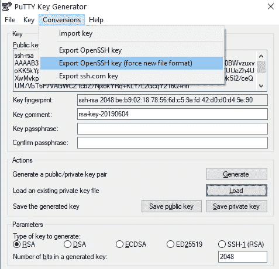
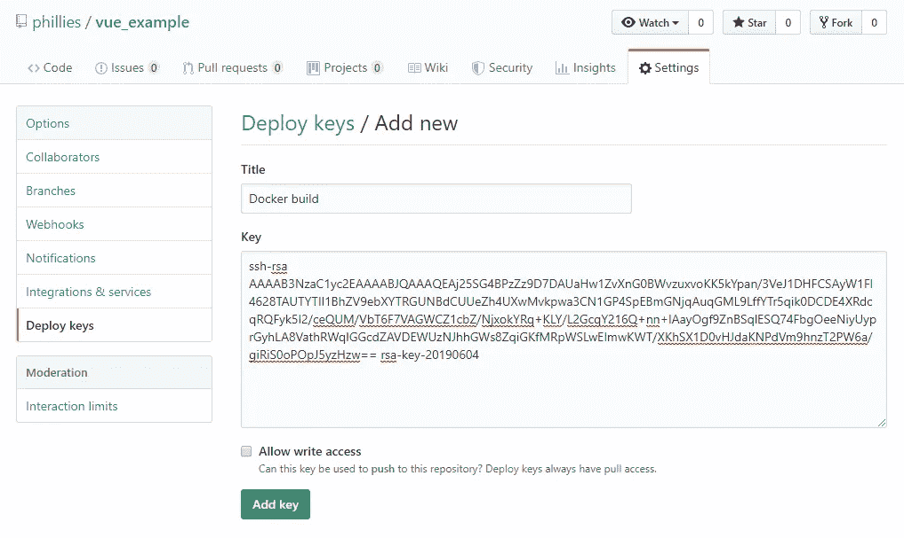

# 使用 ssh 登录从私有 git 存储库构建 docker 映像

> 原文：<https://itnext.io/building-docker-images-from-private-git-repositories-using-ssh-login-433edf5a18f2?source=collection_archive---------0----------------------->

弗兰克·麦肯纳在 [Unsplash](https://unsplash.com?utm_source=medium&utm_medium=referral) 上拍摄的照片

如果你想安装和试用软件，而不需要弄乱你的操作系统，或者为你正在开发的应用程序建立一个干净的环境，Docker 是一个非常棒的工具。在这篇文章中，我将一步一步地向您展示如何设置 docker 文件，这样您就可以克隆一个私有 github repo，并在公共映像中使用从该 repo 构建的内容，而不必担心公共映像中的凭证或私有文件。作为例子，我从私有回购构建 vue.js 应用程序，并使用构建的应用程序设置 web 服务器。

本教程有 3 个步骤:

1.  从 git 存储库克隆和构建 docker 映像
2.  在设置精益 web 服务器之前，使用构建器映像构建应用程序
3.  将 ssh 密钥导入构建器以克隆私有存储库

## 从 git 存储库克隆和构建 docker 映像

最好的情况是，例如，当使用 JS 开发一个开放的 git 库并使用 npm 进行构建时，您可以在 docker 文件中设置少至 5 行的应用程序。获取一个节点基础映像，克隆您的 repo，安装模块，并运行开发服务器。例如，我上传了一个包含用 vue cli 创建的锅炉板应用程序的存储库。

但是，npm development server 不应在生产中使用，并且映像也将非常大，对于上面的示例超过 1 GB，因为安装了所有开发依赖项。因此，我们可以使用一个高效的 web 服务器(apache，nginx)作为基础映像，安装构建应用程序所需的一切，构建应用程序，然后删除我们安装的一切。但这不会让图像立即变小，因为 docker 会为每个执行的命令创建一个层，并默认保留所有层。您可以手动删除层，但这很复杂，可能会导致问题。(如果你想了解更多信息，请点击查看[。)](https://medium.com/@jessgreb01/digging-into-docker-layers-c22f948ed612)

## 在设置精益 web 服务器之前，使用构建器映像构建应用程序

截至今天(2019 年 6 月)，正确的做法是使用多阶段构建。我们首先构建一个用作构建器的映像，在其中安装我们需要的所有依赖项并构建最终的应用程序，然后在第二阶段创建生产性 web 服务器映像并从构建器中复制我们需要的文件。

我们首先创建了一个几乎和以前一样的映像，并将其命名为 *builder* ，但是我们最终没有执行运行命令，而是构建了我们应用程序的生产版本。`&&`连接命令，因此它们被一个接一个地执行，并且只创建一个层。这不是必须的，但是我更喜欢分组命令来创建尽可能少的层。

然后，我们基于 nginx 创建第二个映像，并将构建的应用程序从构建器复制到我们的 web 服务器映像。生成的图像有漂亮的 110 MB，只有应用程序，没有构建过程的痕迹。(对于 apache，使用 httpd 作为基本映像，并用`/usr/local/apache2/htdocs/`替换目标目录)。

现在，我们可以发布容器，下载该图像的用户将只能获得高效的应用程序和基本的 web 服务器。接下来是克隆私有存储库(这里是 github)的重要部分。

## 将 ssh 密钥导入构建器以克隆私有存储库

当你想发布一个来自私有存储库的应用程序的图像时，你需要某种方式将凭证传递到 docker 构建过程，以允许 git 登录到你的存储库。直接且非常危险的方法是在克隆命令中使用用户名和密码。但是您永远不应该将凭证放在配置文件中，所以这不是一个选项。将凭证作为命令行参数传递给构建器也不是一个好主意，因为它要求总是传递凭证，并且密码可能存储在 bash 历史记录或其他日志中。首选解决方案是*部署键*。一组 ssh 公私密钥，专门用于对某些存储库的只读访问。您可以将这些密钥复制到构建器中，向 ssh 代理注册它们，然后克隆存储库。由于构建器图像在该过程之后被删除，所以最终图像不包含任何键的痕迹。

首先，您需要创建一个 ssh 密钥对，一个用于 github 的公钥和一个用于 docker 文件的私钥。在 linux 上，只需运行`ssh-keygen -t rsa -f github_key`来生成一个 RSA 密钥对。确保不使用密码短语。然后复制 docker 文件旁边的`github_key`和`github_key.pub`文件(为了方便)。在 Windows 上，PuTTY/ [KiTTY](https://www.9bis.net/kitty/?page=Command-line%20options&zone=en) 可以生成密钥对，确保以 OpenSSH 格式导出私钥。

接下来，您必须登录 github，导航到您的存储库，选择设置，然后部署密钥，然后添加密钥。

在那里，您可以上传您的*公共*密钥`github_key.pub`的内容并保存更改。

现在我们只需将 github_key 复制到构建器映像中，启动 ssh-agent(第 4 行)，将密钥添加到代理中(第 5 行)，从 github.com 导入公钥(第 6 行)，最后使用 ssh 而不是 https 克隆映像。

就是这样。适用于任何类型的项目，也应该适用于其他 git 主机，只要它们支持 ssh 登录。

docker 文件的存储库可以在这里找到:[https://github.com/phillies/vue_example](https://github.com/phillies/vue_example)

玩得开心！