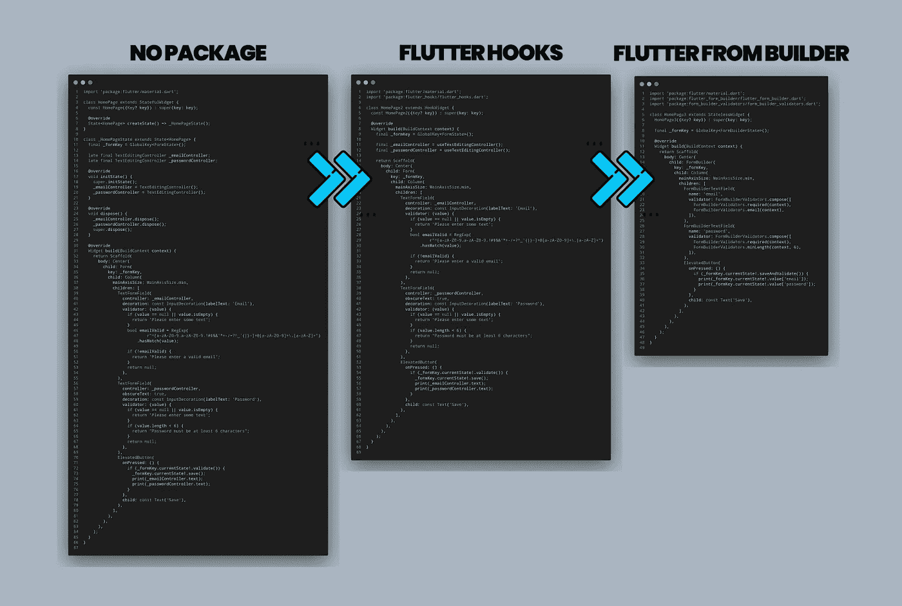

# 现在在 Flutter 中构建表单很有趣！

> 原文：<https://itnext.io/building-forms-in-flutter-is-fun-now-bdcab1f31f87?source=collection_archive---------2----------------------->

## 如何在创建表单时去掉所有的样板代码？

扑扑很好玩！但是创建颤动形式完全是一种折磨！但是有更好的方法来享受表单的乐趣！

在这篇文章中，我们将看到如何使表单生成器变复杂为简单，以及如何减少一半的代码。(86 → 48)

# 动机

我们用一个简单的例子来看看这三种方式吧！

## 1.普通用法

## 2.使用摆动钩

帮助我们管理我们的控制器`init`和`dispose`的事情。

## 也

你知道`flutter_hooks`有疯狂技能吗！不仅是 TextEditingController，它还有更多预定义的功能，可以帮助你摆脱复杂的结构！如果你感兴趣，你也应该去看看！！

 [## 用抖动钩子去掉所有类型的样板代码

### 难道你不认为，是时候杀死 StatefulWidget 并使用 flutter 钩子去掉样板代码了吗

iisprey.medium.com](https://iisprey.medium.com/get-rid-of-all-kind-of-boilerplate-code-with-flutter-hooks-2e17eea06ca0) 

## 3.使用颤振形式生成器

`flutter_form_builder`为我们提供了完整的表单解决方案！不仅仅是文本域，它还有其他现成的表单输入域。

现在我们来快速看一下`flutter_form_builder`套餐！！

## 注意到

下面的解释都来自于包本身的描述

# 颤动形式生成器

> 这个包通过删除构建表单、验证字段、对更改做出反应以及收集最终用户输入所需的样板文件，帮助在 Flutter 中创建数据收集表单。

还包括 FormBuilder 常用的现成表单输入字段。

## 输入部件列表

当前支持的字段包括:

*   `FormBuilderCheckbox` -单复选框字段
*   `FormBuilderCheckboxGroup` -多选复选框列表
*   `FormBuilderChoiceChip` -创建一个类似单选按钮的芯片。
*   `FormBuilderDateRangePicker` -用于选择日期范围
*   `FormBuilderDateTimePicker` -用于`Date`、`Time`和`DateTime`输入
*   `FormBuilderDropdown` -用于从下拉列表中选择一个值
*   `FormBuilderFilterChip` -创建一个类似复选框的芯片。
*   `FormBuilderRadioGroup` -用于从单选按钮列表中选择一个值
*   `FormBuilderRangeSlider` -用于从数值范围中选择一个范围
*   `FormBuilderSegmentedControl` -使用`CupertinoSegmentedControl`控件作为输入选择一个值
*   `FormBuilderSlider` -用于选择滑块上的数值
*   `FormBuilderSwitch` -开/关开关字段
*   `FormBuilderTextField` -一个材料设计文本字段输入。

## 生态系统

这里有一些额外的包可以用来扩展`flutter_form_builder`的功能。

*   [form _ builder _ validators](https://pub.dev/packages/form_builder_validators)—提供了一种验证输入到任何 Flutter `FormField`中的数据的便捷方式。
*   [form _ builder _ extra _ fields](https://pub.dev/packages/form_builder_extra_fields)—提供与`flutter_form_builder`兼容的额外的现成表单输入字段。
*   [form _ builder _ file _ picker](https://pub.dev/packages/form_builder_file_picker)—一个`FormbuilderField`允许从用户设备存储器中选择图像。
*   [form _ builder _ image _ picker](https://pub.dev/packages/form_builder_image_picker)—一个`FormbuilderField`，允许从设备图库或相机中选择图像。
*   [form _ builder _ map _ field](https://pub.dev/packages/form_builder_map_field)—地理位置输入的一个`FormbuilderField`。
*   [form _ builder _ phone _ field](https://pub.dev/packages/form_builder_phone_field)—国际电话号码输入的一个`FormbuilderField`。

## 你可以从这里托运包裹！希望你也喜欢！

 [## 颤振 _ 表单 _ 生成器|颤振包

### 这个软件包通过删除构建表单所需的样板文件，帮助在 Flutter 中创建数据收集表单…

公共开发](https://pub.dev/packages/flutter_form_builder) 

# 感谢您的阅读！

如果你喜欢这篇文章，请点击👏按钮(你知道你可以升到 50 吗？)