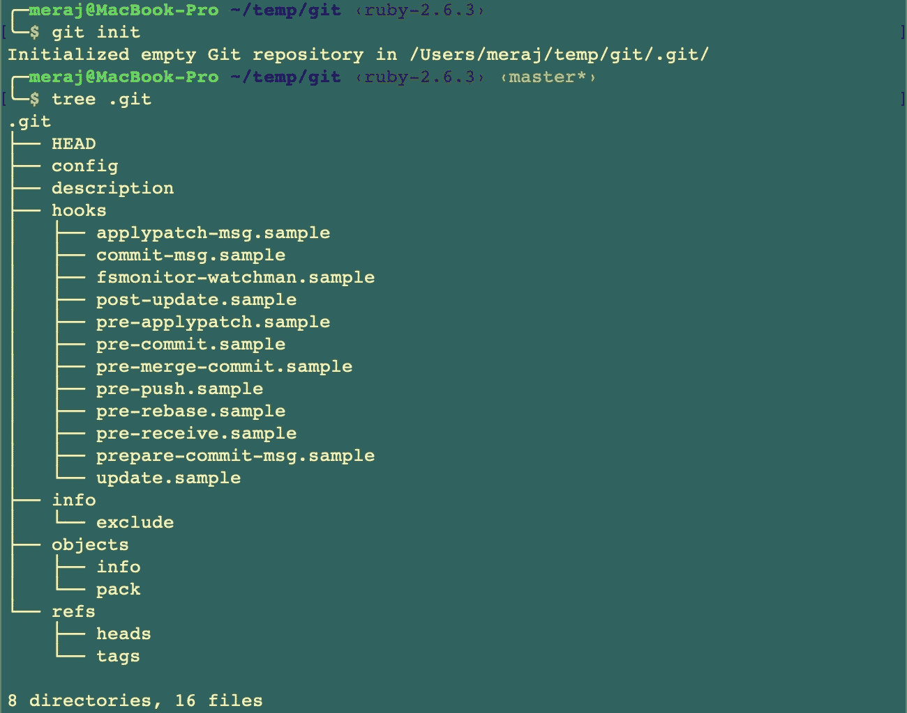
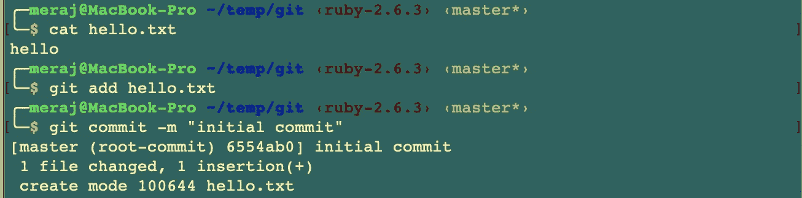
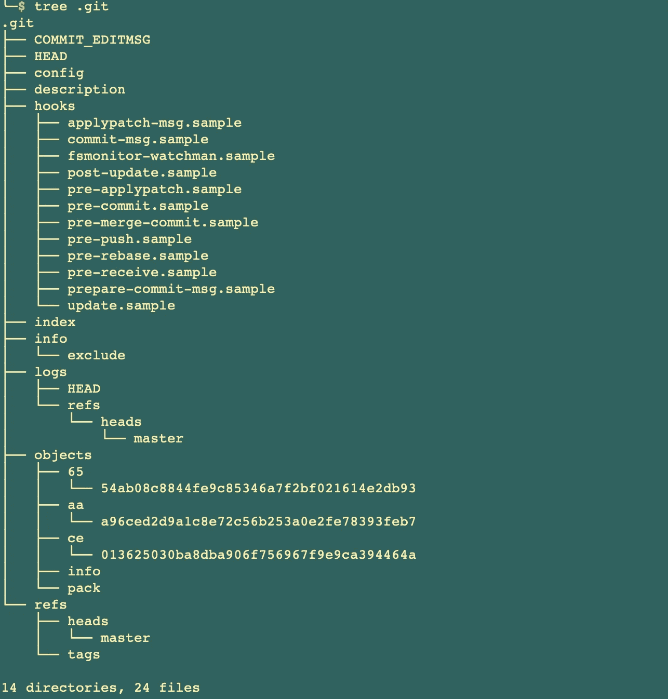
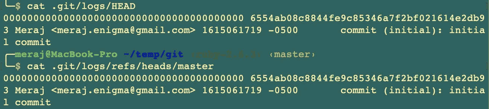
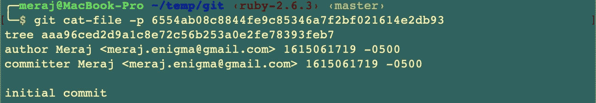
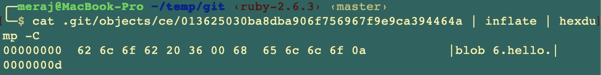
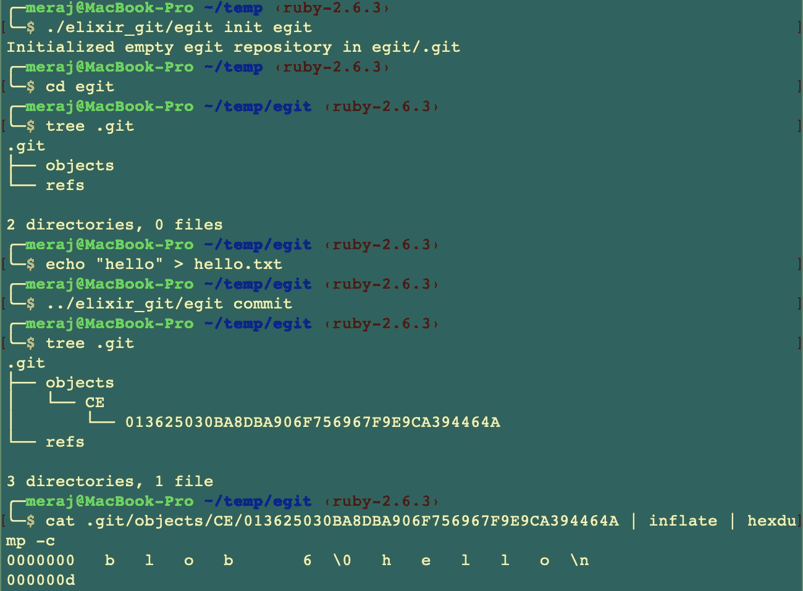

# 在 Elixir 中构建 Git 第 1 部分(初始化 Repo & Store blobs)

> 原文：<https://itnext.io/building-git-in-elixir-part-1-2f2ec245df74?source=collection_archive---------0----------------------->

我最近拿到了詹姆斯·科格兰写的《T2 建筑指南》。这是一本相当厚的书，正如标题所说，涵盖了使用 Ruby 编程语言构建 Git 版本控制系统。当我读这本书的时候，我认为用 Elixir 实现 Git 会是一个有趣的练习。本文是一系列文章中的第一篇介绍性文章，重点介绍我用 Elixir 编程语言实现 Git 的旅程。

这不是一堂介绍性的编程课。因此，我不打算把重点放在灵丹妙药的概念或图书馆。请参考[1]和[2]。此外，为了收集关于 Git 内部的详细知识，我建议你阅读上面的书和/或浏览[文档](https://git-scm.com/docs)【3】。

因为这只是这一系列文章的第 1 部分，所以我将解释一些我们在这篇文章中试图构建的理论，并逐步实现 Elixir。

# 一点理论

Git 将其存储库信息存储在。git 目录。在一个普通的项目中，我们输入 **git init *，*** 。git 目录如下所示—



git 存储库结构

简单概述一下——

*   **HEAD** —包含对当前提交的引用，使用提交 ID 或对当前分支的符号引用
*   **配置** —包含此存储库的配置设置
*   **描述** —包含存储库的名称
*   **钩子** —包含由各种 git 命令执行的各种脚本
*   **信息** —包含关于存储库的各种元数据信息
*   **对象 *—*** 这是 git 的数据库，包含了它跟踪的所有内容 ***。在本文中，我们将主要关注构建和填充这个目录***
*   **引用** —将各种指针存储到**中。git/objects** 数据库。最重要的是，**。git/refs/heads** 存储每个本地分支和**上的最新提交。git/refs/tags** 存储标签

提交一个示例 **hello.txt** 文件后，内容 **hello** 如下—



储存库结构看起来如下，有一些新的目录和文件—



初始提交后的存储库结构

这里—

*   **提交编辑消息** —包含给定的提交消息


*   **索引** —包含用于构建下一次提交的二进制数据
*   **日志**——包含**参考日志**命令使用的各种日志



*   **新对象/ <子目录>** —一些新的子目录是用加密哈希作为文件名创建的。如果我们检查其中一个由 **git log** 命令打印的 ID—


从提交 ID 中，我们可以看到它匹配了一个**对象**子目录—


我们可以使用 **git cat-file -p** 来显示 git 数据库中关于这个对象的信息



关于对象的信息

上面的输出引用了一个提交 ID 为**aa 96 ce D2 9 a 1 c 8 e 72 c 56 b 253 a 0 e 2 Fe 78393 feb 7**的树

我们可以使用类似的命令来检查这个对象—


树表示

从输出中我们可以看到这个树引用了另一个提交 ID**ce 013625030 ba 8d ba 906 f 756967 f 9 e 9 ca 394464 a**，它代表了文件 **hello.txt.**

用相同的命令检查这个提交显示—


现在，为了检查 git 如何在文件系统中存储对象，我们可以这样做—


输出显示了文件系统上对象 blob 的压缩内容。

这本书提供了一个方便的命令来膨胀压缩的内容—

```
alias inflate='ruby -r zlib -e "STDOUT.write Zlib::Inflate.inflate(STDIN.read)"'
```

使用这个命令，我们可以看到这个对象的明文内容—



对膨胀的 blob 应用了 hexdump 命令

***正如我们所看到的，git 存储 blob 的方式是在它们前面加上单词 blob、一个空格、blob 的长度、一个空字节，然后是使用 zlib 压缩的内容。***

# 本文的重点

在本文中，我的重点是从零开始，构建两个命令—

*   git init——它将初始化。仅带有**对象**和**引用**目录的 git
*   git commit —这将使用当前工作目录中的任何文件创建对象数据库

***在本文中，我不会关注树或提交历史或消息。这将是未来某个项目的重点。***

从现在开始，我将使用它的可执行名称来指代这个 elixir 版本— **egit**

# **仙丹代码演练**

本文的源代码可以从 https://github.com/imeraj/elixir_git 的[获得](https://github.com/imeraj/elixir_git)

它包含一个关于如何构建可执行文件和使用 **git init** 和 **commit** 命令的 **README** 文件。

## 解析命令行参数

cli.ex 执行命令行参数解析-

这里，

*   **parse_args** (第 12 -17 行)—解析命令行参数并为内部处理命令创建元组—

> {:init，dir} → for egit init
> 
> {:commit，dir} → for egit 提交

**egit init** 命令也可以将可选目录作为参数。如果什么都没有传递，它将创建。当前工作目录中的 git 目录。

*   **进程**(第 51–57 行)—处理解析的命令行参数，并调用初始化和提交所需的模块

## 助手模块

**helpers.ex** 提供了一些助手功能—

这里—

*   **git_path** (第 6–9 行)—为。git 目录
*   **db_path** (第 11–14 行)—为对象构建 db 路径
*   **ls_r** (第 16–30 行)—列出当前工作目录下的所有文件，包括所有子目录
*   **generate_random_string** (第 33–38 行)——生成给定长度的随机字母数字字符串

## 实现 e *git init*

**init.ex** 执行 init 命令—

这里—

*   **init** (第 8–12 行)—使用路径调用，其中。应该创建 git 目录
*   make_dirs (第 14- 28 行)——在. git 下创建目录。现在它只创建**。git/objects** 和。如果。git 尚不存在。
*   **第 26 行** —打印消息，如果。git 目录已正确初始化

## 实施 egit 提交

**commit.ex** 执行提交命令—

这里，

*   **提交**(第 8–20 行)——执行提交命令。现在，它提交当前目录和任何子目录中的所有文件。

我会更深入地讨论这里发生了什么—

*   **第 9 行** —列出当前目录下的所有文件，包括所有子目录。

它依靠辅助函数 **ls_r()** 来完成这项工作

*   **第 10–14 行—** 对于在上述步骤中获得的任何文件，它将使用文件内容构建一个 BLOB 结构，并写入对象数据库。

BLOB 结构模块( **blob.ex)** 如下所示—

这个结构有两个字段——数据**和 T42 oid**(我将很快讨论 oid**和 T45)**

**database.ex** 提供数据库模块，并完成大部分填充对象目录的繁重工作——

这里—

*   **第 10 行** —使用以下结构构建内容:blob 单词、一个空格、blob 长度和一个空字节，后跟字符串形式的明文文件内容
*   **第 11 行** —使用内容上的 SHA-1 构建对象 ID 哈希
*   **第 12 行**——实际写 blobs 的工作
*   **第 19 行** —通过连接 oid 的前两个字符和其余字符，从 db_path 构建 object_path。因此，我们得到一个路径，比如—**db _ path/<2 chars>/<rest chars>**，它表示对象数据库中的以下内容—


*   **第 21 行** —使用 **generate_temp_name** ()函数创建一个临时文件路径，该函数以与实际 Git 相同的格式创建文件名。代码首先在这个临时路径中写入 blob，然后将其重命名为实际的 object_path ( **line 41** )。
*   **第 23–35 行:**以读、写和独占模式创建临时文件，这样如果文件已经存在，它就会出错(以防我们的临时文件名发生冲突)。
*   **第 37 行**:压缩内容
*   **第 38–39 行**:写入压缩内容并关闭文件

# 带着埃吉特去兜风

既然已经实现了 egit init 和 commit，那么让我们来看看 egit，并与真正的 git 的数据库进行比较。

初始化 repo 并提交内容为 **hello** 的文件 **hello.txt** 的示例会话如下所示



与 egit 的会议

这里—

*   我初始化了。目录位置 egit 处的 git
*   **树。git** 显示下面是什么。在**开始初始化**之后立即 git
*   我用“hello”作为内容创建了 hello.txt
*   **树。git** 显示了下面的内容。git 在 **egit 提交**之后
*   最后，带有 inflate 和 hexdump 的 cat 以纯文本形式显示对象数据库 blob 的内容，这表明数据以与真实 Git 相似的格式存储

# 结论

在这些文章系列的第 1 部分中，我已经从头开始实现了 **egit init** 和 **egit commit** (非常基本的)命令，并展示了与真实 git 版本控制系统相比较的输出。本系列的后续文章将随着我阅读本书— [**构建 Git**](https://shop.jcoglan.com/building-git/) 的进展，继续在 Elixir 中添加和改进更多的命令。

*更多详细和深入的未来技术帖子，请关注我这里或上*[*Twitter*](https://twitter.com/meraj_enigma)*。*

# 参考

1.  [https://elixir-lang.org/getting-started/introduction.html](https://elixir-lang.org/getting-started/introduction.html)
2.  [https://elixir-lang.org/docs.html](https://elixir-lang.org/docs.html)
3.  [https://git-scm.com/docs](https://git-scm.com/docs)
4.  https://github.com/imeraj/elixir_git