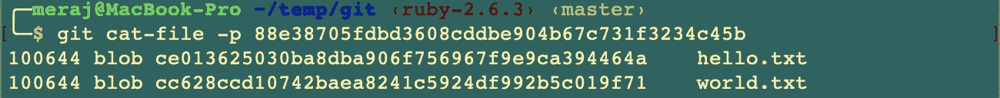
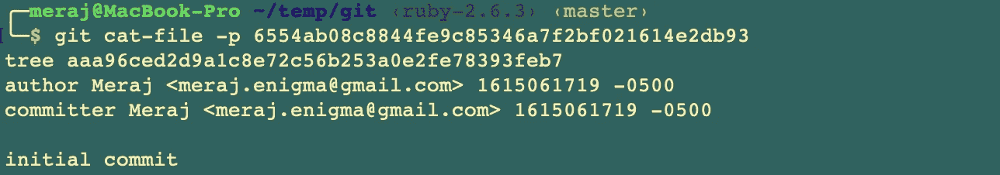
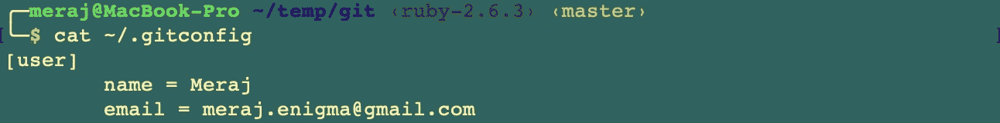
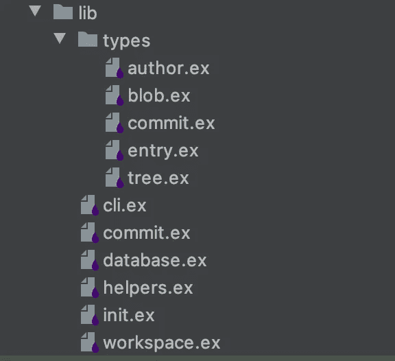
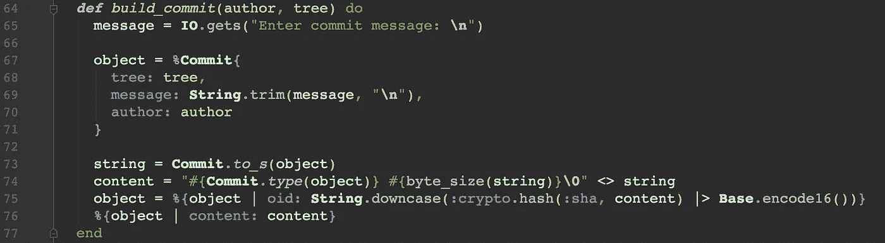
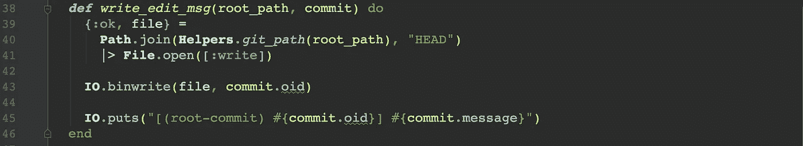
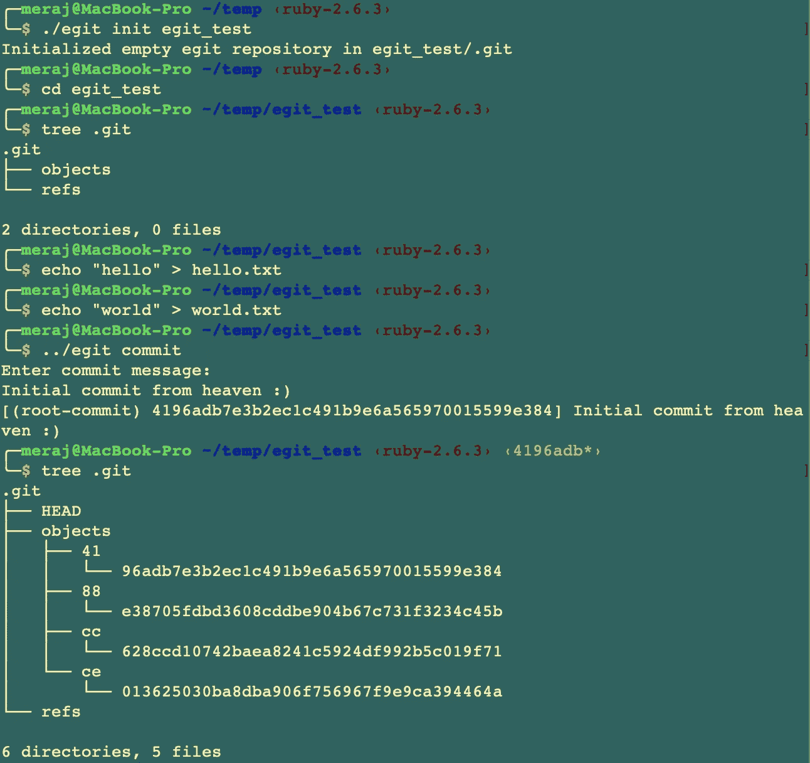
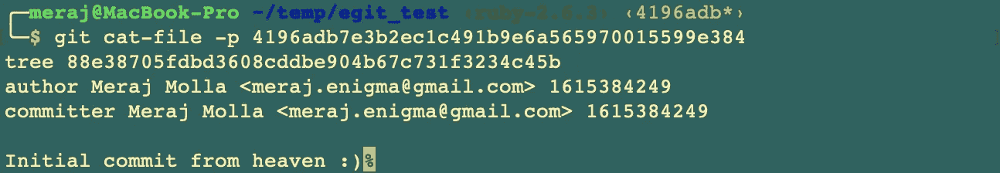
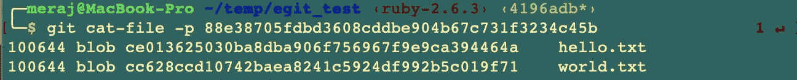
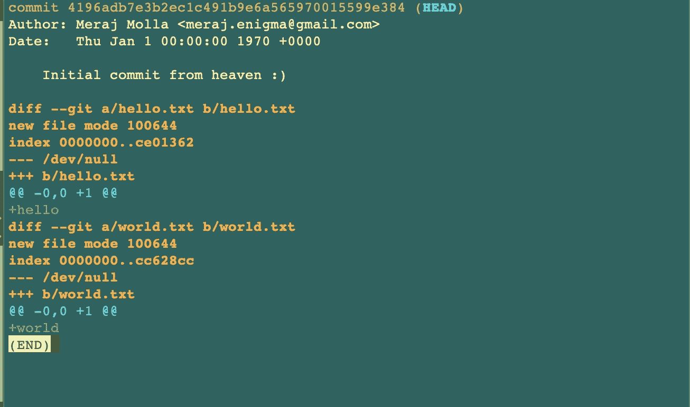

# 在 Elixir 中构建 Git 第 2 部分(存储树和初始提交)

> 原文：<https://itnext.io/building-git-in-elixir-part-2-store-trees-initial-commit-9013ed02b75a?source=collection_archive---------2----------------------->

在本系列的[上一篇文章](/building-git-in-elixir-part-1-2f2ec245df74)中，我关注于初始化存储库和存储文件内容的 blobs。在本文中，我将重点讨论存储树和首次提交。

# 一点理论

正如在[上一篇文章](/building-git-in-elixir-part-1-2f2ec245df74)中所解释的，一棵树存储了关于所存储的斑点的某些信息。它是 blobs 之上的又一层间接寻址，以便于查找。如果我们使用`git cat-file`命令检查 Git 的对象数据库，我们可以看到—



在这里，commit**88e 38705 fdbd 3608 cddbe 904 b 67 c 731 f 3234 c 45b**是一个树，我们可以看到它存储了一个条目列表。每个条目包含文件的模式(100644)、单词 **blob** 、条目的对象 ID 和文件名。

同样，git 提交存储如下—



这里，commit**6554 ab 08 c 8844 Fe 9 c 85346 a 7 F2 BF 021614 e2db 93**存储了关于指向树的指针、作者和提交者信息、时间戳和提交消息的信息。

要填充作者姓名和电子邮件，有多种方法，但通常是一个 **~/。使用的 gitconfig** 看起来像—



但是在本文中，我们将通过环境变量传递这些信息，我将在后面解释。

# 本文的重点

在本文中，重点是复制上述行为并实现—

*   **git commit** —这样它可以存储树并保存初始提交和提交消息。还有，**头的**文件在里面。git 将被更新以存储初始提交的提交 ID。

# 仙丹代码演练

本文的源代码可以从—[https://github.com/imeraj/elixir_git](https://github.com/imeraj/elixir_git)获得

特别是，这篇文章的代码可以在这个 commit 获得—

[](https://github.com/imeraj/elixir_git/commit/bba02d9ae5ac50880fb3f1fe7a1cb1eece1476f0) [## -存储树并写入提交 imeraj/elixir_git@bba02d9

### Git 版本控制系统的 Elixir 实现——imeraj/Elixir _ Git

github.com](https://github.com/imeraj/elixir_git/commit/bba02d9ae5ac50880fb3f1fe7a1cb1eece1476f0) 

它包含一个关于如何构建可执行文件和使用 **git init** 和更新的 **commit** 命令的 **README** 文件。

## 一些代码重构

由于代码库在增长，我做了一些重构，将代码中使用的不同类型从 **lib → lib/types 中移走。**新的目录结构看起来像—



除了 **BLOB、Commit** 之外，我们还可以在这里看到一些新的类型。我将在本文中解释这些。

此外，在数据库对象中编写新 blobs 的代码已被重构，如下所示，这样它可以编写任何对象，而无需知道类型

数据库. ex

## 储存树木

由于树由 blob 条目组成——每个 blob 一个条目，现在有两种新的类型— **条目**和**树**。树基本上是条目集合。

这是它们在代码中的样子—

entry.ex

tree.ex

**条目**类型非常简单，但是**树**需要一些解释。函数 **to_s()** 负责格式化条目，使其与 Git 在树中写入条目的方式完全匹配。这里—

*   **第 15–20 行** —根据名称对条目进行排序，并为每个条目准备一个包含模式(100644)、空格、条目名称、空字节和条目 oid 的字符串。
*   **第 22 行** —连接那些存储在树中的字符串

**commit.ex** 已经被重构，现在看起来如下——

提交. ex

我们现在有了新的**build _ { blob/tree/commit }**函数来构建适当的对象，这样 **database.store()** 就可以在不查看类型的情况下编写这些对象。

这里—

*   **第 18 行** —在写入每个 blob 后创建一个**条目**类型
*   **第 56–62 行** —用这些条目构建一个**树**
*   **第 28 行** —存储构建到对象数据库中的树

在这个阶段，egit 能够在对象数据库中存储 blobs 和树。

## **存储提交**

下一步是存储提交，特别是我们的第一次提交。

为了传递作者姓名和电子邮件的配置，我使用了环境变量。所以，我把下面几行放到我的 shell 中。**剖面图** —

```
export EGIT_AUTHOR_NAME=”Meraj Molla”
export EGIT_AUTHOR_EMAIL=”[meraj.enigma@gmail.com](mailto:meraj.enigma@gmail.com)”
```

当发出 commit 命令时，它读取这些变量并作为映射传递给 commit 函数—


来自 cli.ex

上面粘贴的 **commit.ex** 处理该信息以存储提交。为此，我有一个新的类型**提交**，如下 **—**

这里—

*   **第 14–23 行** —实现 **to_s()** 函数，该函数构建提交类型，使其包含五行文本——提交、作者、已提交、空行和提交消息的树信息

**提交**类型使用了一个**作者**类型，看起来像是—

这里—

*   **第 8–12 行** —实现 **to_s()** 函数，该函数格式化时间戳并以预期的方式创建一个包含作者姓名、电子邮件和时间戳的字符串。( ***注意:我在使用 Calendar/Timex 包使时区格式与 escript Elixir 应用程序一起正常工作时遇到了问题。所以时间戳格式并不完全像 Git 那样。在这个问题解决之前，我们将不得不忍受那个*** )

在我们的主 **commit.ex(粘贴在存储树部分)** —

*   **第 30-32 行** —用环境变量中传递的姓名和电子邮件以及时间戳构建**作者**类型。


*   **第 64–77 行** —从 stdin 收集提交消息(**第 65 行**)并构建**提交**类型



在这个阶段，egit 能够存储提交。我们还需要更新**。git/HEAD** 带有新提交的 ID，并向终端打印一条消息。代码位于 **commit.ex** 中，如下所示



如果一切顺利，我们应该会看到一行包含提交信息的输出(由第 45 行打印)

## **带着 egit 兜风**

到目前为止，我们已经构建了一个示例会话，如下所示



让我们检查根提交**4196 ADB 7 E3 B2 EC 1c 491 b 9 E6 a 565970015599 e384**—



这将显示上面输入的作者信息和提交消息。

让我们检查一下提交树**88e 38705 fdbd 3608 cddbe 904 b 67 c 731 f 3234 c 45b—**



并且其中一个 blob 提交了**ce 013625030 ba 8d ba 906 f 756967 f 9 e 9ca 394464 a**——


这里，我使用了 **git cat-file -p** 来分析和显示 blobs、树和提交。因为 egit 用和 git 一样的方式表示对象数据库，所以这是可能的。

在这个阶段，我们还可以运行其他 Git 命令，如 **git show** 和 **git log**



git 显示输出


git 日志输出

由于上面提到的限制，只有时间戳不匹配，但其他方面看起来都很好:)

# 结论

在本系列文章的第 2 部分中，我已经更新了 git commit 命令的初始实现，以便能够存储 git 树和保存提交。在下一篇文章中，我将在此基础上构建，这样我们就可以拥有提交历史。此外，如果文件内容没有改变，我将引入一些代码优化来避免不必要的磁盘写入。

*更多详细和深入的未来技术帖子请关注我这里或上*[*Twitter*](https://twitter.com/meraj_enigma)*。*

# 参考

1.  [https://elixir-lang.org/getting-started/introduction.html](https://elixir-lang.org/getting-started/introduction.html)
2.  【https://elixir-lang.org/docs.html 
3.  [https://git-scm.com/docs](https://git-scm.com/docs)
4.  [https://github.com/imeraj/elixir_git](https://github.com/imeraj/elixir_git)