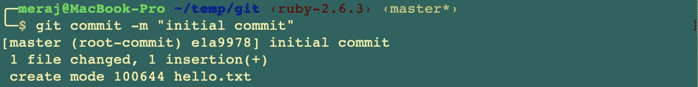
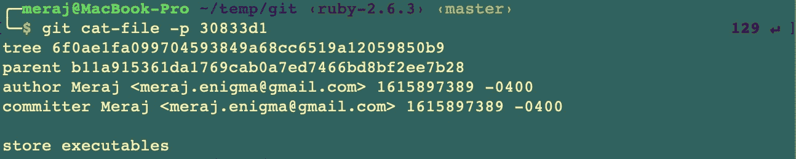
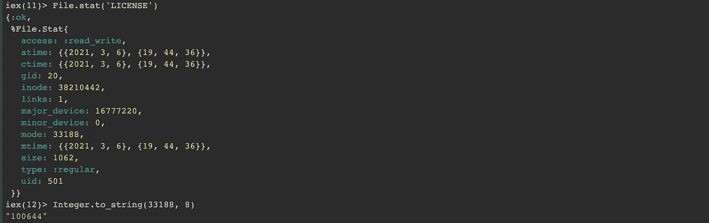
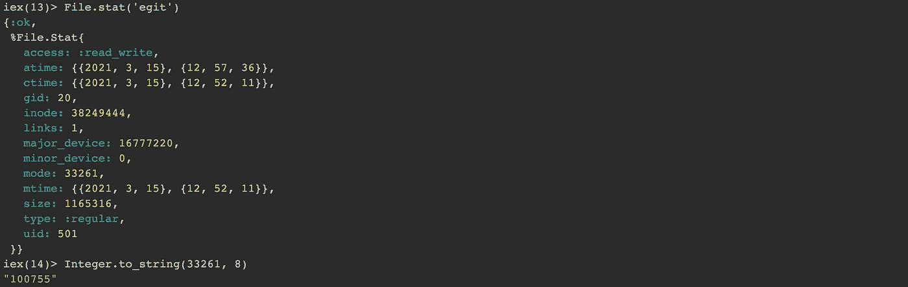
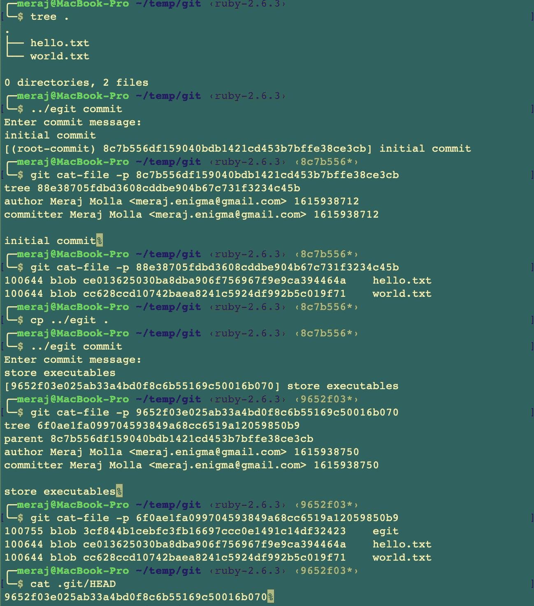
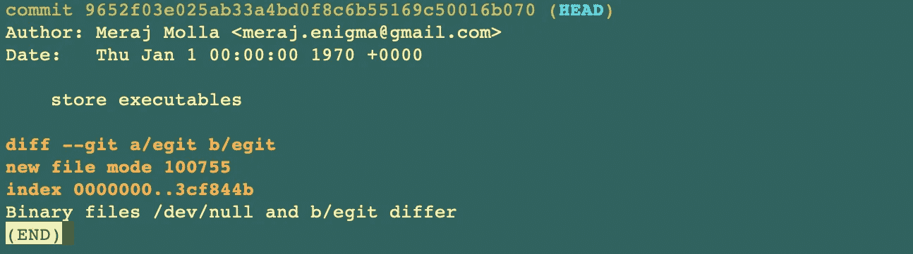

# 在 Elixir 中构建 Git 第 3 部分(创建历史和存储可执行文件)

> 原文：<https://itnext.io/building-git-in-elixir-part-3-make-history-store-executables-e7dbb39e8e47?source=collection_archive---------8----------------------->

在[的前一篇文章](/building-git-in-elixir-part-2-store-trees-initial-commit-9013ed02b75a)中，我关注于存储树和我们的第一次提交。在本文中，我将重点介绍创建提交历史和存储可执行文件。

# 一点理论

Git 通过将最新提交链接到其父提交来维护提交历史，从而构建提交历史。让我们来看看 Git 是如何做到这一点的。

当我们使用 Git 进行第一次提交时，它会输出如下内容—



这个输出告诉我们这是我们的**(根提交)**，因为这是第一次提交。如果我们检查提交 ID，我们可以看到以下详细信息—


现在，让我们进行第二次提交并检查差异—


这里我们可以看到 Git 在输出中不再说**(根提交)**。此外，如果我们检查提交 ID，我们可以看到它有一个新的**父**条目，指向上一次(在本例中是第一次提交)提交的提交 ID——


这就是 Git 维护提交历史的方式——每次进行新的提交时，都会包含上一次提交的 ID，但第一次提交除外，因为它没有上一次提交。

本文中我想关注的另一件事是 git 如何存储可执行文件。如果我们进行第三次提交并存储一个可执行文件，我们可以看到—



如果我们检查该树，我们可以看到可执行文件以模式 **100755** 存储，而不是 **100644** (常规文件)—


# 本文的重点

在本文中，重点是复制这种行为，以便 **egit commit** 可以—

*   通过链接到父提交来创建历史
*   使用正确的模式存储可执行文件

# 仙丹代码演练

这篇文章的代码可以在这里找到—[https://github.com/imeraj/elixir_git](https://github.com/imeraj/elixir_git)

存储库中的 **README** 文件包含构建 **egit** 的指令，以及如何使用 **git init** 和更新的 **git commit** 命令。

## 创造历史

此特定更改的提交链接在此—[https://github . com/imeraj/elixir _ git/commit/508 cf 2035 c 57550536 BF 1560 EC 44d 65 EB 52492 BC](https://github.com/imeraj/elixir_git/commit/508cf2035c57550536bf1560ec44d65eb52492bc)

以便创建提交历史并维护**。git/HEAD** 文件，引入了一个新的类型叫做 **Refs —**

这里—

*   **read_head** (第 22–31 行)—从读取当前提交 ID。 **git/HEAD** 并返回。如果这个文件不存在，它将返回 **nil**
*   **update_head** (第 6-20 行)——创建一个新文件**。git/HEAD.lock，**在这个文件中写入新的提交 ID，并将其重新命名为**。饭桶/人头。**这样做是为了安全更新。 **git/HEAD** 并避免并发写入。

有了这个新类型，我更新了 egit 输出和存储提交的方式。 **commit.ex** 的新变化如下所示—

这里—

*   第 11 行—从**读取当前父 ID。使用新**参考**类型的 git/HEAD**
*   第 34 行—构建新的提交对象，传递新的**父**参数
*   第 37 行—更新**。git/HEAD** 包含新的父提交 ID
*   第 39–45 行—更新来自**提交**命令的输出消息，考虑**父**是否存在或为零

更新后的**提交**类型如下所示—

这里主要是**到 _s** ()的功能发生了变化——

*   **第 14-29 行** —实现 **to_s** ()函数，该函数现在将父代存储为提交的一部分(第 17-21 行)

## 存储可执行文件

此特定更改的提交链接在此—[https://github . com/imeraj/elixir _ git/commit/ae4ed 41528 c 475525d 5978 B4 ea 996324d 16 c 62 FB](https://github.com/imeraj/elixir_git/commit/ae4ed41528c475525d5978b4ea996324d16c62fb)

接下来我想做的是将可执行文件存储在 **egit** 存储库中。到目前为止，我们已经使用模式“ **100644** ”存储了常规文件。可执行文件以“ **100755** ”模式存储。让我们来看看这些值是从哪里来的。

如果我们启动一个 **iex** 会话，并对一个常规文件执行**file . stat(<filename>)**，我们可以看到—



**File.stat()** 显示模式 **33188** 。如果我们使用 **Integer.to_string()** 将其转换为八进制，它将输出“ **100644** ”。

类似地，对于一个可执行文件(egit——它是我的 git 版本的可执行文件),我们可以看到模式 **33261** ,它转换成八进制字符串“**100755”—**



Git 以八进制存储文件模式。所以我要用同样的方法储存。

**workspace.ex** 已更新，增加了一个功能，如下所示

这里—

*   第 17–25 行—实现 **stat_file(path)** 函数，该函数返回给定路径的文件状态信息

如 **commit.ex** 的第 21 行所示(如上图所示)，每个**条目**现在都构建了一个新的 **stat** 字段—

```
%Entry{name: path, oid: blob.oid, stat: Workspace.stat_file(path)}
```

新的**条目**类型如下所示—

这里—

*   第 17–24 行—实现**可执行文件？()**给出文件模式的函数，确定是可执行文件还是普通文件。我不得不使用**逐位**模块来实现这一点，因为我没有找到任何对此的直接库调用。
*   第 13–15 行—实现 **mode()** 函数，该函数使用**可执行文件返回正确的存储模式。()**功能。

**采油树**类型已更新如下—

这里—

*   第 19 行—已更新以生成正确的模式调用 **Entry.mode()** 函数

在这个阶段，创建提交历史并将可执行文件存储在 egit 中的实现已经完成。

# 带着埃吉特去兜风

对于本演示，我已经将可执行文件 **egit** 复制到当前工作目录中，这样我就可以在 egit repo 中将它作为可执行文件提交。



正如我们可以看到的，提交消息的输出现在不同了。第二次提交不再说**(根提交)。**此外，第二提交具有指向第一**提交的树**的**父**条目。

如 **git cat-file** 命令所示，第二个提交树有一个模式为 **100755** 的 egit 条目。

**git log** 命令的输出如下所示


来自 **git show** 命令的输出现在显示 top commit 有一个二进制文件



# 结论

在本系列文章的第 3 部分中，我已经更新了 **egit commit** 命令，以创建提交历史并将可执行文件存储在 egit repo 中。还有，**。git/HEAD** 保持同步以反映最新的提交。在下一篇文章中，我将重点讨论如何存储嵌套树，以便我们能够正确地存储嵌套目录。

*更多详细和深入的未来技术帖子请关注我这里或上*[*Twitter*](https://twitter.com/meraj_enigma)*。*

# 参考

1.  【https://elixir-lang.org/getting-started/introduction.html 
2.  [https://elixir-lang.org/docs.html](https://elixir-lang.org/docs.html)
3.  [https://git-scm.com/docs](https://git-scm.com/docs)
4.  [https://github.com/imeraj/elixir_git](https://github.com/imeraj/elixir_git)