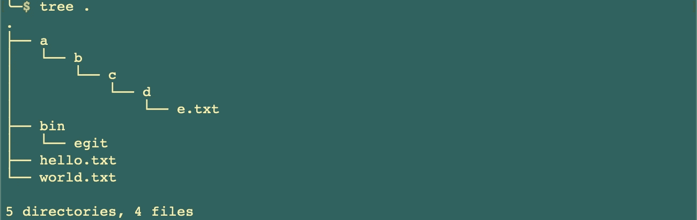
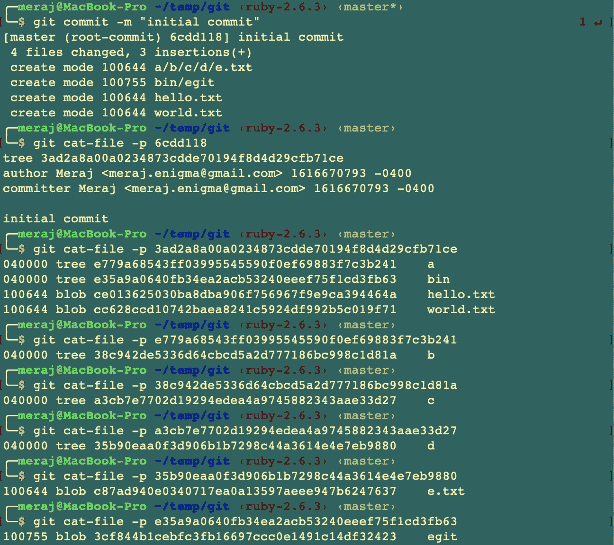
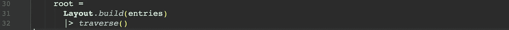
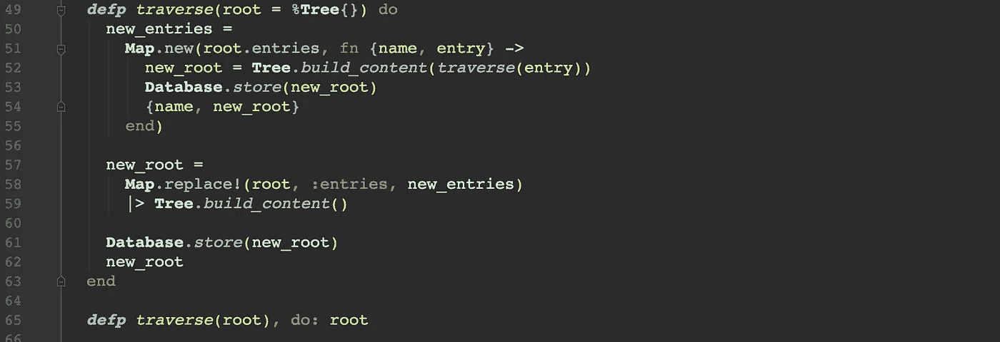
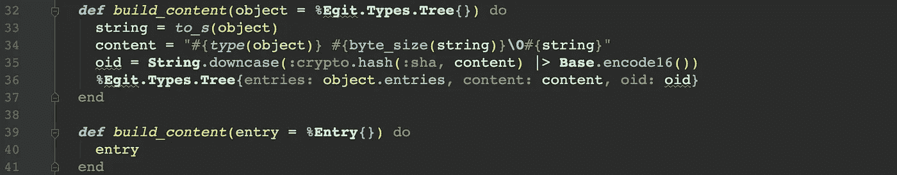
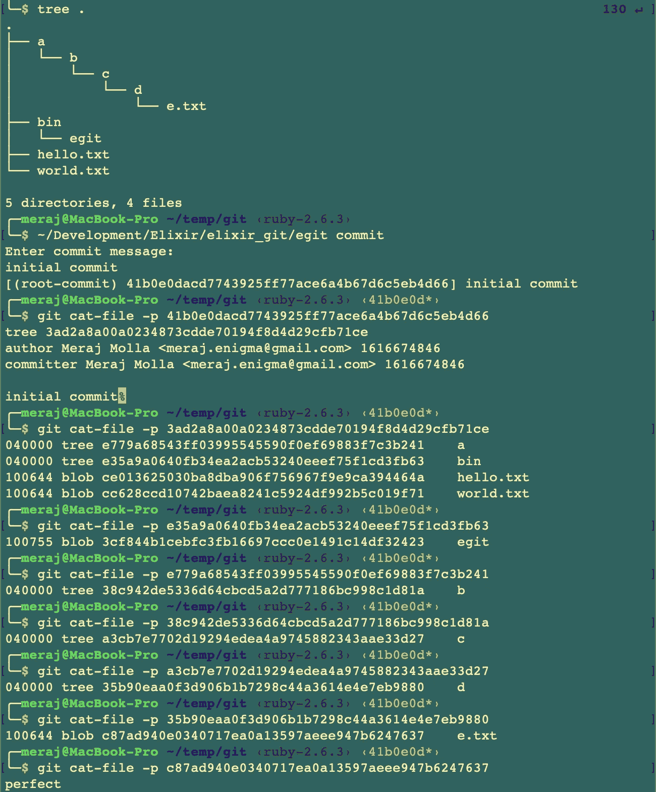
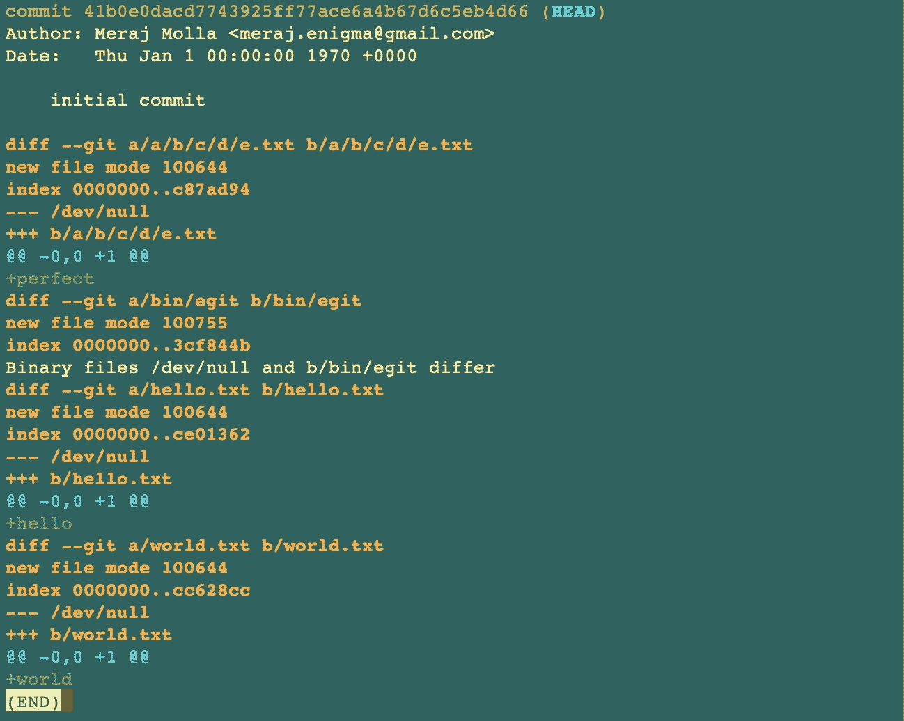

# 在 Elixir 中构建 Git 第 4 部分(将嵌套树存储为 Merkle 树)

> 原文：<https://itnext.io/building-git-in-elixir-part-4-store-nested-trees-as-merkle-tree-1a236882215a?source=collection_archive---------2----------------------->

在[上一篇文章](/building-git-in-elixir-part-3-make-history-store-executables-e7dbb39e8e47)中，我关注于创建历史并将可执行文件存储在存储库中。在本文中，我将通过将嵌套树构建为 Merkle 树来关注在存储库中存储嵌套目录[5]。

# 一点理论

Git 将嵌套目录存储为嵌套树，每棵树都是 Merkle 树。来自维基百科对 Merkle 树的定义—

> *是一棵* ***哈希树*** *或* ***Merkle 树*** *是一棵* [*树*](https://en.wikipedia.org/wiki/Tree_(data_structure)) *其中每一个* [*叶节点*](https://en.wikipedia.org/wiki/Leaf_node) *都标有一个数据块的* [*密码哈希*](https://en.wikipedia.org/wiki/Cryptographic_hash_function) *，并且散列树允许对大型* [*数据结构*](https://en.wikipedia.org/wiki/Data_structure) 的内容进行高效且安全的验证

从 Git 的角度来看，这意味着—当我们比较两个提交的两棵树时，如果两个树条目具有相同的散列 ID，我们知道它们的内容完全相同，我们可以完全跳过它们。这是一个巨大的性能胜利，而且减少了冗余数据在网络上的传输。同样的数据结构也是在**Bitcon**【6】中使用的分布式共识协议的基础。

对于本文，我们将考虑如下的目录结构—

如果我们在 Git 中提交它，并使用`git cat-file -p`命令检查提交和树，我们可以看到嵌套的树以模式 **040000 —** 存储

这里 **e.txt** 文件存储在 **a/b/c/d** 路径中，正如我们所看到的，这些目录中的每一个都被存储为一个有权限的树 **040000** 。

# 本文的重点

在本文中，重点是复制这种行为，以便 **egit commit** 可以—

*   将嵌套目录存储为嵌套树
*   每棵树都存储为 Merkle 树

# 仙丹代码演练

本文的最终代码可以在这里获得—[https://github.com/imeraj/elixir_git](https://github.com/imeraj/elixir_git)

存储库中的 **README** 文件包含构建 **egit** 的指令，以及如何使用 **git init** 和更新的 **git commit** 命令。

## **存储嵌套树**

为了支持构建嵌套树，我在**条目**类型中添加了一些助手方法，如下所示

这里—

*   **第 14–17 行—** 实现 **parent_dirs()** 函数，给定一个条目返回所有父目录。因此，如果 **entry.name** 包含“a/b/c/d/e.txt”，输出将类似于—

> iex(3)> entry . parent _ dirs(entry)
> **[" a "、" a/b "、" a/b/c "、" a/b/c/d"]**

*   **第 40–55 行—** 实现了 **descend()** 函数，其工作原理类似于 Ruby 的 [**descend()**](https://apidock.com/ruby/Pathname/descend) 方法。注意:我在 Elixir 的标准库中找不到它的实现，所以我必须创建一个。
*   **第 10 行—** 添加新的目录模式

新增的**布局**类型负责构建嵌套树和条目的布局—

这里—

*   **第 23–29 行—** 实现了 **build()** 函数，该函数构建了树和条目的完整布局。它首先按名称对作为参数给出的顶级条目进行排序，然后使用 **Enum.reduce** 从空树开始构建布局。
*   **第 8–21 行—** 为 **add_entry()** 函数实现了两个子句，一个是当 parent 为空[]时，另一个是当有 parent 时(对于嵌套目录)。在我们的示例目录结构中，一个示例调用将是—

> add_entry(["bin"]，Entry(name="bin/egit "))
> 
> add_entry([]，Entry(name="hello.txt "))
> 
> add_entry([]，Entry(name="world.txt "))
> 
> …

对 **Layout.build()** 调用的整个输出结果是—

***注*** *:我可以只存储每个条目的模式，而不是整个统计信息，以节省内存，因为我们只需要这些。可能是将来要重构的东西。*

从现在开始，我将每个条目存储为一个散列值( **"a" = > %Egit)。Types.Tree** ，我不得不更新 **Tree.to_s()** 函数来解决这个问题。此外，由于现在我需要根据条目是属于类型**条目**还是**树**来返回正确的模式， **Tree.to_s()** 已经更新，以解决如下问题—

Tree.to_s()

**commit.ex** 已更新为—

[https://github . com/imeraj/elixir _ git/blob/main/lib/commit . ex](https://github.com/imeraj/elixir_git/blob/main/lib/commit.ex)

它现在构建布局(第 31 行)并调用 **traverse()** 函数递归地遍历构建的布局。在每个步骤中，它计算每个父节点的内容和 oid，并将树存储在数据库中。 **traverse()** 函数有两个子句，如下所示

这里—

*   **第 49–63 行—** 在处理**树**时实现了第一个子句。它遍历根之前的所有叶子，并通过对它们调用 **Tree.build_content()** 函数来更新父树。在每个步骤中，在构建内容之后，它还使用 **Database.store()** 函数将树保存在数据库中。
*   **第 65 行—** 实现为**条目**执行的第二个子句，并返回该条目

**Tree.build_content()** 现在看起来如下(在以前的文章中它曾经被称为 build_tree()并驻留在 commit.ex 中)—

# 带着埃吉特去兜风

在这个阶段， **commit** 命令能够存储嵌套的树。如果我提交示例目录并检查存储的树，我们可以看到—

来自 **git 的输出显示**

# 结论

在本系列文章的第 4 部分中，我更新了 **egit commit** 命令，将嵌套子目录存储为嵌套树，其中每棵树本质上都是一棵 Merkle 树。在下一篇文章中，我将重点介绍构建索引和实现基本版本的 **Git add** 命令。

*更多详细和深入的未来技术帖子，请关注我这里或上*[*Twitter*](https://twitter.com/meraj_enigma)*。*

# 参考

1.  [https://elixir-lang.org/getting-started/introduction.html](https://elixir-lang.org/getting-started/introduction.html)
2.  [https://elixir-lang.org/docs.html](https://elixir-lang.org/docs.html)
3.  [https://git-scm.com/docs](https://git-scm.com/docs)
4.  【https://github.com/imeraj/elixir_git 
5.  [https://en.wikipedia.org/wiki/Merkle_tree](https://en.wikipedia.org/wiki/Merkle_tree)
6.  [https://en.wikipedia.org/wiki/Bitcoin](https://en.wikipedia.org/wiki/Bitcoin)