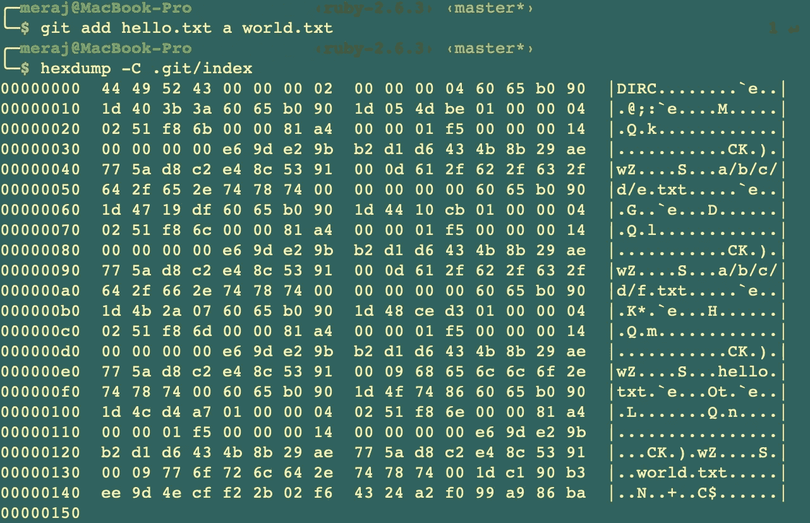
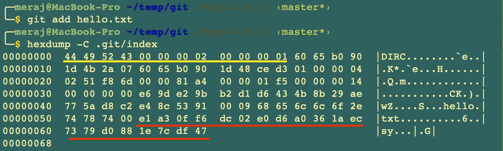
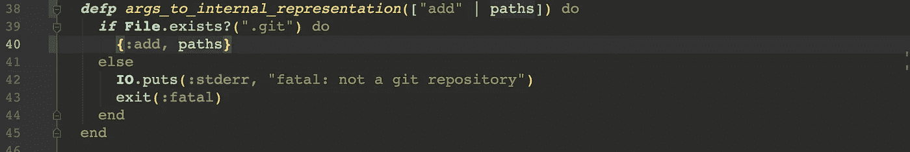
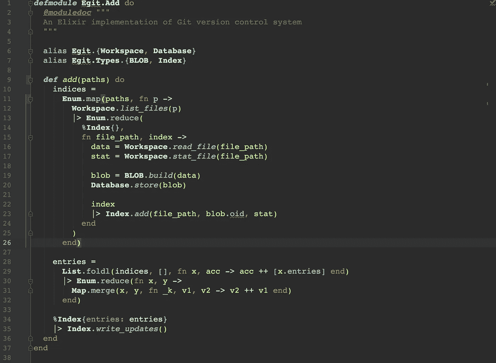
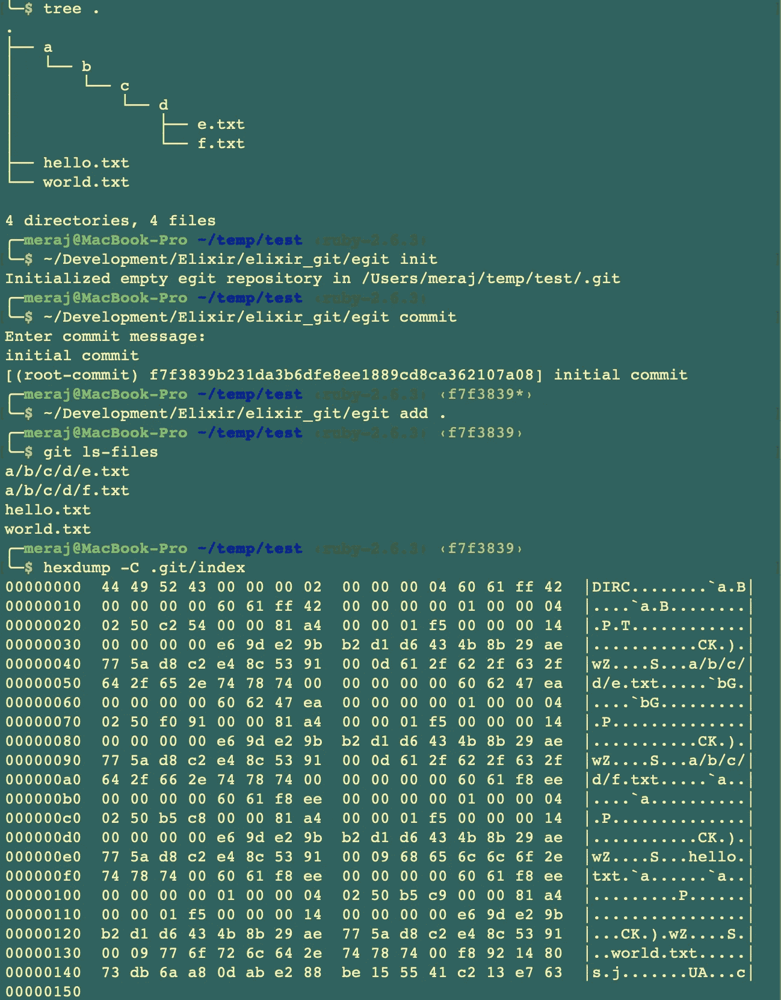

# 在 Elixir 中构建 Git 第 5 部分(构建索引)

> 原文：<https://itnext.io/building-git-in-elixir-part-5-build-index-e10098836a83?source=collection_archive---------4----------------------->

在[的前一篇文章](/building-git-in-elixir-part-4-store-nested-trees-as-merkle-tree-1a236882215a)中，我着重于将嵌套树存储为 Merkle 树，以便 **egit** 可以存储嵌套目录。在本文中，我将着重于编写构建索引，以便在后续文章中，我们可以在存储库中增量存储更改。

# 一点理论

Git 索引用于提供表示项目当前状态的所有 blobs 的缓存。Git **add** 命令使用这些信息在存储库中增量保存变更。索引文件缓存来自文件系统的大量信息，例如文件大小、最后修改时间、文件模式等，Git **add** 命令可以使用这些信息来加速操作。

在这个阶段，检查位于。 **git** 文件夹。我们的目录结构如下—

如果我们使用 **git add** 并使用 **hexdump** 命令检查索引，我们可以看到—

为了理解这种数据格式，你可以看看[5]。但简而言之，它已经—

— 12 字节报头，包含—

*   4 字节签名(“D”、“I”、“R”、“C”)
*   4 字节版本号—在这种情况下，版本是 2
*   索引中 32 位的条目数—在本例中为 4

对于每个条目，它存储通过调用 **stat()** 函数获得的 10 个 4 字节数字、出现的 blob 的 20 字节 SHA-1、2 字节标志集(包括文件名的长度)，文件名用零填充，因此总长度是 8 的倍数。

**Stat()** 存储在十个 4 字节数字中的信息是—

32 位 ctime 秒

32 位 ctime 纳秒

32 位 mtime 秒

32 位 mtime 纳秒

32 位开发

32 位 ino

32 位模式

32 位 uid

32 位 gid

32 位文件大小

索引以另一个 20 字节的 SHA-1 散列结束——这是整个索引内容本身的散列，以便 Git 可以检查索引本身的完整性。

使用 **git ls-files** 我们可以看到索引中的所有文件

对于下面的单个条目—

很容易看到第一个 12 字节的头(带下划线的黄色)，和最后一个 20 字节的 SHA-1(带下划线的红色)。其余属于 **hello.txt** 的词条。

# 本文的重点

在这篇文章中，重点是复制这种行为—

*   添加新的 **egit 添加**命令
*   该命令将建立**索引**

# 仙丹代码演练

这篇文章的最终代码可以在这里找到——[https://github.com/imeraj/elixir_git](https://github.com/imeraj/elixir_git)

存储库中的 **README** 文件包含构建 **egit** 以及如何使用 **egit add** 命令的说明。

## **构建索引& egit 添加实现**

cli.ex 现在包含一个新子句来处理 **egit add** 命令——

因为我们需要存储文件和嵌套目录的能力，所以所有的路径都作为一个列表发送给处理逻辑

为了处理新的 **egit add** 命令，有一个新的模块，看起来像

这里—

*   **第 11–26 行** —处理路径，并为每个路径调用 **Workspace.list_files()** 列出文件，将它们归入索引。所以一旦这段代码执行，我们就有了所有给定路径的索引列表
*   **第 28–32 行** —组合这些索引，并获得索引内所有条目的平面列表
*   **第 34–35 行** —将这份单一的最终索引最终写入文件

新增加的类型**索引**完成了大部分繁重的工作——

这里—

*   **第 10–13 行** —为索引创建一个条目(属于新类型 **Egit。Types.Index.Entry** 并通过添加新条目来更新索引
*   **第 107–123 行** —定义了 **to_s()** 函数，该函数按照上面理论部分的描述构建条目
*   **第 15–45 行** —定义 **write_updates()** 函数，该函数通过首先创建一个 **index.lock** 文件来获取最终索引并写入文件。写入过程分为三个函数，因此在写入每个条目后，可以更新 SHA-1 值

**finish_write()** 写入整个索引的最终散列。

一旦这些写操作完成，它会将 **index.lock** 重命名为 **index** ，这样我们就可以得到最终的索引。

# 带埃吉特去兜一圈

最后，是时候带 egit 兜一圈了。我在上面理论部分提到的相同目录结构上运行了我们新添加的 **egit add** 命令，它给出了相同的结果

# 结论

在本系列文章的第 5 部分中，我添加了 **egit add** 命令来构建**索引**，以便在后续文章中我可以在此基础上构建并支持文件的增量更新，而不是每次都使用 **egit commit** 来存储全部内容。

*更多详细和深入的未来技术帖子，请关注我这里或*[*Twitter*](https://twitter.com/meraj_enigma)*。*

# 参考

1.  [https://elixir-lang.org/getting-started/introduction.html](https://elixir-lang.org/getting-started/introduction.html)
2.  https://elixir-lang.org/docs.html
3.  【https://git-scm.com/docs 
4.  [https://github.com/imeraj/elixir_git](https://github.com/imeraj/elixir_git)
5.  [https://mincong.io/2018/04/28/git-index](https://mincong.io/2018/04/28/git-index/)