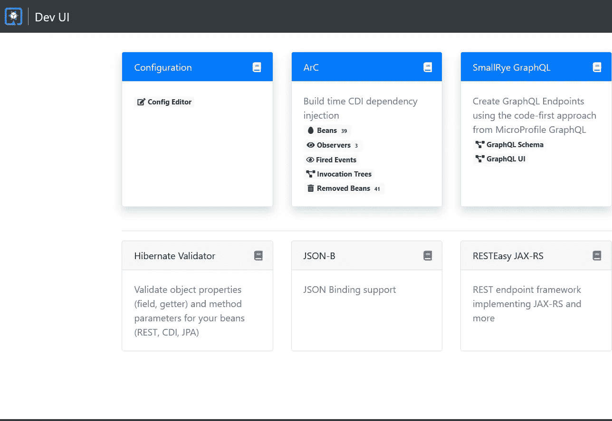
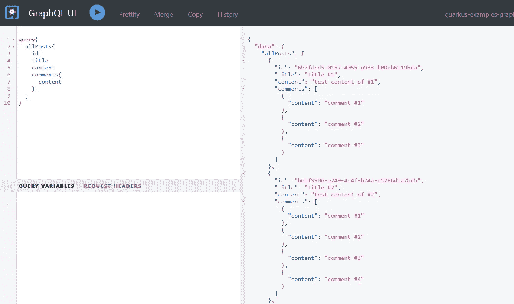
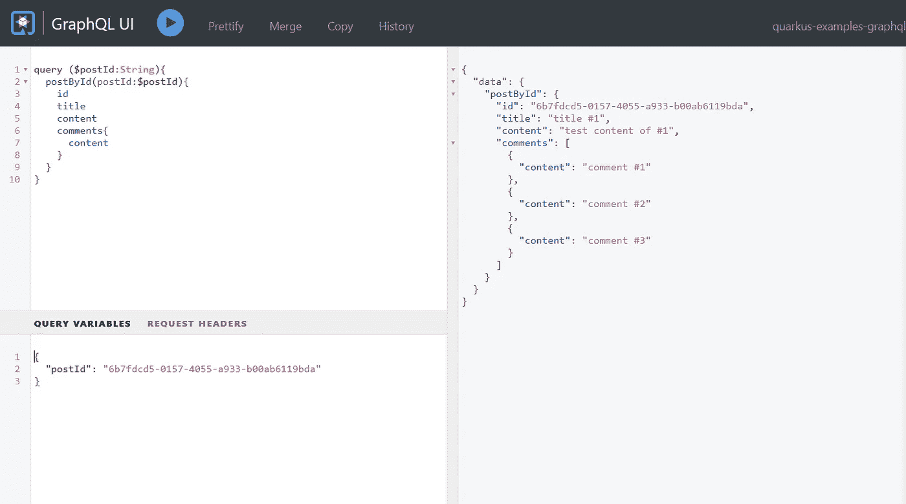
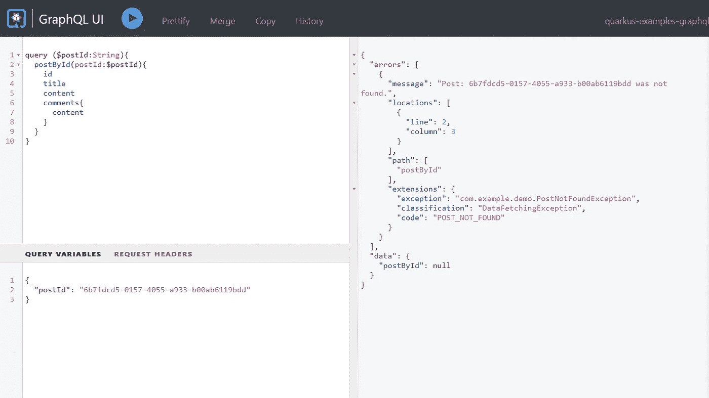
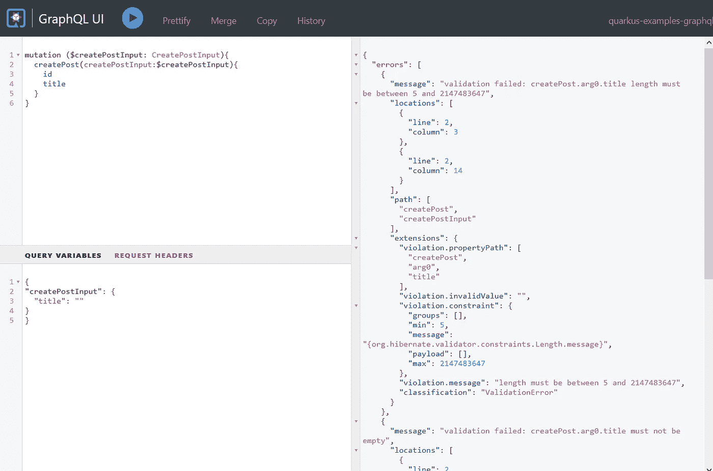

# 用 Quarkus 构建 GraphQL APIs

> 原文：<https://itnext.io/building-graphql-apis-with-quarkus-dbbf23f897df?source=collection_archive---------2----------------------->

[GraphQL](https://graphql.org/) 被用作 REST 的替代品来构建 Web APIs，并且在最近变得越来越流行。


# GraphQL 是什么？

最初的 GraphQL 协议是由脸书创建的，现在由 GraphQL 基金会维护。在 GraphQL 官方网站的主页上，GraphQL 被描述为:

> GraphQL 是一种 API 查询语言，也是一种用现有数据完成这些查询的运行时语言。GraphQL 为 API 中的数据提供了完整且易于理解的描述，使客户能够准确地要求他们需要的东西，使 API 更容易随时间发展，并支持强大的开发工具。

转到 GraphQL [代码](https://graphql.org/code)页面，它列出了当前用不同语言实现的 GraphQL 工具和库。

最新的 Quarkus 增加了一个额外的 MicroProfile GraphQL 实现(通过 SmallRye GraphQL)来取代原来的 Vertx 实现。

在本文中，我们将创建一个 Quarkus 项目，并体验这个内置的 GraphQL 特性。

# 生成项目框架

打开浏览器，导航到 [Quarkus Code](https://code.quarkus.io) 页面，将 *SmallRye GraphQL* 添加到项目依赖项中，然后点击*Generate your application*生成项目框架。下载生成的归档文件并提取光盘中的文件，然后将项目导入 IDE。

对于现有的 Quarkus 项目，打开一个终端并切换到项目根文件夹，运行以下命令添加 *SmallRye GraphQL* 扩展。

```
mvn quarkus:add-extension -Dextensions="smallrye-graphql"
```

最后，您会发现在 *pom.xml* 文件中添加了以下依赖项。

```
<dependency>
    <groupId>io.quarkus</groupId>
    <artifactId>quarkus-smallrye-graphql</artifactId>
</dependency>
```

接下来，我们来煮 GraphQL API。

类似于构建 RESTful APIs，有两个原则可以选择，**代码优先**或者**模式优先**。

SmallRye GraphQL 遵循**代码优先**原则，在运行时从代码中生成 GraphQL 模式。

# 声明 GraphQL API

创建一个类，并在该类上添加一个`@GraphQLApi`注释来声明 GraphQL API。

```
@GraphQLApi
@RequiredArgsConstructor
public class GraphQLResource {
    final PostService postService; @Query
    @Description("Get all posts")
    public List<Post> getAllPosts() {
        return this.postService.getAllPosts();
    } @Query
    @Description("Get a specific post by providing an id")
    public Optional<Post> getPostById(@Name("postId") String id) {
        return this.postService.getPostById(id);
    } @Mutation
    @Description("Create a new post")
    public Post createPost(@Valid CreatePost createPostInput) {
        return this.postService.createPost(createPostInput);
    }
}
```

在上面的代码片段中，`@RequiredArgsConstructor`是一个 [Lombok](https://projectlombok.org/) 注释(不要忘记将`org.projectlombok:lombok`添加到依赖项中)。

`PostService`是一个 CDI bean，用于处理特定的业务逻辑。

`@Query`定义了一个`query`操作，`Post`映射到一个 GraphQL *对象类型*，`@Name("postId")`定义了一个 GraphQL *参数*的名称，`@Mutation`是一个`mutation`操作，`CreatePost`映射到一个 GraphQL *输入*类型。

更多关于 GraphQL 的概念，如*查询*、*变异*、*对象类型*，以及*输入类型*，请参考 [GraphQL 学习页面](https://graphql.org/learn/)。

我们来看看`Post`、`Comment`、`CreatePost`的内容。

```
@Data
@Builder
@ToString
@Type
@NoArgsConstructor
@AllArgsConstructor
public class Post {
    @Id
    String id;
    String title;
    String content; int countOfComments; @Builder.Default
    List<Comment> comments = new ArrayList<>();
}@Data
@Builder
@Type
@NoArgsConstructor
@AllArgsConstructor
public class Comment {
    @Id
    String id;
    String content;
} @Data
@Builder
@NoArgsConstructor
@AllArgsConstructor
@Input
public class CreatePost {
    String title; String content;
}
```

注意有两个注释:`@Type`和`@Input`被添加到类中。其他注释来自龙目岛。

让我们继续学习`PostService`课程。

```
@ApplicationScoped
public class PostService { static List<Post> STORE = new ArrayList<>(); public void init(List<Post> data) {
        STORE.clear();
        STORE.addAll(data);
    } List<Post> getAllPosts() {
        return STORE;
    } Optional<Post> getPostById(String id) {
        return STORE.stream().filter(p -> p.id.equals(id)).findFirst();
    } Post createPost(CreatePost postInput) {
        var data = Post.builder().id(UUID.randomUUID().toString())
                .title(postInput.title)
                .content(postInput.content)
                .build();
        STORE.add(data);
        return data;
    }
}
```

这是一个虚拟实现，目的是消除后端数据库需求。您可以简单地用访问真实数据库的代码来替换它。

# 运行应用程序

在运行应用程序之前，让我们添加一些示例数据。创建一个 CDI bean 来观察`StartupEvent`事件，它将在应用程序已经启动时执行。

```
@ApplicationScoped
@RequiredArgsConstructor
public class DataInitializer {
    public static final Logger LOGGER = Logger.getLogger(DataInitializer.class.getName());
    //
    final PostService postService; //
    public void onStartup(@Observes StartupEvent e) { var initData = IntStream.range(1, 5).mapToObj(
                i -> {
                    var comments = IntStream.range(1, new Random().nextInt(5)+1).mapToObj(c -> Comment.builder().id(UUID.randomUUID().toString()).content("comment #" + c).build())
                            .toList();
                    var data = Post.builder().title("title #" + i)
                            .id(UUID.randomUUID().toString())
                            .content("test content of #" + i)
                            .comments(comments)
                            .build();
                    return data;
                }
        ).toList(); this.postService.init(initData); this.postService.getAllPosts()
                .forEach(p -> LOGGER.log(Level.INFO, "post data : {0}", p)); }
}
```

打开终端，运行项目根文件夹中的`mvn quarkus:dev`。

```
2021-06-01 18:10:27,726 INFO  [io.quarkus] (Quarkus Main Thread) quarkus-examples-graphql 1.0.0-SNAPSHOT on JVM (powered by Quarkus 2.0.0.CR2) started in 5.654s. Listening on: [http://l](http://l)
ocalhost:8080
2021-06-01 18:10:27,727 INFO  [io.quarkus] (Quarkus Main Thread) Profile dev activated. Live Coding activated.
2021-06-01 18:10:27,728 INFO  [io.quarkus] (Quarkus Main Thread) Installed features: [cdi, hibernate-validator, resteasy, smallrye-context-propagation, smallrye-graphql]--
Tests paused, press [r] to resume
```

应用程序启动后，打开浏览器并导航至[开发界面](http://localhost:8080/q/dev/)。



我们的应用有一个 **SmallRye GraphQL** 卡。 *GraphQL 模式*是生成的模式定义。而 *GraphQL UI* 是供开发者直接测试 GraphQL 操作的交互 UI。

点击 *GraphQL UI* 打开图形 UI 页面。

尝试执行一个 *allPosts* 查询，点击执行按钮，你会看到下面的页面。



要按 ID 获取文章，请尝试下面的查询，它需要一个额外的参数。在*查询变量*输入框中设置`postId`变量，是`JSON`格式。



如果`postId`是一个不存在的 id，它将返回一个`null`结果，如下所示。

```
{
    "data":{
    	"postById":null
	}
}
```

您可以定义一个自定义异常，并将其转换为 GraphQL 错误。

# 异常处理

创建一个`PostNotFoundException`。

```
import io.smallrye.graphql.api.ErrorCode;@ErrorCode("POST_NOT_FOUND")
public class PostNotFoundException extends RuntimeException{ public PostNotFoundException(String id) {
        super("Post: "+ id +" was not found.");
    }
}
```

并在*应用程序中添加以下配置。*

```
mp.graphql.showErrorMessage=com.example.demo.PostNotFoundException
smallrye.graphql.errorExtensionFields=exception,classification,code,description,validationErrorType,queryPath
```

再次运行应用程序，并提供一个不存在的文章 ID，然后执行查询。当您看到错误被添加到查询结果中时，它包括您在异常类中定义的代码和消息。



# 解析字段

在我们之前的例子中，一个`Post`直接包含了`comments`字段，这是一个*急切的*方法。在现实世界的应用程序中，您可能希望按需获取相关评论的数据。当在查询字符串的结果字段列表中设置了一个*评论*字段时，它可以命中后端数据库或从缓存中检索并返回指定帖子 ID 的结果。

```
@GraphQLApi
@RequiredArgsConstructor
public class GraphQLResource {
    final PostService postService; public int comments(@Source Post post) {
        return postService.commentsByPostId(post.getId());
    }
}
```

您还可以对一些*虚拟*字段应用解析规则(这里我指的是那些不存在于后端数据库中并在运行时评估的字段)，这里有一些例子:

```
// calculate the comments count of a specified post
public int countOfComments(@Source Post post) {
     return ...
}// retrieve the current user info from the GraphQL context 
// and determine if he/her has voted the current post
public boolean voted(@Source Post post, @Context context) {
     return ...
}
```

# 输入验证

您可以在输入类型上应用一些 bean 验证注释，以检查它是否满足您的要求。

```
public class CreatePost { @NotEmpty//add hibernate-validator, else bean validation dose not work.
    @Length(min = 5)
    String title; String content;
}
```

并且不要忘记在项目 deps 中添加`hibernate-validator`扩展。

```
mvn quarkus:add-extension -Dextensions="hibernate-validator"
```

运行应用程序，试一试。将*标题*留空，点击*执行*按钮，验证异常被转换为 GraphQL 错误。



在本文中，我们没有探究 GraphQL 规范中的`Subscription`类型——消息传递契约。我们将在以后的文章中讨论它。

[从我的 Github 中抓取源代码](https://github.com/hantsy/quarkus-sandbox/tree/master/graphql)。