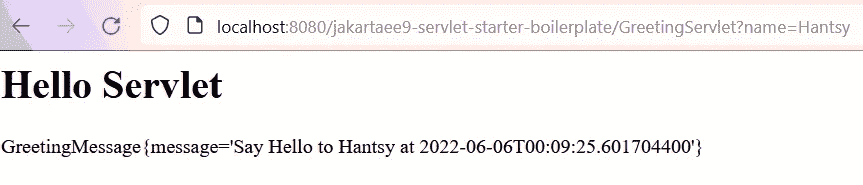
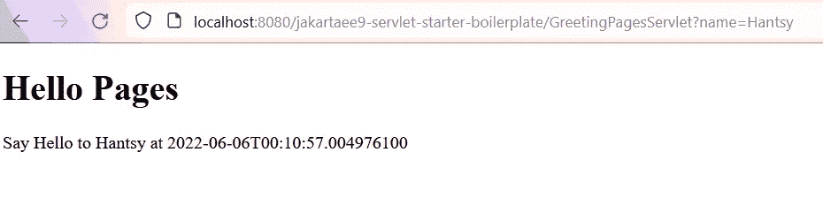
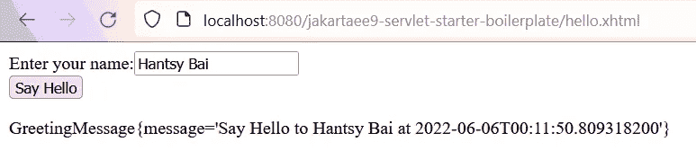
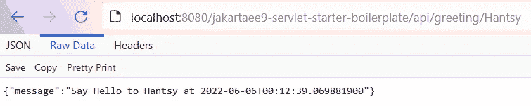

# 用 Servlet 容器构建 Jakarta EE 9 Web 应用程序

> 原文：<https://itnext.io/building-jakarta-ee-9-web-application-with-servlet-containers-b3acc50c8464?source=collection_archive---------0----------------------->


在 Jakarta EE world 中，许多 Java 开发人员构建了 Java Web 应用程序，但他们没有使用成熟的应用服务器(如 Payara、WildFly 和 WebLogic)作为生产环境，而是更喜欢部署到轻量级 Servlet 容器中并在其上运行，如 Apache Tomcat、Eclipse Jetty。

在过去的几年里，我已经准备了[jakartaee 8-starter-boilerplate](https://github.com/hantsy/jakartaee8-starter-boilerplate)和[jakartaee 9-starter-boilerplate](https://github.com/hantsy/jakartaee9-starter-boilerplate)来帮助开发人员开始一个新的 jakartaee 项目并部署到流行的应用服务器中。新创建的[jakartaee 9-servlet-starter-boilerplate](https://github.com/hantsy/jakartaee9-servlet-starter-boilerplate)项目提供了一个模板来创建 Jakarta EE web 应用程序并部署到流行的 Servlet 容器，尤其是。在这个项目中，我集成了以下流行的 Jakarta EE 组件。

*   CDI 3.0(焊接 4.0)
*   雅加达休息区 3.0(泽西岛 3.0)
*   Jakarta Server Faces 3.0(Mojarra 3.0)
*   以及上述特性的可传递依赖，包括 Jakarta EL、Jarkarta Json 处理、Jakarta Json 绑定、Jakarta 验证(Hibernate Validator)等。

现在最流行的 Servlet 容器，如 Apache Tomcat、Eclipse Jetty 等。内置了雅加达 Servlet、雅加达服务器页面、JSTL、雅加达 EL 和雅加达 WebSocket 支持。

# 先决条件

确保您已经安装了以下软件。

*   JDK 11 或 17
*   Apache Maven 3.8
*   Apache Tomcat 10.x 和 Eclipse Jetty 11.x
*   Intellij IDEA 社区版或 VSCode + Java 包

让我们探索一下[jakartaee 9-servlet-starter-boilerplate](https://github.com/hantsy/jakartaee9-servlet-starter-boilerplate)存储库中的集成特性。

# 配置

为了准备下一个 stpes 中使用的项目，克隆[jakartaee 9-servlet-starter-boilerplate](https://github.com/hantsy/jakartaee9-servlet-starter-boilerplate)存储库的源代码，或者通过 [Maven Webapp 原型](https://maven.apache.org/archetypes/maven-archetype-webapp/)创建一个新的 Maven webapp。

# 雅加达 Servlet 5.0

Apache Tomcat 和 Eclipse Jetty 在分发包中内置了 Jakarta Servlet、Jakarta Pages、Jakarta WebSocket 实现。

但是在开发阶段，您可以在项目代码中使用这些 API。

在`dependencyManagement`部分删除`jakarta.jakartaee-bom`。

```
<!-- [https://mvnrepository.com/artifact/jakarta.platform/jakarta.jakartaee-bom](https://mvnrepository.com/artifact/jakarta.platform/jakarta.jakartaee-bom) -->
<dependency>
    <groupId>jakarta.platform</groupId>
    <artifactId>jakarta.jakartaee-bom</artifactId>
    <version>9.1.0</version>
    <type>pom</type>
</dependency>
```

并在项目`dependencies`部分添加以下依赖项。

```
<dependency>
    <groupId>jakarta.servlet</groupId>
    <artifactId>jakarta.servlet-api</artifactId>
    <version>5.0.0</version>
    <scope>provided</scope>
</dependency>
<dependency>
    <groupId>jakarta.el</groupId>
    <artifactId>jakarta.el-api</artifactId>
    <version>4.0.0</version>
    <scope>provided</scope>
</dependency>
<dependency>
    <groupId>jakarta.servlet.jsp.jstl</groupId>
    <artifactId>jakarta.servlet.jsp.jstl-api</artifactId>
    <version>${jakarta.servlet.jsp.jstl.version}</version>
    <scope>provided</scope>
</dependency><dependency>
    <groupId>org.glassfish.web</groupId>
    <artifactId>jakarta.servlet.jsp.jstl</artifactId>
    <version>${jakarta.servlet.jsp.jstl.version}</version>
</dependency><dependency>
    <groupId>org.glassfish</groupId>
    <artifactId>jakarta.el</artifactId>
    <version>${jakarta.el.version}</version>
</dependency> <!-- Optional, only when <f:websocket> is used. -->
<!-- dependency>
    <groupId>org.glassfish</groupId>
    <artifactId>jakarta.json</artifactId>
    <version>${jakarta.json.version}</version>
</dependency --><dependency>
    <!-- Optional, only when <f:validateBean> or <f:validateWholeBean> is used. -->
    <groupId>org.hibernate.validator</groupId>
    <artifactId>hibernate-validator</artifactId>
    <version>${hibernate-validator.version}</version>
</dependency>
```

`jakarta.json`和`hibernate-validator`是可选的，需要时添加。

创建一个空的*src/main/WEB app/we b-INF/WEB . XML*。

```
<?xml version="1.0" encoding="UTF-8"?><web-app version="5.0"

         xmlns:xsi="http://www.w3.org/2001/XMLSchema-instance"
         xsi:schemaLocation="https://jakarta.ee/xml/ns/jakartaee https://jakarta.ee/xml/ns/jakartaee/web-app_5_0.xsd">
</web-app>
```

注意，在 Jakarta EE 9 中，XML 名称空间被更新为使用`[https://jakarta.ee/xml/ns/jakartaee](https://jakarta.ee/xml/ns/jakartaee)`。

# CDI 3.0

Weld 4.0 与 CDI 3.0 规范兼容，并且可以与 Apache Tomcat 和 Eclipse Jetty 一起工作。

添加以下依赖项。

```
<!-- Weld for CDI support -->
<dependency>
    <groupId>org.jboss.weld.servlet</groupId>
    <artifactId>weld-servlet-core</artifactId>
    <version>${weld.version}</version>
    <exclusions>
        <exclusion>
            <groupId>jakarta.el</groupId>
            <artifactId>jakarta.el-api</artifactId>
        </exclusion>
    </exclusions>
</dependency>
```

创建一个空的*src/main/WEB app/we b-INF/beans . XML*。

```
<?xml version="1.0" encoding="UTF-8"?>
<beans 
       xmlns:xsi="http://www.w3.org/2001/XMLSchema-instance"
       xsi:schemaLocation="https://jakarta.ee/xml/ns/jakartaee https://jakarta.ee/xml/ns/jakartaee/beans_3_0.xsd"
       version="3.0">
</beans>
```

通过 JNDI 查找使`BeanManager`可用。对于 Apache Tomcat，在应用程序 *context.xml* 中创建一个资源。

创建一个`src/main/webapp/META-INF/context.xml`。

```
<?xml version="1.0" encoding="UTF-8"?>
<Context path="/jakartaee9-servlet-starter-boilerplate">
    <Resource name="BeanManager"
            auth="Container"
            type="jakarta.enterprise.inject.spi.BeanManager"
            factory="org.jboss.weld.resources.ManagerObjectFactory"/>
</Context>
```

该路径是运行时的应用程序上下文路径。这里它创建了一个资源`BeanManager`。

对于 Eclipse Jetty，创建一个*src/main/WEB app/we b-INF/Jetty-env . XML*。

```
<?xml version="1.0" encoding="UTF-8"?>
<!DOCTYPE Configure PUBLIC "-//Jetty//Configure//EN" "https://www.eclipse.org/jetty/configure_10_0.dtd">
<Configure id="wac" class="org.eclipse.jetty.webapp.WebAppContext">
    <New id="BeanManager" class="org.eclipse.jetty.plus.jndi.Resource">
        <Arg>
            <Ref refid="wac"/>
        </Arg>
        <Arg>BeanManager</Arg>
        <Arg>
            <New class="javax.naming.Reference">
                <Arg>jakarta.enterprise.inject.spi.BeanManager</Arg>
                <Arg>org.jboss.weld.resources.ManagerObjectFactory</Arg>
                <Arg/>
            </New>
        </Arg>
    </New>
</Configure>
```

在 *web.xml* 中添加资源引用。

```
<resource-env-ref>
    <resource-env-ref-name>BeanManager</resource-env-ref-name>
    <resource-env-ref-type>
        jakarta.enterprise.inject.spi.BeanManager
    </resource-env-ref-type>
</resource-env-ref>
```

# 雅加达休息站(Jaxrs) 3.0

Jersey 是 Glassfish 中默认的 JAX-RS 实现，现在它是 Eclipse EE4J 项目下的一个独立项目。此外，其他流行的 JAX-RS 实现包括 Apache CXF，JBoss RestEasy 等。

在`dependencyManagement`部分增加`jersey-bom`。

```
<dependency>
    <groupId>org.glassfish.jersey</groupId>
    <artifactId>jersey-bom</artifactId>
    <version>${jersey.version}</version>
    <type>pom</type>
    <scope>import</scope>
</dependency>
```

添加下列依赖项。

```
<dependency>
    <groupId>org.glassfish.jersey.containers</groupId>
    <artifactId>jersey-container-servlet</artifactId>
</dependency>
<dependency>
    <groupId>org.glassfish.jersey.inject</groupId>
    <artifactId>jersey-hk2</artifactId>
</dependency><!-- see: [https://github.com/eclipse-ee4j/jersey/blob/3.x/examples/cdi-webapp/pom.xml#L142](https://github.com/eclipse-ee4j/jersey/blob/3.x/examples/cdi-webapp/pom.xml#L142) -->
<dependency>
    <groupId>org.glassfish.jersey.ext.cdi</groupId>
    <artifactId>jersey-cdi1x</artifactId>
</dependency>
<dependency>
    <groupId>org.glassfish.jersey.ext.cdi</groupId>
    <artifactId>jersey-cdi1x-servlet</artifactId>
</dependency>
<dependency>
    <groupId>org.glassfish.jersey.ext.cdi</groupId>
    <artifactId>jersey-cdi1x-ban-custom-hk2-binding</artifactId>
</dependency><dependency>
    <groupId>org.glassfish.jersey.media</groupId>
    <artifactId>jersey-media-json-binding</artifactId>
</dependency>
```

Jersey 3.0 仍然依赖 HK2 这个小型 IOC 容器，`jersey-media-json-binding`通过 Jakarta JSON 绑定提供 JSON searial 化和 de aria 化。

当 Servlet 容器启动时，将初始化 Jersey 支持。

类似于一般的 Jakarta EE 应用程序，添加一个简单的`Application`类来激活 Jakarta REST。

```
@ApplicationPath("/api")
public class RestActivator extends Application {
    @Override
    public Set<Class<?>> getClasses() {
        return Set.of(GreetingResource.class);
    }
}
```

# 雅加达服务器面向 4.0

Mojarra 是最流行的 JSF 实现，另一个流行的是 Apache MyFaces。

```
<!-- Jakarta Faces -->
<dependency>
    <groupId>org.glassfish</groupId>
    <artifactId>jakarta.faces</artifactId>
    <version>${jakarta.faces.version}</version>
</dependency>
```

添加一个空的*/src/main/WEB app/we b-INF/faces-config . XML*。

```
<?xml version="1.0" encoding="UTF-8"?>
<faces-config

        xmlns:xsi="http://www.w3.org/2001/XMLSchema-instance"
        xsi:schemaLocation="https://jakarta.ee/xml/ns/jakartaee https://jakarta.ee/xml/ns/jakartaee/web-facesconfig_3_0.xsd"
        version="3.0">
    <!-- Put any faces config here. -->
</faces-config>
```

自 JSF 2.3，它增加了一些 CDI 兼容的功能，如新的范围等。要启用新特性，创建一个简单的配置类来激活它。

```
@FacesConfig(version = Version.JSF_2_3)
@ApplicationScoped
public class FacesCdiActivator {
}
```

# 例子

接下来，我们来看看这些规范的一些例子。

# 雅加达 CDI 示例

下面的例子是一个简单的 CDI bean 来构建一个问候消息。

```
@ApplicationScoped
public class GreetingService {
    private static final Logger LOGGER = Logger.getLogger(GreetingService.class.getName());

    public GreetingMessage buildGreetingMessage(String name) {
        var message = GreetingMessage.of("Say Hello to " + name + " at " + LocalDateTime.now());
        LOGGER.log(Level.INFO, "build message: {0}", message);
        return message;
    }
}
```

`GreetingMessage`是一个 POJO 类。

```
@SuppressWarnings("serial")
public class GreetingMessage implements Serializable { private String message; public static GreetingMessage of(String s) {
        final var message = new GreetingMessage();
        message.setMessage(s);
        return message;
    } public String getMessage() {
        return message;
    } public void setMessage(String message) {
        this.message = message;
    }

    @Override
    public String toString() {
        return "GreetingMessage{" +
                "message='" + message + '\'' +
                '}';
    }
}
```

# 雅加达 Servlet 示例

在这个 Servlet 类中，我们注入了现有的`GreetingService`来处理消息。

```
@WebServlet(urlPatterns = "/GreetingServlet")
public class GreetingServlet extends HttpServlet {
    private static final String PAGE_HEADER = "<html><head><title>Jakarta Servlet Example</title></head><body>";
    private static final String PAGE_FOOTER = "</body></html>";

    @Inject
    private GreetingService greetingService;

    protected void doGet(HttpServletRequest req, HttpServletResponse resp) throws IOException {
        var name = req.getParameter("name");
        resp.setContentType("text/html");
        var writer = resp.getWriter();
        writer.println(PAGE_HEADER);

        // write message to http response
        writer.println("<h1> Hello Servlet </h1>");
        writer.println("<p>" + greetingService.buildGreetingMessage(name) + "</p>");

        writer.println(PAGE_FOOTER);
        writer.close();
    }

}
```

# Jakarta Servlet 和页面示例

重构上面的示例，将页面视图部分拆分成一个独立的页面文件。

```
@WebServlet(urlPatterns = "/GreetingPagesServlet")
public class GreetingPagesServlet extends HttpServlet { @Inject
    private GreetingService greetingService; protected void doGet(HttpServletRequest req, HttpServletResponse resp) throws IOException, ServletException {
        var name = req.getParameter("name");
        var message = greetingService.buildGreetingMessage(name);
        req.setAttribute("hello", message);
        req.getRequestDispatcher("/hello-pages.jspx").forward(req, resp);
    }}
```

将消息对象放入请求属性中，在页面视图中，可以从 requestScope 指令中读取它。

```
<?xml version="1.0" encoding="UTF-8" ?>
<jsp:root xmlns:jsp="http://java.sun.com/JSP/Page"

          version="2.0">
    <jsp:directive.page contentType="text/html; charset=UTF-8"
                        pageEncoding="UTF-8"
                        session="false"/>
    <jsp:output omit-xml-declaration="true"/>
    <!-- make it HTML 5 declaration compatiable -->
    <![CDATA[<!DOCTYPE html>]]>
    <html>
    <head><title>Jakarta Server Pages Example</title></head>
    <body>
        <h1>Hello Pages</h1>
        <p>${requestScope.hello.message}</p>
    </body>
    </html>
</jsp:root>
```

# 雅加达面临榜样

创建一个 Jakarta Faces 后端 bean，它是一个 CDI bean。

```
@Named
@RequestScoped
public class Hello {

    private String name;
    private GreetingMessage message;

    @Inject
    private GreetingService greetingService;

    public Hello() {
    }

    public Hello(GreetingService greetingService) {
        this.greetingService = greetingService;
    }

    public void createMessage() {
        message = greetingService.buildGreetingMessage(name);
    }

    public String getName() {
        return name;
    }

    public void setName(String name) {
        this.name = name;
    }

    public GreetingMessage getMessage() {
        return message;
    }

}
```

我们来看看 *hello.xhtml* 。

```
<!DOCTYPE html>
<html lang="en"

      xmlns:f="http://xmlns.jcp.org/jsf/core"
      xmlns:jsf="http://xmlns.jcp.org/jsf"
      xmlns:h="http://xmlns.jcp.org/jsf/html">
<f:view>
    <h:head>
        <title>Hello, World!</title>
    </h:head>
    <h:body>
        <h:form prependId="false">
            <label jsf:for="name" jsf:required="true">Enter your name:</label>
            <input type="text"
                   jsf:id="name"
                   jsf:value="#{hello.name}"
                   jsf:required="true"
                   jsf:requiredMessage="Name is required."
                   placeholder="Type your name here..."
            />
            <h:message for="name"/>
            <br/>
            <input type="submit" jsf:id="submit" value="Say Hello"  jsf:action="#{hello.createMessage()}">
                <f:ajax execute="@form" render="@form"/>
            </input>
            <br/>
            <p id="message">#{hello.message}</p>
        </h:form>
    </h:body>
</f:view>
</html>
```

# 雅加达 REST 示例

在这个例子中，我们重用了`GreetingService` bean 来处理问候消息。

```
@Path("greeting")
@RequestScoped
public class GreetingResource { @Inject
    private GreetingService greetingService; @GET
    @Path("{name}")
    @Produces(MediaType.APPLICATION_JSON)
    public Response greeting(@PathParam("name") String name) {
        return ok(this.greetingService.buildGreetingMessage(name)).build();
    }
}
```

# 部署并运行应用程序

要将应用程序部署到生产环境中，首先我们可以将构建的文件打包到一个`war`归档文件中，并将其放入 servlet 容器下的一个可部署文件夹中。然后启动 servlet 容器，war 文件将被检测并部署到 servlet 容器中。

为了简化开发阶段的部署，我们使用 maven 插件来完成这项工作。

# 部署到 Apache Tomcat

为了将应用程序部署到 Apache Tomcat 中，我们使用了`cargo-maven3-plugin`。

```
<build>
    <plugins>
        ...
        <plugin>
            <groupId>org.codehaus.cargo</groupId>
            <artifactId>cargo-maven3-plugin</artifactId>
            <configuration>
                <container>
                    <containerId>tomcat10x</containerId>
                    <artifactInstaller>
                        <groupId>org.apache.tomcat</groupId>
                        <artifactId>tomcat</artifactId>
                        <version>${tomcat.version}</version>
                    </artifactInstaller>
                </container> <configuration>
                    <properties>
                        <!-- <cargo.servlet.port>8080</cargo.servlet.port>-->
                        <cargo.logging>low</cargo.logging>
                    </properties>
                </configuration>
            </configuration>
        </plugin>
    </plugins>
</build>
```

`cargo-maven3-plugin`控制 Tomcat 生命周期的开始和停止。

运行以下命令在 Tomcat 上运行应用程序。

```
mvn clean package cargo:run
```

启动后，打开您的浏览器，检查我们上面创建的示例。

转到[http://localhost:8080/jakartaee 9-servlet-starter-boilerplate/greeting servlet？name=Hantsy](http://localhost:8080/jakartaee9-servlet-starter-boilerplate/GreetingServlet?name=Hantsy) 查看 Servlet 示例。



打开[http://localhost:8080/jakartaee 9-servlet-starter-boilerplate/greeting pagessservlet？查看 Jakarta 服务器页面的结果。](http://localhost:8080/jakartaee9-servlet-starter-boilerplate/GreetingPagesServlet?name=Hantsy)



导航到[http://localhost:8080/jakartaee 9-servlet-starter-boilerplate/hello . XHTML](http://localhost:8080/jakartaee9-servlet-starter-boilerplate/hello.xhtml)并输入姓名，点击问候语按钮，会看到如下结果。



在你的浏览器中访问[http://localhost:8080/jakartaee 9-servlet-starter-boilerplate/API/greeting/Hantsy](http://localhost:8080/jakartaee9-servlet-starter-boilerplate/api/greeting/Hantsy)或者使用`curl`命令，你会看到下面的结果。



类似地，我们也可以将 cargo 配置为使用 Eclipse Jetty 作为 servlet 容器。但是 Eclipse Jetty 提供了一个官方的 maven 插件，用于将应用程序部署到 Jetty 服务器中。

# 部署到 Eclipse Jetty

在 Jetty 11.x 中，Jetty maven 插件进行了重构，并在新的 pluign 中提供了 3 种部署模式。

*   把…嵌入
*   叉状的
*   外部的

默认模式是`EMBED`，类似于之前版本中运行最简单的`jetty:run`目标。

`FORKED`模式使用分叉线程来运行应用程序。

`EXTERNAL`模式在外部独立的 Jetty 服务器上运行应用程序。

## 部署到嵌入式 Jetty 服务器

配置 jetty maven 插件并使用嵌入模式。

```
<profile>
    <id>jetty-embed</id>
    <build>
        <plugins>
            <plugin>
                <groupId>org.eclipse.jetty</groupId>
                <artifactId>jetty-maven-plugin</artifactId>
                <configuration>
                    <deployMode>EMBED</deployMode>
                    <useProvidedScope>true</useProvidedScope>
                    <httpConnector>
                        <port>9090</port>
                    </httpConnector>
                </configuration>
            </plugin>
        </plugins>
    </build>
    <dependencies>
        <dependency>
            <groupId>org.glassfish.web</groupId>
            <artifactId>jakarta.servlet.jsp.jstl</artifactId>
            <version>${jakarta.servlet.jsp.jstl.version}</version>
            <scope>provided</scope>
        </dependency>
        <dependency>
            <groupId>org.glassfish</groupId>
            <artifactId>jakarta.json</artifactId>
            <version>${jakarta.json.version}</version>
            <scope>provided</scope>
        </dependency>
        <dependency>
            <groupId>jakarta.el</groupId>
            <artifactId>jakarta.el-api</artifactId>
            <version>4.0.0</version>
            <scope>provided</scope>
        </dependency> <dependency>
            <groupId>org.eclipse.jetty</groupId>
            <artifactId>jetty-servlet</artifactId>
            <scope>provided</scope>
        </dependency>
        <dependency>
            <groupId>org.eclipse.jetty</groupId>
            <artifactId>jetty-plus</artifactId>
            <scope>provided</scope>
        </dependency>
        <dependency>
            <groupId>org.eclipse.jetty</groupId>
            <artifactId>jetty-annotations</artifactId>
            <scope>provided</scope>
        </dependency>
        <dependency>
            <groupId>org.eclipse.jetty</groupId>
            <artifactId>jetty-webapp</artifactId>
            <scope>provided</scope>
        </dependency>
        <dependency>
            <groupId>org.eclipse.jetty</groupId>
            <artifactId>jetty-cdi</artifactId>
            <version>${jetty.version}</version>
            <scope>provided</scope>
        </dependency>
        <dependency>
            <groupId>org.slf4j</groupId>
            <artifactId>slf4j-simple</artifactId>
            <version>1.7.36</version>
        </dependency>
    </dependencies>
</profile>
```

还有`useProvidedScope`选项。当它为真时，它将把 Maven *提供的*范围的依赖项添加到容器类路径并运行应用程序，否则它将使用一个隔离的应用程序类路径来运行应用程序。

> 这里我们必须将它设置为 true，如果它是 false，我们的应用程序将无法运行。

运行以下命令将应用程序部署到嵌入式 Jetty 中。

```
mvn clean jetty:run -Pjetty-embed
```

由于容器类路径中的一些重复的工件，您将看到许多重复类的警告。

## 部署到外部 Jetty 服务器

为此创建一个新的 Maven 概要文件。

```
<profile>
    <id>jetty-external</id>
    <build>
        <plugins>
            <plugin>
                <groupId>org.eclipse.jetty</groupId>
                <artifactId>jetty-maven-plugin</artifactId>
                <configuration>
                    <deployMode>EXTERNAL</deployMode>
                    <webApp>
                        <contextPath>/${project.artifactId}</contextPath>
                    </webApp>
                    <jettyHome>${env.JETTY_HOME}</jettyHome>
                    <modules>jdni,jsp,servlet,glassfish-jstl,websocket-jakarta,cdi-decorate</modules>
                </configuration>
            </plugin>
        </plugins>
    </build>
    <dependencies>
        <dependency>
            <groupId>org.glassfish.web</groupId>
            <artifactId>jakarta.servlet.jsp.jstl</artifactId>
            <version>${jakarta.servlet.jsp.jstl.version}</version>
            <scope>provided</scope>
        </dependency>
        <dependency>
            <groupId>org.glassfish</groupId>
            <artifactId>jakarta.json</artifactId>
            <version>${jakarta.json.version}</version>
            <scope>provided</scope>
        </dependency>
        <dependency>
            <groupId>jakarta.el</groupId>
            <artifactId>jakarta.el-api</artifactId>
            <version>4.0.0</version>
            <scope>provided</scope>
        </dependency>
    </dependencies>
</profile>
```

确保您已经下载了 Eclipse Jetty 的副本，并创建一个系统环境变量`JETTY_HOME`并将其设置到 Eclipse Jetty 根文件夹的位置。

运行以下命令，将应用程序部署到独立的 Jetty 服务器中。

```
mvn clean jetty:run -Pjetty-external
```

查看来自我的 Github 的完整示例代码。