# 通过 GitHub Actions、ArgoCD 和 Reliza Hub 建设 Kubernetes CICD 管道

> 原文：<https://itnext.io/building-kubernetes-cicd-pipeline-with-github-actions-argocd-and-reliza-hub-e7120b9be870?source=collection_archive---------2----------------------->

**更新 4(2021 年 6 月):**我们现在使用 Kustomize 和 Reliza CLI 来解析每个环境的定义

**更新 3(2021 年 5 月):新增**使用 Reliza Hub 构建基于 Helm 的 CD 教程—[https://worklife notes . com/2021/05/22/Helm-CD-with-Reliza-Hub-tutorial/](https://worklifenotes.com/2021/05/22/helm-cd-with-reliza-hub-tutorial/)

**更新 2:** 如果你想实现类似的东西并获得帮助，请随时加入我们新的 DevOps & DataOps Discord 频道—[https://discord.gg/UTxjBf9juQ](https://discord.gg/UTxjBf9juQ)。我很乐意回答问题并提供帮助。

**更新 1:**Reliza Hub 中现在有一个新功能，从使用 cron 调度程序的[到按需 GitHub 操作构建](https://worklifenotes.com/2020/05/20/on-demand-builds-on-github-actions-with-reliza/)改进了这个故事。

这里我想描述一下我们是如何为一个简单的游戏项目组装 CICD 管道的。我描述的项目你可以在这里找到——这是一个黑手党或狼人游戏的洗牌应用。

# 项目构成

我们的黑手党游戏项目是完全开源的，有两个关键组件:

1.  使用 Vue.js 构建的 UI 组件—[https://github.com/taleodor/mafia-vue](https://github.com/taleodor/mafia-vue)
2.  使用 Express 构建的后端组件—[https://github.com/taleodor/mafia-express](https://github.com/taleodor/mafia-express)

# 每个组件的持续集成

我们从为每个组件构建 CI 系统开始。我对每个组件进行 CI 的理念是通过容器化——使用 Dockerfiles。

本质上，这意味着像 GitHub Actions 这样的 CI 工具只需要做 3 件事:检查代码，从 Dockerfile 构建映像，并将该映像推送到 docker registry。构建逻辑本身存储在 Dockerfile 文件中。

以我们在 UI 项目中使用的 [Dockerfile](https://github.com/taleodor/mafia-vue/blob/master/Dockerfile) 为例。它有两个阶段。在称为“构建阶段”的第一阶段，我们构建 Vue.js 项目，将其转换为静态 UI 文件；在称为“工件阶段”的第二阶段，我们使用 nginx 图像作为基础，并在上面复制我们编译的 UI 文件。

后端项目的 Dockerfile 更简单。它所做的一切—它将 Express 应用程序包装在 base Node.js 映像中。

一旦我们的 docker 文件准备好了，我们需要再做两步——首先，在 [Reliza Hub](https://relizahub.com) 上建立项目。在 Reliza Hub UI 中，我创建了一个组织“Mafia Game ”,并设置了我们的 2 个组件项目，外加一个用于部署数据的额外项目——我将在后面描述。下图显示了这一切在 Reliza Hub 中的外观:

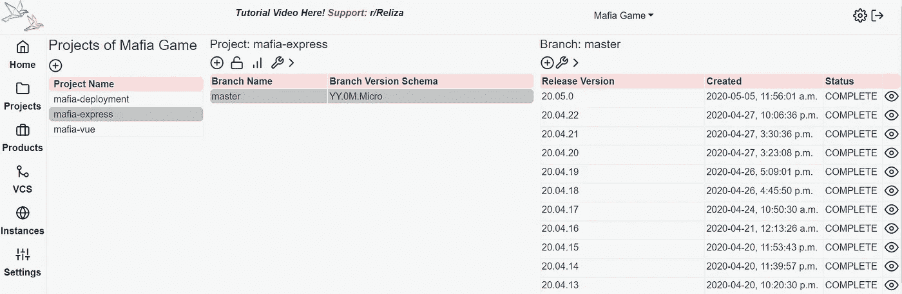

雷丽莎中心的黑手党游戏项目

我们需要做的第二步是准备 Docker 注册表。黑手党游戏项目是开源的，因此我使用 Docker Hub 上的公共图像— [taleodor/mafia-vue](https://hub.docker.com/r/taleodor/mafia-vue) 作为 UI 项目，使用 [taleodor/mafia-express](https://hub.docker.com/r/taleodor/mafia-express) 作为后端。

最后，是 GitHub 动作脚本的时候了。因为他们所做的只是构建 Docker 图像并发布它们，所以这些脚本对于后端和 UI 项目来说本质上是相同的。例如，你可以在这里找到 [UI GitHub 动作脚本](https://github.com/taleodor/mafia-vue/blob/master/.github/workflows/dockerhub.yml)。

该脚本使用了以下秘密:Docker _ log in(DOCKER 注册表上的用户登录)、DOCKER_TOKEN(来自 DOCKER 注册表的编程用户令牌)、IMAGE_NAMESPACE —这是我们的 DOCKER 图像名称空间、IMAGE_NAME —这是我们的图像名称本身、RELIZA_API_ID 和 RELIZA_API_KEY。在 GitHub 上通过我们项目的设置->秘密菜单来设置秘密，如下所示。

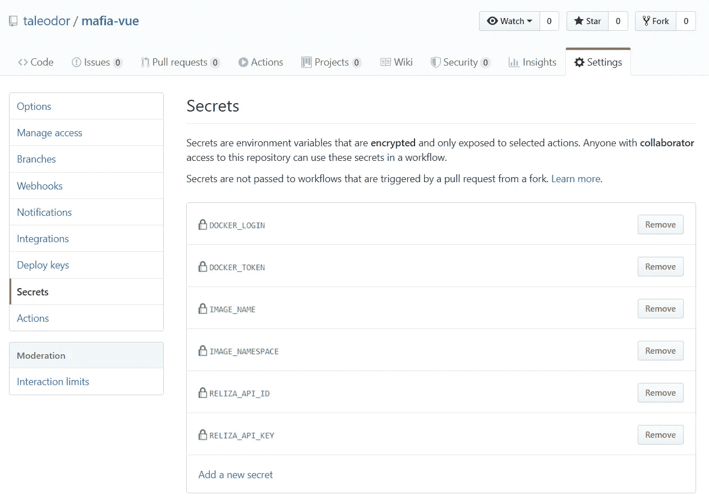

GitHub 上定义的秘密

有了我们的秘密集，我们的 [GitHub 动作工作流](https://github.com/taleodor/mafia-vue/blob/master/.github/workflows/dockerhub.yml)将执行以下操作:

1.  请致电 Reliza Hub 获取此版本的版本。通过 Reliza Hub，项目和分支版本控制是高度可配置的(关于这个过程的更多细节，请参见我的[以前的博文](https://worklifenotes.com/2020/02/27/automatic-version-increments-with-reliza-hub-2-strategies/))。
2.  构建 Docker 映像并将其推送到 Docker Hub。
3.  记录所有图像元数据并将其发送到 Reliza Hub，这样我们就有了所有构建细节的记录。Reliza Hub 中的最终发布记录如下所示:

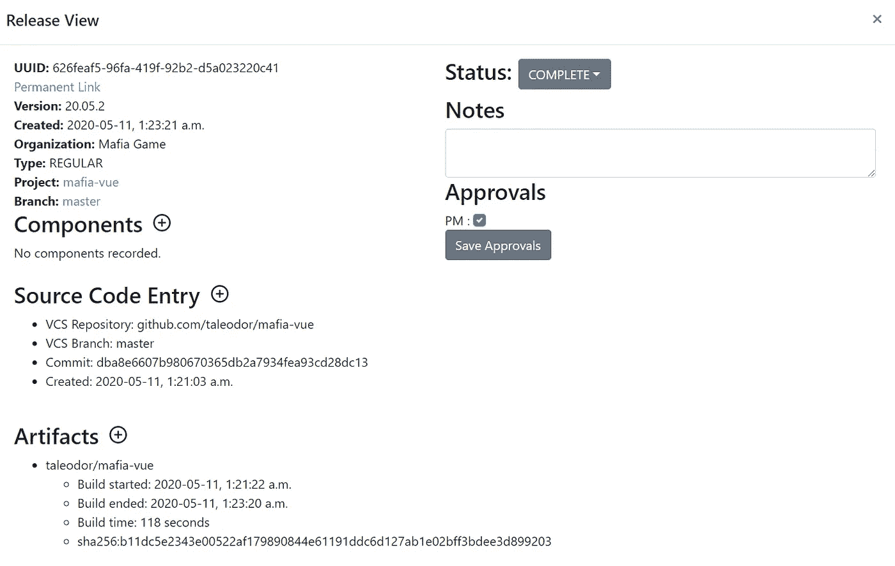

在 Reliza Hub 中发布元数据

现在，我们每个组件的 CI 流程都准备好了！每次我们将代码推送到 GitHub，GitHub Actions 脚本都会构建一个新的 Docker 映像，将其推送到 Docker Hub，并将所有相关的元数据流式传输到 Reliza Hub。

# 构建部署脚本

CI 步骤准备就绪后，是时候将我们的部署策略组合在一起了。我们首先创建一个部署 Git 项目，我在前面简单地提到过。这是 GitHub 上的这个项目。

在开始使用 Kubernetes 之前，我喜欢做的第一件事是准备基本的 docker-compose 脚本。对于黑手党游戏项目，这样的脚本可以在[这里](https://github.com/taleodor/mafia-deployment/tree/master/compose)找到。拥有 compose 文件允许进行快速的本地测试。

接下来我修改了 stack，这样它就可以在 Kubernetes 上运行了，结果文件可以在我的 [k8s 目录](https://github.com/taleodor/mafia-deployment/tree/master/k8s)中找到(注意这个目录使用了 [Kustomize 覆盖模式](https://kubectl.docs.kubernetes.io/guides/introduction/kustomize/#2-create-variants-using-overlays))。

现在，有了 docker-compose 和 Kubernetes 定义，是时候建立我们的实例了。对于这个项目，我们使用两个环境，每个环境都由自己独立的 k8s 集群组成:测试和生产。这是一个小项目，所以 2 个环境足够了。

我们通过 UI 将这些实例添加到 Reliza Hub，如下所示:

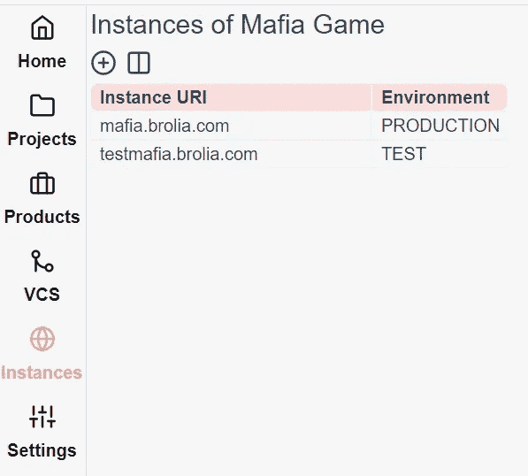

Reliza Hub 上的黑手党游戏实例

然后，在我们的部署项目中，我们为最终的 k8s 定义创建 2 个目录——每个实例一个目录。最初，两个目录都是空的。对于测试实例，我们使用 [k8s_test_gcp](https://github.com/taleodor/mafia-deployment/tree/master/k8s_test_gcp) ，对于生产实例，我们使用 [k8s_prod_gcp](https://github.com/taleodor/mafia-deployment/tree/master/k8s_prod_gcp) 。

然后，我们将 ArgoCD 指向每个实例，从其各自的目录中提取。下面我展示了来自我们测试实例的 ArgoCD 配置。

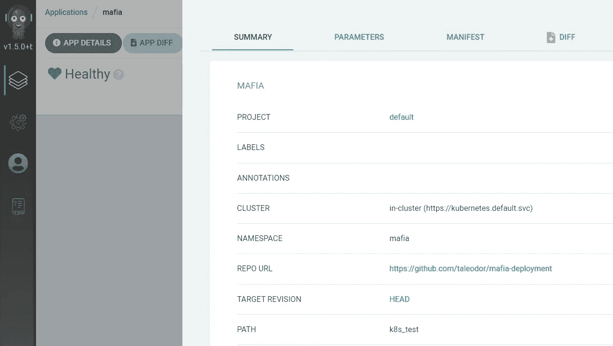

测试实例上的 ArgoCD 配置

接下来，我们希望对部署存储库本身进行版本控制。为此，我们在每次推送时都创建 GitHub Actions CI 工作流——每次推送时，它都会向 Reliza Hub 上的 mafia-deployment 项目发送发布元数据。这个项目的 GitHub 动作脚本可以在[这里](https://github.com/taleodor/mafia-deployment/blob/master/.github/workflows/reliza.yml)找到。

注意，因为这里除了源代码没有工件，我们提交工件类型作为“文件”,发送 Git SHA1 作为工件摘要。

# 将 k8s 与 Reliza 合并为最终定义

如果您还记得，我们为测试和生产实例设置了目录。然而，这些目录起初是空的。问题是我们如何用自动化的方式来填充它们？

为了解决版本问题，我们将在 Kustomize 结果上使用 Reliza Hub 功能。

但首先，让我们在 Reliza Hub 设置菜单中定义我们的批准矩阵。对于黑手党游戏，我们允许任何最新的**完成的**版本被部署来测试。但是要在生产中部署，发布将需要 PM 的批准。

这反映在如下所示的批准矩阵中:

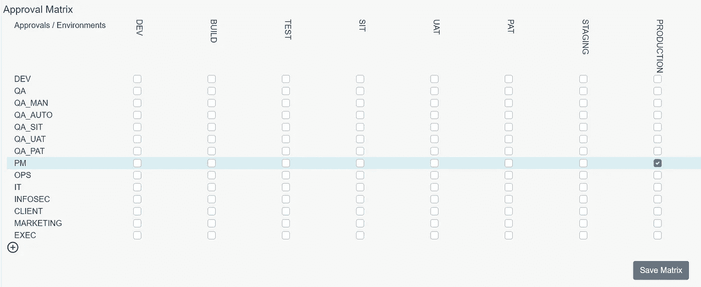

雷丽莎中心黑手党游戏的批准矩阵

此外，在 Reliza Hub UI 中，我们创建了一个名为“Mafia”的产品来跟踪我们两个微服务(后端和 UI)的版本的[的多种排列。](https://worklifenotes.com/2020/03/04/microservices-combinatorial-explosion-of-versions/)

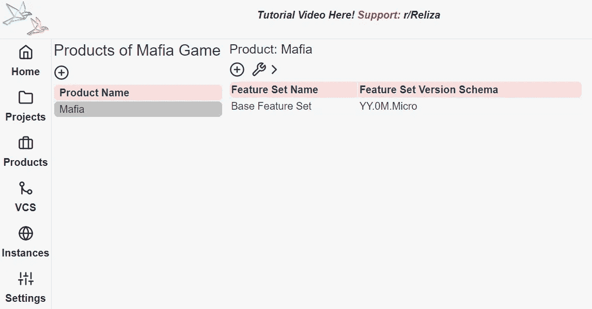

Reliza 中心的黑手党产品

下一步，我们转到 Reliza Hub UI 中的 Mafia 测试实例，并将其设置为集成 Mafia 产品。

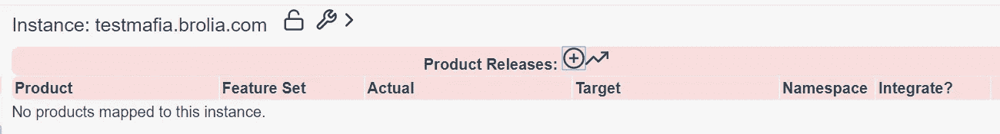

添加产品版本以测试 Mafia 实例

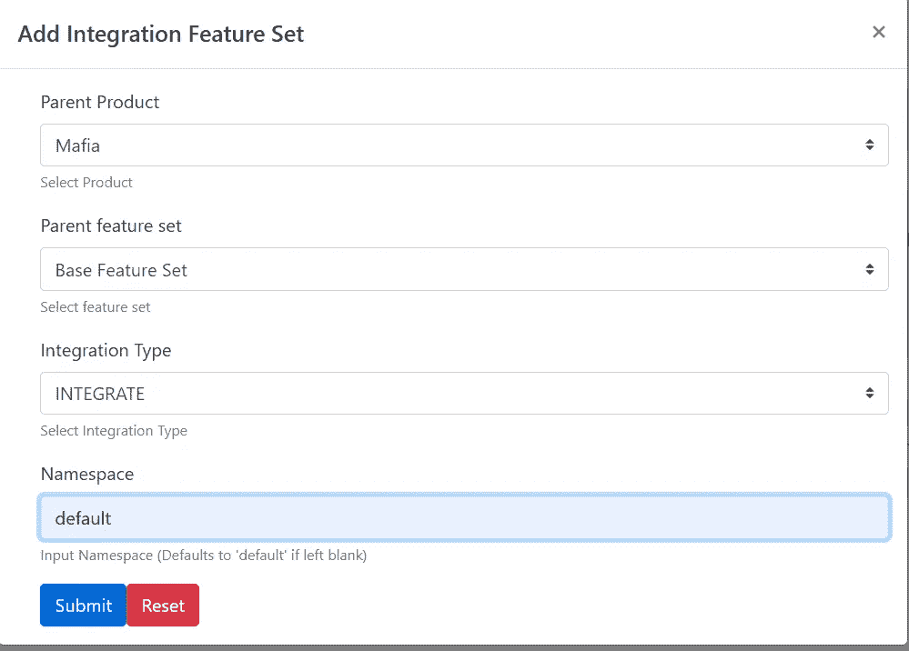

将 Mafia 产品添加到测试实例

类似地，我们将 Mafia 产品添加到生产实例中，但是这一次我们选择“FOLLOW”集成类型，而不是“INTEGRATE”。“INTEGRATE”类型意味着每次 Reliza Hub 在实例上检测到新的项目排列时，都会生成一个新的产品版本。“FOLLOW”类型意味着 Reliza Hub 将根据批准状态向实例客户端提交工件详细信息。

最后，我们利用 Reliza CLI 的 Kustomize 和 [replacetags 功能，并在 GitHub Actions](https://github.com/relizaio/reliza-cli#72-use-case-replace-tags-on-deployment-templates-to-inject-correct-artifacts-for-gitops-using-instance-and-revision) 中创建一个 [GitOps 作业。它的作用——它从 **k8s** 目录中定制定义，并将处理后的文件写入 **k8s_test_gcp** 和 **k8s_prod_gcp** 目录，其中包含来自 Reliza Hub 的各个实例的解析版本。](https://github.com/taleodor/mafia-deployment/blob/master/.github/workflows/gitopsUpdateFromReliza.yml)

具体来说，下面的 bash 代码包含了用于测试的解析逻辑:

```
# test                                 
docker run --rm -v ${PWD}/k8s:/sourcek k8s.gcr.io/kustomize/kustomize:v4.1.3 build /sourcek/overlays/test > k8s_test_gcp/kustomized_defs.yaml
docker run --rm -u root -v ${PWD}/k8s_test_gcp/kustomized_defs.yaml:/values.yaml relizaio/reliza-cli replacetags -i $RELIZA_API_ID -k $RELIZA_API_KEY --instanceuri testmafia.brolia.com --infile /values.yaml --provenance=false > k8s_test_gcp/mafia_defs.yaml
rm k8s_test_gcp/kustomized_defs.yaml
```

最后，我们通过 Reliza Hub 在 GitHub Actions 上配置按需构建，如本文中的[所述。本质上，对于来自我们前端或后端项目的任何触发器，我们将相应地触发我们的 GitOps 脚本来运行和填充 k8s 测试和 k8s 生产目录。](https://worklifenotes.com/2020/05/20/on-demand-builds-on-github-actions-with-reliza/)

# 解析来自实例的反馈以跟踪变化

最后一步——我们想知道我们的每个实例上当前部署了什么版本的软件，以及它们如何与目标版本相对应。为此，我们利用 [kubectl 命令列出已部署映像](https://worklifenotes.com/2020/01/25/kubernetes-list-all-deployed-images-with-sha256-hash/)的所有 SHA256 摘要，并将这些数据从每个实例传输到 cron 调度器上的 Reliza Hub。[在我们的部署库](https://github.com/taleodor/mafia-deployment/blob/master/send_instance_data_to_reliza.sh)中定义了一个用于传输此类数据的脚本。

类似地，我们有一个[脚本](https://github.com/taleodor/mafia-deployment/blob/master/send_argo_data_to_reliza.sh)来流传输 ArgoCD 使用的 Git 提交的 SHA1，以跟踪我们在每个实例上的部署项目的版本。

当 Reliza Hub 从实例接收这些数据时，它会根据 CI 步骤中先前保存的元数据解析 SHA256 或 SHA1 摘要。

因此，我们在 Reliza Hub 中有一张图片，显示了在我们的实例上到底部署了什么:

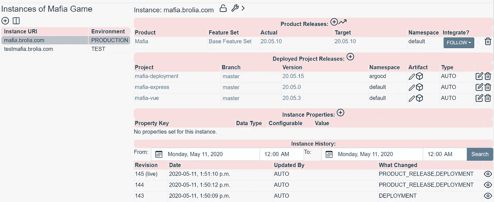

Reliza Hub 上的 Mafia 生产实例

请注意，每个修订都会被跟踪，您可以按日期搜索变更和部署。

# 批准

到目前为止，我们所取得的成果是，每一个最新完成的版本都被自动部署到我们的测试实例中。然后，测试实例将有关它的信息提交给 Reliza Hub。Reliza Hub 发布新产品。

然后，该产品由 PM 批准(记住我们上面讨论的批准矩阵):

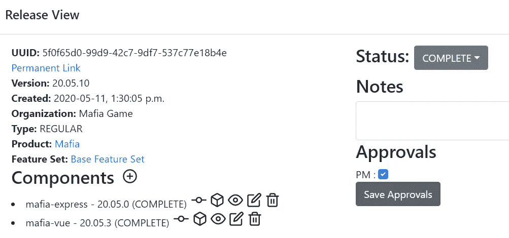

经项目经理批准后发布

一旦发布被批准，我们的生产实例将获得它，并通过 GitOps 和 ArgoCD 自动部署到生产中。请参见[我关于批准的视频](https://www.youtube.com/watch?v=PzdZjMby6Is)，了解 Reliza Hub 签署流程的更多详情。

# 我们取得了什么？

我们现在有了一个按钮式 CI/CD 管道，可以在每次推送时自动构建映像。最新完成的发布会自动部署到我们的测试实例中。从测试服务器上，Reliza Hub 记录我们产品的工作包。一旦相关方根据我们的批准矩阵批准了一个包(在上面的例子中，由 PM 批准)，它就会被部署到生产实例中。

最重要的是，每一个变化都被跟踪和搜索。可以简单地通过不认可组件来进行回滚。我们总是知道我们的应用程序的版本，追溯到它的源代码部署在我们的每个实例上。

# 有兴趣试试 Reliza Hub 吗？

Reliza Hub 正处于早期阶段，正在为所有 SaaS 版本进行公开预览/免费工作，直到 2020 年底。支持私有云或本地安装，但需要付费。

如果你有兴趣为你的项目尝试 Reliza Hub，我很乐意提供支持，并与你合作，使它成为一个成功的故事。为此，请通过[我的 LinkedIn](https://www.linkedin.com/in/pshukhman/) 或 [Twitter](https://twitter.com/taleodor) 联系我。