# 构建微前端—角度元素

> 原文：<https://itnext.io/building-micro-frontend-applications-with-angular-elements-34483da08bcb?source=collection_archive---------1----------------------->

通常，现代的单页面 web 应用程序变得越来越单一，并使用后端微服务架构。单一的应用程序将随着时间的推移而增长，由单独的团队开发，并且变得更加难以维护。这些都是将大型前端应用划分为多个微前端应用的标志。以便每个微前端应用程序可以由单独的团队开发，并且它们都集成在用户的前端。

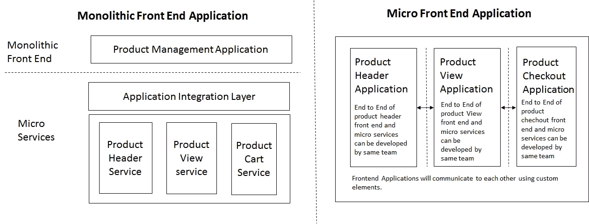

单芯片和微型前端应用的比较

## 创建角度元素

角度元素是自定义元素。他们将角度组件封装在自定义元素中，并进行自引导。角度元素可以包含在任何能够创建可重复使用的小部件/应用程序的 web 应用程序中。

产品管理原型应用程序用于使用角度元素构建微前端概念。该页面分为三个区域，每个区域将由微前端应用程序呈现，并将通过自定义元素相互通信。

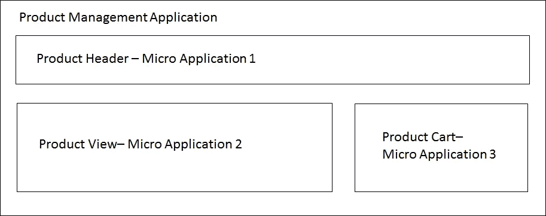

原型—产品管理

让我们以产品视图为例，用角元素创建微前端应用程序。以同样的方式为所有其他微型应用创建角度元素。本文末尾提供了示例代码和演示应用程序。

## **1。初始化项目**

ng 新产品-视图

## **2。使用正确的多边形填充设置项目**

npm 安装@ web components/自定义元素

## 3.创建一个组件

创建 ProductViewComponent 以呈现产品视图屏幕并与其他微前端应用程序通信。视图封装。Emulated 将模拟样式封装，因此 angular 将创建作用域样式，而组件样式选择器不会影响页面上的其他组件。

ng g 组件产品视图组件

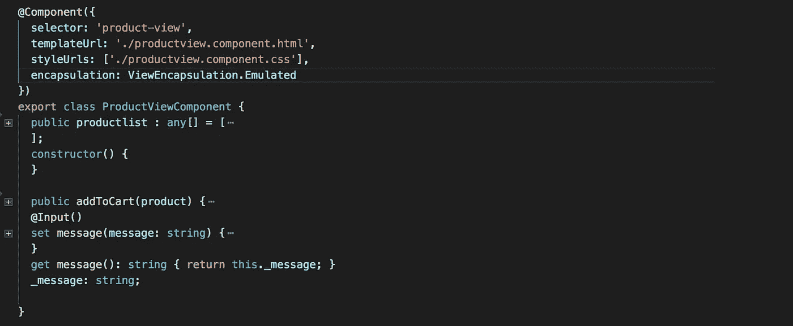

产品视图.组件. ts

## 4.注册自定义元素

[@angular/elements](http://twitter.com/angular/elements) 包提供了 createCustomElement() API 来将它的依赖项一起转换成定制元素。JavaScript 函数 customElements.define()将向浏览器注册自定义元素标记。ngDoBootstrap 方法将告诉 angular 使用这个模块进行引导。

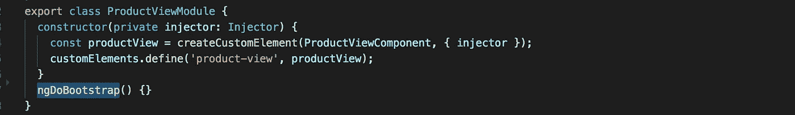

应用程序模块

## 5.微前端应用组件之间的通信

角度输入和输出将用于将数据转换为自定义元素组件。在 ProductViewComponent 中创建(product-cart)自定义元素的实例，以将产品详细信息发送到产品 cart 微前端应用程序。产品购物车组件输入法将接收产品详细信息并显示在购物车应用程序中。类似地，产品可用性的确认将从 ProductCartComponent 发送回 product-view 自定义元素。

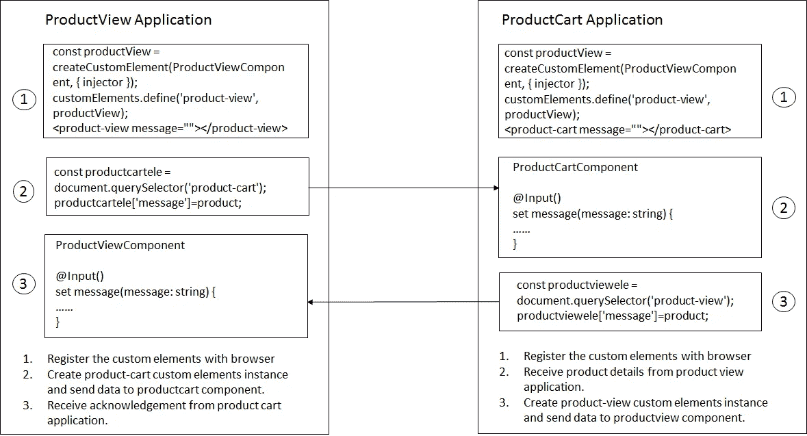

微前端应用程序之间的通信

## 构建并发布为模块

将微前端应用程序构建为可重复使用的模块/封装为类似于任何角度模块。

*   gulp-inline-ng2-template，将 HTML 和 CSS 文件转换成 JavaScript ES5/ES6 和 TypeScript 文件。
*   用于传输的 Typescript & Angular 编译器(NGC)。
*   包装用卷。

## 1.公共 API

创建一个 index.ts，以便有一个入口点来导入微应用程序的所有模块和组件。用户可以使用这些公共 API 将微应用导入到任何父应用中。

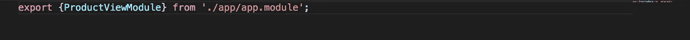

index.ts

## 3。大口配置

将所有 html 和 css 文件转换为内嵌模板，以生成有效的 ES5 文件。

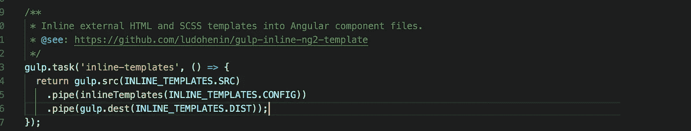

gulpfile.js

## 4.类型脚本配置

tsconfig_build.json 控制编译器选项，供 Typescript 和 NGC 用来读取 compilerOptions 和 angularCompilerOptions 属性。

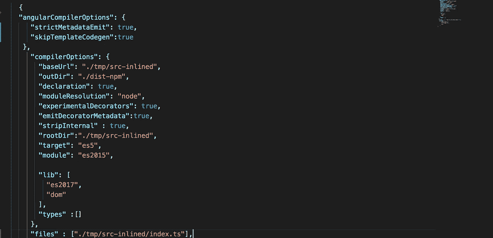

typscript_build.json

*   " strictMetadataEmit": true，Angular 编译器验证为与 AOT 兼容的包捆绑而发出的. metadata.json 文件。
*   " skipTemplateCodegen": true，编译器禁止发出 angular .ngfactory.js 和. ngstyle.js 文件。
*   “声明”:true，生成类型定义 d.ts 文件。
*   “模块”:“es2015”，使用导入/导出模块代码生成。
*   “目标”:“es2015”。代码生成到 es5。

## 5.汇总配置

卷起模块捆扎机提供类似于角模块的应用。应用程序的入口点名为 index.js，将所有编译的内容导入到一个名为 mf-pv.umd.js 的文件中

以下是汇总配置示例，

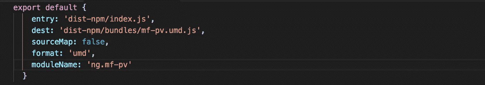

rollup .配置. js

## 6.建设

构建脚本将运行 gulp/ngc 和 rollup 任务，以在 dist-npm 目录中传输和捆绑模块。

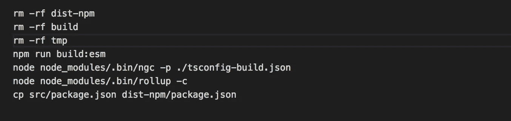

build.sh

## 7.发布到 NPM

发布 dist-npm 目录。dist-npm/package.json 将把所有细节发布给 npm。

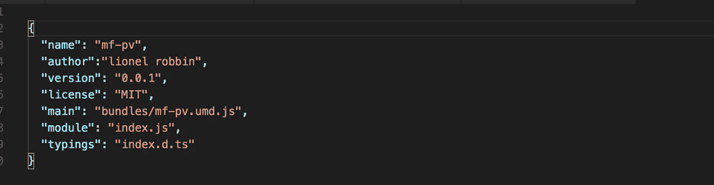

package.json

## 运行单个微前端应用程序

运行独立微前端应用程序，无需集成父应用程序和其他微应用程序。以便每个团队可以使用定义好合同开发他们的微前端应用程序，通过定制的元素属性与其他微应用程序进行通信。

在 dist/product-view 目录中构建和生成工件的命令。

*ng build-prod-output-hashing = none*

server.js 将为 dist 文件夹中的应用程序提供服务。

node server.js

浏览器将检测到 indext.html 自定义元素标签并启动应用程序。

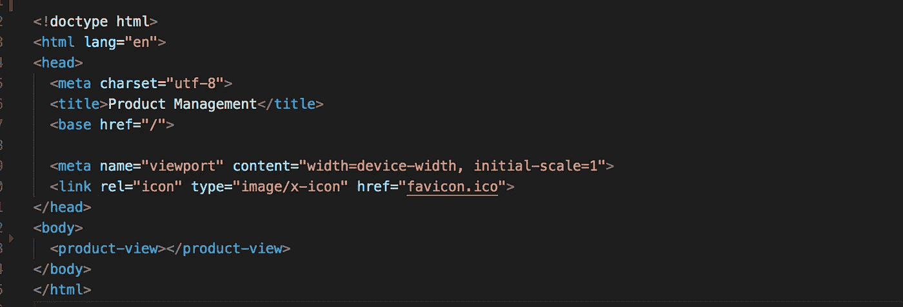

index.html

## 运行集成微前端应用

产品管理应用程序将集成所有其他三个微型应用程序，以便为最终用户呈现完整的应用程序。在产品管理应用程序中添加以下模块依赖项，以获得微前端模块。

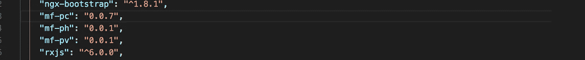

package.json

导入的微前端应用模块将在产品管理中呈现微应用。

包括定制元素标签到父应用上的适当布局中，以呈现微应用。产品视图和产品购物车微应用程序将通过消息属性相互通信。

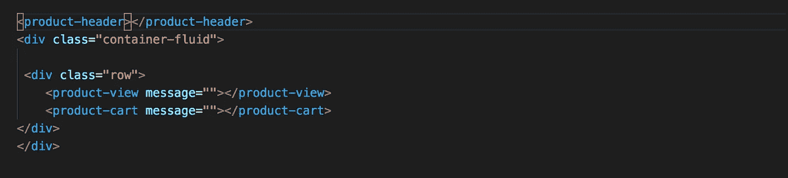

app.component.html

运行产品管理应用程序。

发球

## 完整的代码和演示应用

**产品管理(集成所有三个微前端应用)** github [代码](https://github.com/learnfrontend-dc/productmgt.git)
演示应用[链接](https://productmgt-dc.herokuapp.com/)

**产品头(微前端应用)**
github [代码](https://github.com/learnfrontend-dc/product-header.git)
演示应用[链接](https://product-header.herokuapp.com/)

**产品视图(微前端应用)**
github [代码](https://github.com/learnfrontend-dc/product-view.git)
演示应用[链接](https://product-view-dc.herokuapp.com/)

**产品购物车(微前端应用)**
github [代码](https://github.com/learnfrontend-dc/product-cart.git)
演示应用[链接](https://product-cart-dc.herokuapp.com/)

## 结论

虽然微前端提供了可维护性/技术自由和独立部署的好处，但这里有一些成功实现需要考虑的关键因素。

对应用模块逻辑中断的深入初步分析。
设计良好的接口和消息传递契约，用于微应用程序之间的通信。
每个微应用集成点的测试策略。
微应用应具有独立的功能。
沟通是将开发应用程序的团队之间的冲突降至最低的关键。

感谢你阅读这篇文章。我希望你会感兴趣。

## 参考资料:

[https://www . thoughtworks . com/radar/techniques/微前端](https://www.thoughtworks.com/radar/techniques/micro-frontends)
[https://micro-frontends.org/](https://micro-frontends.org/)
[https://developers . Google . com/web/fundamentals/we b-components/custom elements](https://developers.google.com/web/fundamentals/web-components/customelements)
[https://www.youtube.com/watch?v=vHI5C-9vH-E](https://www.youtube.com/watch?v=vHI5C-9vH-E)
[https://www . tikalk . com/posts/2017/04/23/微前端-intro/](https://www.tikalk.com/posts/2017/04/23/micro-frontends-intro/)