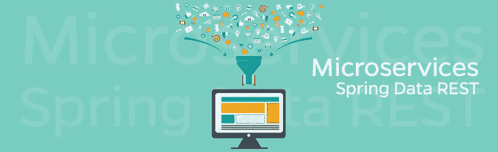
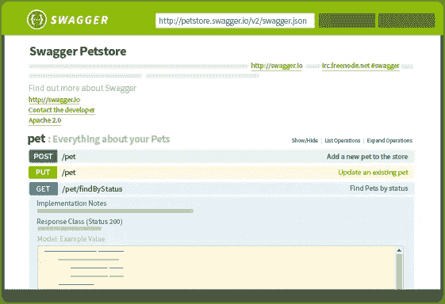
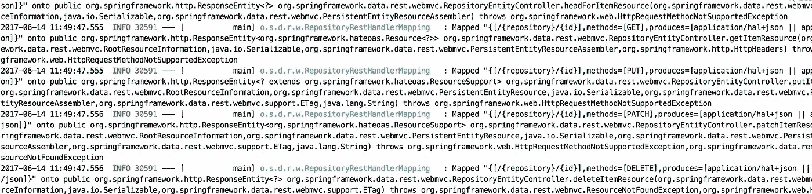
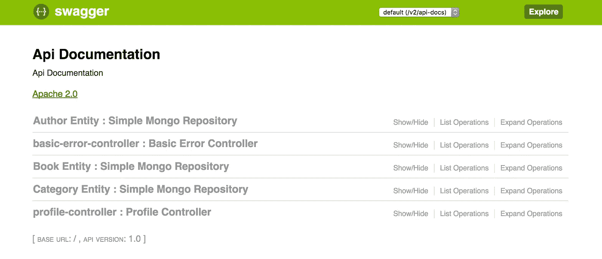
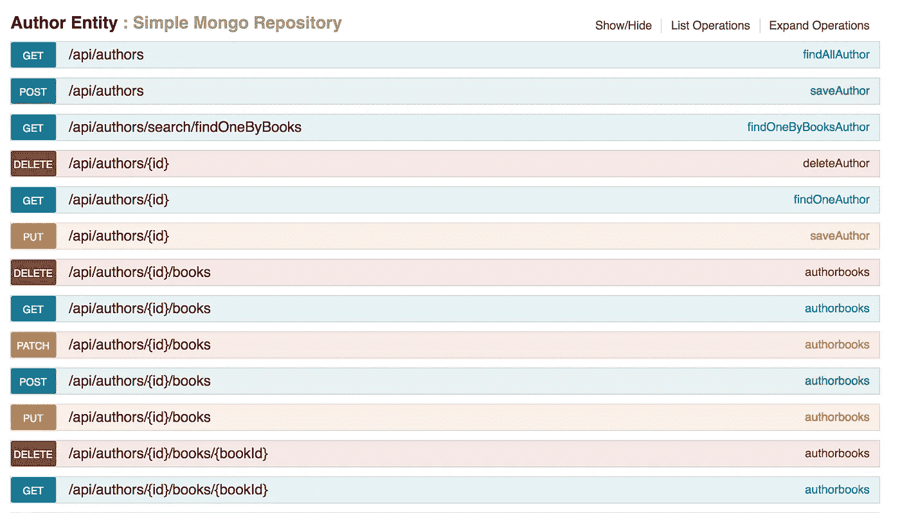
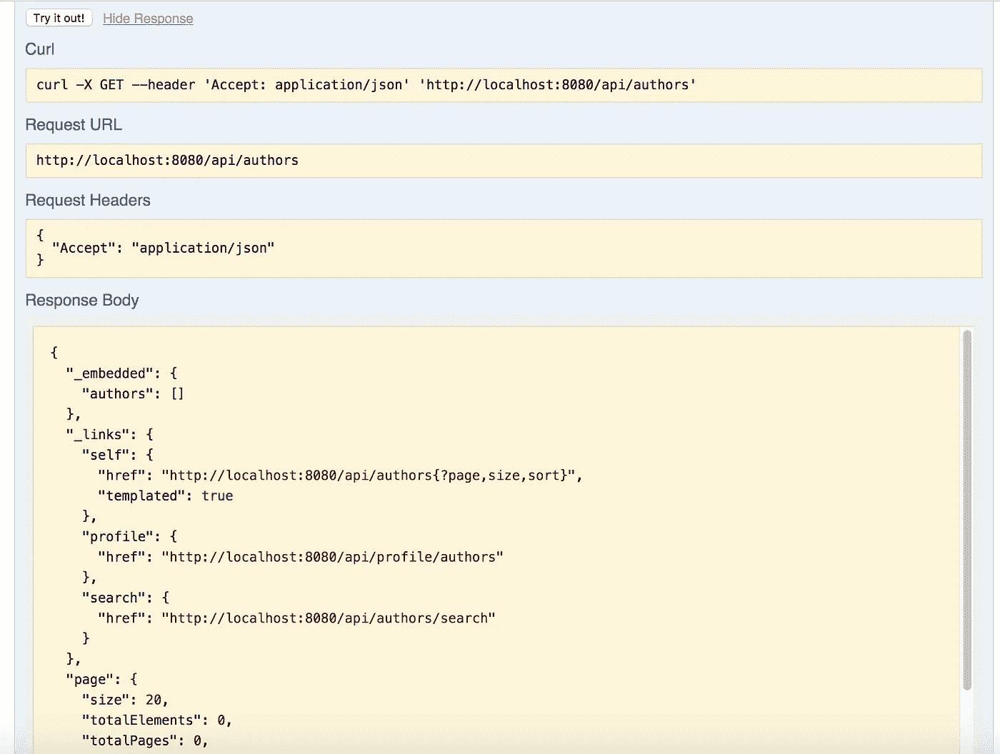

# 使用 Spring Data REST 构建微服务

> 原文：<https://itnext.io/building-microservices-with-spring-data-rest-40bb94080a9e?source=collection_archive---------1----------------------->

微服务目前得到了 IT 市场的大量关注。像优步、亚马逊、微软和网飞这样的公司正在投资将其平台从[整体架构](http://microservices.io/patterns/monolithic.html)迁移到[微服务架构](http://microservices.io/patterns/microservices.html)。为了帮助其他公司做同样的事情，大型市场参与者正在共享一套框架、文档和新技术来处理这个新市场的复杂性。其中一些公司认为有两种选择:创新或死亡。与此同时，软件社区中也有一些怀疑者，他们认为微服务并不是什么新鲜事物，它只是对 [SOA](http://www.javaworld.com/article/2071889/soa/what-is-service-oriented-architecture.html) 的重新命名。

我写这篇文章的目的是展示微服务架构模式如何让你进行更敏捷的开发。



就是这篇文章我们会用[Spring Data REST](https://docs.spring.io/spring-data/rest/docs/current/reference/html/)[Swagger 2](http://swagger.io/)[Mongo DB](https://www.mongodb.com/)和 [Maven](https://maven.apache.org/) 。如果你不知道这些技术，不要担心，我会在编码前做一个简短的介绍。

## Spring Boot

Spring Boot 使得创建独立的、生产级的基于 Spring 的应用程序变得容易，你可以“直接运行”。大多数 Spring Boot 应用需要很少的弹簧配置。

## 特征

*   创建独立的 Spring 应用程序
*   直接嵌入 Tomcat、Jetty 或 Undertow(无需部署 WAR 文件)
*   提供固执己见的“初学者”POM 来简化您的 Maven 配置
*   尽可能自动配置 Spring
*   提供生产就绪特性，如指标、运行状况检查和外部化配置
*   绝对**没有代码生成**和**不需要 XML** 配置

[参考指南](https://docs.spring.io/spring-boot/docs/current-SNAPSHOT/reference/htmlsingle)包括所有功能的详细描述。

## 弹簧数据架

Spring Data REST 构建在 Spring 数据仓库之上，分析应用程序的域模型，并为模型中包含的集合公开超媒体驱动的 HTTP 资源。

## 特征

*   展示代表你的模型的[集合、项目和关联资源](http://docs.spring.io/spring-data/rest/docs/current/reference/html/#repository-resources)。
*   通过[导航链接](http://docs.spring.io/spring-data/rest/docs/current/reference/html/#paging-and-sorting)支持分页。
*   为存储库中定义的查询方法提供专用的[搜索资源。](http://docs.spring.io/spring-data/rest/docs/current/reference/html/#repository-resources.query-method-resource)
*   允许通过操作弹簧`ApplicationEvents`将[挂钩到 REST 请求](http://docs.spring.io/spring-data/rest/docs/current/reference/html/#events)的处理中。
*   [公开关于被发现为 ALPS 和 JSON 模式的模型的元数据](http://docs.spring.io/spring-data/rest/docs/current/reference/html/#metadata)。
*   允许通过[投影](http://docs.spring.io/spring-data/rest/docs/current/reference/html/#projections-excerpts)定义客户特定的表示。
*   允许暴露默认资源的[高级定制](http://docs.spring.io/spring-data/rest/docs/current/reference/html/#customizing-sdr)。

## 霸气 2

Swagger 是面向 OpenAPI 规范(OAS)的世界上最大的 API 开发工具框架，支持从设计和文档到测试和部署的整个 API 生命周期的开发。



霸气的 UI 界面。

## Spring 数据 Mongo 数据库

Spring Data MongoDB 项目将核心的 Spring 概念应用到使用 MongoDB 文档风格数据存储的解决方案开发中。它提供了一个“模板”,作为存储和查询文档的高级抽象。您会注意到与 Spring 框架中 JDBC 支持的相似之处。

## 专家

Apache Maven 是一个软件项目管理和理解工具。基于项目对象模型(POM)的概念，Maven 可以从一个中心信息管理项目的构建、报告和文档。

# 让我们开始吧

首先，我们需要使用 [Spring Initializr](https://start.spring.io/) 创建一个 Spring Boot 应用程序。如果你对 Spring Boot 没有足够的经验，请阅读[这篇](https://spring.io/guides/gs/spring-boot/)。基本代码可以在文章末尾找到。

## **添加依赖关系**

在根文件夹中找到 pom.xml，添加 Spring Data REST、MondoDB、Swagger 2 (Jars 和 UI)和 Test 的依赖项。

```
*<!--DATA REST-->* <**dependency**>
    <**groupId**>org.springframework.boot</**groupId**>
    <**artifactId**>spring-boot-starter-data-rest</**artifactId**>
</**dependency**>

*<!--EMBED MONGO DB-->* <**dependency**>
    <**groupId**>org.springframework.boot</**groupId**>
    <**artifactId**>spring-boot-starter-data-mongodb</**artifactId**>
</**dependency**>

<**dependency**>
    <**groupId**>de.flapdoodle.embed</**groupId**>
    <**artifactId**>de.flapdoodle.embed.mongo</**artifactId**>
    <**version**>1.50.5</**version**>
</**dependency**>

*<!--DEPENDENCIES FOR SWAGGER DOCUMENTATION-->* <**dependency**>
    <**groupId**>io.springfox</**groupId**>
    <**artifactId**>springfox-data-rest</**artifactId**>
    <**version**>2.7.0</**version**>
</**dependency**>

<**dependency**>
    <**groupId**>io.springfox</**groupId**>
    <**artifactId**>springfox-swagger-ui</**artifactId**>
    <**version**>2.7.0</**version**>
</**dependency**>

<**dependency**>
    <**groupId**>io.springfox</**groupId**>
    <**artifactId**>springfox-swagger2</**artifactId**>
    <**version**>2.7.0</**version**>
    <**scope**>compile</**scope**>
</**dependency**>

*<!--TEST-->* <**dependency**>
    <**groupId**>org.springframework.boot</**groupId**>
    <**artifactId**>spring-boot-starter-test</**artifactId**>
    <**scope**>test</**scope**>
</**dependency**>
```

在这个例子中，我们使用了 embed MongoDB，因此重启服务器后，数据将会丢失。

## **设置我们的网络服务**

```
@SpringBootApplication
@EnableAutoConfiguration
@EnableSwagger2
@Import({springfox.documentation.spring.data.rest.configuration.SpringDataRestConfiguration.**class**})
**public class** SpringRestApplication {

    **public static void** main(String[] args) {
        SpringApplication.*run*(SpringRestApplication.**class**, args);
    }
}
```

*   **SpringBootApplication** :这是我们 REST 服务的标准配置。这个注释相当于使用了`@Configuration`、`@EnableAutoConfiguration`和`@ComponentScan`
*   **enable auto configuration**:允许我们的 Swagger2 和 MongoDB 依赖项进行自我配置。
*   **EnableSwagger2** :基于 Swagger2 生成 API 文档。
*   [**@导入**](http://twitter.com/Import)**({ spring fox . documentation . Spring . Data . rest . configuration . springdatarestconfiguration . class }):**将 Spring 数据 REST 配置导入到 API 文档中。

## 模型

我们有针对性的服务管理**作者**、**书籍**和**类别。**

```
@Document
**public class** Author {

    @Id
    **private** String **id**;

    **private** String **name**;

    @DBRef
    **private** List<Book> **books**;

    **public** String getId() {
        **return id**;
    }

    **public void** setId(String id) {
        **this**.**id** = id;
    }

    **public** String getName() {
        **return name**;
    }

    **public void** setName(String name) {
        **this**.**name** = name;
    }

    **public** List<Book> getBooks() {
        **return books**;
    }

    **public void** setBooks(List<Book> books) {
        **this**.**books** = books;
    }
}@Document
**public class** Book {

    @Id
    **private** String **id**;

    **private** String **name**;

    @DBRef
    **private** Category **category**;

    **private** Double **price**;

    **public** Book() {
    }

    **public** String getId() {
        **return id**;
    }

    **public void** setId(String id) {
        **this**.**id** = id;
    }

    **public** String getName() {
        **return name**;
    }

    **public void** setName(String name) {
        **this**.**name** = name;
    }

    **public** Category getCategory() {
        **return category**;
    }

    **public void** setCategory(Category category) {
        **this**.**category** = category;
    }

    **public** Double getPrice() {
        **return price**;
    }

    **public void** setPrice(Double price) {
        **this**.**price** = price;
    }
}@Document
**public class** Category {

    @Id
    **private** String **id**;

    **private** String **name**;

    **public** String getName() {
        **return name**;
    }

    **public void** setName(String name) {
        **this**.**name** = name;
    }

    **public** String getId() {
        **return id**;
    }

    **public void** setId(String id) {
        **this**.**id** = id;
    }
}
```

# 仓库资源

现在关于 Spring Data REST 的酷的部分，在用@RepositoryRestResource 注释 MongoRepositories 时，RepositoryRestHandler 将基于我们的存储库映射所有的端点，模拟一个 RestController。

## 作者知识库

这个存储库将公开 CRUD 操作。您可以在 [Spring 数据](http://projects.spring.io/spring-data/)之后添加自己的方法。

```
@RepositoryRestResource(collectionResourceRel = **"authors"**, path = **"authors"**)
**public interface** AuthorRepository **extends** MongoRepository<Author, String> {
    Author findOneByBooks(Book book);
}
```

## 图书仓库

```
@RepositoryRestResource(collectionResourceRel = **"books"**, path = **"books"**)
**public interface** BookRepository **extends** MongoRepository<Book, String> {
    List<Book> findByCategory(Category category);
}
```

## **类别仓库**

```
@RepositoryRestResource(collectionResourceRel = **"categories"**, path = **"categories"**)
**public interface** CategoryRepository **extends** MongoRepository<Category, String> {
}
```

## 设置基本路径

可以为 Data REST 服务设置一个基本路径。转到位于“src/main/resources/application . properties”的应用程序属性文件。

```
**spring.data.rest.base-path**=**/api**
```

## **上次霸气配置**

下面是一个 Swagger API 扫描的例子。

```
*/**
 * Created by rodrigo.chaves on 13/06/2017.
 */* @Configuration
**public class** SwaggerConfig {
    @Bean
    **public** Docket productApi() {
        **return new** Docket(DocumentationType.***SWAGGER_2***).select()
                .apis(RequestHandlerSelectors.*any*())
                .paths(PathSelectors.*any*())
                .build();
    }
}
```

## 让我们运行它！

我们只需要转到根文件夹，运行“mvn spring-boot:run”。



RepositoryRestHandlerMapping 正在映射和公开我们的 API。

## 来测试一下吧！

从[http://localhost:8080/Swagger-ui . html](http://localhost:8080/swagger-ui.html)打开 Swagger API 文档



Swagger 列出了 web 服务中所有可用的端点。您可以测试所有为我们自动创建的端点。我们可以看到我们的附加方法“findOneByBooks”。



## 我们来试试吧！

通过使用 swagger-ui，我们可以直接测试我们的 API。基本上，这就是我们对“api/authors”的结果。



另一个有趣的特性是所有的 API 都实现了现成的 HATEOAS(作为应用程序状态引擎的超媒体)模式！超媒体驱动的站点通过在响应中包含超媒体链接，提供动态导航站点的 [REST](https://spring.io/understanding/rest) 界面的信息。

这个例子可以在 https://github.com/LINKIT-Group/spring-data-rest[或者](https://github.com/LINKIT-Group/spring-data-rest)[这里](https://github.com/LINKIT-Group/spring-data-rest/archive/master.zip)下载