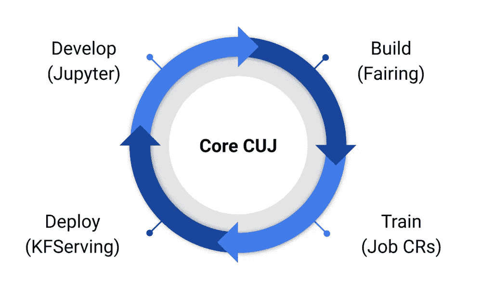
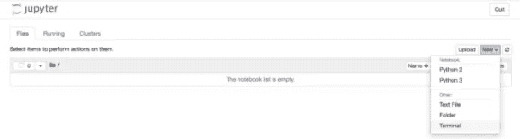
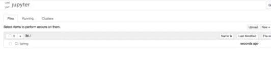

# 在 Kubernetes 上构建 ML 组件

> 原文：<https://itnext.io/building-ml-componentes-on-kubernetes-fc7e24cb9269?source=collection_archive---------2----------------------->

你好！

在 [KONA](https://kona.tech) 这里，我们建造的一切都是一个组件，这个概念改变了我们、我们的工作方式和我们的产品策略！

每当我们讨论产品特性或新产品时，我们首先会想到我们需要什么，以及我们可以从目录中重复使用哪些组件。

# 我们如何做到这一点

每个项目或功能都从 Jupyter 笔记本或直接从 python 代码开始，无论哪种方式，我们都可以将其打包成一个组件(Pod)并部署到我们的集群中进行培训和服务。

假设最复杂的场景(从 Jupyter 开始)，我们可以把笔记本放在左边，然后是整流罩、火车和服务的构建过程。



Kubeflow 整流罩简化了在 Kubernetes 中构建、培训和部署机器学习(ML)培训工作的流程。通过使用光顺并添加一些代码行，您可以直接从 Python 代码或 Jupyter 笔记本在本地或云中运行 ML 训练作业。训练工作完成后，您可以使用 kube flow strength 将训练好的模型部署为预测端点。

然后，您从一个想法开始，在笔记本电脑上进行测试，并部署到 Kubernetes 上的可扩展集群，实现自动扩展。

# 步伐

打开木星笔记本。



点击新建->终端并安装整流罩。

```
git clone [https://github.com/kubeflow/fairing](https://github.com/kubeflow/fairing)
cd fairing/examples/prediction
pip3 install -r requirements.txt
```

现在我们可以看到整流罩目录。



一些注意事项:

*   要执行小型测试，请使用笔记本电脑服务器进行训练，使用少量数据
*   当笔记本电脑准备好进行大型测试或生产时，切换到那里(在群集上)进行测试和培训

房屋预测示例:

*   在本地笔记本中训练 XGBoost 模型，
*   使用光顺远程训练模型
*   使用整流罩将训练好的模型部署到 Kubeflow

# 设置笔记本

```
!pip install --user -r requirements.txt**import** **argparse**
**import** **logging**
**import** **joblib**
**import** **sys**
**import** **pandas** **as** **pd**
**from** **sklearn.metrics** **import** mean_absolute_error
**from** **sklearn.model_selection** **import** train_test_split
**from** **sklearn.impute** **import** SimpleImputer
**from** **xgboost** **import** XGBRegressor
```

定义一个函数来分割培训文件

```
**def** read_input(file_name, test_size=0.25):
    *"""Read input data and split it into train and test."""*
    data = pd.read_csv(file_name)
    data.dropna(axis=0, subset=['SalePrice'], inplace=**True**)

    y = data.SalePrice
    X = data.drop(['SalePrice'], axis=1).select_dtypes(exclude=['object'])

    train_X, test_X, train_y, test_y = train_test_split(X.values,
                                                      y.values,
                                                      test_size=test_size,
                                                      shuffle=**False**)

    imputer = SimpleImputer()
    train_X = imputer.fit_transform(train_X)
    test_X = imputer.transform(test_X)

    **return** (train_X, train_y), (test_X, test_y)
```

定义执行培训和评估的功能

```
**def** train_model(train_X,
                train_y,
                test_X,
                test_y,
                n_estimators,
                learning_rate):
    *"""Train the model using XGBRegressor."""*
    model = XGBRegressor(n_estimators=n_estimators, learning_rate=learning_rate)

    model.fit(train_X,
            train_y,
            early_stopping_rounds=40,
            eval_set=[(test_X, test_y)])

    print("Best RMSE on eval: **%.2f** with **%d** rounds" %
               (model.best_score,
                model.best_iteration+1))
    **return** model

**def** eval_model(model, test_X, test_y):
    *"""Evaluate the model performance."""*
    predictions = model.predict(test_X)
    logging.info("mean_absolute_error=**%.2f**", mean_absolute_error(predictions, test_y))

**def** save_model(model, model_file):
    *"""Save XGBoost model for serving."""*
    joblib.dump(model, model_file)
    logging.info("Model export success: **%s**", model_file)
```

定义类别

```
**class** **HousingServe**(object):

    **def** __init__(self):
        self.train_input = "ames_dataset/train.csv"
        self.n_estimators = 50
        self.learning_rate = 0.1
        self.model_file = "trained_ames_model.dat"
        self.model = **None**

    **def** train(self):
        (train_X, train_y), (test_X, test_y) = read_input(self.train_input)
        model = train_model(train_X,
                          train_y,
                          test_X,
                          test_y,
                          self.n_estimators,
                          self.learning_rate)

        eval_model(model, test_X, test_y)
        save_model(model, self.model_file)

    **def** predict(self, X, feature_names=**None**):
        *"""Predict using the model for given ndarray."""*
        **if** **not** self.model:
            self.model = joblib.load(self.model_file)
        *# Do any preprocessing*
        prediction = self.model.predict(data=X)
        *# Do any postprocessing*
        **return** prediction
```

火车

```
HousingServe().train()
```

在这里，培训是在笔记本上进行的。

# 设置 Kubeflow 整流罩

```
**from** **kubeflow** **import** fairingFAIRING_BACKEND = 'KubeflowGKEBackend'
```

# 远程训练模型

```
**from** **kubeflow.fairing** **import** TrainJob
train_job = TrainJob(HousingServe, input_files=['ames_dataset/train.csv', "requirements.txt"],
                     docker_registry=DOCKER_REGISTRY,
                     backend=BackendClass(build_context_source=BuildContext))
train_job.submit()
```

# 部署预测模型

```
**from** **kubeflow.fairing** **import** PredictionEndpoint
endpoint = PredictionEndpoint(HousingServe, input_files=['trained_ames_model.dat', "requirements.txt"],
                              service_type='LoadBalancer',
                              docker_registry=DOCKER_REGISTRY,
                              backend=BackendClass(build_context_source=BuildContext))
endpoint.create()
```

就是这样:)

现在，您从笔记本电脑变成了运行在 Kubernetes 集群上的组件。