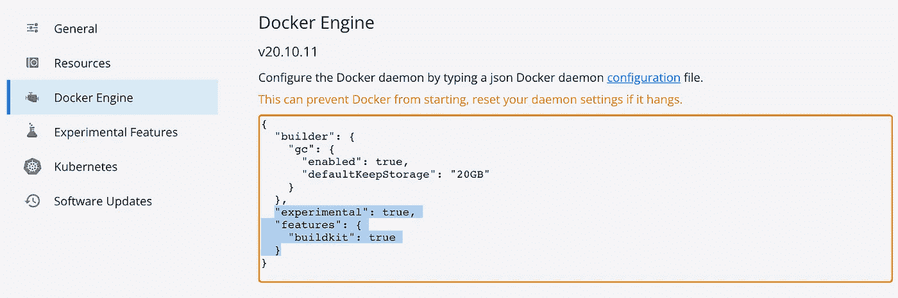
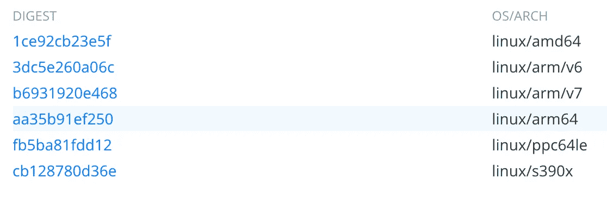

# 为 ARM 和 x86 构建多 CPU 架构 Docker 映像(1):基础知识

> 原文：<https://itnext.io/building-multi-cpu-architecture-docker-images-for-arm-and-x86-1-the-basics-2fa97869a99b?source=collection_archive---------0----------------------->


[Jason Ng](https://unsplash.com/@json_pix?utm_source=medium&utm_medium=referral) 在 [Unsplash](https://unsplash.com?utm_source=medium&utm_medium=referral) 上的照片

# 为什么？

随着苹果的 M1 机器越来越受欢迎，开发人员从用户那里收到越来越多的 ARM CPU 支持他们软件的请求。虽然 M1 版本的 docker 桌面允许用户在仿真下运行 x86 docker 映像，但将您的软件作为“通用”的多拱 docker 映像提供，可以为您的 ARM (M1)和 x86 用户提供服务，这将是一个更有效的解决方案。

我们也看到越来越多的云提供商提供基于 ARM CPU 的服务。例如，Oracle Ampere A1 Compute 声称其 ARM 实例比 AMD Milan 的[高 32%的性价比。AWS Graviton 声称，其 ARM CPU EC2 A1 实例的性价比比当前基于 x86 的同类实例高出 40%。除了节省成本，ARM-power 数据中心还能带给我们更多的节能和绿色未来。分析显示](https://blogs.oracle.com/cloud-infrastructure/post/arm-based-cloud-computing-is-the-next-big-thing-introducing-arm-on-oracle-cloud-infrastructure)[ARM 驱动的数据中心减少了 74%的二氧化碳排放量，相当于近 50 万桶石油](https://devops.com/energy-efficiency-and-the-data-center/)。因此，即使您现在没有大量的 ARM 用户，构建一个 CI 管道来发布具有 ARM CPU 支持的 docker 映像仍然是一个不错的长期投资。

# “Buildx”Docker CLI 插件和莫比“BuildKit”生成器工具包

Docker Buildx 是一个 CLI 插件，它扩展了 Docker 命令，完全支持[莫比构建工具包](https://github.com/moby/buildkit)构建工具包提供的功能。BuildKit 设计用于为多个平台构建，而不仅仅是调用构建的用户碰巧运行的架构和操作系统。这允许我们在一台机器上一次性构建多 CPU 架构 docker 映像。

在您的本地开发 PC(x86 或苹果 M1 CPU)上，访问“Buildx”和“BuildKit”的最简单方法是安装 [Docker Desktop](https://www.docker.com/products/docker-desktop) 。只要 docker 配置文件中的“experimental”&“build kit”配置选项设置为 true，您应该能够从终端访问 Buildx docker CLI 插件& buildkit，而无需任何特殊设置。



码头引擎配置

对于 CI 管道，我们可以使用安装了 buildx CLI 插件的预构建 docker 映像。要在 Docker 容器中安装 buildx CLI 插件，您只需从 Github 下载与您当前的 CPU 架构相匹配的正确版本。例如:

```
export BUILDX_ARCH="linux-amd64"
export BUILDX_VERSION="v0.6.3"mkdir -p ~/.docker/cli-plugins && \    
    wget -nv -O ~/.docker/cli-plugins/docker-buildx https://github.com/docker/buildx/releases/download/${BUILDX_VERSION}/buildx-${BUILDX_VERSION}.${BUILDX_ARCH} && \    
    chmod a+x ~/.docker/cli-plugins/docker-buildx
```

为了节省时间，也可以使用我发布的预建 docker 图片:`[data61/magda-builder-docker:latest](https://hub.docker.com/r/data61/magda-builder-docker/tags)`。

我们将在另一篇文章中讨论为 CI 管道构建多 CPU 架构 docker 映像的更多细节。

# 在本地机器上构建多 CPU 架构 Docker 映像

要为多 CPU 架构构建 Docker 映像，只需运行以下命令:

```
docker buildx build -t docker.io/xx/myimage:v1 -f [path to Dockerfile] --push --platform=linux/arm64,linux/amd64 [path to build context]
```

该命令的语法类似于单 arch 版本构建命令`[docker build](https://docs.docker.com/engine/reference/commandline/build/)`,但有几个额外的参数:

*   `--platform`:您可以以`TargetOS`(如`linux` ) / `TargetArch`(如`arm64`/`TargetVariant`(可选)的格式列出所有的目标 CPU arch(用逗号分隔)。为了支持两种 x86 64 位 CPU&ARM 64 CPU(例如苹果 M1)，您需要指定`--platform=linux/arm64,linux/amd64`。当该命令运行时，将同时构建所有指定目标平台的 docker 映像。一旦构建了所有目标的映像，所有映像将被推送到 docker 注册表，并且包含所有目标平台信息的单个清单将被保存到注册表中。这确保了正确的目标映像的映像将用于不同的平台。
*   `--push`:当您提供该参数时，构建的图像将被直接推送到远程注册表。请注意:如果您不提供该参数，docker 将不会尝试生成清单并将其推送到 docker 注册表。另一方面，本地 docker 存储库不能提供一个清单背后的多拱图像。因此，构建的结果将被简单地丢弃。除非您只想测试您的映像构建脚本，否则您可能总是希望在您的命令中包含`--push`。

```
As a "universal" multi-arch Docker image is hosted by a registry as a list of docker images for different target platforms that is served behind one single manifest. Instead of using buildx / buildkit, you can alternatively achieve the same result by:
- Build docker image for linux/arm64 on an arm machine (e.g. Apple m1) using `Docker build` and push to registry
- Build docker image for linux/amd64 on an intel CPU PC and push to registry
- Create a combined manifest: `docker manifest create my-      image:latest --amend my-image:x64 --amend my-image:arm`
- Push the new manifest to registry: `docker manifest push my-image:lates`We will not cover the details of this apporach as it's troublesome and hard to implement in CI.
```

# 为构建多 CPU 架构 Docker 映像编写 Docker 文件

因为“buildx/buildkit”将使用一个[docker 文件](https://docs.docker.com/engine/reference/builder/)同时为所有目标平台构建 docker 映像。您的 Docker 文件需要能够为所有目标平台生成正确的 Docker 映像。

即:

*   使用的基本 Docker 映像应该是一个多拱映像，并支持您选择的平台(除非您在 Docker 文件中采用多阶段构建方法)
*   用于构建 Docker 映像的所有脚本都应该编译/安装与容器中的目标平台相匹配的软件。

为了确保基本映像支持您计划构建的所有 CPU 架构，您可以检查 [Docker Hub](https://hub.docker.com/) 上的映像操作系统/ARCH 信息面板，如果它发布在 Docker Hub 上的话。



Docker Hub OS/Arch 信息面板

或者，您可以使用`[docker manifest inspect](https://docs.docker.com/engine/reference/commandline/manifest_inspect/)`命令直接检查基本映像清单。例如:

```
docker manifest inspect docker.io/alpine:3.15
```

在选择了合适的基础映像之后，我们还需要确保我们的构建脚本安装/编译软件适合当前构建的目标平台。如果您使用操作系统附带的软件包管理器，这通常不是问题。例如`[apk](https://docs.alpinelinux.org/user-handbook/0.1a/Working/apk.html)` `[yum](https://linux.die.net/man/8/yum)`或`[apt](https://ubuntu.com/server/docs/package-management)`。因为它们会自动为您当前的平台安装正确的版本。但如果需要手动安装软件，就需要找出当前的构建平台(即 OS & CPU arch)。

这可以通过[docker 在使用“buildkit”后端构建时自动设置的平台参数列表](https://docs.docker.com/engine/reference/builder/#automatic-platform-args-in-the-global-scope)来实现。它们是:

*   `TARGETOS`:目标平台操作系统。例如`linux`
*   `TARGETARCH`:目标平台 CPU 架构。例如`arm64`
*   `TARGETVARIANT`:目标平台 CPU 架构变体。例如`v8`

请注意:这些参数是在全局范围内定义的，因此在构建阶段或运行命令中不会自动提供。要在构建阶段公开这些参数之一，请将其重新定义为不带值。例如:

```
FROM alpine:3.15ARG TARGETOS
ARG TARGETARCHRUN echo "I'm building for $TARGETOS/$TARGETARCH"
```

使用`TARGETOS` & `TARGETARCH` ARG 通过‘buildx’插件生成多拱 Docker 图像的完整 Docker 文件示例如下:

```
FROM alpine:3.15ARG TARGETOS
ARG TARGETARCH#`BUILDX_ARCH` will be used in the buildx package download URL 
# The required format is in `TARGETOS-TARGETARCH`
# Set it default to linux-amd64 to make the Dockerfile 
# works with / without buildkitENV BUILDX_ARCH="${TARGETOS:-linux}-${TARGETARCH:-amd64}"
ENV BUILDX_VERSION="v0.6.3"RUN apk add --no-cache openssl ca-certificates wget docker docker-composeRUN mkdir -p ~/.docker/cli-plugins && \    
    wget -nv -O ~/.docker/cli-plugins/docker-buildx https://github.com/docker/buildx/releases/download/${BUILDX_VERSION}/buildx-${BUILDX_VERSION}.${BUILDX_ARCH} && \    
    chmod a+x ~/.docker/cli-plugins/docker-buildx
```

# 具有多阶段构建多拱码头文件

您可能并不总能找到支持您计划构建的所有目标平台的基础映像。使用[多阶段构建](https://docs.docker.com/develop/develop-images/multistage-build/)，可以根据 docker 文件中的当前构建平台(通过检查`TARGETOS` & `TARGETARCH` ARG)有条件地选择不同的基础图像。

下面是一个完整的 Dockefile 示例:

```
# Declare stage using linux/amd64 base image
FROM --platform=linux/amd64 docker.elastic.co/elasticsearch/elasticsearch:6.8.22 as stage-amd64# Commands run only for linux/amd64 target platform
RUN yum -y install sudo zip
RUN find modules -type d -name "x-pack-*" -exec rm -r {} +
COPY --chown=elasticsearch:elasticsearch component/elasticsearch.yml /usr/share/elasticsearch/config/# Declare stage using linux/arm64 base image
FROM --platform=linux/arm64 data61/elasticsearch:6.8.22 as stage-arm64# Commands run only for linux/arm64 target platform
RUN apt-get update && apt-get install -y --no-install-recommends sudo zip && rm -rf /var/lib/apt/lists/*
COPY --chown=elasticsearch:elasticsearch component/elasticsearch-arm64.yml /usr/share/elasticsearch/config/elasticsearch.yml # Declare TARGETARCH to make it available
ARG TARGETARCH# Select final stage based on TARGETARCH ARG
FROM stage-${TARGETARCH} as final# Commands run at final stage for all target platforms
ADD component/setup.sh /setup.shCOPY --chown=elasticsearch:elasticsearch component/wn_s.pl /usr/share/elasticsearch/config/analysis/
COPY --chown=elasticsearch:elasticsearch component/regionSynonyms.txt /usr/share/elasticsearch/config/analysis/CMD ["/setup.sh"]
```

请注意:Docker 足够聪明，可以跳过当前建筑目标从不需要的阶段。因此，声明更多的阶段不会减慢你的构建过程。

# 下一步是什么？

到目前为止，我们已经讨论了在您的本地计算机上构建多 CPU 架构，无论它是英特尔 PC 还是苹果 M1 笔记本电脑。对于 CI 管道中的生产 docker 映像发布，请检查:

[为 ARM 和 x86 构建多 CPU 架构 Docker 映像(2):在 GitLab CI 中构建](https://medium.com/p/295966b7185d)

[为 ARM 和 x86 构建多 CPU 架构 Docker 映像(3):在 GitHub Action CI 中构建](https://medium.com/p/a382feab5af9)