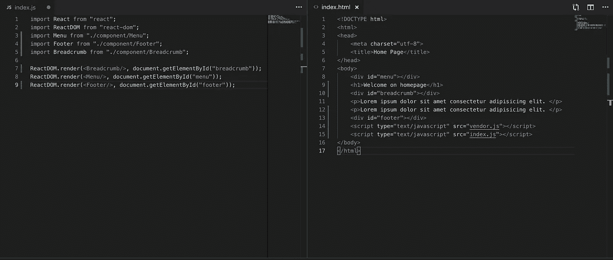
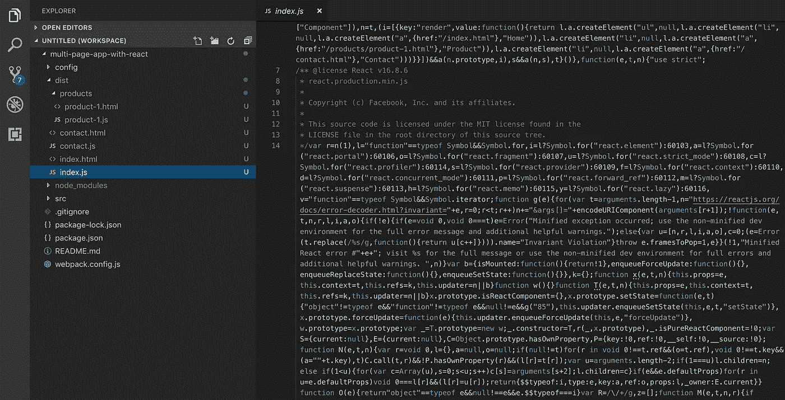
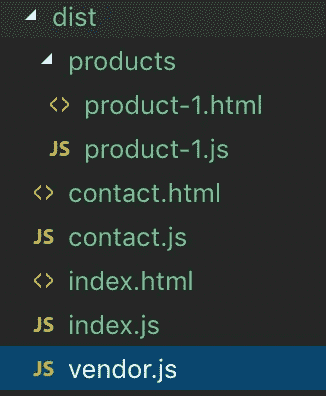

# 带 React 的多页面应用程序

> 原文：<https://itnext.io/building-multi-page-application-with-react-f5a338489694?source=collection_archive---------0----------------------->

在 web 开发领域，我们可以列出 web 应用程序的两种主要设计模式:多页面应用程序(MPA)和单页面应用程序(SPA)。在这篇博文中，我将重点介绍 react 库在多页面应用程序中的集成。传统架构需要重新加载网页，以便在用户浏览器中从服务器加载数据或向服务器发送数据。

我打算做的是准备一个 Webpack 配置，将 React 组件包含到生成的静态页面(即 html 文件)中。我将介绍项目创建和设置的步骤。

因为一张图片，或者在这种情况下，一些代码，胜过千言万语，这里有一个示例来说明上面静态页面的概念:



添加到静态页面的几个 React 组件。

# 先决条件列表

本教程假设您已经安装了带有 npm 的节点:

```
$ node -v
v10.11.0$ npm -v
6.4.1
```

事不宜迟，让我们创建 *package.json* 文件:

```
$ npm init
```

*注意:添加-y/ — yes 标志以跳过问题并使用默认值*

现在我们要准备项目的结构，如下所示:

```
├── src
|   ├── components/
|   |   └── Menu.js
|   └── pages/
|       ├── products/
|       |   ├── product-1.js
|       |   └── product-1.html
|       ├── contact.js
|       ├── contact.html
|       ├── index.js
|       └── index.html
├── package.json
└── webpack.config.js
```

为了加快这个过程，我们可以执行这个命令:

```
$ touch webpack.config.js && mkdir -p src/components && mkdir -p src/pages/products && touch src/components/Menu.js && touch src/pages/products/product-1.js && touch src/pages/products/product-1.html && touch src/pages/contact.js && touch src/pages/contact.html && touch src/pages/index.js && touch src/pages/index.html
```

好了，我们在 pages 目录中看到的是一堆文件名相同的 js 和 html 文件。这个文件名提示 webpack 将适当的 js 文件链接到 html 文件。例如，对于成对的 index.html 和 index.js 文件，webpack 生成包含 index.js 文件的 index.html 文件，该文件又导入 React 组件。在我深入研究 webpack 配置之前，让我们在那些空文件中编写一些代码。

首先，让我们定义菜单组件:

/src/components/菜单. js

其次，在 index.js 中，放置以下代码，该代码将导入在上一步中创建的菜单组件:

/src/pages/index.js —将粘贴代码复制到 contact.js 和 product-1.js 文件中

最后，编辑将呈现

<menu>react 组件的 index.html 文件:</menu>

/src/pages/index.html —将代码复制粘贴到 contact.html 和 product-1.html 文件中，更改<title>标记</title>

html 文件中最有趣的部分是带有 id HTML 属性“menu”的 *< div >* 标签，菜单组件将放置在该标签中。在此之前，我们需要设置一些工具，比如捆绑器和开发服务器，它们将帮助我们完成这项工作。

**安装依赖关系**

对于该项目，我们将安装 webpack 模块捆绑器、 **webpack-cli** 以在命令行中使用 webpack(即，在 package.json 文件中)、 **html-webpack-plugin** 以生成包含所有 webpack 捆绑包的 html 文件，以及 **webpack-dev-server** 作为提供实时重新加载的开发服务器:

```
$ npm i webpack webpack-cli webpack-dev-server html-webpack-plugin --save-dev
```

接下来我们安装 **react** 和 **react-dom** (它是 react 和 dom 之间的粘合剂，允许它呈现组件和访问 DOM):

```
$ npm i react react-dom --save
```

除了 React，我们还需要安装巴别塔插件，增加对 ES6 和 JSX 的支持:

```
$ npm i @babel/core @babel/preset-env @babel/preset-react babel-loader --save-dev
```

当我们安装好之后，我们可以将*构建*和*启动*脚本添加到 *package.json:*

```
{
   "name": "multi-page-app-with-react",
   "version": "1.0.0",
   "description": "Multi Page Application with React",
   "main": "index.js",
   **"scripts": { 
      "build": "webpack — mode production", 
      "start": "webpack-dev-server — mode development — hot — open — port 3100" 
   }** "keywords": [],
   "author": "",
   "license": "ISC"
}
```

***构建*** *脚本在生产模式下运行，以缩短加载时间(即缩减代码、减轻源代码映射等)* ***启动*** *脚本在开发模式下运行服务器，进行热模块替换，并在服务器启动后打开浏览器。*

但是在运行这些脚本之前，我们需要编辑和设置 **webpack.config.js** 文件。

**网络包配置**

首先我们要通过配置 webpack.comfig.js 文件中的 **entry** 属性来定义入口点。我们想告诉 Webpack 每个页面只使用一个入口点。这可以通过将定义了 entryChunkName 键的对象和 js 文件的路径作为值传递来实现:

```
module.exports = {
  entry: {
    'index' : './src/index.js',
    'products/product-1': './src/pages/products/product-1.js',
    'contact' : './src/pages/contact.js'
  }
};
```

显然，我们不想像上面那样硬编码，因为每当我们添加一个新页面时，这个配置都必须更新。期望的解决方案是找到所有。js 文件，并根据结果生成一个带有入口点的对象。

为此，我们将在 files.js 中实现 *getFilesFromDir* 函数:

/config/files . js-getFilesFromDir 递归函数返回由文件扩展名筛选出的给定目录中的文件路径

然后我们可以用 *getFilesFromDir* 函数的修改结果导入并替换条目属性:

```
const path = require("path");
**const getFilesFromDir = require("./config/files");**
const PAGE_DIR = path.join("src", "pages", path.sep);const jsFiles = **getFilesFromDir**(PAGE_DIR, ["**.js**"]);
const **entry** = jsFiles.reduce( (obj, filePath) => {
   const entryChunkName = filePath.replace(path.extname(filePath), "").replace(PAGE_DIR, "");
   obj[entryChunkName] = `./${filePath}`;
   return obj;
}, {});module.exports = {
  **entry: entry**
};
```

*注意:webpack.config.js 文件的最终版本可以在下面找到(见要点文件)。*

当入口点设置好后，我们就可以跳转到 **html-webpack-plugin** 部分的配置了。这个插件的主要目标是生成一个 html 文件(在 **dist** 文件夹中)，包括相应的 javascript 文件。例如，如果我们已经生成了一个联系页面，我们期望将带有 *contact.js* 文件的*contact.html*包含在*<body>*by*<script>*标签中。至少，我们希望提供三种配置选项:

```
plugins:[
  new HtmlWebPackPlugin({
    chunks:["contact", "vendor"],
    template: "src/pages/contact.html",
    filename: "contact.html"
})]
```

**chunks** 属性通过 *<脚本>* 标签定义包含在**模板**文件中的代码库，并生成名为**文件名**的 html 文件作为输出。
由于我们希望将供应商(即第三方库)和应用程序代码拆分成单独的包，我们必须将 **"vendor"** 元素添加到 **chunks** 表中。在讨论优化时，我会写得更多。

这个插件配置是正确的，但是如果我们想要遵循这个结构，我们必须为每个 html 文件硬编码创建 HtmlWebPackPlugin 对象。出于与入口点定义相同的原因，我们不想这样做。这就是为什么我们将再次使用 **getFileFromDir** 函数，但这次我们将只搜索 html 文件:

```
const HtmlWebPackPlugin = require("html-webpack-plugin");
const htmlFiles = **getFilesFromDir**(PAGE_DIR, ["**.html**"]);const **htmlPlugins** = htmlFiles.map( filePath => {
  const fileName = filePath.replace(PAGE_DIR, "");
  return new HtmlWebPackPlugin({
    chunks:[fileName.replace(path.extname(fileName), ""), "vendor"],
    template: filePath,
    filename: fileName})
});module.exports = {
  entry: entry,
  **plugins: [...htmlPlugins]**
};
```

为了更容易地导入模块，我们还可以通过为模块解析器设置*别名*来别名常用的“组件”和“src”文件夹:

```
module.exports = {
  entry: entry,
  plugins: [...htmlPlugins],
  **resolve:{
     alias:{
        src: path.resolve(__dirname, "src"),
        components: path.resolve(__dirname, "src", "components")
     }
  }**,
};
```

现在，Webpack 将在解析模块导入时使用此别名，如下所示:

```
import Menu from "components/Menu";
```

而不是对文件位置变化敏感的默认导入机制，即:

```
import Menu from "../../components/Menu";
```

最后但同样重要的是，我们必须设置 babel-loader 来使 React 工作(即把 ES6 转换成 ES5 代码，把 JSX 转换成 javascript):

```
module.exports = {
  * // put previously defined properties here (entry, plugins etc)
 * ** module: {
      rules: [{
         test: /\.js$/,
         exclude: /node_modules/,
         use: {
            loader:”babel-loader”,
               options:{
                  presets: [
                     “@babel/preset-env”,
                     “@babel/preset-react”
                  ]
               }
         }
      }]
   },**
}
```

*注:也可将预置放入。babelrc 文件*

最后，我们可以构建项目:

```
$ npm run build
```

瞧！如果一切顺利，我们应该看到 **dist** 目录，其中包含基于“pages”文件夹生成的 html 和 js 文件。

然而，我们的 js 文件仍然有一个问题。如果你编辑它们中的任何一个，你会看到它们包括一个应用和第三方源代码(即与其他库反应)。



优化前 index.js 文件的内容包括 React 和其他库的代码。

这产生了两个问题:

1.  一个巨大的文件意味着当我们改变一行代码时，用户必须重新下载整个文件
2.  每个 js 文件都包含并下载了相同的第三方源代码。我的意思是 index.js、contact.js 和 product-1.js 文件包含相同的 React 代码。

这个问题的解决方案是将第三方库分离到一个单独的 *vendor.js* 文件中。因此，让我们使用 splitChunksPlugin 将我们的包拆分到一个单独的文件中，splitChunksPlugin 成为 Webpack4 中代码拆分的默认解决方案。

```
module.exports = {
  * // put previously defined properties here (entry, plugins etc)*
   **optimization: {
      splitChunks: {
         cacheGroups: {
            vendor: {
               test: /node_modules/,
               chunks: "initial",
               name: "vendor",
               enforce: true
            }
         }
      }
   }**
}
```

以下是最终的 **webpack.config.js** 文件经过所有修改后的样子:

网络包.配置. js

现在我们可以再次构建我们的应用程序:

```
$ npm run build
```

但是这次构建完成后，我们将在 *dist* 文件夹中看到新的 *vendor.js* 文件。此文件仅包含第三方源代码，其他*。图中可见的 js 文件现在应该没有这段代码了。



优化后生成的文件

当我们准备好所有这些元素后，我们最终可以通过输入以下命令在开发模式下运行 project:

```
$ npm start
```

下一步是什么？

众所周知，总有改进的空间，所以我们可以很容易地扩展 CSS/SCSS 加载器的配置，添加 linter，hashes 到。js 文件名(用于缓存失效目的)和做许多其他很酷的事情。对于任何想要克隆这个配置并进行上述改进的人，我准备了这个 [github 库](https://github.com/przemek-nowicki/multi-page-app-with-react)。

[](https://github.com/przemek-nowicki/multi-page-app-with-react) [## przemek-nowicki/多页应用程序-使用-反应

### 扳手:一个轻量级、灵活的 webpack 设置，带有 React，用于多页面应用程序开发…

github.com](https://github.com/przemek-nowicki/multi-page-app-with-react)