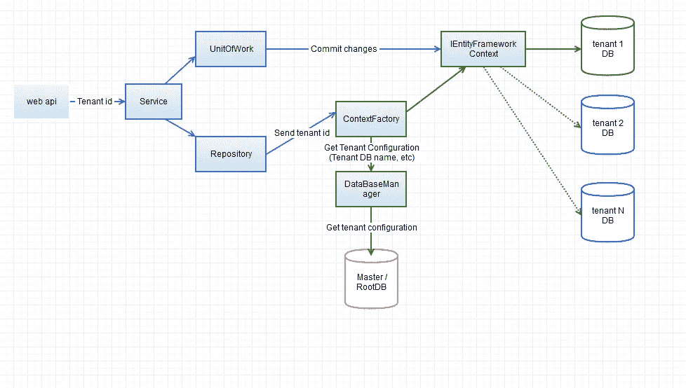
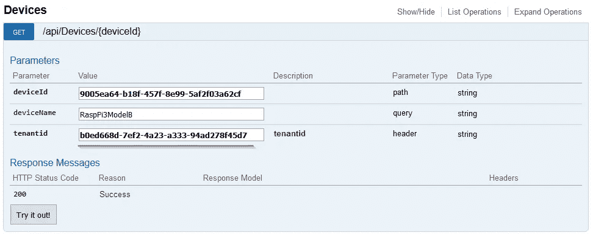

# 使用. net core 和最佳实践构建多租户 Web API(教程)

> 原文：<https://itnext.io/building-multi-tenant-web-api-using-dot-net-core-and-best-practices-8dce439bfae7?source=collection_archive---------1----------------------->

为了取得成功并处理越来越多的客户和合作伙伴，业务需要增长，如果一家公司没有准备好应对这一负载，那么机会就有可能被错过。这给游戏带来了可伸缩性的话题，作为公司应该解决的主要需求之一。因为解决这一需求的可能方法之一是构建多租户解决方案。随着这个话题变得越来越重要，有很多选择可以实现这一点，例如使用微软的弹性数据库(弹性工具)。然而在特殊的情况下，比如我在项目中遇到的情况，并不是所有的产品需求都可以用现有的选项来满足。这让我想到了收集我在这个话题上的经验并在下面展示出来。

众所周知，有两种主要方法来解决应用程序扩展问题——水平和垂直。水平扩展将为您带来动态扩展的好处，并意味着处理多个数据库，因为每个租户都有自己的数据库/碎片。纵向扩展方法假设有一个数据库为多个租户服务。

在我的文章中，我将通过如何构建多租户 web API 应用程序的分步指南来解决水平伸缩的方法。

如果您想更新多租户架构的某些方面，或者它有哪些优点和缺点

我建议您访问以下资源:

*   [云架构为何重要:多实例相对于多租户的优势](https://servicematters.servicenow.com/2016/02/01/why-cloud-architecture-matters-the-multi-instance-advantage-over-multi-tenant/)
*   [为什么多租户应用架构在 2017 年如此重要](https://dzone.com/articles/why-multi-tenant-application-architecture-matters)
*   [多租户 SaaS 应用和 Azure SQL 数据库的设计模式](https://docs.microsoft.com/en-us/azure/sql-database/sql-database-design-patterns-multi-tenancy-saas-applications)

# 体系结构

我们先简单看一下架构。以下示例是基于 N-tire 设计的

体系结构，具有以下几层:

*   表示层或 web api
*   将容纳所有业务逻辑的服务层
*   使用 [UnitOfWork](https://martinfowler.com/eaaCatalog/unitOfWork.html) 和[存储库](https://msdn.microsoft.com/en-us/library/ff649690.aspx)模式实现的数据访问层。作为这个例子中的 ORM，我使用了实体框架核心。

租户分离的关键组件是 [*ContextFactory*](https://github.com/Boriszn/DeviceManager.Api/blob/master/src/DeviceManager.Api/Data/Management/ContextFactory.cs) ，它包含从 HTTP 头获取租户 id、使用[*database manager*](https://github.com/Boriszn/DeviceManager.Api/blob/master/src/DeviceManager.Api/Data/Management/DataBaseManager.cs)*检索租户数据库名称以及替换连接字符串中的数据库名称的逻辑。结果，创建了数据库上下文(实体框架上下文)。*

*下图演示了这种体系结构。*

**

# *履行*

*如你所见，架构在这里并不复杂，浏览一下，我建议
关注实现它的步骤。*

## *1.创建上下文工厂*

*正如我之前提到的 *ContextFactory* 是整个架构的关键组件。它构建特定于租户数据库实体框架上下文(在当前示例中为 *DeviceApiContext* )*

**ContextFactory* 的源代码可用[**此处**](https://github.com/Boriszn/DeviceManager.Api/blob/master/src/DeviceManager.Api/Data/Management/ContextFactory.cs)*

## *3.添加数据库管理器*

*数据库管理器协调所有租户元数据，如租户数据库名称、激活*

*租户的状态(激活/停用)和其他属性的集合。为了演示一个基本原理，我在当前的解决方案中使用了 dictionary。稍后，字典应该被更合适的解决方案所取代，比如包含租户元数据的 SQL 或 NoSQL 数据库。这个想法类似于微软弹性工具中使用的[分片地图管理器](https://docs.microsoft.com/en-us/azure/sql-database/sql-database-elastic-scale-shard-map-management)。租户元数据还可以包括存储数据库名称的字段、激活/停用租户的选项、甚至基于 CSS/SASS/LESS 文件的前端应用程序的租户样式等等*

**数据库管理器*的源代码可用[**此处**](https://github.com/Boriszn/DeviceManager.Api/blob/master/src/DeviceManager.Api/Data/Management/DataBaseManager.cs)*

## *4.添加工作单元类(包含提交到特定上下文方法)*

**UnitOfWork* 解决两个任务。它提交实体框架在实体中所做的所有更改，并处理特定的上下文。*

*此处 可用 [**的 UnitOfWork 源代码**](https://github.com/Boriszn/DeviceManager.Api/blob/master/src/DeviceManager.Api/Data/Management/UnitOfWork.cs)*

## *5.添加通用存储库类。*

*存储库将在 EF 实体中进行更改，工作单元将向租户数据库提交更改。请注意，EF 使用[跟踪机制来改变内存。](https://docs.microsoft.com/en-us/ef/core/querying/tracking)*

*资源库的源代码可用 [**此处**](https://github.com/Boriszn/DeviceManager.Api/blob/master/src/DeviceManager.Api/Data/Management/Repository.cs)*

## *5.添加租户标题操作过滤器。*

**TenantHeaderOperationFilter*类将租户 id 字段添加到所有 API 调用中(作为 HTTP 头)。在使用 auth0.com 服务的解决方案中，可以将身份服务器或租户注入 JWT 令牌。*

*这是应用过滤器后 API 的外观。*

**

*服务类的当前示例( *DeviceService.cs* )包含按 id 检索设备和为特定租户添加新设备的功能。服务层可用的源代码[此处](https://github.com/Boriszn/DeviceManager.Api/blob/master/src/DeviceManager.Api/Services/DeviceService.cs)*

# *结论*

*在这篇文章中，我解释了如何构建“随时可用”的多租户解决方案，并给出了如何在您的产品/业务中使用它的一些建议。正如我之前提到的，这个解决方案是现成的，所以它可以作为“样板”项目或部分使用。*

# *源代码*

*该项目的源代码可在 [**Git 库中找到，此处**](https://github.com/Boriszn/DeviceManager.Api)*

*原文[此处](https://boris-zaikin.blogspot.de/2017/10/build-multitenant-api-based-on-swagger.html)。*