# 用 Python 从头开始构建神经网络

> 原文：<https://itnext.io/building-neural-network-from-scratch-in-python-71ed71d34588?source=collection_archive---------1----------------------->

## **从零开始理解深度学习**

这是*从零开始理解深度学习*系列的第二篇帖子，这是我们[的第一篇帖子](https://akilahmed.medium.com/creating-a-single-neuron-model-perceptron-5731aaf36a54)，我们已经详细解释了如何创建一个单个神经元(感知器)，我们将在这里多次引用该帖子，所以请在另一个标签中打开它。您可以在这个 *building_dnn.ipynb* 文件中的 [*GitHub 链接*](https://github.com/akil-ahmed3/understanding_deep_learning) 上找到本文的代码，并且您可以在这个[链接](https://drive.google.com/drive/folders/1OTmte5WhL97YrDHYsb7JSv_7E55JZeYG?usp=sharing)中找到 numpy 数据集

在本帖中，我们将从头开始用 Python 创建一个浅层神经网络。然后，我们训练一个分类模型来预测图像是狗还是猫。请参考我以前的帖子来理解数据集的设置。我们将跳过一些已经解释过的东西，如 sigmoid 函数、前向传播、后向传播、成本函数和梯度下降。我们将在这篇文章中讨论所有这些事情，但我们不会涉及太多细节。

让我们看看我们模型的架构

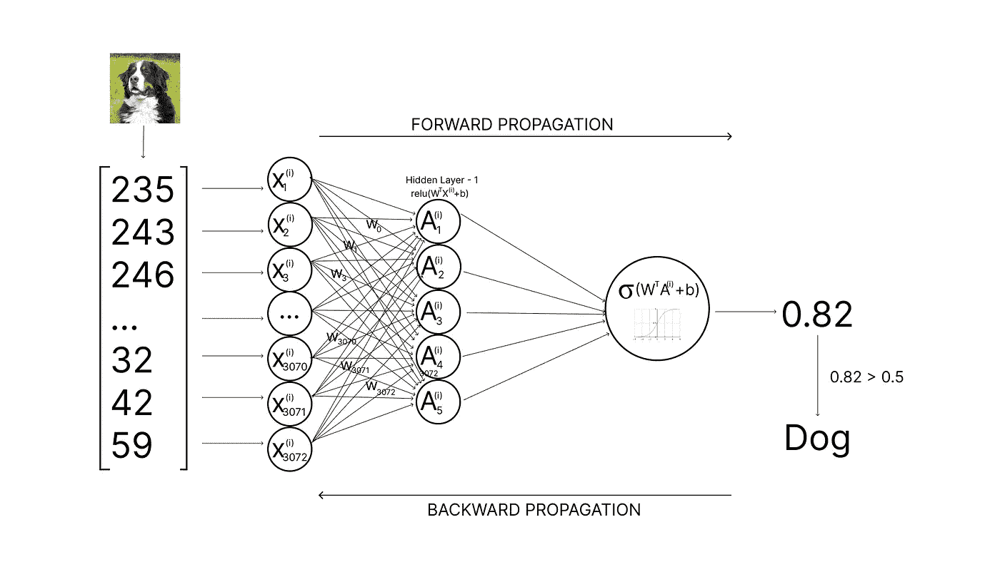

图片-1

与我们的感知器不同，这里的数据(X)不连接到我们的输出神经元，它连接到一个称为隐藏层的中间层(A)。 *X* 的每个单元连接到 *A* 的每个单元。这里我们将创建一个有 1 个输入、1 个输出和 1 个隐藏层的网络。如果我们愿意，我们可以增加隐藏层的数量。A 是这样计算的，

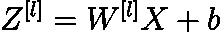

方程式- 1

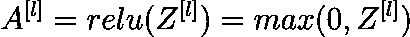

方程式 2

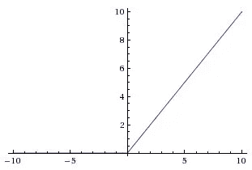

图片-2

像上次一样，我们用等式-1 计算 *Z* 向量，其中上标 *l* 表示隐藏层数。 *W* 、 *X* 、 *b* 分别是权重、样本数据和偏差。我们将在隐藏层使用 Relu 激活函数，在输出层使用 sigmoid 函数。

然后，隐藏层的所有 5 个单元与我们的输出单元连接，输出单元像以前一样使用 sigmoid 函数来分类到正确的类中。

像以前一样，我们将首先初始化我们的权重和偏差，然后它将通过隐藏层，最后是输出层。让我们详细地看看并理解代码。

*   首先在*initialize _ parameters _ deep*函数中，我们在初始化参数，但与之前不同的是，我们将 *W* 初始化为随机数。为什么？因为，如果我们为第一层的每个单元(神经元)从零开始设置 *W* 的值，那么在向前和向后传播期间，每个层的每个神经元的 *W* 的值将保持不变，每个单元的 *W* 将以相同的方式更新，因为它们的起点是相同的，所以一般来说，它将不会学习到任何新的东西，这就像使用单个神经元进行更多的计算，这没有任何意义，对吗？
*   如果我们使用随机数来初始化 *W* ，那么所有的值在初始化时都将是不同的，并且每个神经元将学习一个我们想要的新东西。我们会看到多快。
*   我们正在创建一个参数字典，其中存储不同层的 *W* 、 *b* (初始化为 0)的值，并返回它们。
*   然后我们创建 Sigmoid 和 ReLu 函数，分别用于输出层和隐藏层。

我们的前向传播步骤与之前非常相似，唯一的区别是，之前我们只对一个神经元进行传播，但现在我们将对每一层的每个神经元进行传播。因此，如果模型有 2 层，每层有 5 个单元，那么总共有 11 个神经元(2 x 5 + 1 个输出神经元)。

让我们详细了解一下代码，

*   在 *linear_forward* 函数中，我们执行等式-1，将当前层的权重(W)与前一层(A_prev)或样本数据(X)的结果进行点积(仅针对第一层)。
*   然后在*linear _ activation _ forward*函数中，我们传递 *A_prev* (来自前几层的结果) *W* 、 *b* 和 *activation* 作为参数，这里 activation 将是一个字符串( *sigmoid* 或 *relu* )来决定在当前层使用哪个激活函数，我们将调用*linear _ forward*
*   然后在 *L_model_forward* 函数中，我们将第一层的 *A* 初始化为 *X* (数据集)，创建一个名为*cache*的空数组，它将跟踪我们的*参数(W 和 b)* 、 *A_prev* 和 *Z、*然后将层数存储在变量 *L.* I am 中
*   在 for 循环中，所有隐藏层(A)的单元都是通过 Relu 激活来计算的，在下一层中，我们将 A_prev 更新为 A(第 28 行)。因此，对于第一层 *A* 是 *X* ，但是对于所有其他层， *A* 成为前一层(A_prev)的输出，明白吗？
*   循环之后，我们使用 sigmoid 激活函数计算最终层(al)的输出。
*   L_model_forward 函数将返回在整个正向传播步骤中追加的所有缓存。

你可能会问，为什么我们在隐藏层使用 ReLu 而不是 sigmoid？因为 ReLu 是用 *max(0，Z)* 公式计算的，所以它在计算上比 sigmoid 或 tanh 更有效，因为它不执行任何指数运算。此外，它解决了消失梯度问题。

因此，我们完成了正向传播步骤。

现在是计算每层的成本函数(J)的时候了。在[上一篇文章](https://akilahmed.medium.com/creating-a-single-neuron-model-perceptron-5731aaf36a54)中，我们已经详细解释了成本函数，所以在这里我们将只看到我们的公式对于多个单元和隐藏层是如何变化的。好吗？

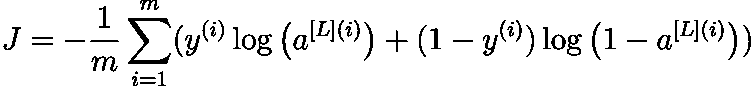

方程式 3

我们在这里看到的唯一变化是[L]上标，它表示网络的第 1 层。让我们看看代码，

*   代码非常简单，我们取正向传播步骤(al)的最终结果，并用 *compute_cost* 函数中的实际值(Y)计算成本。

现在，我们必须计算*反向传播*，其用于计算损失函数相对于参数的梯度。在向前和向后传播的过程中，我们会经历一个叫做计算图的过程。请参考[本文](https://medium.com/tebs-lab/deep-neural-networks-as-computational-graphs-867fcaa56c9)详细了解计算图。在该图中，想象我们在正向传播中所做的一切，我们必须反向进行，并计算损失函数相对于参数的*梯度。*

首先，我们会找到激活函数(dZ)的梯度损失函数 w.r.t，这是我们最后为前向传播计算的，所以在后向传播中，我们会先这样做，以此类推，好吗？所以 *dZ* 是损失函数 w.r.t *dA* 的导数和损失函数 w.r.t *Z* 方程-4 的导数的乘积。

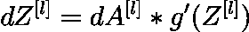

方程式 4

我们知道第一层的激活函数是 sigmoid，而其他层的激活函数是 ReLu。此后，当激活函数为 Sigmoid 时， *dZ = dA*A*(1-A)* 当激活函数为 ReLu 时，*dZ = dA(Z>0)**dZ = 0(Z≤0)。下面是代码，*

下面我就不详细介绍这些方程的推导了，如果你想让我说的话，请评论。这里 *l* 是当前层， *l-1* 是前一层。现在，权重(dW)、偏差(db)和前一层的输出(dA_prev)相对于损失函数(J)的导数将是，

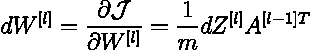

方程式 5

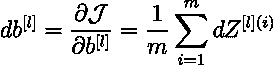

方程式 6

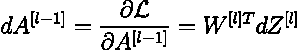

方程式 7

让我们看看代码，

*   我们可以看到，linear_backward 函数以 *dZ* 、 *W* 和 *b* 作为参数，并将根据等式 5、6 和 7 返回 *dW* 、 *db* 和 *dA_prev* 。
*   在正向传播中，我们取第 1 层的值 *W* ， *b* 和第(L-1)层的值 *A* 来计算第 1 层的值 *A* 对吗？因此，在反向传播中，我们将采用第 L 层的 *dA* 来计算第 L 层的 *dW* 、第 L 层的 *db* 和第(L-1)层的 *dA* ，这个过程以相反的顺序发生。希望你能围绕它建立直觉。
*   在*linear _ activation _ backward*函数中，我们首先询问反向传播将发生在哪个激活函数上。
*   激活的 Backprop 返回 *dZ* ，然后 linear_backward 计算并返回 *dA_prev* 、 *dW* 和 *db。*

在前向传播步骤的*initialize _ parameters _ deep*函数中，我们已经将所有权重(W)和偏差(b)存储在参数字典中。同样，我们将把每一层的所有 *dW* 、 *db* 和 *dA_prev* 存储在名为 *grads、*的字典中，其中字典的关键字是 *dW + str(l)* (字符串化后的数字)我以 *dW* 为例， *db* 和 *dA* 的存储方式也是一样的。

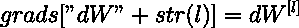

从正向传播中，我们得到了 *W* 、 *b* 、 *AL* 。从反向传播中，我们得到了 *dW* ， *db* ， *dA_prev* 。所以现在，我们必须更新每一层的 *W* 和 *b* ，以适应我们的数据。正如我们在上一篇文章中一样，我们通过分别从 W 和 b 中减去 *dW* 和 *db* 乘以学习率(alpha)来更新 *W* 的值。参考[上一篇](https://akilahmed.medium.com/creating-a-single-neuron-model-perceptron-5731aaf36a54)的渐变下降部分可以更好的理解。

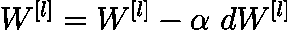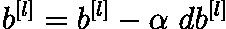

让我们看看梯度存储和参数更新的代码，

*   首先在 *L_model_backward* 函数中，我们将 grads 初始化为一个空字典，它将存储 *dW* 、 *db* 和 *dA_prev* ，然后 *L* 是当前的层数， *m* 是概率向量的形状，前向传播的输出( *AL* )， *Y* 是包含 0 或的标签向量
*   *dAL* 是输出层损失函数的梯度，将在*linear _ activation _ backward*函数中用于计算最后一层(第 10 行)的梯度。
*   正如你所记得的，在我们的前向属性的最后一层(输出层)中，我们使用了 sigmoid 函数，我们也在 Sigmoid 激活时进行后向属性，然后将其存储在 grads 字典中。
*   然后，我们从倒数第二层循环到第一层，并计算和存储所有其他层的梯度。在这些层中，我们使用了 ReLu 激活，所以我们将使用我们之前创建的 relu _ backwards 函数。最后，我们把毕业生送回来了。
*   在 update_parameters 函数中，我们传递参数(权重和偏差)、梯度(损失函数的梯度 w.r.t 参数 dw，db)和学习率。
*   然后，从第一层循环到最后一层，并根据等式 9 和 10 更新权重和偏差。在上一篇文章中，我们在感知器模型的*梯度体面*函数中做了同样的事情。但是在这里，我们是针对多层和多个神经元(感知器)来做的

让我们把到目前为止的所有函数集合起来，创建 *L_layer_model* 函数，

*   我们正在创建空的 costs 数组，它将存储每次迭代的成本函数。
*   用层维度初始化我们的参数(权重和偏差)，层维度将是一个类似于[3072，5，1]的数组，这里第一个是具有 3072 个单元(展平图像)的输入层，它有一个具有 5 个单元的隐藏层，最后一个是具有 1 个单元或神经元的输出层，它将给出我们分类的概率。我们可以通过改变层维度数组来增加隐藏层的数量，如果我们将它改为[3072，5，5，1]，那么它将有两个隐藏层，以此类推。
*   在循环内部，我们迭代我们提供的迭代次数。
*   首先，我们是*正向传播*，它给我们输出*层(a1)的结果，以及存储参数(权重和偏差)和每层(A)输出的缓存*。
*   然后，我们正在*计算 AL 和实际标签(Y)的成本。*
*   之后，我们*计算我们的梯度(dW，db 和 dA_prev)* 。
*   接下来，我们将更新参数并打印成本函数。
*   在第 13–14 行，我在某些迭代之后降低了学习率，这样它就不会超调。
*   最后，我们返回更新的参数(W 和 b)和成本数组。

现在，让我们训练和测试我们的模型，

*   首先，我们调用 L_layer_model 函数，该函数将通过获取训练数据集来训练模型，层维度为[3072，5，5，1]，学习率为 0.2，迭代次数为 10000 作为自变量，并返回更新的参数和成本。
*   然后在预测函数中，我们将概率值转换为 0 和 1。如果前向传播或 L_model_forward 通过采用更新的参数得到的结果大于 0.5，则为 1，否则为 0。
*   它将通过与实际值 *y.* 进行比较来打印数据集的准确性

```
Cost after iteration 0: 0.6965011895457693
Cost after iteration 1000: 0.6368951308414399 
Cost after iteration 2000: 0.6219993389332111 
Cost after iteration 3000: 0.6054223197992217 
Cost after iteration 4000: 0.6010027596861128 
Cost after iteration 5000: 0.5801166825629971 
Cost after iteration 6000: 0.578504474487532 
Cost after iteration 7000: 0.5665113489929966 
Cost after iteration 8000: 0.5620262967779565 
Cost after iteration 9000: 0.5597852629281578 
Cost after iteration 9999: 0.5575603590876632`test Accuracy: 0.6150000000000001 
train Accuracy: 0.7849999999999998
```

我们可以清楚地看到，我们的具有多个神经元和层的模型仅比我们之前的模型提高了 3%，这一点也不好。虽然我们比以前做了更多的工作。这是怎么回事？

该模型在训练数据上过度拟合，为了避免这种情况，我们必须使用称为正则化方法的东西和一些超参数来优化我们的算法，这可以在本系列的第三篇文章中读到。感谢您的阅读，如果您有任何问题，请在评论区或任何社交媒体上发表。

信用:【https://www.coursera.org/specializations/deep-learning 