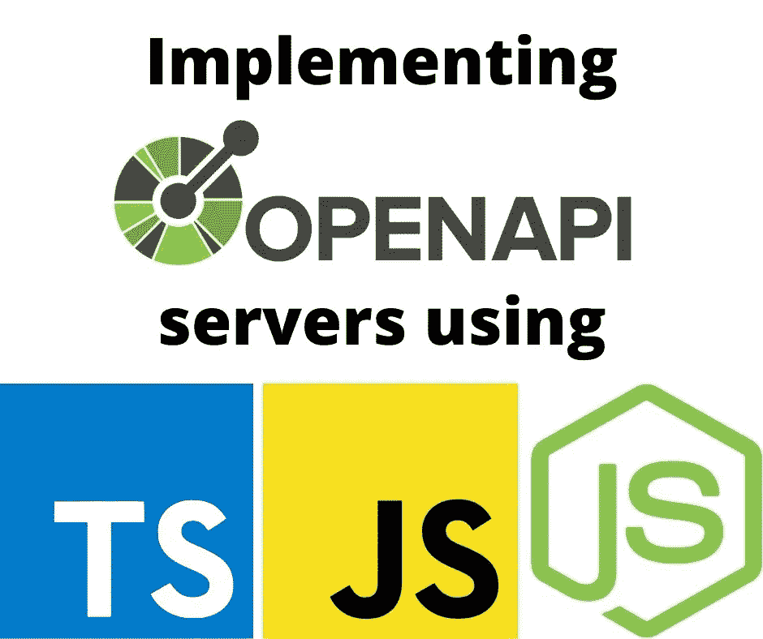

# 根据 OpenAPI 规范构建 Node.js REST 服务器

> 原文：<https://itnext.io/building-node-js-rest-servers-from-openapi-specifications-f15e8b885793?source=collection_archive---------5----------------------->

## 快速从 API 规范到运行服务器



作者图片

**OpenAPI 规范旨在帮助创建服务器或客户端 API 实现。在本文中，我们将探索如何快速实现运行在 Node.js 上的 OpenAPI 规范中的服务器代码，最好使用 TypeScript。**

本文的目标是创建一个可维护的 Node.js/JavaScript/TypeScript 服务器，实现 OpenAPI 规范中定义的 REST 服务。在这种情况下，我们不会从代码中生成 OpenAPI 规范文件，而是使用 OpenAPI 规范来驱动服务器。一些框架走另一条路，从代码中生成 OpenAPI 规范。这个模型在某些情况下是有用的。但是，在很多情况下，我们需要实现一个与现有 API 兼容的服务器，其中有一个已发布的 OpenAPI 规范。在这种情况下，我们需要从 OpenAPI 规范中生成服务器，而不是从代码中生成 OpenAPI 规范。

我们所说的*可维护的服务器代码*是什么意思？API 会改变。当您需要更新到 API 的更高版本时，您的服务器实现会发生什么？一个可维护的场景是，您可以更新正在使用的 OpenAPI 规范，而不必从头开始重新创建您的实现。在某些情况下，从更改的 API 规范重新生成源代码会覆盖现有代码。如果您定制的代码被覆盖，您需要重新创建定制。相反，我们必须能够毫不费力地快速更新我们的服务器代码。这是因为我们必须在迭代 OpenAPI 规范和测试服务器实现变化之间有一个紧密的循环。

OpenAPI 规范的核心是`paths`结构，其中每一项都是我们 API 中的一个 URL 路径。这些 URL 显然对应于如下的路由处理程序:

```
router.get('/todos/all', ...) 
router.put('/todos', ... ) 
router.delete('/todos/123', ...)
```

这意味着 OpenAPI 服务器框架必须以某种方式生成这些路由处理程序。服务器框架应该建立在像 Express 或 Fastify 这样的现有框架之上。OpenAPI 框架既可以生成源代码，我们可以根据业务逻辑定制源代码，也可以根据指定的 API 在内部处理匹配请求。OpenAPI 路径声明中的`operationId`属性必须连接到包含我们代码的 JavaScript 函数(我们的目标是 Node.js)。还有像对象模式这样的东西，它们必须对应于数据类型，等等。

对于 URL 路径和请求动词的每个组合，都有一个对应的`operationId`。Node.js 服务器的`operationId`对应于一个 JavaScript 函数。因此，OpenAPI 服务器框架应该处理 URL 和请求动词的匹配，确保传入数据匹配 OpenAPI 规范中的任何内容，然后调用对应于`operationId`的函数。

带有示例代码的存储库:[https://github.com/robogeek/typescript-todo-service](https://github.com/robogeek/typescript-todo-service)

该存储库包含 TODO 服务的示例 OpenAPI 文件。在撰写本文时，TODO 服务还没有在真实的应用程序中进行测试。它是根据之前的教程[设计的，包含 Express、Bootstrap v5、Socket 的单页多用户应用程序。IO，Sequelize](https://techsparx.com/nodejs/examples/todo-bootstrap/index.html) ，因此这个 API 应该工作。然而，本文的目的不是创建一个工作应用程序，而只是演示如何从一个 OpenAPI 规范开始，并快速搭建服务器实现的起点。我们所需要的就是见证操作处理函数的执行。

这个存储库还包含使用规范构建服务器的例子。

# 使用 Exegesis 和 Exegesis-Express 创建 OpenAPI 服务器

注释库实现了 OpenAPI 3，但是你可能想要使用`exegesis-express`或者`exegesis-koa`。让我们用速成版兜一圈。

*   github:[https://github.com/exegesis-js/exegesis-express](https://github.com/exegesis-js/exegesis-express)
*   源代码:[https://github . com/robogeek/typescript-todo-service/servers/exegesis-express](https://github.com/robogeek/typescript-todo-service/servers/exegesis-express)

通过安装这些包来设置 Node.js 项目目录

```
$ npm init -y 
$ npm install express exegesis-express cookie-parser body-parser 
$ npm install @types/cookie-parser @types/errorhandler \
      @types/express @types/method-override @types/morgan \
      @types/node typescript nodemon
```

对于典型的 ExpressJS 服务器来说，这是一组非常有用的包。截至本文撰写时，Express v4 仍然是当前版本，Express v5 处于 Beta 1 中。如果您希望支持的不仅仅是 OpenAPI 路径，那么这套 Express 中间件非常有用。

我们正在安装 TypeScript，以及几个类型包。最后，Nodemon 对于监控源代码和重新加载服务器以获得更好的开发人员工作流非常有用。

`todo.yml`文件必须做一些小的修改，所以将它复制到项目目录中，并对`paths`下的每个条目进行修改

```
paths:
   /todo:
     post:
       ...
       x-exegesis-controller: todoController
       ...
```

在 OpenAPI 中，`x-`用于厂商扩展。在这种情况下，注释是供应商，因此是`x-exegesis`，这个特殊的扩展是命名一个模块，在那里可以找到一个*控制器函数*。在 OpenAPI 中，每个`paths`条目都有一个`operationId`参数，它是对应于路径的操作的可读名称。

比如`/todo`上的岗位对应`createTodo`操作。`x-exegesis-controller`参数命名一个模块，在该模块中，注释查找名称与`operationID`参数匹配的函数。因此，解释学将调用`todoController.createTodo`来匹配这个`paths`条目的请求。

您可能已经注意到我们安装了 TypeScript 编译器和一些类型包。这意味着我们需要像这样初始化一个`tsconfig.json`:

```
{
     "include": [ "lib/**/*" ],
     "compilerOptions": {
         "lib": [ "es6", "es2021", "esnext" ],
         "target": "es2022",
         "module": "commonjs",
         "moduleResolution": "Node",
         "outDir": "dist",
         "rootDir": "./lib",
         "experimentalDecorators": true,
         "emitDecoratorMetadata": true,
         "declaration": true,
         "declarationMap": true,
         "inlineSourceMap": true,
         "inlineSources": true
     } 
}
```

这意味着在`lib`目录中查找源文件，并编译成`dist`，编译成 CommonJS 模块格式。我开始使用 ES6 模块格式，但是 Exegesis 使用`require`来加载控制器模块，这需要将 TypeScript 编译成 CommonJS 格式。

在`lib/index.ts`中，创建一个脚本来连接 Express 服务器，并使用注释来处理 OpenAPI 请求。通常在 Express 应用程序中，我们会使用 Router 对象来处理路由，但是 Exegesis 可以处理所有符合 OpenAPI 规范的路由。

该函数由注释小组提供的教程示例修改而来:

```
async function createServer() {
     // See [https://github.com/exegesis-js/exegesis/blob/master/docs/Options.md](https://github.com/exegesis-js/exegesis/blob/master/docs/Options.md)
     const options = {
         controllers: path.resolve(__dirname, 'controllers'),
         allowMissingControllers: false,
     };
     // This creates an exegesis middleware,
     // which can be used with express,
     // connect, or even just by itself.
     const exegesisMiddleware = await exegesisExpress.middleware(
         path.resolve(__dirname, '../todo.yml'),
         options
     );
     const app: express.Express = express();
     // If you have any body parsers, this should go before them.
     app.use(exegesisMiddleware);
     app.use(bodyParser.json());
     app.use(bodyParser.urlencoded({
         extended: true
     }));
     app.use(cookieParser('keyboard mouse'));
     // Return a 404
     app.use((req, res) => {
         res.status(404).json({ message: `Not found` });
     });
     // Handle any unexpected errors
     app.use((err, req, res, next) => {
         res.status(500).json({ 
                 message: `Internal error: ${err.message}` 
         });
     });
      const server = http.createServer(app);
      return server; 
}
```

*选项*对象，顾名思义，配置注释。在这种情况下，我们配置一个目录，在其中查找包含与操作相对应的功能的控制器模块。它将返回并调用`require('moduleName')`来加载模块，然后调用`MODULE['operationID']`来处理操作。因此，要使用`require`加载，控制器模块必须为 CommonJS 格式。

调用`exegesisExpress.middleware`生成一个中间件函数来手动表达。它包含 OpenAPI 规范，以及 options 对象。然后我们使用`app.use`将这个函数传递给 Express。

这个函数的其余部分是 Express 应用程序的典型设置。请注意，您可以在注释的同时使用其他 Express 中间件。对于错误处理，有一个无所不包的处理程序，它将为任何没有被处理的请求执行，并且配置了一个错误处理程序。要启动服务器运行，当然要调用`server.listen()`。

在`lib/controllers`中创建一个名为`todoController.ts`的文件，包含以下内容:

```
import * as util from 'util'; export function createTodo(context) {
   return {
     message: `Hello createTodo ${util.inspect(context.params)}`   
   }; 
} export function listTodos(context) {
   return { 
      message: `Hello listTodos ${util.inspect(context.params)}` 
   }; 
} export function getTodoById(context) {
   return { message: `Hello getTodoById ${util.inspect(context.params)}` }; 
} export function patchTodoById(context) {
   return { message: `Hello patchTodoById ${util.inspect(context.params)}` }; 
} export function deleteTodo(context) {
   return { message: `Hello deleteTodo ${util.inspect(context.params)}` }; 
}
```

这些函数名与`todo.yml`中的`operationID`值相匹配。换句话说，对于与规范中相应条目相匹配的请求，将执行这些函数。

结果是，您可以通过配置 Express 应用程序，然后创建这些操作处理函数来创建 OpenAPI 服务器。

`context`对象特定于注释，它包含关于请求的所有信息。

为了简化开发，在`package.json`中使用这些脚本:

```
"scripts": {
     "build": "tsc",
     "watch": "tsc -w",
     "serve": "node ./dist/index.js",
     "monitor": "nodemon --config nodemon.json dist/index.js" 
},
```

`build`和`watch`脚本负责将源代码构建到`dist`目录中。`serve`脚本将启动服务器，而`monitor`脚本使用`nodemon`，这样每当代码被重新构建时，服务器将自动重启。也可以使用`nodemon`自动执行单元测试。

服务器运行后，您可以像这样运行它:

```
$ curl -f http://localhost:3000/todos/all {"message":"Hello listTodos {
       query: {}, header: {}, server: {}, path: {}, cookie: {}  
}"} 
$ curl -f http://localhost:3000/todos/111 {"message":"Hello getTodoById {
       query: {}, header: {}, server: {}, path: { id: '111' }, cookie: {}  
}","complete":false} 
$ curl -X DELETE -f http://localhost:3000/todos/111 {"message":"Hello deleteTodo {
       query: {}, header: {}, server: {}, path: { id: '111' },
       cookie: {}  }"}
```

`getTodoById`和`deleteTodo`的区别在于后者是一个 HTTP 删除请求。我们通过在 CURL 命令行上传递`-X DELETE`来调用它。

因此，注释是一个有吸引力的选择，因为我们可以自由地完全定制 Express 应用程序，以服务于 API 之外的其他目的。

# 使用 OpenAPI-Backend 创建 OpenAPI 服务器

下一个使用 OpenAPI 创建 REST 服务器的例子也使用了类似的方法。通过`openapi-backend`,我们给这个包一个 OpenAPI 规范，它为我们处理请求。然后我们提供一些框架调用的处理函数。

*   https://www.npmjs.com/package/openapi-backend
*   文档:[https://github . com/anttiviljami/open API-back end/blob/master/docs . MD](https://github.com/anttiviljami/openapi-backend/blob/master/DOCS.md)
*   完整的 Express/TypeScript 示例:[https://github . com/anttiviljami/open API-back end/tree/master/examples/Express-TypeScript](https://github.com/anttiviljami/openapi-backend/tree/master/examples/express-typescript)
*   源代码:[https://github . com/robogeek/typescript-todo-service/servers/open API-back end](https://github.com/robogeek/typescript-todo-service/servers/openapi-backend)

通过安装这些包来设置 Node.js 项目目录

```
$ npm init -y 
$ npm install express openapi-backend cookie-parser body-parser 
$ npm install @types/cookie-parser @types/errorhandler \
        @types/express @types/method-override @types/morgan \
        @types/node typescript nodemon
```

对于典型的 ExpressJS 服务器来说，这是一组非常有用的包。在撰写本文时，Express v4 仍然是当前版本，但是 Express v5 处于 Beta 1 中。因此，下面显示的代码是针对 Express v4 编写的。设置类似于我们为注释所做的，只是包名不同。

使用`openapi-backend`不需要修改`todo.yml`，因为它不使用任何供应商扩展。

像注释一样，我们为`openapi-backend`提供处理函数。当框架匹配一个请求时，它调用处理函数。

对于 TypeScript 配置，可以使用相同的`tsconfig.json`，但是增加了一项:

```
"esModuleInterop": true,
```

这提高了 ES6 和 CommonJS 模块之间的互操作性。

在`lib`目录下创建一个名为`index.ts`的文件。因为需要实现的处理函数很少，所以我们可以将所有的东西放入一个源文件中。

```
import 'source-map-support/register'; 
import OpenAPIBackend from 'openapi-backend'; 
import Express from 'express'; import morgan from 'morgan';  
import type { Request } from 'openapi-backend'; const app = Express(); app.use(Express.json()); // create api with your definition file or object const api = new OpenAPIBackend({
      definition: '../../todo.yml', 
}); // register your framework specific request handlers here
api.register({
     createTodo: (c, req, res) => {
         return res.status(200).json({
             operationId: `createTodo`,
             method: c.request.method,
             path: c.request.path,
             params: c.request.params,
             headers: c.request.headers,
             query: c.request.query,
             body: c.request.body,
             requestBody: c.request.requestBody,
             result: 'ok'
         });
     },
     listTodos: (c, req, res) => {
         return res.status(200).json({
             operationId: `listTodos`,
             // Ditto
             result: 'ok'
         });
     },
     getTodoById: (c, req, res) => {
         return res.status(200).json({
             operationId: `getTodoById`,
             // Ditto
             result: 'ok'
         });
     },
     patchTodoById: (c, req, res) => {
         return res.status(200).json({
             operationId: `patchTodoById`,
             // Ditto
             result: 'ok'
         });
     },
     deleteTodo: (c, req, res) => {
         return res.status(200).json({
             operationId: `deleteTodo`,
             // Ditto
             result: 'ok'
          });
     },
     validationFail: (c, req, res) => res.status(400).json({ err: c.validation.errors }),
     notFound: (c, req, res) => res.status(404).json({ err: 'not found' }),
}); // initalize the backend 
api.init(); 

// logging 
app.use(morgan('combined'));

// use as express middleware 
app.use((req, res) => api.handleRequest(req as Request, req, res)); // start server 
app.listen(9000, () => console.info('api listening at http://localhost:9000'));
```

这是普通的 Express 应用程序设置。`OpenAPIBackend`对象使用 OpenAPI 规范，并包含许多有用的函数。其中一个功能`handleRequest`是如何匹配和处理入站请求。

想想标有 *use as express middleware* 的行。从技术上来说，[根据中间件的 Express 文档](https://expressjs.com/en/guide/writing-middleware.html)，这不是中间件的用法，但这是吹毛求疵。中间件函数有三个参数，第三个是下一个的*，下一个*的*被调用以将请求沿链向下传递。继续吹毛求疵，这是一个无所不包的路由处理程序，意味着所有入站请求都由该行处理。既然我已经表达了这种吹毛求疵，让我们继续。*

我们传递给`api.register`一个包含所谓的*操作处理程序*的对象。这个名字表达了它们的作用，因为它们是你在 OpenAPI 规范中声明的操作的处理函数。这些函数接收三个参数，一个*上下文*以及普通的*请求*和*响应*对象。上下文对象包含许多关于请求的有用数据。

您还会注意到两个额外的处理函数。有几个特殊的处理程序来满足错误处理需求:

*   **validationFail** :当输入数据不符合规范时被调用。
*   **notFound** :如果路径与规范中的任何内容都不匹配，就会被调用。
*   **methodNotAllowed** :如果请求方法(GET、POST、PATCH 等)与该路径规范中允许的操作不匹配，则调用该方法。
*   **notImplemented** :如果没有为操作 ID 注册操作处理程序，则被调用。
*   **unauthorizedHandler** :如果安全检查失败就会被调用。
*   **postResponseHandler** :对响应进行后处理，允许你检查响应是否有效。

考虑这是如何构成的，以及您的 Express 应用程序可能如何处理规范中列出的路线以外的其他路线。显然，对于那些要识别的其他路由，它们应该在添加`api.handleRequest`之前被附加。另一种方法是`OpenAPIBackend`选项对象有一个参数`apiRoot`，用于设置 API 处理的树根。

使用`OpenAPIBackend`对象还可以做更多的事情，所以值得一读文档。

```
$ curl -f [http://localhost:9000/todos/all](http://localhost:9000/todos/all)
{"operationId":"listTodos","method":"get","path":"/todos/all",
   "params":{},"headers":{"host":"localhost:9000",
   "user-agent":"curl/7.81.0","accept":"*/*"},
   "query":{},"body":{},"requestBody":{},"result":"ok"}  
$ curl -X PATCH -f [http://localhost:9000/todos/111](http://localhost:9000/todos/111)
{"operationId":"patchTodoById","method":"patch","path":"/todos/111",
   "params":{"id":"111"},"headers":{"host":"localhost:9000",
   "user-agent":"curl/7.81.0","accept":"*/*"},
   "query":{},"body":{},"requestBody":{},"result":"ok"}  
$ curl -X DELETE -f [http://localhost:9000/todos/111](http://localhost:9000/todos/111)
{"operationId":"deleteTodo","method":"delete","path":"/todos/111",
   "params":{"id":"111"},"headers":{"host":"localhost:9000",
   "user-agent":"curl/7.81.0","accept":"*/*"},
   "query":{},"body":{},"requestBody":{},"result":"ok"}  
$ curl -X PATCH -f http://localhost:9000/todoz 
curl: (22) The requested URL returned error: 404
```

下面是一些针对服务器的示例查询。这些证明我们正在执行预期的操作处理函数。

像注释一样，OpenAPI-Backend 很有吸引力，因为我们可以完全定制 Express 应用程序。

# 使用 Swagger-Codegen-v3 和 OAS3-Tools 创建 OpenAPI 服务器

Swagger 规范和工具的创造者 Smart Bear 创建了一个名为 Swagger Codegen 的规范。它处理从 OpenAPI 规范生成代码，并为几种语言这样做。为 Node.js/Express 生成的代码使用了 OAS3-Tools

*   https://hub.docker.com/r/swaggerapi/swagger-codegen-cli-v3
*   github:[https://github.com/bug-hunters/oas3-tools](https://github.com/bug-hunters/oas3-tools)

这两者都没有很好的记录，所以下面是从实验和阅读源代码中收集的。

例如，以这种方式运行它会根据 OpenAPI 3 规范为 Node.js/Express 生成代码:

```
$ docker run --rm -v ${PWD}:/local swaggerapi/swagger-codegen-cli-v3 \
   generate \
   -i /local/todo.yml \
   -l nodejs-server \
   -o /local/servers/swagger-codegen
```

这将当前目录挂载为 Docker 容器中的`/local`，该容器包含 3.x 版本的 Swagger Codegen。命令行告诉*使用`nodejs-server`语言从`todo.yml`生成*代码到指定的输出目录。

这很简单。但是，研究生成的代码，如果我们重新生成代码，似乎没有办法避免覆盖定制。看起来我们被期望把这作为一种生成起始项目的方法。但是，我注意到这只是使用了`oas3-tools`包，使用该包实现服务器非常容易。因此，与其进一步探索 Swagger Codegen，不如让我们转向`oas3-tools`。

OAS3-Tools 被描述为从`apigee-127/swagger-tools`分叉，以实现 OpenAPI3。文档不多，但有简单明了的示例代码。不幸的是，使用 OAS3-Tools 在 TypeScript 中实现服务器遇到了类型定义的多个问题。因此，不建议将 OAS3-Tools 与 TypeScript 一起使用。

让我们检查为 TODO 服务生成的代码:

```
var path = require('path'); 
var http = require('http');  
var oas3Tools = require('oas3-tools'); 
var serverPort = 8080;  
// swaggerRouter configuration 
var options = {
     routing: {
         controllers: path.join(__dirname, './controllers')
     }, 
}; var expressAppConfig = oas3Tools.expressAppConfig(path.join(__dirname, 'api/openapi.yaml'), options); 
var app = expressAppConfig.getApp(); // Initialize the Swagger middleware
http.createServer(app).listen(serverPort, function () {
     console.log('Your server is listening on port %d (http://localhost:%d)', serverPort, serverPort);
     console.log('Swagger-ui is available on http://localhost:%d/docs', serverPort); 
});
```

文件`todo.yml`作为`api/openapi.yaml`被复制到生成的源代码树中。该文件中使用了几个供应商扩展名。

*选项*对象用于配置 OAS 3-工具。还有更多可用的字段，它可以配置 Swagger UI 或数据验证等。此处的*控制器*设置给出了一个目录，在该目录中搜索包含操作处理函数的模块。

功能`oas3Tools.expressAppConfig`和`expressAppConfig.getApp`消耗`todo.yml`中的设置并产生一个快速应用。定制 Express 应用程序的唯一能力是通过 options 对象。

在`controllers`目录中创建了一个名为`Default.js`的文件。在`openapi.yaml`中的供应商扩展中，有一个引用了`Default`。该文件包含操作处理函数:

```
module.exports.createTodo = function createTodo (req, res, next, body) {
   ... 
}; module.exports.deleteTodo = function deleteTodo (req, res, next, id) {
   ... 
}; module.exports.getTodoById = function getTodoById (req, res, next, id) {
   ... 
}; module.exports.listTodos = function listTodos (req, res, next) {
   ... 
}; module.exports.patchTodoById = function patchTodoById (req, res, next, body, id) {
   ... 
};
```

这些显然意味着 Express 中间件功能，但是还有额外的参数，因为签名大多匹配 Express 中间件。缺少 OAS3-Tools 文档意味着我们不知道如何确定哪些处理函数需要额外的参数，也不知道这些额外的参数是什么。

OpenAPI 规范的任何迭代都将覆盖这个文件。这意味着当您重新生成源代码时，您对此文件所做的任何定制都将丢失。默认实现调用另一个文件`DefaultService.js`中的代码，但是当重新生成源代码时，该文件也会被覆盖。

换句话说，我们不推荐使用 Swagger Codegen，因为它会覆盖您可能要定制的源代码。

但是，可以推荐使用 OAS3 工具。这是一个易于使用的框架。不幸的是，正如刚刚讨论的，方法签名没有被记录。这将使创建操作处理函数变得困难。

使用 OAS3-Tools 的另一个问题是，options 对象的定义方式不便于在 TypeScript 中使用。并非所有人都使用 TypeScript，但在我看来，它比直接的 JavaScript 更可取。options 对象的定义方式是，TypeScript 要求我们填写每个字段，而大多数字段显然是可选的。

OAS3-Tools 的一个大问题是您无法控制 Express 应用程序对象的配置。如果它的预配置应用程序不能满足您的需求，您就不走运了。

换句话说，这是一个有趣的工具，但我们不能推荐 Swagger-Condegen。OAS3-Tools 更有趣，但仍然不可用。对于 OAS3-Tools 团队来说，两个简单的解决方法是添加文档和定义 options 对象，以便从 TypeScript 中轻松使用。

# OpenAPI-Generator 同上

OpenAPI-Generator 项目很大，涵盖了客户机和服务器上 OpenAPI 规范的代码生成，使用了一长串语言。这看起来是一个有趣的项目，可能会非常有用。但是最初的试运行显示了 OAS3-Tools 的许多问题。

github:[https://github.com/OpenAPITools/openapi-generator](https://github.com/OpenAPITools/openapi-generator)

这个工具是用 Java 实现的，执行它的最佳方式似乎是使用 Docker 容器，如下所示:

```
$ docker run --rm -v "${PWD}:/local" openapitools/openapi-generator-cli \
     generate \
     -i /local/todo.yml \
     -o /local/servers/openapi-generator \
     -g nodejs-express-server
```

这种用法非常类似于 Swagger-Codegen 工具。

生成的代码比使用 Swagger-Codegen 更广泛。但是，它有刚才提到的同样的问题。它生成的一些文件可能需要定制，但在生成新代码时会被覆盖。

这个工具有一个很长的选项列表，也许在这些选项中有一个解决这个问题的方法。

# 摘要

这里显示的包是通过查看`npmjs.com`网站上 OpenAPI 包的许多页面搜索结果找到的。对于从 OpenAPI 规范开发服务器来说，它们是最有前途的。

其他一些包允许您编写一个服务器实现，并在 JSDOC 注释中使用标记，或者使用 TypeScript decorators 来描述 API 细节。这些包提供的工具然后被用来生成 OpenAPI 规范。这样做是为了节省您自己创建规范的努力，因为创建一个大型的 OpenAPI 规范是一项非常重要的任务。

其中，最有前途的是 OpenAPI-Backend 和 Exegesis。因为它们不生成代码，所以不会覆盖您自定义的文件。相反，您创建一个实现，框架根据 OpenAPI 规范在内部配置自己。对于开发来说，这是非常方便的。

# 关于作者


[**大卫·赫伦**](https://davidherron.com/) :大卫·赫伦是一名作家和软件工程师，专注于技术的明智使用。他对太阳能、风能和电动汽车等清洁能源技术特别感兴趣。David 在硅谷从事了近 30 年的软件工作，从电子邮件系统到视频流，再到 Java 编程语言，他已经出版了几本关于 Node.js 编程和电动汽车的书籍。

*最初发表于*[*https://techsparx.com*](https://techsparx.com/software-development/openapi/openapi-nodejs-servers.html)*。*