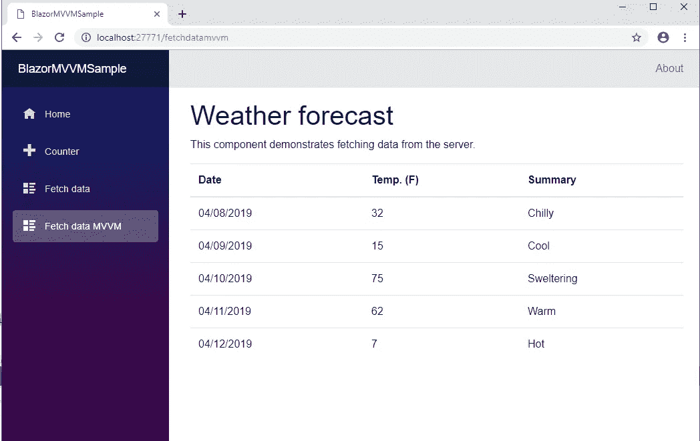
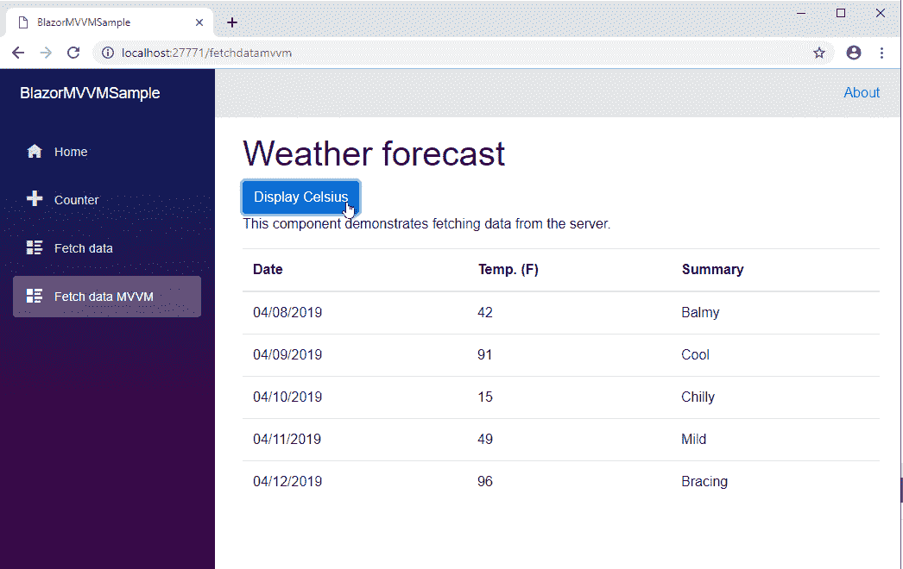

# 在客户端 Blazor 中构建简单的 MVVM 实现

> 原文：<https://itnext.io/building-on-the-simple-mvvm-implemention-in-client-side-blazor-c2e75c703fae?source=collection_archive---------4----------------------->

这是关于在客户端 Blazor 中实现模型-视图-视图模型系列的第二篇文章。在位于此处的第一篇文章中，我们采用了默认的 hosted Blazor 应用程序模板，并使用具有独立视图、视图模型和模型的 MVVM 重新实现了 FetchData 页面:

[](https://medium.com/@haywireiv/a-simple-mvvm-implementation-in-client-side-blazor-8c875c365435) [## 客户端 Blazor 中一个简单的 MVVM 实现。

### 如前所述，我正致力于将我的生产 Silverlight 应用程序迁移到一个新的平台上。我的…

medium.com](https://medium.com/@haywireiv/a-simple-mvvm-implementation-in-client-side-blazor-8c875c365435) 

在本文中，我们将向我们构建的示例客户端添加一些额外的功能。目标是展示一些与构建标准业务线应用程序时可能遇到的情况类似的场景。该项目的代码位于 GitHub 的这个存储库中:

[](https://github.com/lchendricks/BlazorMVVM) [## lchendrick s/blazormvm

### 一个客户端 Blazor MVVM 实现。通过在…上创建帐户，为 lchendricks/BlazorMVVM 的开发做出贡献

github.com](https://github.com/lchendricks/BlazorMVVM) 

本文的起点是前一篇文章的结尾，代码可以在 ArticleOne 分支或 4.1 版本中找到。本文的终点将是 ArticleTwo 分支和 4.2 版本。

# 使用 ViewModel 自定义数据视图

在第一篇文章中，FetchDataModel 中的“RetrieveForecastsAsync()”方法调用了 Web API，并直接将 WeatherForecast[]返回给 ViewModel。这不是一个合适的模型实现，而是在将示例应用程序放在一起时为了简单起见而做的。我们的模型应该包含我们的对象和相关的逻辑，而视图模型应该只包含在视图中显示数据所需的内容。我们将更新我们的模型来保存我们的 WeatherForecast[]，然后在我们的应用程序中实现一个“来自业务的新需求”。

在我们的假想场景中，我们的企业找到了一个新的基于云的提供商，该提供商将以当前提供商一半的成本为我们提供预测数据。唯一的问题是他们只提供摄氏温度的数据，而不是华氏温度。营销部门意识到我们可以使用提供的数据自己计算这个数字，但他们也认为同时向用户提供这两个数字是压倒性的，会使他们在使用应用程序时感到困惑。已经决定，应用程序现在必须只显示一个温标，并提供一个来回切换的选项。默认情况下，应用程序加载时显示华氏温度，因为焦点研究小组发现摄氏温度太令人困惑。

为了模拟服务提供者的变化，我们将实现一个 IWeatherForecast 接口，但不包括 TemperatureF 属性。我们的天气预报类现在看起来像这样:

# 更新模型

我们希望在模型中正确存储检索到的数据。为此，我们将添加一个私有成员变量和一个公共方法，以允许 ViewModel 访问我们的预测。在这个方法中，我们将 setter 设为私有，因为 ViewModel 不允许修改模型中的数据。这是我们添加的代码:

```
private IWeatherForecast[] _weatherForecasts;
public IWeatherForecast[] WeatherForecasts { get => _weatherForecasts; private set => _weatherForecasts = value; }
```

我们不想再返回 WeatherForecast[]数组；ViewModel 现在将访问模型的公共属性。我们必须将 Web API 调用的结果存储在模型中，因此我们更改了 RetrieveForecastsAsync()上的签名和代码，因此它现在如下所示:

```
public async Task RetrieveForecastsAsync()
{
  _weatherForecasts = await _http.GetJsonAsync<WeatherForecast[]>
    ("api/SampleData/WeatherForecasts");
}
```

这还需要更改我们的 IFetchDataModel，以便通过更新现有方法和添加所需的天气预报公共属性来匹配新代码。我们的模型现在看起来像这样:

# 更新视图模型

我们现在必须打开视图模型并重写“RetrieveForecastsAsync()”方法。首先，我们删除不再使用的局部私有变量的赋值，然后添加代码，从模型中的公共属性填充变量。在许多真实世界的场景中，我们会使用完全不同的类来保存我们呈现给视图的数据，但是在这个简单的例子中，我们将坚持使用 WeatherForecast 类。然后，我们遍历并更改 WeatherForecast 的所有引用，使其成为 IWeatherForeCast 的引用。FetchDataViewModel-的新代码如下:

构建更新项目的最后一步是现在进入 FetchDataView 并删除 Temp 的行。(F)删除@ forecast.TemperatureF 的行。我们已经实现了我们的“新服务提供商”,但经过这么多努力，我们现在拥有了看起来与我们已经拥有的相同的应用程序，但显示的信息更少。


# 添加新功能

现在我们的应用程序又可以工作了，让我们把新的需求放在适当的位置。让我们从默认显示华氏温度开始。因为我们已经知道我们将来回交换，所以我们可以在视图模型中添加一个新的私有布尔变量。

```
private bool _displayFahrenheit;
```

我们将在构造函数中将该值设置为 true

```
_displayFahrenheit = true;
```

然后将下面的公共属性和方法添加到我们的视图模型中。然后我们可以使用 Ctrl +。快速操作将它们拉至 IFetchDataViewModel。

```
public string DisplayTemperatureScaleShort
{
   get
   {
      return _displayFahrenheit ? "F" : "C";
   }
}public int DisplayTemperature(int temperature)
{
   return _displayFahrenheit ? 32 + (int)(temperature / 0.5556) :
     temperature;
}
```

我们现在将使用公共可用的属性来更新视图中的表头

```
<th>Temp. (@fetchDataViewModel.DisplayTemperatureScaleShort)</th>
```

并使用新方法更新表体中的温度显示。

```
<td>@fetchDataViewModel.DisplayTemperature(@forecast.TemperatureC)</td>
```

如果我们再次启动我们的应用程序，气温现在以华氏温度显示，即使服务返回摄氏温度。我们已经使用我们的视图模型为我们的视图提供了由模型提供的数据的修改版本，而没有改变原始数据。



我们收到的最后一个要求是允许用户将显示的温度从华氏温度切换到摄氏温度。我们将保持简单，只需在页面上直接添加一个按钮，让他们进行切换。为了支持这一点，我们将向 ViewModel 添加另一个属性和另一个方法。我们将添加的属性只是为了显示温标的全名

```
public string DisplayOtherTemperatureScaleLong
{
   get
   {
      return !_displayFahrenheit ? "Fahrenheit" : "Celsius";
   }
}
```

这个方法只是切换我们之前创建的布尔值。

```
public void ToggleTemperatureScale()
{
   _displayFahrenheit = !_displayFahrenheit;
}
```

一旦我们把所有东西都放到接口上，FetchDataViewModel 现在看起来就像这样:

现在，我们可以进入视图并添加一个按钮，允许我们切换温标并将其放在页面顶部附近。

```
<button class="btn btn-primary" onclick=@fetchDataViewModel.ToggleTemperatureScale>Display @fetchDataViewModel.DisplayOtherTemperatureScaleLong</button>
```

一旦完成，我们就可以启动我们的应用程序，并使用我们的新按钮切换温度显示。



# 今天到此为止

就是这样！我们已经解决了原始实现的一个小缺点，并更改了我们的模型，以接受来自类似但略有不同的服务的数据。随后，我们更新了我们的视图模型和视图，以实现我们收到的新业务需求。我希望有助于展示在客户端 Blazor 上实现 MVVM 的这种方式的灵活性。目前，我将继续构建这个演示。在下一篇文章中，我计划使用两个模型来实现我们下一个新的应用程序特性。

更新:本系列的第三篇文章现已发表。点击下面的链接阅读。

[](/adding-features-to-a-simple-blazor-mvvm-client-with-composition-f31bfb01e20a) [## 用 composition 为一个简单的 Blazor MVVM 客户端添加特性

### 这是详细介绍在客户端 Blazor 中实现 MVVM 模式的一种方法的系列文章的第三篇。如果你…

itnext.io](/adding-features-to-a-simple-blazor-mvvm-client-with-composition-f31bfb01e20a)