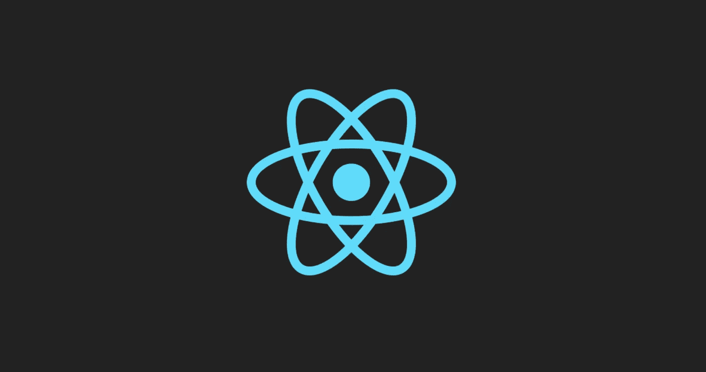
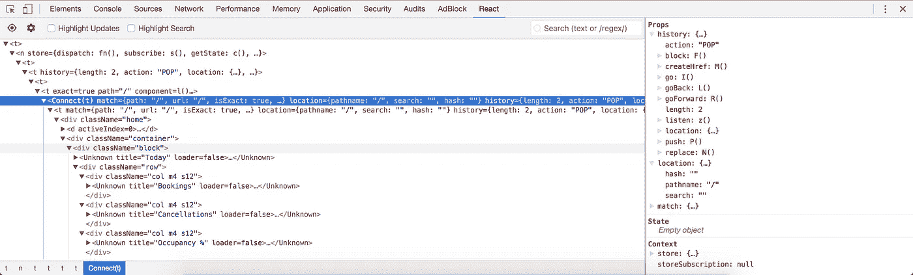

# 构建 React 应用程序第 1 部分—为什么要 React？

> 原文：<https://itnext.io/building-react-app-part-1-why-react-1a4ecdaffd6e?source=collection_archive---------8----------------------->

注意:这里的重点是 React 和我为什么喜欢它，而不是它与其他可用的框架或库相比如何。如果你是一个初学者，那么这不适合你，在阅读这之前，你应该检查 React 的官方网站或一些入门文章。



React 是关于构建声明式用户界面的，并且有所有的附加功能让你能够做到这一点。

React 只是 JavaScript，有一个很小的学习曲线与之相关，只是一些函数和如何使用它们。之后，你的 Javascript 技能会让你成为一名更好的 React 开发人员，不像在 XYZ 框架中，你会围绕它发展你的技能，并最终融入其中，但之后你会成为 XYZ 框架开发人员，而不是 JavaScript 开发人员。

> **React 是一个库而不是一个框架。**

# 让我全力以赴的事情很少

## 让 Javascript 变得有趣

首先是 JSX，能够用 javascript 编写 HTML 并混合各种东西是很棒的。第二是用普通的旧 Javascript 创建带有状态和属性的模板和数据绑定。

```
import React, { Component } from 'react';
import './home.css'
import Layout from '../../components/layout'
import Actions from './actions'

export default class Home extends Component {

  constructor(props) {
    super(props);
  }

  componentDidMount() {
    this.props.dispatch(Actions.test("John Doe"));
  } render() {
    return (
      <Layout className="home">
        Welcome Home {this.props.test}
      </Layout>
    );
  }
}
```

## 反应性质

React 的名字就说明了一切。每个用户界面都与其底层状态相关联，并且在状态更新时完美地适应变化。所有这些改变都在**虚拟 DOM** 中完成。然后，我们根据需要管理数据的更新，而不必担心在浏览器的实际用户界面上反映这些更新所需的步骤(因为我们知道 React 会这样做，而且它会以高效的方式这样做！)

## 每样东西都是组件

> 这就是未来。

多年来，人们一直关注干净的架构，遵循设计原则之类的东西。分离关注点，能够分配责任并将应用程序分成小块是构建干净的可伸缩应用程序的关键要素之一。

组件是代码的小而独立的部分，如果你对它们进行足够的抽象，使**具有低耦合性**，你就可以在任何其他文件甚至任何其他项目中重用它们，只需导入它们。甚至像自定义项目符号这样的小的可重用项目也可以是一个组件，一些常见的例子如页眉、页脚、按钮、侧栏等。在 React 中，完整的视图也是一个组件，并且其中的元素也是组件。

并非每个组件都是为了执行除显示状态或数据之外的任务，因此开始了无状态组件的时代。

```
**const** header = (props) => {

  **return** (
    <div className="header">
      
    </div>
  );
};
```

## 出色的开发工具

一个简单的 Chrome 扩展为调试应用程序提供了如此多的便利，包括虚拟 DOM 中的视图。



## 来自脸书

脸书的一些大人物是它的幕后策划者。脸书内部正在广泛使用 React，因此信任是存在的。

## 积极的副作用

一旦您熟悉了使用 React 构建 web 应用程序，您也可以轻松地使用 React-Native 并开始跨平台(IOS 和 Android)的移动应用程序开发。虽然不完全相似，但基本原理是一样的。

这是第 1 部分的全部内容……对于初学者来说，有很多全面的文章可以带你进入和退出 React。我的重点是强调 react 的一些令人惊叹的方面，然后带您了解如何设置 React 环境和构建令人惊叹的 UI。

在第 2 部分中，我们将看看 **React 样板文件的设置。对于每一个新开发人员来说，环境设置可能是最大的入门障碍，我写这篇文章的动机就是要打破这个障碍。**

继续[第二部分——架构样板](https://medium.com/@ankitsharma6466/building-react-app-part-2-architecture-boilerplate-683b992089a6)

[](https://medium.com/@ankitsharma6466_4003/building-react-app-part-2-architecture-boilerplate-683b992089a6) [## 构建 React 应用程序第 2 部分—架构样板

### 教程结束后，最大的入门障碍是环境设置和应用程序架构…

medium.com](https://medium.com/@ankitsharma6466_4003/building-react-app-part-2-architecture-boilerplate-683b992089a6) 

如果你喜欢这个，认为这是有用的，我在这里做得很好，那么请不要忘记鼓掌。你的赞赏很有价值，让我有动力。

干杯！！