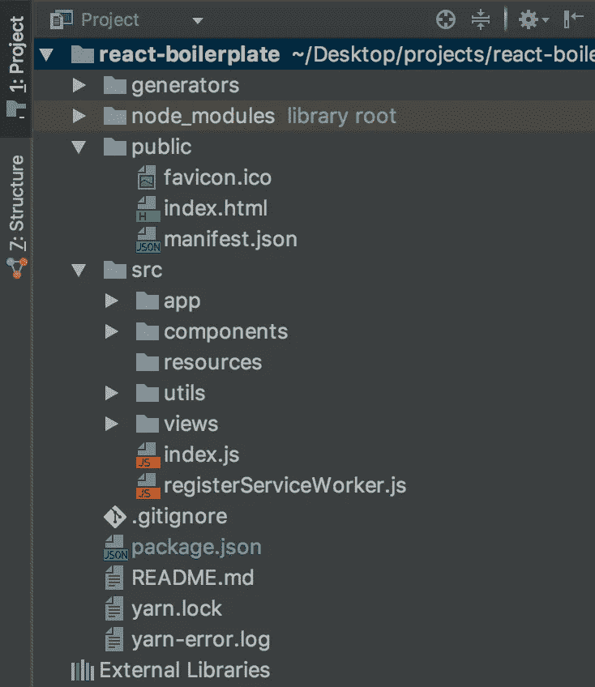
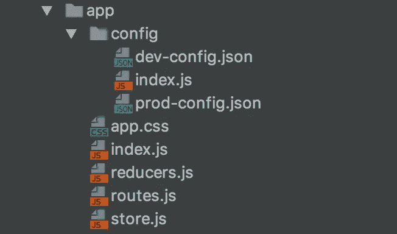
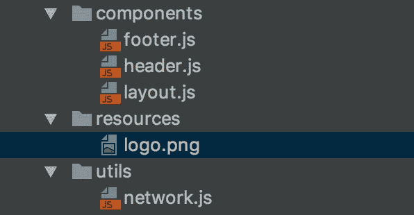
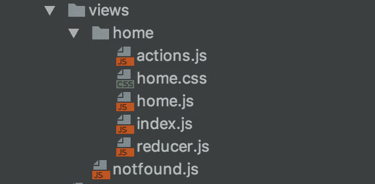

# 构建 React 应用程序第 2 部分—架构样板

> 原文：<https://itnext.io/building-react-app-part-2-architecture-boilerplate-683b992089a6?source=collection_archive---------2----------------------->

> [点击这里在 LinkedIn 上分享这篇文章](https://www.linkedin.com/cws/share?url=https%3A%2F%2Fitnext.io%2Fbuilding-react-app-part-2-architecture-boilerplate-683b992089a6%3Futm_source%3Dmedium_sharelink%26utm_medium%3Dsocial%26utm_campaign%3Dbuffer)

教程结束后，最大的入门障碍是环境设置和应用架构。即使您对 React 及其生态系统有足够的了解，构建一个功能齐全、可伸缩和模块化的应用程序仍然是一个挑战。


虽然没有完美的、适合所有人的解决方案。在本文中，我们将尝试达到这样一个水平，即使用预设的样板代码可以构建一个好的客户端应用程序，这将帮助您在几分钟内开始开发。

我并不是说这是完美的或者可以在所有情况下使用。这是我已经使用了一段时间的产品，效果非常好。

[](https://github.com/ankitsharma6466/react-boilerplate) [## ankitsharma 6466/react-样板文件

### 样板代码帮助您开始开发高度优化的 PWA。

github.com](https://github.com/ankitsharma6466/react-boilerplate) 

以上是我的参考样本库的链接。欢迎反馈和改进。

*注:本文重点是* ***不是*** *学习* ***如何在 React 中编码，*** *有很多牛逼的文章可用。我假设您至少了解 react、redux、react-routing 的基础知识。这都是关于设置环境，使用样板文件构建应用程序。*

# 我们开始吧

有许多方法可以进行 React 设置。在开始设置之前，需要知道一些事情。除了 react 之外，我们还将使用

*   [Webpack](https://webpack.js.org/) —用于构建和捆绑
*   [Redux](https://redux.js.org/) —用于状态管理
*   Axios —用于 Http 呼叫
*   [React 路由器](https://github.com/ReactTraining/react-router) —用于路由和历史回溯管理

这些是与 React 一起广泛使用的一些库和实用程序(可能还有其他替代程序，完全取决于开发人员)。如果你先阅读以上内容，然后继续使用样板文件，那会很好。

## 奖金

我们已经使用了脸书介绍的 [**create-react-app**](https://github.com/facebook/create-react-app) ，它去掉了 70%的样板文件设置。这是一个包装器，所以你不需要担心环境设置、Webpack 配置、捆绑包属性、开发服务器等等。所有这些令人头痛的事情都由脸书处理，所以您所有的担心都是围绕构建应用程序。

create-react-app 用 react 为我们提供了完整的环境设置，但如今应用程序需要的不仅仅是 React。应用程序正在快速增长，而像状态管理这样的东西很快就失去了控制。

让我们不要浪费时间讨论为什么，做什么和不做什么！！一份很棒的申请在等着你。

## 设置

1.克隆存储库。

```
git clone [https://github.com/ankitsharma6466/react-boilerplate.git](https://github.com/ankitsharma6466/react-boilerplate.git)
```

2.安装模块。(纱线或 npm)

```
yarn install
```

3.启动应用程序

```
yarn start
```

> 瞧啊。！你的应用已启动并运行。

位于`http://localhost:3000`的窗口将显示欢迎回家信息。默认情况下，这是在`development`环境中运行应用程序的开发服务器。

## 该结构



目录结构

我们将重点关注两个主要目录 **public** 和 **src** 。现在先忽略**生成器**目录，我们稍后会谈到它。

## 公众的

这包含了基本的 HTML 模板，react 应用程序将在其中呈现。像全局字体，一些第三方库，PWA 之类的东西都在这个文件夹中完成。建议不要编辑模板，直到您觉得后果完全在控制之下。

## 科学研究委员会

> 这是所有奇迹发生的地方。

这是你的完整申请。让我们一个接一个地进入子目录。

1.  **app** —包含应用程序的基本配置文件和入口点。
2.  **组件** —包含应用广泛使用的全局组件，如页眉、页脚、按钮等。
3.  **资源** —包含图标、图像、字体和类似的东西。
4.  **实用程序** —包含应用程序范围的实用程序，如网络、存储、常量、日期时间；任何其他常见的实用工具放在这里。
5.  **视图** —包含更多的目录，每个目录代表任何特定功能的完整视图组件，例如:主页。

除此之外，它还有`index.js`，这是应用程序的入口点。dev 服务器从这个文件执行。对于符合 PWA 资格的应用程序，它应该注册一个服务人员，这就是为什么我们有`registerServiceWorker.js`

```
**import** React **from** 'react';
**import** ReactDOM **from** 'react-dom';
**import** App **from** './app';
**import** registerServiceWorker **from** './registerServiceWorker';

ReactDOM.render(<App />, document.getElementById('root'));
registerServiceWorker();
```

以上是`index.js`的内容，它什么也不做，只是提供应用程序组件来作出反应，然后用 DOM 中的`#root`在元素中呈现。

## 应用



该目录包含应用程序的基本配置。

1.  **index.js** —提供入口点，连接 redux 商店并绘制路线。
2.  **reducers.js** —包含将被映射到全局状态存储的每个视图组件的所有 reducers 映射。对于添加的每个新视图，将在该文件中完成条目以映射到其状态对象。
3.  **store.js** —包含 redux 商店设置的所有基本配置。
4.  **routes.js** —包含视图组件映射到并将被访问的所有路由，例如:home 将在`/`被访问，myAccount 将在`/account`被访问。对于添加的每个新视图，将组件映射到其路由的条目将在此处完成。
5.  **app.css** —定义全局 css 规则。例如:应用程序的字体大小，字体家族，页眉，页脚等 css。
6.  **配置** —子目录包含两个普通的。定义应用程序中使用的配置值的 json 文件。例如:api 服务器的基本 URL，数据刷新率等。基于环境`index.js`将相应地返回 config.json。这部分比较主观，看需求。人们也可以将`.env`文件用于环境特定的字段。在 create-react-app 文档中了解更多信息。

## 组件、资源和实用程序



组件包含应用广泛使用的子组件，如:页眉，页脚等。这些子组件可以是常规的，也可以是无状态的。资源和效用如上所述。

# 视图

> 这就是事情变得有趣的地方



如上所述，它包含子目录，每个子目录代表属于某个路由的完整视图组件，例如:home。

还有一个`notFound.js`，如果没有匹配的路线，它将被渲染。

> 起初，对于希望开发一个简单应用的人来说，这一切看起来有点过头了，但是相信我，事情会很快失控。开始时安全比以后后悔要好。

## 主页

这不一定是名称，它将根据您正在构建的视图类型而变化。例如:我的帐户，购物车，订单等。

我们应用程序中的每个视图至少有 5 组文件——actions、index、reducer、home 和 CSS。

**index.js**

```
**import** { connect } **from** 'react-redux';
**import** Home **from** './home'

**function** mapStateToProps(state) {
  **return** {
    test: state.home.test,
    testData: state.home.testData
  };
}

**export default** connect(mapStateToProps)(Home);
```

这是视图的入口点。我们在这里为视图定义所有的状态映射。`mapStateToProps`是将状态对象从 reducer 提供给 props 最终被视图消费的函数。每当我们在 reducer 中定义一个新的状态时，我们也需要将它映射到这里。

**home.js**

```
**import** React, { Component } **from** 'react';
**import** './home.css'
**import** Layout **from** '../../components/layout'
**import** Actions **from** './actions'

**export default class** Home **extends** Component {

  constructor(props) {
    **super**(props);
  }

  componentDidMount() {
    **this**.props.dispatch(Actions.test("John Doe"));
  } render() {
    **return** (
      <Layout className="home">
        Welcome to Home {**this**.props.test}
      </Layout>
    );
  }
}
```

这是主要观点。您为 home 或任何视图编写所有视图结构，定义用户将要进行的所有交互，使用映射到 props 的状态值。

**actions.js**

```
**import** Network **from** '../../utils/network';

**const** actions = {
  test: (msg) => {
    **return** {
      type: "TEST",
      payload: msg
    }
  }
};

**export default** actions;
```

Actions 也称为 ActionCreators，包含针对交互或 onLoad 等的操作或可执行文件。为加载时获取数据等功能定义函数的简单对象。我们遵循 redux 标准向商店发送数据。

**reducer.js**

```
**export default** (state = {
  test: ""
}, action) => {
  **switch** (action.type) {
    **case** "TEST":
      **return** {...state, test: action.payload};
    **default**: **return** state;
  }
};
```

> 反对一个行动，总会有一个反应。

在 redux 的帮助下，我们能够分离动作执行和响应处理——分离关注点。

Reducer 最终将接收 actionCreator 发送的数据。在我们的例子中，动作名`test`分派了一个`msg`有效载荷。Reducer 然后接收并检查动作是什么，然后相应地将数据映射到状态对象。如果没有匹配的动作，则返回默认状态(确保发生这种情况)。

注意:如上所述，我们还需要映射 index.js 中定义的每个状态对象，以便可以通过 props 查看这些状态。

**home.css**

不需要任何特别提及，查看具体风格在这里。

> 大概就是这样…

尝试对 home.js 进行更改，并立即看到这些更改得到反映。

*祝贺您，您现在已经到了不再考虑设置并开始构建应用的阶段。*

> 而且还在继续…

这部分到此为止。这一切看起来很花哨，但仍然有一个陷阱。当你想要一个新的视角，一条新的路线时该怎么做。这很简单，和我一起跳到第 3 部分，我们将讨论添加视图和简化过程。

继续[第 3 部分——组件生成](https://medium.com/@ankitsharma6466/building-react-app-part-3-component-generation-455e77d7b1c6)

[](https://medium.com/@ankitsharma6466_4003/building-react-app-part-3-component-generation-455e77d7b1c6) [## 构建 React 应用程序第 3 部分—组件生成

### 如果你直接在这里登陆，请阅读第一部分和第二部分。

medium.com](https://medium.com/@ankitsharma6466_4003/building-react-app-part-3-component-generation-455e77d7b1c6) 

如果你喜欢这个，并且认为我在这里做得很好，那么请不要忘记鼓掌。你的赞赏很有价值，让我有动力。

干杯！！