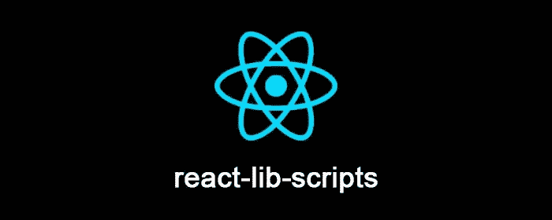

# 使用 react-lib-scripts 构建 React 库

> 原文：<https://itnext.io/building-react-library-using-react-lib-scripts-eab6f0fd21f2?source=collection_archive---------2----------------------->



反应库脚本

嗨，今天我想分享我最新的开源项目，用于构建 [React](https://reactjs.org/) 库、 [react-lib-scripts](https://github.com/antonybudianto/react-lib-scripts) 。

这是一个 CLI，它将帮助开始开发和捆绑库，因此您可以**专注于您的解决方案，而不是工具**。它的灵感来自于[create-react-app](https://github.com/facebook/create-react-app/tree/next/packages/react-scripts)[使用的](https://github.com/facebook/create-react-app)React-scripts，帮助 React 应用开发。

CLI 本身是使用 Heroku 的 [OCLIF 制作的，捆绑器是使用](https://oclif.io/) [Webpack 4](https://webpack.js.org/) 制作的。它还可以捆绑您的库样式和图像。

总的来说， [react-lib-scripts](https://github.com/antonybudianto/react-lib-scripts) 只有两个命令:

*   开始(开始开发流程。这将捆绑和观看你的库源)
*   构建(为发布准备生产就绪包)

# 开始

您可以在此处复制 starter repo:

```
[https://github.com/antonybudianto/react-lib-starter](https://github.com/antonybudianto/react-lib-starter)
```

这是一个演示 [react-lib-scripts](https://github.com/antonybudianto/react-lib-scripts) 用法的启动程序，也是一个使用 [Lerna](https://lernajs.io/) 的单一回购设置。你可以在**包**文件夹中找到**实例-app** 和**实例-lib** 。

> 你可以使用 [react-lib-scripts](https://github.com/antonybudianto/react-lib-scripts) 而不用[react-lib-starter](https://github.com/antonybudianto/react-lib-starter)/[Lerna](https://lernajs.io/)，因为它们只是为开发库提供了一个很好的基础

让我们来看看:

*   example-app(普通的 create-react-app，使用 example-lib)
*   example-lib(我们的 React 库，使用 [react-lib-scripts](https://github.com/antonybudianto/react-lib-scripts) )

让我们确保您位于启动程序的根目录，并安装依赖项:

```
npm install# for yarn user
yarn
```

使用 [Lerna](https://lernajs.io/) 的一个好处是，你只需要一个命令就可以引导和链接你的包依赖关系。大家自举吧！

```
npm run bootstrap# for yarn user
yarn bootstrap
```

它实际上运行`lerna bootstrap`命令，为了方便起见，我把它作为 npm 脚本放在启动器上。这个命令将引导您的所有软件包(包括 npm 安装和链接)，现在您不必为每个软件包手动执行。

# 开发流程

安装好东西后，我们就可以开始开发流程了。

您可以将目录更改为 **example-lib** 并运行:

```
npm start# for yarn user
yarn start
```

您的库现在可以被**示例应用**使用了！

`npm start`脚本是`react-lib-scripts start`的别名

> **重要提示:**您需要在启动或构建命令之前提供 **NODE_ENV** 环境变量。
> 
> 它已经通过 [better-npm-run](https://github.com/antonybudianto/react-lib-starter/blob/master/packages/example-lib/package.json#L14) 在 react-lib-starter 上提供了

现在，您可以将目录更改为**示例应用程序**并运行:

```
npm start# for yarn user
yarn start
```

您现在可以开始库开发了。在更改**示例库**代码时，这些更改也会在**示例应用**上更新。

# 生产流程

好了，你的库已经完成了，可以发布了。

您可以通过运行以下命令来构建您的生产就绪包:

```
npm run build
```

`npm run build`剧本是`react-lib-scripts build`的别名

现在你的包已经在 **lib** 文件夹中准备好了。

接下来，您必须在您的 **example-lib** 的 package.json 上设置以下字段(仅**一次**):

```
"main": "lib/index.js",
"files": [
  "lib",
  ...
],
```

此外，每次预发布时也要突出“版本”字段。

好吧，我们发表吧。

```
npm publish
```

现在，您的库已上线！

> react-lib-starter 还有`npm run release`(别名为`lerna publish`)，可以自动处理依赖关系版本更新、版本选择、git 标记和 npm 发布。

# 常见问题解答

1.  为什么没有测试命令？因为我认为 [Jest](https://facebook.github.io/jest/) 使用起来已经足够简单，几乎没有什么可以抽象掉的。不像 Jest 出现之前，配置测试运行器、框架、覆盖率和其他东西是个麻烦。现在就像运行`jest`:)一样简单
2.  [上卷](https://rollupjs.org/guide/en)？目前，没有，因为在使用他们的节点 API 时有[观察问题](https://github.com/rollup/rollup/issues/1666)。解决之后我可能会重访。
3.  我可以添加[巴别塔](https://babeljs.io/)插件/预置或者 [postcss](https://github.com/postcss/postcss) 插件吗？是啊！检查[这里的](https://github.com/antonybudianto/react-lib-scripts#customize)

[react-lib-scripts](https://github.com/antonybudianto/react-lib-scripts) 项目仍然是新的，需要改进，因此您的**反馈和贡献**将对该项目非常有帮助。

我希望这个故事对你们所有人都有帮助。请对任何反馈/想法/问题做出回应，并友好地**分享**给你可能需要它的朋友，最后，请鼓掌！👏👏👏

感谢阅读！