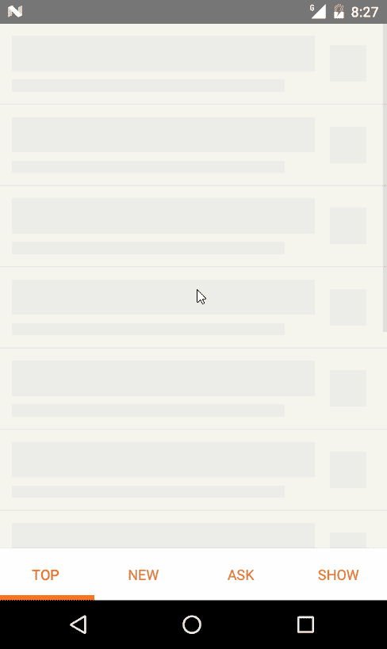
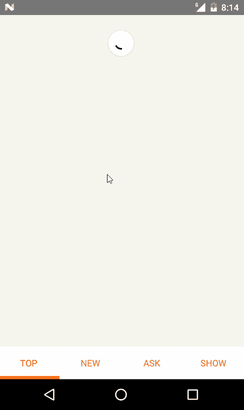

# 构建 React-Native Hackernews 应用程序—第 1 部分

> 原文：<https://itnext.io/building-react-native-hackernews-app-part-1-ac25bc44b903?source=collection_archive---------1----------------------->

## 使用 Redux、Redux-Saga、Immer 和自定义导航解决方案

模拟 GPRS 网络，在开发模式下的 android 模拟器上(大量的 console.log)

最近我玩了 React for web & NodeJS，但没怎么玩 React Native。为了刷新我的记忆，我开始了一个新项目，用 React Native 创建一个 **performant** HackerNews 移动客户端。对于这个项目，我想使用一些我以前没有使用过的库，如 Immer 和 Redux-Saga。我的重点之一是创建一个高性能的 UI 体验，因此我选择实现我自己的导航解决方案，这将在本系列的另一部分中讨论。

## 在这一部分中，我们将重点关注 redux、redux-saga 的设置，以及应用程序的开始屏幕，该屏幕显示了来自 hackernews 的置顶、显示、询问、新故事。这篇文章概述了我所做的选择和最佳实践。

正在进行的工作和源代码可以在这里找到:【https://github.com/Rusfighter/HackerNewsRN

# 堆栈

*   反应本地(无 Expo，进一步阅读我的选择)
*   [Redux](https://redux.js.org/) 进行状态管理&缓存
*   [减少副作用](https://github.com/redux-saga/redux-saga)
*   [浸入](https://github.com/mweststrate/immer)以获得不变性
*   为导航渲染道具
*   分形项目结构

# React-native-cli 与 Expo-cli

我选择不使用 expo starter kit 有一个简单的原因:我永远也不会用到的依赖项会使部署的二进制文件非常大(20mb+)。另一个原因是对我将来可以使用的依赖项有更多的控制。).

# 黑客新闻

我选择创建一个 hackernews 克隆应用程序的原因非常简单。我不想编写任何后端代码，只想专注于客户端部分，因此我查看了可用的公共 API 以及人们迄今为止用它们创建的东西。其中一个项目:[https://github.com/hidroh/materialistic](https://github.com/hidroh/materialistic)这是一个用 Java 为 Android 开发的黑客新闻应用，看起来非常好。我想看看我能在多大程度上推动 react-native，使其成为一个本地应用程序，甚至更好。hackernews 的公共 API 可从这里获得:[https://github.com/HackerNews/API](https://github.com/HackerNews/API)

# 我们开始吧

首先你需要为 react native 设置你的环境，文档可以在这里找到:[https://Facebook . github . io/react-Native/docs/getting-started . html](https://facebook.github.io/react-native/docs/getting-started.html)选项卡上:**用本地代码构建项目**

之后你可以在 https://github.com/Rusfighter/HackerNewsRN[克隆我的回购](https://github.com/Rusfighter/HackerNewsRN)

运行: ***npm 安装&反应-本机链接反应-本机向量-图标***

所有 app 相关代码都可以在/src 目录下找到。我选择对我的文件和目录使用分形结构模式(如果你感兴趣的话，请阅读这篇文章),我发现它工作得很好。app 的入口点是/src/App.js

# **Redux + Redux Saga + Immer**

对于状态管理，我选择了著名的 redux 与 redux-saga 的组合。众所周知，副作用(API 请求等)令人头疼，这也是人们开发 Redux Saga 的原因。redux saga 的好处之一是，我可以让我的 reducers 非常简单，并将硬逻辑放在中间件中(redux saga)。为了保持我的 reducers 不可变，我使用了一个名为 [immer](https://github.com/mweststrate/immer) 的包。这个包与我的助手功能配合得非常好，它让你避免了切换的情况。有了这种组合，你可以很容易地创建纯减速器！

帮助器函数的最终结果，您可以使用它来创建减速器:

减速器现在看起来像这样:

如你所见，我们可以直接推送到数组(第 19 行)并分配给一个对象(第 21 行)，这都归功于 immer。此外，我们不再需要使用任何开关盒。

## **保持 redux 状态正常化**

保持状态正常化总是最好的做法，**即使你认为你现在不需要它，你也会**。说真的，照做就是了！！！
在这里阅读更多关于如何创建规范化状态以及为什么应该创建的内容:[https://redux . js . org/recipes/structuringreducers/normalizingstateshape](https://redux.js.org/recipes/structuringreducers/normalizingstateshape)

## 还原传奇

由于这是一个很难的话题，你应该深入研究(或者只是复制)，我将告诉你到目前为止我使用的东西和技巧，使这成为一个简短的部分:

目前我只对 API 请求使用 redux-saga(src/utils/API . js)。我使用的一种模式是确保一个唯一的请求不会出现两次，从而减少网络流量。为了向您展示我的意思，请看下面的代码(很抱歉使用了错误的名称约定，fetchItem = watchGetItem):

fetchItem 函数正在等待 GET_ITEM 类型的事件。当这个事件发生时，它通过 id(第 43 行)缓存 getItem 函数的执行，并在后台执行 getItem(第 8 行)函数**，继续等待下一个 GET_ITEM 事件。但是，如果使用相同的 id 调度 GET_ITEM 事件，而 getItem 函数仍然忙于该 id，则 getItem 函数将不会被执行。结果是我们**不需要**手动取消 http 请求或浪费请求，这提供了更好的网络控制。这就是使用 redux-saga 的威力之一！这个功能是[所熟悉的，在 redux-saga 中实现了最新的](https://redux-saga.js.org/docs/advanced/Concurrency.html)效果。为了熟悉 redux-saga，我建议阅读他们的文档并观看一些 youtube 视频。**

在/src/store.js 中查看 redux 及其中间件的配置。这些文件是 ducks，这意味着每个类型的 reducer、常量和动作创建者都在一个文件中声明(例如 src/redux/comments.js 包含 reducer +动作创建者和常量)。

# 主屏幕

我的选择之一是保持导航简单快捷。因此，我为主页选择了一个底部的 tabbar 布局，用户可以在故事列表之间快速导航。为此，我使用了一个名为 *react-native-tab-view* 的包，在我的实践中，如果你正确使用它，它会有最好的性能。

诀窍是延迟加载标签(据我所知在 *react-native-tab-view* 中没有这个选项)。查看 *_renderScene* 函数，如果有不清楚的地方可以在评论中询问！该部分的完整源代码位于/src/screens/Home.js 中

## 置顶，新，询问，显示

这些选项卡在外观和功能上非常相似，唯一的区别是从存储中选择的数据和获取数据的调度事件。

Ask 选项卡的来源(src/screens/home/Ask.js):

两个要点:

*   如果 render 方法不依赖于 props，除非它是一个函数并且没有状态，则实现一个返回 false 的 shouldComponentUpdate 方法。考虑这种方法并知道何时真正应该重新渲染组件总是好的(大多数时候这是很昂贵的)
*   如果您使用动作创建器，您不需要将它们包装在调度函数中，react-redux 会自动为您完成(第 26 行)

## 故事列表

一份外卖:

*   因为只有一个 API 请求来获取 Asks stories 的整个列表，所以我们手动实现了一个分页(第 11 行)，当用户滚动到列表底部时，来自商店的更多元素被添加到平面列表中(第 22 行)

StoryListItem.js

三个要点:

*   如果项目没有在 redux 存储中定义，我们只获取 story，因此已经为 story 应用了应用程序运行时缓存(第 6 行)
*   我们只重新渲染项目，如果项目已经改变(性能)
*   我们有两个表示，一个虚拟物品只是一些像媒介一样的花哨的装载效果，另一个是真实的表示

在 src/screens/home/story listitem . js 中查看该文件的完整源代码

结果是:

模拟 GPRS 网络，在开发模式下的 android 模拟器上(大量的 console.log)

我希望我给出了一些我认为几种情况下最佳选择的见解。如果你认为你有更好的解决方案或想为这个项目做贡献，请随时 PM 我或创建一个 PR！

这是第一部分的结尾。我希望你喜欢这篇文章，并学到了一些东西。在接下来的部分中，我们将讨论导航、渲染评论、处理网络错误、缓存、渲染 html 等等…

项目的当前状态有自定义导航，html 渲染和评论页面。所以，继续玩吧，告诉我在下一部分中我应该如何解释这些组件。

> 还有一件事，我不打算在任何商店发布这个应用程序，所以你可以自由地这样做，只是把一些参考 github repo:)

直到下一次！