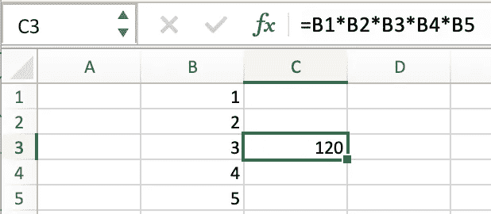

# 使用 LiveData 和 SavedStateHandle(或类似 Rx 的等效方法)构建反应式 ui

> 原文：<https://itnext.io/building-reactive-uis-with-livedata-and-savedstatehandle-or-equivalent-approaches-4e934487035f?source=collection_archive---------0----------------------->


*也可以关注/r/android_devs* 上的 [*相关讨论线程。*](https://www.reddit.com/r/android_devs/comments/j55e1x/building_reactive_uis_with_livedata_and/)

**LiveData** 是被误解的猛兽。您经常会看到类似“LiveData 不属于存储库”的评论，或者由于 RxJava、协程通道或协程流的存在——根本没有理由使用 LiveData。

虽然这些库中有一些组件具有重叠的职责(BehaviorRelay、ConflatedBroadcastChannel、MutableStateFlow)，但这并不意味着 LiveData 是无用的。

随着 Jetpack 相对较新的增加，例如`liveData {`协程生成器，LiveData 实际上非常有趣。

# 什么是 LiveData？

如果你试图找到 LiveData 的定义，你会发现它是一个“反应性的、可观察的、生命周期感知的数据持有者”。

我们知道它是可以被观察到的，并且我们知道它保存 1 个数据值，这个数据值将被重新发送给任何新的观察者(对它所做的任何更改也会被发送)，就像任何 BehaviorRelay 一样。但是它有什么特别之处呢？

由于 LiveData 的生命周期意识，它有自己的“激活状态”(`onActive`和`onInactive`)。它让你知道什么时候有一个活动的观察者，什么时候不再有任何活动的观察者。

诀窍在于，这使它远远不只是“一个日常数据的持有者”。**这允许 LiveData****表示*反应数据源*** 。

我甚至敢打赌，如果 Room 的`ComputableLiveData`是一个指示的话，那么 ***这个*** 就是创建 LiveData 的最初目的(因为它也依赖于`onActive`来触发查询结果的刷新，如果对它的一个写操作使表无效的话)。

# 为什么我需要反应式数据源？

如果您的数据或状态会随着时间而变化，那么通知*变化*要比轮询可能的变化容易得多(如果我们试图在错误的时间获取数据，可能会错过变化)。

这意味着通过使用“观察者”(或更改监听器)，我们可以在发生更改时接收更新，从而不会与我们的数据或状态“不同步”——特别是如果这些更改是异步进行的(例如，仅当网络可用时)。

在过去，人们一直使用 event bus 来实现这一点，但在大多数情况下这实际上是不必要的——特别是如果您的数据层(例如，Room 的`LiveData<List<T>>`)允许这种自动失效事件。

# LiveData 有什么帮助？

查看 ComputableLiveData 的实现:

```
/* 
* Copyright (C) 2017 The Android Open Source Project 
* Licensed under the Apache License
*/
mLiveData = **new** LiveData<T>() {
    @Override
    **protected void** onActive() {
        mExecutor.execute(mRefreshRunnable);
    }
};**final** Runnable **mInvalidationRunnable** = **new** Runnable() {
    @MainThread
    @Override
    **public void** run() {
        **boolean** isActive = mLiveData.hasActiveObservers();
        **if** (mInvalid.compareAndSet(**false**, **true**)) {
            **if** (isActive) {
                mExecutor.execute(mRefreshRunnable);
            }
        }
    }
```

每当失效发生时，Room 能够强制刷新当前加载的数据。

这不是房间独有的。我们可以很容易地为 Firebase 编写自己的代码:

```
**private** val **db** = FirebaseDatabase.getInstance().referencefun getDeviceData(deviceId: String) : LiveData<Device> {
  **return** object: MutableLiveData<Device>() {
    **private** val mutableLiveData = **this

    private** var query: Query? = **null
    private** val listener: ValueEventListener = 
      object: ValueEventListener {
        **override** fun onDataChange(dataSnapshot: DataSnapshot) {
          val device = dataSnapshot.getValue(Device::**class**.java)
          mutableLiveData.value = device
        }

        **override** fun onCancelled(dataError: DatabaseError) {
        }
      }

    **override** fun onActive() {
      query?.removeEventListener(listener)
      val query = **db**.child(deviceId).child(**"config/device"**)
      **this**.query = query
      query.addValueEventListener(listener)
    }

    **override** fun onInactive() {
      query?.removeEventListener(listener)
      query = **null** }
  }
}
```

通过这种方式，我们能够将任何反应性数据源包装为 LiveData。当 LiveData 处于活动状态时，我们观察数据集的变化，当它不活动时，我们停止观察。

# 用 LiveData 建模用户界面状态

之前，我已经提到过“数据”或“状态”。我们大部分时间都在谈论数据，但是状态呢？毕竟，通常数据是基于当前状态提取的(想想活动数据过滤器)。

在我们的模型中(例如，一个 Jetpack ViewModel，或者类似的模型)，我们可以为值创建字段，当它们被修改时，这些字段会通知我们发生了变化。

我们可以用`MutableLiveData`、`ConflatedBroadcastChannel`、`MutableStateFlow`或`BehaviorRelay`来做这件事——毕竟，从架构的角度来看，它们是同一件事。

想象一个电子表格。



这里我们有`B1`、`B2`、`B3`、`B4`、`B5`作为我们模型的字段。我们有一个到`C3`的转换，它组合了 5 个值，并将它们映射到一起相乘。

现在想象一下 Kotlin 中相同的代码，除了同时处理进程死亡(当然)。

```
**private val b1** = **savedStateHandle**.getLiveData(**"b1"**, 1)
**private val b2** = **savedStateHandle**.getLiveData(**"b2"**, 2)
**private val b3** = **savedStateHandle**.getLiveData(**"b3"**, 3)
**private val b4** = **savedStateHandle**.getLiveData(**"b4"**, 4)
**private val b5** = **savedStateHandle**.getLiveData(**"b5"**, 5)

**private val c3** = *combineTupleNonNull*(**b1**, **b2**, **b3**, **b4**, **b5**)
                    .*map* **{** (b1, b2, b3, b4, b5) **->** b1 * b2 * b3 * b4 * b5
                    **}**
```

其中`combineTupleNonNull`是来自[***LiveData-combine tuple-Kt***](https://github.com/Zhuinden/livedata-combinetuple-kt)的帮助器函数。`combineTuple`和`combineTupleNonNull`帮助器利用`MediatorLiveData`，这是 LiveData 的组成元素，允许描述任意操作符。这也是引擎盖下`map`和`switchMap`的基础。除了内部操作符，你通常不需要在你的代码中把`MediatorLiveData`看作`MediatorLiveData`，只有当它的转换完成后才作为`LiveData`公开。

事后，现在我们能做的

```
**viewModel.c3**.observe(viewLifecycleOwner) { c3 ->
    println("$c3")
}
```

然后我们可以做

```
**b1**.value = 5
```

当它改变时，我们将立即获得最新的值:接收基于我们的状态的组合值，通过包装在可观察值容器中的不可变值建模。就像 Excel 一样！享受玻璃钢！

我们甚至不需要使用`copy`😏

**警告:** `**savedStateHandle.getLiveData("key", initialValue)**` **有一个 bug，即初始值没有持久化到 Bundle 中。要解决这个问题，您可以做:**

```
savedStateHandle.getLiveData("key", **initialValue**).apply { 
    **if**(**value** === **initialValue**) {
        **value** = **initialValue** *// call setValue()* }
}
```

# 使用反应状态建模进行验证

当我们的州使用多个 LiveDatas 时，我们获得了简化验证的额外好处。

由于我们可以组合任意数量的实时数据，我们可以将输入映射到条件，然后以反应的方式评估这些条件是`true`还是`false`。

```
**val isLoginEnabled** = *validateBy*(
    **username**.*map* **{ it**.*isNotBlank*() **}**, 
    **password**.*map* **{ it**.*isNotBlank*() **}** )
```

在这个代码片段中，我使用了助手函数[***LiveData-validate by-Kt***](https://github.com/Zhuinden/livedata-validateby-kt/)。不涉及魔法，只是组合然后映射进来的`LiveData<Boolean>`看看它们是否都是真的。

这可以大大简化输入验证。

# 使用 LiveData 和协同例程进行异步数据加载

当然，状态本身比数据更容易管理——毕竟，数据是异步加载的。

幸运的是，管理这个场景并不困难，因为 LiveData 已经随`Transformations.switchMap`一起提供了。

```
**private val** selectedUserId= **savedStateHandle**.getLiveData(**"selectedUserId"**)**private val** selectedUser = selectedUserId.***switchMap*** { userId ->
    dao.findUserById(userId)
}
```

这本身就已经确保了无论何时所选的用户 ID 发生变化，最终都会加载并提供正确的数据。

在某些情况下，可能需要执行多个后台操作来获取数据，而不是直接读取作为 LiveData 公开的数据源。在这种情况下，`liveData {`协程构建器会有所帮助，因为它可以在后台线程上运行任何挂起函数，将结果发送到 UI 线程，但确保使用`emit`和`emitSource`正确取消后台操作(或忽略其结果)。

```
**private val** someValue= **savedStateHandle**.getLiveData(**"someValue"**)**private val** someData = someValue.***switchMap*** { value ->
    ***liveData*** {
        val someFetchedValue = suspendingCall(value)
        ***emit***(someFetchedValue) *// one-off async fetch*
    }
}
```

在更复杂的情况下，我们甚至可以使用`emitSource`来“连接到一个新的 LiveData 包装的反应式数据源”。

```
**private val** someValue= **savedStateHandle**.getLiveData(**"someValue"**)**private val** someData = someValue.switchMap { value ->
    ***liveData*** {
        val profile = getProfile(value) *// suspending call*
        ***emitSource***(dao.getDataWithChanges(profile.username))
    }
}
```

有趣的是，当不再观察到 LiveData 时(`onInactive`),`liveData {`协程构建器会超时取消其中的块，默认值为 5 秒。

此外，通过使用由`emitSource`返回的`DisposableHandle`，可以在`liveData {`块内创建更复杂的逻辑，这允许交换到`liveData {`块内的“不同订阅”。这可以用来创建类似于`[NetworkBoundResource](https://github.com/android/architecture-components-samples/blob/b553addbd2b4e233094bb7d309dd9a78d606e1a5/GithubBrowserSample/app/src/main/java/com/android/example/github/repository/NetworkBoundResource.kt#L39-L126)`的东西，除了在协程的背面。

(虽然我个人建议*不要*将“本地数据源读取”与“网络数据源读取”结合起来，因为本地数据源通常不会失败，而另一方面，网络连接是不可靠的——这样，我们可以只担心 LiveData 中的“成功案例”,而我们可以将*错误*保留在单独的流中)。

# 结论

希望本文有助于寻找如何反应性地公开我们的数据的方法，这样我们就不需要担心手动缓存失效或使用 EventBus 在正确的时间手动分派事件。而只是“订阅数据，最终接收数据”。

这已经可以通过 LiveData 或 RxJava 实现了(尽管本质上，这意味着即使是常规的 Observer 模式也可以实现)。

有关 LiveData 协同程序构建器及其与协同程序、流和其他 LiveData 的交互的更多信息，请参见 2019 年 Android Dev Summit 的[“LiveData with Coroutines and Flow”演讲。](https://www.youtube.com/watch?v=B8ppnjGPAGE)

对于想独占使用 Flow 的，一般可以使用`Flow`，然后依靠`asLiveData()`获得最新项的预期缓存行为。例如，这甚至允许流与`emitSource`互操作。

至于`MutableStateFlow`如何改变事情，我们将拭目以待，尽管这不会使`SavedStateHandle.getLiveData()`消失，这是[当前 Jetpack-given 的方式](https://github.com/Zhuinden/jetpack-navigation-ftue-sample/blob/hilt/app/src/main/java/com/zhuinden/jetpacknavigationdaggersavedstatehandleftueexperiment/features/registration/RegistrationViewModel.kt#L51-L52)来简化创建反应式 ui，并在进程死亡时进行适当的状态恢复。

前面提到的助手也可以在 Rx 和 Flow 中找到:

*   [RxCombineTupleKt](https://github.com/Zhuinden/rx-combinetuple-kt)
*   [RxValidateByKt](https://github.com/Zhuinden/rx-validateby-kt)
*   [LiveDataCombineTupleKt](https://github.com/Zhuinden/livedata-combinetuple-kt)
*   [LiveDataValidateByKt](https://github.com/Zhuinden/livedata-validateby-kt)
*   [流量组合函数](https://github.com/Zhuinden/flow-combinetuple-kt)
*   [FlowValidateByKt](https://github.com/Zhuinden/flow-validateby-kt)

如果您被困在 Java 上，您仍然可以使用:

*   [LiveDataCombineUtilJava](https://github.com/Zhuinden/livedata-combineutil-java)

*更多相关讨论，请查看/r/android_devs* *的* [*讨论线程。*](https://www.reddit.com/r/android_devs/comments/j55e1x/building_reactive_uis_with_livedata_and/)