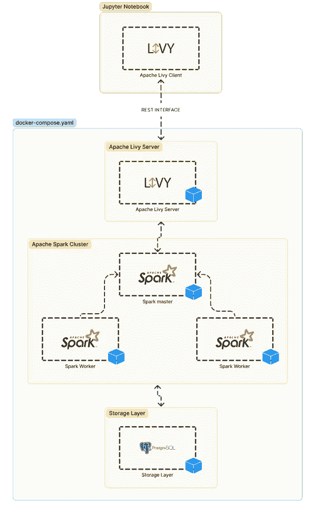
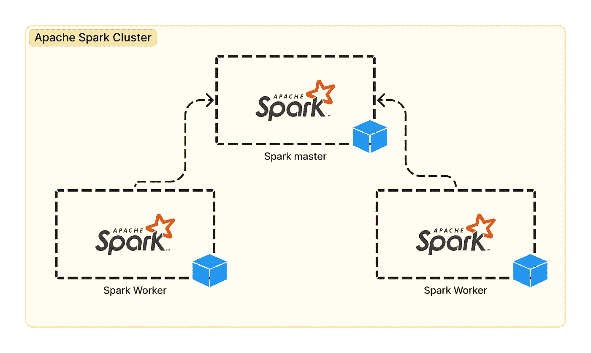
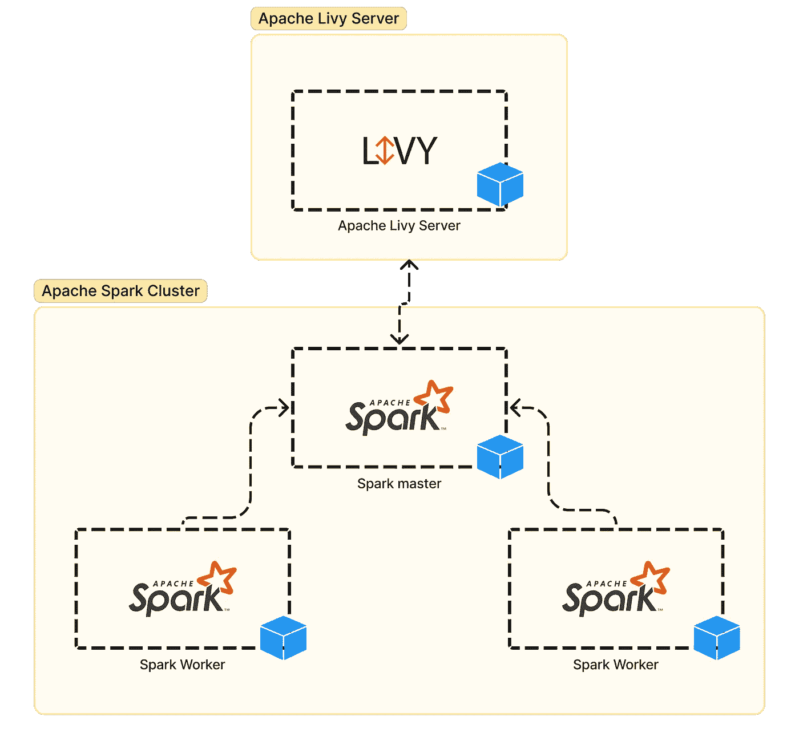
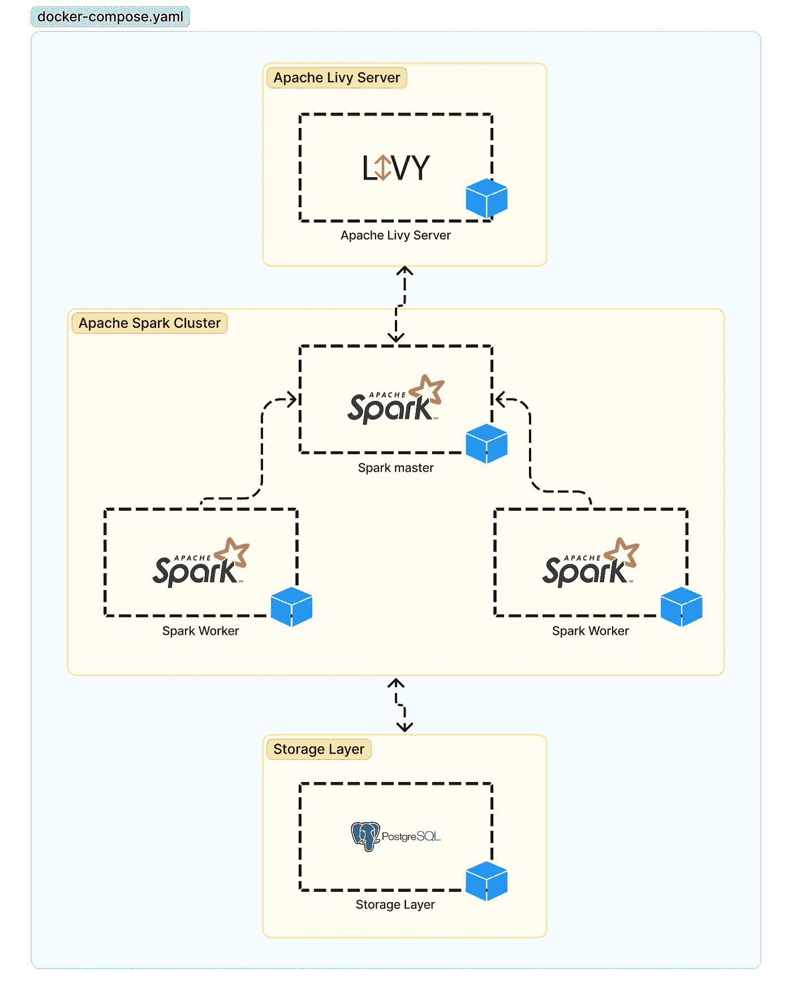
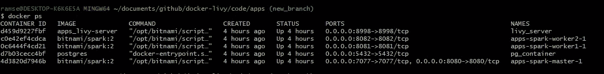
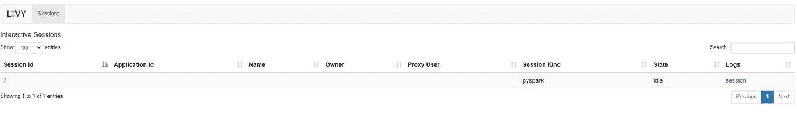

# 通过 Apache Livy 与 Apache Spark 建立实时通信

> 原文：<https://itnext.io/building-real-time-interactions-with-apache-spark-through-apache-livy-53169d87d012?source=collection_archive---------3----------------------->

## 编写和使用 Apache Livy 环境



编写和使用 Apache Livy 环境

我们都知道 Apache Spark 是什么，有两种通过编程向 Apache Spark 集群提交作业的方法，每种方法都有一些限制，以便实现实时交互， **spark-submit** 和 **spark-shell** 是向 Apache Spark 集群提交 Spark 应用程序的唯一选项，但是， ***如果您想从 web 或移动应用程序*** 交互提交 spark-jobs，会发生什么情况呢？

有些情况下，您的 Apache ***Spark 集群可以托管在本地基础架构*** 中，您可能需要许多用户从他们的手机、web 或桌面应用程序中同时消费和运行针对您组织的数据源的大量聚合，创建一个“ **Spark 即服务**”环境来解决我上面提到的问题 ***并不像听起来那么困难*** ，一个解决方案可以是通过公开您的 JDBC/ODBC 数据源

我不知道 Apache Livy 现在是否应该被视为一种变通方法，因为 Apache Spark 通过像[**Google Cloud data proc**](https://cloud.google.com/dataproc)或 [**AWS EMR**](https://aws.amazon.com/es/emr/) 这样的技术积极地进军云领域，但是，本文展示并解释了一个文档化的环境*，您可以使用它作为模板来快速部署一个可使用的 Apache Livy 环境*。

我会尽量简短地解释什么是 Apache Livy:*是一个服务，它可以通过 REST 接口与 Apache Spark 集群轻松交互*，请看下图:


一个 **Apache Livy 接口的基本例子**

如您所见，为了重现一个真实的例子，我们需要三个组件:

1.  阿帕奇火花集群
2.  Apache Livy 服务器
3.  Apache Livy 客户端

作为一个额外的组件，我将添加 **docker** 来实现更快的实现，并添加 **PostgreSQL** 数据库服务器来模拟 Apache Spark 可用的外部数据源。

# 我们开始吧

## **阿帕奇星火集群**

我将创建一个 **docker-compose.yaml** 文件，并且我将添加三个容器 **spark-master** 、 **spark-worker1** 和 **spark-worker2** 使用图像:**docker.io/bitnami/spark:2**



Docker 上的 Apache Spark 集群

## Apache Livy 服务器

在同一个 **docker-compose.yaml** 文件中，我将使用后面显示的 docker 文件添加一个 Apache Livy 服务器作为新容器:



Docker 上的 Apache Livy 服务器

Apache Livy 服务器文档

## **PostgreSQL** 数据库服务器

我使用图像将名为 **pg_container** 的容器添加到 **docker-compose.yaml** 中: **postgres，**我们的示例执行一个 pyspark 脚本，该脚本使用 apache spark 与外部数据源交互，这将是我们的外部数据源。



docker 上的 PostgreSQL

***我们的 docker-compose.yaml 文件准备好了，下面查看:***

## Apache Livy 客户端

我找了一些类来消费一个 Apache Livy REST 接口，我对它做了一些细微的改编，在[**PyPi**](https://pypi.org/)**上发布成 Python 包，名字叫 [*livyc*](https://pypi.org/project/livyc/) **。**你可以在这里查看 github 库: [**livyc**](https://github.com/Wittline/livyc)**

**为了重现实验，我们需要遵循以下步骤:**

*   **在 Windows 上安装 [***Docker 桌面，它也会安装 Docker Compose，Docker Compose 将允许你运行多个容器应用程序。***](https://docs.docker.com/docker-for-windows/install/)**
*   **安装[***git-bash for windows***](https://www.stanleyulili.com/git/how-to-install-git-bash-on-windows/)，安装完成后，打开 git bash 并下载这个库，这样就会下载***docker-compose . YAML***文件，以及其他需要的文件。**

```
ramse@DESKTOP-K6K6E5A MINGW64 /c
$ git clone [https://github.com/Wittline/docker-livy.git](https://github.com/Wittline/docker-livy.git)
```

*   **一旦从存储库中下载了所有需要的文件，让我们运行所有的程序。我们将再次使用 git bash 工具，转到文件夹 ***docker-livy*** 并运行 Docker Compose 命令:**

> **查看我的 GitHub 库 [docker-livy](https://github.com/Wittline/docker-livy) 以获得关于该项目的更多信息。**

```
ramse@DESKTOP-K6K6E5A MINGW64 /c
$ cd docker-livyramse@DESKTOP-K6K6E5A MINGW64 /c/docker-livy
$ cd coderamse@DESKTOP-K6K6E5A MINGW64 /c/docker-livy/code
$ cd apps@DESKTOP-K6K6E5A MINGW64 /c/docker-livy/code/apps
$ docker-compose up -d --build
```

*   **等待一分钟，当最后一个命令执行完毕时，使用下面的命令检查所有容器的状态。**

```
docker ps
```

****

**docker ps**

*   **如果一切正常，那么我们将继续前进，使用[](https://github.com/Wittline/livyc)**与 Apache Livy 接口进行交互****
*   ******使用 Google Colab 设置本地环境******
*   ****转到 ***git-bash*** 并输入下一条命令:****

```
**ramse@DESKTOP-K6K6E5A MINGW64 ~
**jupyter notebook --NotebookApp.allow_origin='https://colab.research.google.com' --port=8888 --NotebookApp.port_retries=0****
```

*   ****执行最后一个命令后，复制本地主机 URL，您将需要它用于 colab****
*   ****前往[***Google Colab***](https://colab.research.google.com/)****
*   ****创建新笔记本****
*   ****转到->连接->连接到本地运行时->粘贴从上一步复制的网址，并把它放在后端网址->连接****
*   ****上传文件***test-livy . ipynb***，并将其使用到您的 colab 本地 env:****
*   ****运行每个单元格并查看每个步骤的结果。****

****请注意，在***test-livy . ipynb***文件中采取的操作中，postgres 数据库正在使用外部。csv 文件，这是为了让 apache spark 拥有与之交互的数据。****

****[test_livy.ipynb](https://gist.github.com/Wittline/9308a337ec28503b49760faa6bd5bb1e#file-test_livy-ipynb)****

*   ****如果您想监控 Apache Livy 服务器中创建的所有会话，请访问地址:[http://localhost:8998/ui](http://localhost:8998/ui)****

********

****李维·塞申斯****

> ****查看我的 GitHub 库 [docker-livy](https://github.com/Wittline/docker-livy) 以获得关于该项目的更多信息。****

## ****结论****

****Python 包[**livyc**](https://github.com/Wittline/livyc)**可以很好地动态和异步地向 Apache Livy 服务器提交 pyspark 脚本，这反过来以透明的方式与 Apache Spark 集群交互，检查这个项目并记住在与 jupyter 笔记本文件交互之前检查所有文件。******

> ******查看我的 GitHub 库 [docker-livy](https://github.com/Wittline/docker-livy) 以获得关于该项目的更多信息。******