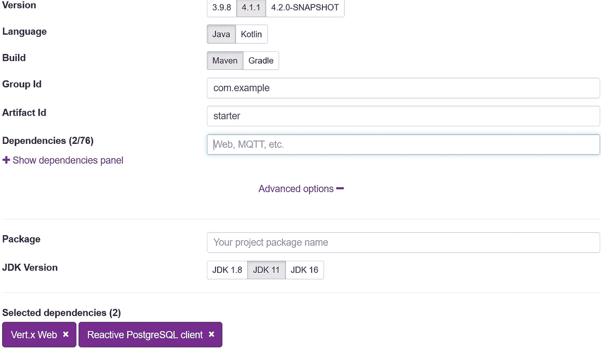

# 用 Eclipse Vertx 构建 RESTful APIs

> 原文：<https://itnext.io/building-restful-apis-with-eclipse-vertx-4ce89d8eeb74?source=collection_archive---------0----------------------->

在本文中，我们将探索如何用 Eclipse Vertx 和 reactive Postgres 客户端构建一个简单的 RESTful 示例应用程序。


萨姆·比斯利在 [Unsplash](https://unsplash.com/s/photos/china-gugong?utm_source=unsplash&utm_medium=referral&utm_content=creditCopyText) 上拍摄的照片

不同于其他框架中 *reactive* 是对现有特性的添加，Eclipse Vertx 是为 *reactive 应用*而生，阅读[官方介绍指南](https://vertx.io/introduction-to-vertx-and-reactive/)了解 Vertx 中的 reactive 支持。

类似于 [Spring Boot 初始化器](https://start.spring.io)，Eclipse Vertx 也提供了一个脚手架工具来为您生成项目框架。

打开浏览器，导航至 [Vertx 开始页面](https://start.vertx.io/)。在**依赖项**字段中，选择 *Vertx Web* 、*responsive PostgreSQL 客户端*，并可选展开**高级选项**，选择*最新 Java 版本*(目前为 **16** )。



保持其他选项不变，它将使用默认值，然后点击**生成项目**按钮，将项目生成到一个档案中以供下载。

下载项目档案，将文件解压到本地磁盘，并导入到您的 ide 中，例如 Intellij IDEA。

打开 *pom.xml* 。如你所见，它使用`maven-shade-plugin`将构建的结果打包到一个胖罐子里，*主类*就是 Vertx 内置的`io.vertx.core.Launcher`。当通过`java -jar target\xxx.jar`运行应用程序时，它将使用`Launcher`来部署声明的`MainVerticle`。一个`Verticle`是一个 Vertx 特定的部署单元，用于对网络、HTTP 等资源进行分组。

让我们转到`MainVerticle`类。

```
public class MainVerticle extends AbstractVerticle {

}
```

通常，要编写我们的业务逻辑，您只需要覆盖`start()`方法或`start(Promise<Void> startPromise)`。

在我们的应用程序中，我们将启动一个 HTTP 服务器来服务 HTTP 请求。用以下内容替换`start(Promise<Void> startPromise)`方法的内容。

```
// Create the HTTP server
vertx.createHttpServer()
    // Handle every request using the router
    .requestHandler(router)
    // Start listening
    .listen(8888)
    // Print the port
    .onSuccess(server -> {
        startPromise.complete();
        System.out.println("HTTP server started on port " + server.actualPort());
    })
    .onFailure(event -> {
        startPromise.fail(event);
        System.out.println("Failed to start HTTP server:" + event.getMessage());
    });
```

请求处理工作由上面的`.requestHandler(Handler<HttpServerRequest>)`完成。`Router`是一个特殊的`Handler<HttpServerRequest>`，它简化了 HTTP 请求的处理，并允许链接一系列处理程序。

添加一个`reoutes`方法在一个中心位置处理所有路由的请求，它返回路由器。

```
//create routes
private Router routes(PostsHandler handlers) { // Create a Router
    Router router = Router.router(vertx);
    // register BodyHandler globally.
    //router.route().handler(BodyHandler.create());
    router.get("/posts").produces("application/json").handler(handlers::all);
   	router.post("/posts").consumes("application/json").handler(BodyHandler.create()).handler(handlers::save);
    router.get("/posts/:id").produces("application/json").handler(handlers::get).failureHandler(frc -> frc.response().setStatusCode(404).end());
    router.put("/posts/:id").consumes("application/json").handler(BodyHandler.create()).handler(handlers::update);
    router.delete("/posts/:id").handler(handlers::delete); router.get("/hello").handler(rc -> rc.response().end("Hello from my route")); return router;
}
```

对于`post`和`put` HTTP 方法，需要`BodyHandler`来处理消费 HTTP 请求体。

将所有处理细节提取到一个新的`PostHandler`类中。

```
class PostsHandler {
    private static final Logger LOGGER = Logger.getLogger(PostsHandler.class.getSimpleName()); PostRepository posts; private PostsHandler(PostRepository _posts) {
        this.posts = _posts;
    } //factory method
    public static PostsHandler create(PostRepository posts) {
        return new PostsHandler(posts);
    } public void all(RoutingContext rc) {
//        var params = rc.queryParams();
//        var q = params.get("q");
//        var limit = params.get("limit") == null ? 10 : Integer.parseInt(params.get("q"));
//        var offset = params.get("offset") == null ? 0 : Integer.parseInt(params.get("offset"));
//        LOGGER.log(Level.INFO, " find by keyword: q={0}, limit={1}, offset={2}", new Object[]{q, limit, offset});
        this.posts.findAll()
            .onSuccess(
                data -> rc.response().end(Json.encode(data))
            );
    } public void get(RoutingContext rc) {
        var params = rc.pathParams();
        var id = params.get("id");
        this.posts.findById(UUID.fromString(id))
            .onSuccess(
                post -> rc.response().end(Json.encode(post))
            )
            .onFailure(
                throwable -> rc.fail(404, throwable)
            ); } public void save(RoutingContext rc) {
        //rc.getBodyAsJson().mapTo(PostForm.class)
        var body = rc.getBodyAsJson();
        LOGGER.log(Level.INFO, "request body: {0}", body);
        var form = body.mapTo(PostForm.class);
        this.posts.save(Post.of(form.getTitle(), form.getContent()))
            .onSuccess(
                savedId -> rc.response()
                    .putHeader("Location", "/posts/" + savedId)
                    .setStatusCode(201)
                    .end() );
    } public void update(RoutingContext rc) {
        var params = rc.pathParams();
        var id = params.get("id");
        var body = rc.getBodyAsJson();
        LOGGER.log(Level.INFO, "\npath param id: {0}\nrequest body: {1}", new Object[]{id, body});
        var form = body.mapTo(PostForm.class);
        this.posts.findById(UUID.fromString(id))
            .compose(
                post -> {
                    post.setTitle(form.getTitle());
                    post.setContent(form.getContent()); return this.posts.update(post);
                }
            )
            .onSuccess(
                data -> rc.response().setStatusCode(204).end()
            )
            .onFailure(
                throwable -> rc.fail(404, throwable)
            ); } public void delete(RoutingContext rc) {
        var params = rc.pathParams();
        var id = params.get("id"); var uuid = UUID.fromString(id);
        this.posts.findById(uuid)
            .compose(
                post -> this.posts.deleteById(uuid)
            )
            .onSuccess(
                data -> rc.response().setStatusCode(204).end()
            )
            .onFailure(
                throwable -> rc.fail(404, throwable)
            ); }}
```

从`RoutingContext`中，很容易读取请求参数等。`PostRepository`负责与你的后台数据库 Postgres 交互，当数据库操作完成后，再通过`RoutingContext.response()`将结果发送给 HTTP 响应。

我们来看看`PostRepository`类。

```
public class PostRepository {
    private static final Logger LOGGER = Logger.getLogger(PostRepository.class.getName()); private static Function<Row, Post> MAPPER = (row) ->
        Post.of(
            row.getUUID("id"),
            row.getString("title"),
            row.getString("content"),
            row.getLocalDateTime("created_at")
        ); private final PgPool client; private PostRepository(PgPool _client) {
        this.client = _client;
    } //factory method
    public static PostRepository create(PgPool client) {
        return new PostRepository(client);
    } public Future<List<Post>> findAll() {
        return client.query("SELECT * FROM posts ORDER BY id ASC")
            .execute()
            .map(rs -> StreamSupport.stream(rs.spliterator(), false)
                .map(MAPPER)
                .collect(Collectors.toList())
            );
    } public Future<Post> findById(UUID id) {
        Objects.requireNonNull(id, "id can not be null");
        return client.preparedQuery("SELECT * FROM posts WHERE id=$1").execute(Tuple.of(id))
            .map(RowSet::iterator)
            .map(iterator -> iterator.hasNext() ? MAPPER.apply(iterator.next()) : null)
            .map(Optional::ofNullable)
            .map(p -> p.orElseThrow(() -> new PostNotFoundException(id)));
    } public Future<UUID> save(Post data) {
        return client.preparedQuery("INSERT INTO posts(title, content) VALUES ($1, $2) RETURNING (id)").execute(Tuple.of(data.getTitle(), data.getContent()))
            .map(rs -> rs.iterator().next().getUUID("id"));
    } public Future<Integer> saveAll(List<Post> data) {
        var tuples = data.stream()
            .map(
                d -> Tuple.of(d.getTitle(), d.getContent())
            )
            .collect(Collectors.toList()); return client.preparedQuery("INSERT INTO posts (title, content) VALUES ($1, $2)")
            .executeBatch(tuples)
            .map(SqlResult::rowCount);
    } public Future<Integer> update(Post data) {
        return client.preparedQuery("UPDATE posts SET title=$1, content=$2 WHERE id=$3")
            .execute(Tuple.of(data.getTitle(), data.getContent(), data.getId()))
            .map(SqlResult::rowCount);
    } public Future<Integer> deleteAll() {
        return client.query("DELETE FROM posts").execute()
            .map(SqlResult::rowCount);
    } public Future<Integer> deleteById(UUID id) {
        Objects.requireNonNull(id, "id can not be null");
        return client.preparedQuery("DELETE FROM posts WHERE id=$1").execute(Tuple.of(id))
            .map(SqlResult::rowCount);
    }}
```

`pgPool`是一个 Postgres 客户端，用于与 Postgres 数据库进行交互，操作与传统的 JDBC 非常相似，但它基于 Vertx 的`Future` API。与 Java 8 `CompletionStage`或 Reactor `Mono` / `Flux`类似，Vertx Future 提供了非常有限的 API，用于以异步方式产生、转换和观察完成的结果。

> *更多关于反应式 PostgreSQL 客户端的详细信息，请阅读* [*PostgreSQL 客户端文档*](https://vertx.io/docs/vertx-pg-client/java/) *。*
> 
> *在 Vertx 中，几乎所有的异步方法都提供了一个变体，接受一个* `*Promise*` *like 回调作为参数，而不是返回一个* `*Future*` *实例。但我个人认为* `*Promise*` *是邪恶的，如果把处理进度传递成一个转场序列，那么* `*Promise*` *就会嵌套另一个* `*Promise*` *等等。它会把你放在一个无限的* `*Promise*` *洞里。*

在`MainVerticle`中创建一个方法来产生一个`PgPool`实例。

```
private PgPool pgPool() {
    PgConnectOptions connectOptions = new PgConnectOptions()
        .setPort(5432)
        .setHost("localhost")
        .setDatabase("blogdb")
        .setUser("user")
        .setPassword("password"); // Pool Options
    PoolOptions poolOptions = new PoolOptions().setMaxSize(5); // Create the pool from the data object
    PgPool pool = PgPool.pool(vertx, connectOptions, poolOptions); return pool;
}
```

创建一个类来初始化一些示例数据。

```
public class DataInitializer { private final static Logger LOGGER = Logger.getLogger(DataInitializer.class.getName()); private PgPool client; public DataInitializer(PgPool client) {
        this.client = client;
    } public static DataInitializer create(PgPool client) {
        return new DataInitializer(client);
    } public void run() {
        LOGGER.info("Data initialization is starting..."); Tuple first = Tuple.of("Hello Quarkus", "My first post of Quarkus");
        Tuple second = Tuple.of("Hello Again, Quarkus", "My second post of Quarkus"); client
            .withTransaction(
                conn -> conn.query("DELETE FROM posts").execute()
                    .flatMap(r -> conn.preparedQuery("INSERT INTO posts (title, content) VALUES ($1, $2)")
                        .executeBatch(List.of(first, second))
                    )
                    .flatMap(r -> conn.query("SELECT * FROM posts").execute())
            )
            .onSuccess(data -> StreamSupport.stream(data.spliterator(), true)
                .forEach(row -> LOGGER.log(Level.INFO, "saved data:{0}", new Object[]{row.toJson()}))
            )
            .onComplete(
                r -> {
                    //client.close(); will block the application.
                    LOGGER.info("Data initialization is done...");
                }
            )
            .onFailure(
                throwable -> LOGGER.warning("Data initialization is failed:" + throwable.getMessage())
            );
    }
}
```

在上面的代码中，使用`withTransaction`方法将一系列数据库操作包装在单个事务中。

让我们在`MainVerticle`的 start 方法中集合所有的资源。

```
@Override
public void start(Promise<Void> startPromise) throws Exception {
    LOGGER.log(Level.INFO, "Starting HTTP server...");
    //setupLogging(); //Create a PgPool instance
    var pgPool = pgPool(); //Creating PostRepository
    var postRepository = PostRepository.create(pgPool); //Creating PostHandler
    var postHandlers = PostsHandler.create(postRepository); // Initializing the sample data
    var initializer = DataInitializer.create(pgPool);
    initializer.run(); // Configure routes
    var router = routes(postHandlers); // Create the HTTP server
    vertx.createHttpServer()
        // Handle every request using the router
    	.requestHandler(router)
        ...
}
```

默认情况下，Vertx Web 使用 Jackson 来序列化和反序列化请求/响应负载。不幸的是，默认情况下，它没有注册 Java DateTime 模块。

在 *pom.xml* 文件中添加以下依赖项。

```
<dependency>
    <groupId>com.fasterxml.jackson.core</groupId>
    <artifactId>jackson-databind</artifactId>
    <version>${jackson.version}</version>
</dependency>
<dependency>
    <groupId>com.fasterxml.jackson.datatype</groupId>
    <artifactId>jackson-datatype-jsr310</artifactId>
    <version>${jackson.version}</version>
</dependency>
```

向`properties`部分添加一个`jackson.version`属性。

```
<jackson.version>2.11.3</jackson.version>
```

然后在`MainVerticle`类中添加一个静态块来配置日期时间序列化和反序列化。

```
static {
    LOGGER.info("Customizing the built-in jackson ObjectMapper...");
    var objectMapper = DatabindCodec.mapper();
    objectMapper.disable(SerializationFeature.WRITE_DATES_AS_TIMESTAMPS);
    objectMapper.disable(SerializationFeature.WRITE_DATE_TIMESTAMPS_AS_NANOSECONDS);
    objectMapper.disable(DeserializationFeature.READ_DATE_TIMESTAMPS_AS_NANOSECONDS); JavaTimeModule module = new JavaTimeModule();
    objectMapper.registerModule(module);
}
```

让我们启动应用程序。

简单地获取[源代码](https://github.com/hantsy/vertx-sandbox)，它提供一个 docker 编译文件。

运行以下命令在 Docker 容器中启动一个 Postgres 实例。

```
docker compose postgres
```

当数据库启动时，它将通过[初始脚本](https://github.com/hantsy/vertx-sandbox/tree/master/pg-initdb.d)准备必要的表。

现在切换到项目文件夹，运行以下命令启动应用程序。

```
mvn clean compile exec:java
```

或者先构建项目，然后运行最终的 jar 文件。

```
mvn clean package
java -jar target/demo.jar
```

应用程序启动后，打开一个终端，用`curl`测试`/posts`端点。

```
curl [http://localhost:8888/posts](http://localhost:8888/posts) -H "Accept: application/json"
[{"id":"1f99032b-3bb0-4795-ba9f-b0437b59cfbe","title":"Hello Quarkus","content":"My first post of Quarkus","createdAt":"2021-07-02T09:35:21.341037"},{"id":"adda9ca6-2c4c-4223-9cb6-b8407c15ba03","title":"Hello Again, Quarkus","content":"My second post of Quarkus","createdAt":"2021-07-02T09:35:21.341037"}]
```

## 从我的 Github 获取完整的源代码。