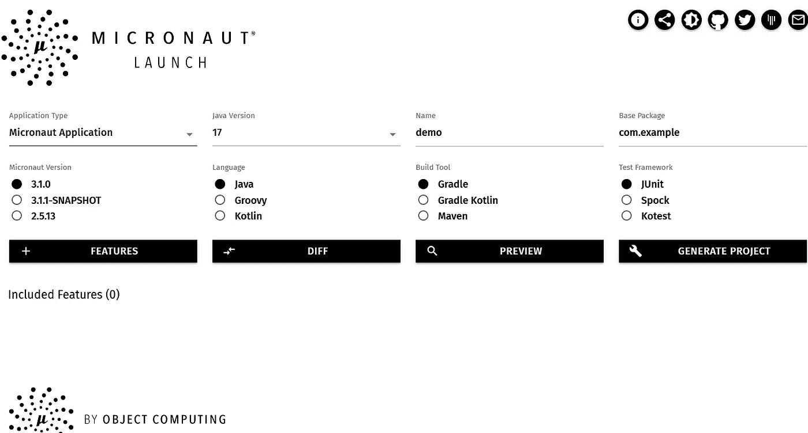

# 用 Micronaut 构建 Restful APIs

> 原文：<https://itnext.io/building-restful-apis-with-micronaut-98f4eb39211c?source=collection_archive---------1----------------------->

与 Spring Boot 类似，Micronaut 是一个基于 JVM 的框架，旨在构建微服务和云原生应用。


[黄祖儿](https://unsplash.com/@onice?utm_source=unsplash&utm_medium=referral&utm_content=creditCopyText)在 [Unsplash](https://unsplash.com/s/photos/china-snow?utm_source=unsplash&utm_medium=referral&utm_content=creditCopyText) 上的照片

与 Spring Boot 不同，Micronaut 在编译时处理 IOC 并删除运行时反射，因此更容易构建本机映像。

> *Spring 也开始了一个 Spring 原生项目，不过是早期。*

对于不熟悉 Micronaut 的开发人员来说，如果您对 Spring Boot 有所了解，使用 Micronaut 开发您的应用程序会很容易。在这篇文章中，我将从 Spring 开发者的角度分享我使用 Micronaut 从头创建一个简单的 Restful API 应用程序的经验。

# 生成项目框架

类似于 [Spring Initializr](https://start.spring.io) ，Micronaut 提供了一个名为 **Launch** 的在线服务来帮助你生成一个项目框架。

打开您的浏览器，进入 [Micronaut Launch](https://micronaut.io/launch/) ，您将看到以下屏幕。



在 **Java 版本**字段中，选择最新的 LTS 版本 **17** 。然后点击**功能**按钮，添加 *lombok* 、 *data hibernate jpa* 、 *assertj* 、 *postgres* 、 *testcontainers* 。最后，点击**生成项目**按钮，将项目文件生成一个存档文件供下载。

将项目文件解压缩到磁盘中，并导入到您的 IDE 中。

> *您也可以使用 Micronaut CLI 创建 Micronaut 项目，查看* [*Micronaut Starter 文档*](https://micronaut-projects.github.io/micronaut-starter/latest/guide/#installation) *。*

# 探索项目结构

让我们看看项目中的文件。

```
.
├── build.gradle
├── gradle
│   └── wrapper
│       ├── gradle-wrapper.jar
│       └── gradle-wrapper.properties
├── gradle.properties
├── gradlew
├── gradlew.bat
├── micronaut-cli.yml
├── settings.gradle
└── src
    ├── main
    │   ├── java
    │   │   └── com
    │   │       └── example
    │   │           └── Application.java
    │   └── resources
    │       ├── application.yml
    │       └── logback.xml
    └── test
        ├── java
        │   └── com
        │       └── example
        │           └── DemoTest.java
        └── resources
            ├── application-test.yml
            └── logback-test.xml
```

除了 Gradle build 脚本相关的资源之外，它的结构类似于 Spring Boot 项目。

*   `Application`是应用程序的入口类。
*   *src/main/resources/application . yml*是应用配置。
*   *src/main/resources/log back . XML*是日志配置。
*   `DemoTest`是使用`@MicronautTest`的一个例子。
*   在 *src/test/resources* 文件夹下，有一些测试用的配置资源。

让我们来看看 *build.gradle* 。

它使用`com.github.johnrengelman.shadow`将应用程序打包到 jar 档案中。`micronaut`插件将通过 Java 编译器注释处理器在编译时处理依赖注入。该插件还包括其他任务，如将应用程序构建到 Docker 映像和 GraalVM 本机映像中。

# 声明一个 Bean

在 Micronaut 中，它使用 JSR330(aka @Inject)规范来注释可注入的 beans。JSR330 最初由 SpringSource(现在的 VMware)和 Google 领导。

> *Spring 也内置了 JSR330 支持，默认情况下是不激活的。您应该在您的项目依赖项中添加* `*inject*` *工件来启用它。*

当一个类用`@Singleton`注释时，意味着在应用范围内只有一个共享的实例，`@Prototype`将为每次注入产生一个新的实例。

例如，Micronaut 提供了一个`@Factory`来分组生产简单的豆子。

```
@Factory
class MyConfig{

    @Singleton
    public Foo foo(){}

    @Singleton
    public Bar bar(){}
}
```

如前所述，Micronaut 在编译时处理 IOC。构建应用程序时，浏览项目 *build/classes* 文件夹，您会发现在编译时生成了许多额外的类，它们的名称都以美元(“ **$** ”)符号开头。

# 设置数据库

打开*src/main/resources/application . yml*，生成项目时配置`datasources`。根据您的环境更改属性。

```
datasources:
  default:
    url: jdbc:postgresql://localhost:5432/blogdb
    driverClassName: org.postgresql.Driver
    username: user
    password: password
    schema-generate: CREATE_DROP
    dialect: POSTGRES
jpa.default.properties.hibernate.hbm2ddl.auto: update
```

创建一个 docker 合成文件来引导 docker 容器中的 Postgres。

```
version: '3.7' # specify docker-compose versionservices:
  postgres:
    image: postgres
    ports:
      - "5432:5432"
    restart: always
    environment:
      POSTGRES_PASSWORD: password
      POSTGRES_DB: blogdb
      POSTGRES_USER: user
    volumes:
      - ./data:/var/lib/postgresql
      - ./pg-initdb.d:/docker-entrypoint-initdb.d
```

启动 Postgres 数据库。

```
docker compose up postgres
```

# 使用 Micronaut 数据访问数据

我们在生成项目时添加了 *data-jpa* 特性，这使得 Micronaut 数据支持成为可能。如果您有 Spring 数据 JPA 的经验，迁移到 Micronaut 数据是很容易的。

在演示其他框架时，我在前面的例子中使用了一个简单的博客应用程序。在这篇文章中，我将重用博客应用程序的概念。

基本上它包括两个 JPA 实体，`Post`和`Comment`，这是一个`OneToMany`关系。

```
@Getter
@Setter
@NoArgsConstructor
@AllArgsConstructor
@Builder
@Entity
@Table(name = "posts")
public class Post implements Serializable { @Id
    @GeneratedValue(generator = "uuid")
    @GenericGenerator(name = "uuid", strategy = "uuid2")
    UUID id;
    String title;
    String content; @Builder.Default
    Status status = Status.DRAFT; @Builder.Default
    LocalDateTime createdAt = LocalDateTime.now(); @OneToMany(cascade = {CascadeType.ALL}, orphanRemoval = true, mappedBy = "post")
    @Builder.Default
    @OrderColumn(name = "comment_idx")
    List<Comment> comments = new ArrayList<>(); @Override
    public boolean equals(Object o) {
        if (this == o) return true;
        if (o == null || getClass() != o.getClass()) return false;
        Post post = (Post) o;
        return getTitle().equals(post.getTitle());
    } @Override
    public int hashCode() {
        return Objects.hash(getTitle());
    } @Override
    public String toString() {
        return "Post{" +
                "id=" + id +
                ", title='" + title + '\'' +
                ", content='" + content + '\'' +
                ", status=" + status +
                ", createdAt=" + createdAt +
                '}';
    }
}// Comment entity 
@Getter
@Setter
@NoArgsConstructor
@AllArgsConstructor
@Builder
@Entity
@Table(name = "comments")
public class Comment implements Serializable { @Id
    @GeneratedValue(generator = "uuid")
    @GenericGenerator(name = "uuid", strategy = "uuid2")
    private UUID id; @ManyToOne
    @JoinColumn(name = "post_id")
    private Post post; private String content; @Builder.Default
    @Column(name = "created_at")
    private LocalDateTime createdAt = LocalDateTime.now(); @Override
    public boolean equals(Object o) {
        if (this == o) return true;
        if (o == null || getClass() != o.getClass()) return false;
        Comment comment = (Comment) o;
        return getContent().equals(comment.getContent());
    } @Override
    public int hashCode() {
        return Objects.hash(getContent());
    } @Override
    public String toString() {
        return "Comment{" +
                "id=" + id +
                ", content='" + content + '\'' +
                ", createdAt=" + createdAt +
                '}';
    }
}
```

它们是标准的 JPA `@Entity`类。

JPA 实体类应该用一个`@Entity`注释进行注释，并包含一个`@Id`字段来标识这个实体和一个无参数构造函数。这里我们使用 Lombok 在编译时生成 setters、getters 和 constructors。我们使用 IDE 根据业务需求生成`equals`和`hasCode`。

```
@Repository
public interface PostRepository extends JpaRepository<Post, UUID>{}@Repository
public interface CommentRepository extends JpaRepository<Comment, UUID> { List<Comment> findByPost(Post post);
}
```

添加一个`DataInitializer` bean 来初始化一些样本数据。

```
@Singleton
@RequiredArgsConstructor
@Slf4j
public class DataInitializer implements ApplicationEventListener<ApplicationStartupEvent> {
    private final PostRepository posts; private final TransactionOperations<?> tx; @Override
    public void onApplicationEvent(ApplicationStartupEvent event) {
        log.info("initializing sample data...");
        var data = List.of(Post.builder().title("Getting started wit Micronaut").content("test").build(),
                Post.builder().title("Getting started wit Micronaut: part 2").content("test").build());
        tx.executeWrite(status -> {
            this.posts.deleteAll();
            this.posts.saveAll(data);
            return null;
        });
        tx.executeRead(status -> {
            this.posts.findAll().forEach(p -> log.info("saved post: {}", p));
            return null;
        });
        log.info("data initialization is done...");
    }
}
```

编写一个测试来验证`PostRepository`的功能。类似于`@SpringBootTest`，Micronaut 提供了一个`@MicronautTest`。

```
@MicronautTest(application = Application.class, startApplication = false)
class PostRepositoryTest { @Inject
    PostRepository posts; @PersistenceContext
    EntityManager entityManager; @Test
    void testCreatePost() {
        var entity = Post.builder().title("test title").content("test content").build();
        this.entityManager.persist(entity); assertThat(entity.getId()).isNotNull();
        assertTrue(posts.findById(entity.getId()).isPresent());
    }}
```

这里我们设置`startApplication = false`，它不启动嵌入式服务器来托管应用程序，为了测试数据库，我们不需要运行应用程序

我们增加了`testcontainers`功能，它会自动配置一个 Postgres 进行测试。检查`src/test/resources/application-test.yml`中的 testcontainers 配置。

```
datasources:
  default:
    url: jdbc:tc:postgresql:12:///postgres
    driverClassName: org.testcontainers.jdbc.ContainerDatabaseDriver
```

当有一个`tc`作为数据库主机名时，testcontainer 将自动启动一个 Postgres 数据库。

# 公开 Restful APIs

类似于 Spring WebMVC，在 Micronaut 中，我们可以使用一个控制器来公开 Restful APIs。

```
@Controller("/posts")
@RequiredArgsConstructor(onConstructor_ = {@Inject})
@Validated
public class PostController {
    private final PostRepository posts;
    private final CommentRepository comments; @Get(uri = "/", produces = MediaType.APPLICATION_JSON)
    public HttpResponse<List<PostSummaryDto>> getAll() {
        var body = posts.findAll()
                .stream()
                .map(p -> new PostSummaryDto(p.getId(), p.getTitle(), p.getCreatedAt()))
                .toList();
        return ok(body);
    } @Get(uri = "/{id}", produces = MediaType.APPLICATION_JSON)
    public HttpResponse<?> getById(@PathVariable UUID id) {
        return posts.findById(id)
                .map(p -> ok(new PostDetailsDto(p.getId(), p.getTitle(), p.getContent(), p.getStatus(), p.getCreatedAt())))
                //.orElseThrow(() -> new PostNotFoundException(id));
        .orElseGet(HttpResponse::notFound);
    }
}
```

一个控制器用`@Controller`标注，你可以设置一个基础`uri`应用于所有的方法。`@Get`、`@Post`、`@Put`、`@Delete`映射处理各种 HTTP 方法，类似于 Spring 的`@GetMapping`、`@PostMapping`等。您可以使用这些注释中的 *consumes* 或 *produces* 属性来设置媒体类型，以限制请求和响应的内容类型，或者使用独立的注释`@Consumes`和`@Produces`来设置媒体类型。

通过 Gradle 命令启动应用程序。

```
./gradlew run
```

> 不要忘记首先启动 Postgres。

使用`curl`测试`/posts`端点。

```
curl [http://localhost:8080/posts](http://localhost:8080/posts)
[ {
  "id" : "b6fb90ab-2719-498e-a5fd-93d0c7669fdf",
  "title" : "Getting started wit Micronaut",
  "createdAt" : "2021-10-14T22:00:28.80933"
}, {
  "id" : "8c6147ea-8de4-473f-b97d-e211c8e43bac",
  "title" : "Getting started wit Micronaut: part 2",
  "createdAt" : "2021-10-14T22:00:28.80933"
} ]curl [http://localhost:8080/posts/b6fb90ab-2719-498e-a5fd-93d0c7669fdf](http://localhost:8080/posts/b6fb90ab-2719-498e-a5fd-93d0c7669fdf)
 {
  "id" : "b6fb90ab-2719-498e-a5fd-93d0c7669fdf",
  "title" : "Getting started wit Micronaut",
  "content": "test",
  "createdAt" : "2021-10-14T22:00:28.80933"
}
```

> *Micronaut CLI 提供生成控制器、bean 等命令。运行* `*mn --help*` *获取所有可用命令。*

为`PostController`编写一个测试。

```
@MicronautTest(environments = Environment.TEST)
public class PostControllerTest { @Inject
    @Client("/")
    HttpClient client; @Inject
    PostRepository posts; @Inject
    CommentRepository comments; @MockBean(PostRepository.class)
    PostRepository posts() {
        return mock(PostRepository.class);
    } @MockBean(CommentRepository.class)
    CommentRepository comments() {
        return mock(CommentRepository.class);
    } @Test
    @DisplayName("test GET '/posts' endpoint")
    public void testGetAllPosts() throws Exception {
        when(this.posts.findAll()).thenReturn(
                List.of(Post.builder().id(UUID.randomUUID()).title("test title").content("test content").build())
        );
        var response = client.toBlocking().exchange("/posts", PostSummaryDto[].class);
        assertEquals(HttpStatus.OK, response.status());
        var body = response.body();
        assertThat(body.length).isEqualTo(1);
        assertThat(body[0].title()).isEqualTo("test title"); verify(this.posts, times(1)).findAll();
        verifyNoMoreInteractions(this.posts);
    } @Test
    @DisplayName("test GET '/posts/{id}' endpoint")
    public void testGetSinglePost() throws Exception {
        when(this.posts.findById(any(UUID.class))).thenReturn(
                Optional.ofNullable(Post.builder().id(UUID.randomUUID()).title("test title").content("test content").build())
        );
        var request = HttpRequest.GET(UriBuilder.of("/posts/{id}").expand(Map.of("id", UUID.randomUUID())));
        var response = client.toBlocking().exchange(request, PostDetailsDto.class);
        assertEquals(HttpStatus.OK, response.status());
        var body = response.body();
        assertThat(body.title()).isEqualTo("test title"); verify(this.posts, times(1)).findById(any(UUID.class));
        verifyNoMoreInteractions(this.posts);
    } @Test
    @DisplayName("test GET '/posts/{id}' endpoint that does not exist")
    public void testGetSinglePost_notFound() throws Exception {
        when(this.posts.findById(any(UUID.class))).thenReturn(Optional.ofNullable(null));
        var request = HttpRequest.GET(UriBuilder.of("/posts/{id}").expand(Map.of("id", UUID.randomUUID())));
        var exception = assertThrows(HttpClientResponseException.class, () -> client.toBlocking().exchange(request, PostDetailsDto.class)); assertEquals(HttpStatus.NOT_FOUND, exception.getStatus());
        verify(this.posts, times(1)).findById(any(UUID.class));
        verifyNoMoreInteractions(this.posts);
    }
}
```

在这个测试中，我们使用 Mockito 来模拟`PostController`中的所有依赖 bean(`PostRepository`和`CommentRepository`)。为了在测试上下文中模拟 bean，Micronaut 提供了一个`MockBean`来生成一个模拟实例，以替换真正的 bean。

与 Spring 的`RestTemplate`或`WebClient`类似，Micronaut 提供了一个`HttpClient`向某个 URI 发送请求，默认使用*react vestream*s 兼容 API，如果你坚持传统的阻塞 API，调用`toBlocking()`方法切换使用。

`exchange`方法会返回一个 HTTP 响应对象，`retrieve`方法直接返回响应体。

> *注意:使用阻塞 API 时，如果返回一个失败的 HTTP 响应，比如返回一个 4xx 状态码，它会抛出一个* `*HttpClientResponseException*` *来代替。相比之下，在 ReactiveStreams APIs 中，它会向错误通道发出异常。*

# 异常处理

在上面的`PostController`中，如果没有找到给定文章 id 的文章，它直接返回 404 HTTP 状态。在真实的应用程序中，我们可以使用异常来封装异常情况。和 Spring WebMVC 一样，Micronaut 也提供了异常处理机制。

例如，创建一个`PostNotFoundException`来代表 id 找不到帖子的情况。

创建一个`PostNotFoundException`类。

```
public class PostNotFoundException extends RuntimeException {
    public PostNotFoundException(UUID id) {
        super("Post[id=" + id + "] was not found");
    }
}
```

在`PostController`中，抛出异常。

```
@Get(uri = "/{id}", produces = MediaType.APPLICATION_JSON)
public HttpResponse<?> getById(@PathVariable UUID id) {
    return posts.findById(id)
        .map(p -> ok(new PostDetailsDto(p.getId(), p.getTitle(), p.getContent(), p.getStatus(), p.getCreatedAt())))
        .orElseThrow(() -> new PostNotFoundException(id));
}
```

增加一个`PostNotFoundExceptionHandler`来处理`PostNotFoundException`。

```
@Produces
@Singleton
@Requires(classes = { PostNotFoundException.class})
@RequiredArgsConstructor
public class PostNotFoundExceptionHandler implements ExceptionHandler<PostNotFoundException, HttpResponse<?>> {
    private final ErrorResponseProcessor<?> errorResponseProcessor; @Override
    public HttpResponse<?> handle(HttpRequest request, PostNotFoundException exception) {
        return errorResponseProcessor.processResponse(
                ErrorContext.builder(request)
                        .cause(exception)
                        .errorMessage(exception.getMessage())
                        .build(),
                HttpResponse.notFound()
        );
    }
}
```

打开您的终端，使用`curl`测试不存在 id 的`/posts/{id}`端点。

```
# curl [http://localhost:8080/posts/b6fb90ab-2719-498e-a5fd-93d0c7669fdf](http://localhost:8080/posts/b6fb90ab-2719-498e-a5fd-93d0c7669fdf) -v
> GET /posts/b6fb90ab-2719-498e-a5fd-93d0c7669fdf HTTP/1.1
> Host: localhost:8080
> User-Agent: curl/7.55.1
> Accept: */*
>
< HTTP/1.1 404 Not Found
< Content-Type: application/json
< date: Mon, 25 Oct 2021 07:02:01 GMT
< content-length: 301
< connection: keep-alive
<
{
  "message" : "Not Found",
  "_links" : {
    "self" : {
      "href" : "/posts/b6fb90ab-2719-498e-a5fd-93d0c7669fdf",
      "templated" : false
    }
  },
  "_embedded" : {
    "errors" : [ {
      "message" : "Post[id=b6fb90ab-2719-498e-a5fd-93d0c7669fdf] was not found"
    } ]
  }
}
```

# 页码

与 Spring 数据类似，Micronaut 数据为长查询结果提供分页，`findAll`接受一个`Pageable`参数，并返回一个`Page`结果。Micronaut 数据还包括一个`Specification`来采用 JPA 标准 API 进行类型安全查询。

更改`PostRepository`，将`JpaSpecificationExecutor<Post>`添加到扩展列表。

```
@Repository
public interface PostRepository extends JpaRepository<Post, UUID>, JpaSpecificationExecutor<Post> {}
```

创建一个特定的`PostSpecifications`来分组查询帖子的所有规范。目前只添加一个按关键字和状态查询。

```
public class PostSpecifications {
    private PostSpecifications(){
        // forbid to instantiate
    } public static Specification<Post> filterByKeywordAndStatus(
            final String keyword,
            final Status status
    ) {
        return (Root<Post> root, CriteriaQuery<?> query, CriteriaBuilder cb) -> {
            List<Predicate> predicates = new ArrayList<>();
            if (StringUtils.hasText(keyword)) {
                predicates.add(
                        cb.or(
                                cb.like(root.get(Post_.title), "%" + keyword + "%"),
                                cb.like(root.get(Post_.content), "%" + keyword + "%")
                        )
                );
            } if (status != null) {
                predicates.add(cb.equal(root.get(Post_.status), status));
            } return cb.and(predicates.toArray(new Predicate[0]));
        };
    }
}
```

将`PostController`的`getAll`方法改为如下。

```
@Get(uri = "/", produces = MediaType.APPLICATION_JSON)
@Transactional
public HttpResponse<Page<PostSummaryDto>> getAll(@QueryValue(defaultValue = "") String q,
                                                 @QueryValue(defaultValue = "") String status,
                                                 @QueryValue(defaultValue = "0") int page,
                                                 @QueryValue(defaultValue = "10") int size) {
    var pageable = Pageable.from(page, size, Sort.of(Sort.Order.desc("createdAt")));
    var postStatus = StringUtils.hasText(status) ? com.example.domain.Status.valueOf(status) : null;
    var data = this.posts.findAll(PostSpecifications.filterByKeywordAndStatus(q, postStatus), pageable);
    var body = data.map(p -> new PostSummaryDto(p.getId(), p.getTitle(), p.getCreatedAt()));
    return ok(body);
}
```

所有查询参数都是可选的。

让我们用`curl`来测试一下*/波斯特*端点。

```
# curl [http://localhost:8080/posts](http://localhost:8080/posts)
{
  "content" : [ {
    "id" : "c9ec963d-2df5-4d65-bfbe-5a0d4cb14ca6",
    "title" : "Getting started wit Micronaut",
    "createdAt" : "2021-10-25T16:35:03.732951"
  }, {
    "id" : "0a79185c-5981-4301-86d1-c266b26b4980",
    "title" : "Getting started wit Micronaut: part 2",
    "createdAt" : "2021-10-25T16:35:03.732951"
  } ],
  "pageable" : {
    "number" : 0,
    "sort" : {
      "orderBy" : [ {
        "property" : "createdAt",
        "direction" : "DESC",
        "ignoreCase" : false,
        "ascending" : false
      } ],
      "sorted" : true
    },
    "size" : 10,
    "offset" : 0,
    "sorted" : true,
    "unpaged" : false
  },
  "totalSize" : 2,
  "totalPages" : 1,
  "empty" : false,
  "size" : 10,
  "offset" : 0,
  "numberOfElements" : 2,
  "pageNumber" : 0
}
```

# 自定义 JsonSerializer

`Page`物体渲染结果有点繁琐，大多数情况下，我们不需要所有这些字段，我们可以通过 Jackson `JsonSerializer`自定义。

```
@Singleton
public class PageJsonSerializer extends JsonSerializer<Page<?>> {
    @Override
    public void serialize(Page<?> value, JsonGenerator gen, SerializerProvider serializers) throws IOException {
        gen.writeStartObject();
        gen.writeNumberField("pageNumber", value.getPageNumber());
        if (value.getNumberOfElements() != value.getSize()) {
            //only display it in the last page when number of elements is not equal to page size.
            gen.writeNumberField("numberOfElements", value.getNumberOfElements());
        }
        gen.writeNumberField("size", value.getSize());
        gen.writeNumberField("totalPages", value.getTotalPages());
        gen.writeNumberField("totalSize", value.getTotalSize());
        gen.writeObjectField("content", value.getContent());
        gen.writeEndObject();
    }
}
```

再次运行应用程序，并提示 */posts* 端点。

```
# curl [http://localhost:8080/posts](http://localhost:8080/posts)
{
  "pageNumber" : 0,
  "numberOfElements" : 2,
  "size" : 10,
  "totalPages" : 1,
  "totalSize" : 2,
  "content" : [ {
    "id" : "53fb77d5-4159-4a80-bab9-c76d9a535b36",
    "title" : "Getting started wit Micronaut",
    "createdAt" : "2021-10-25T16:47:05.545594"
  }, {
    "id" : "aa02fd49-0c24-4f12-b204-2e48213c7a1e",
    "title" : "Getting started wit Micronaut: part 2",
    "createdAt" : "2021-10-25T16:47:05.545594"
  } ]
}
```

修改测试代码以验证更改。

```
class PostControllerTest{
    //...

    @Test
    @DisplayName("test GET '/posts' endpoint")
    public void testGetAllPosts() throws Exception {
        var content = List.of(Post.builder().id(UUID.randomUUID()).title("test title").content("test content").build());
        when(this.posts.findAll(isA(Specification.class), isA(Pageable.class))).thenReturn(
                Page.of(content, Pageable.from(0, 20), 1)
        );
        var request = HttpRequest.GET("/posts");
        var response = client.toBlocking().exchange(request, String.class);
        assertEquals(HttpStatus.OK, response.status());
        var body = response.body();
        assertThat(JsonPath.from(body).getInt("totalSize")).isEqualTo(1);
        assertThat(JsonPath.from(body).getString("content[0].title")).isEqualTo("test title"); verify(this.posts, times(1)).findAll(isA(Specification.class), isA(Pageable.class));
        verifyNoMoreInteractions(this.posts);
    }
}
```

# 创建帖子

我们已经讨论了如何通过关键字查询帖子和通过 id 获取单个帖子，在这一节中，我们将专注于创建一个新帖子。

根据 REST 约定，我们将使用 POST HTTP 方法在端点 */posts* 上发送请求，并接受 JSON 数据作为请求体。

```
@io.micronaut.http.annotation.Post(uri = "/", consumes = MediaType.APPLICATION_JSON)
@Transactional
public HttpResponse<Void> create(@Body CreatePostCommand dto) {
    var data = Post.builder().title(dto.title()).content(dto.content()).build();
    var saved = this.posts.save(data);
    return HttpResponse.created(URI.create("/posts/" + saved.getId()));
}
```

请求体被内置的 Jackson `JsonDesearilizer`反序列化为一个 POJO，它用一个`@Body`注释来表示它将被反序列化到哪个目标类。帖子数据保存后，将响应头`Location`设置为访问新帖子的 URI。

运行应用程序，尝试通过`curl`添加帖子，然后访问新创建的帖子。

```
# curl -X POST -v  -H "Content-Type:application/json" [http://localhost:8080/posts](http://localhost:8080/posts) -d "{\"title\":\"test title\",\"content\":\"test content\"}"
> POST /posts HTTP/1.1
> Host: localhost:8080
> User-Agent: curl/7.55.1
> Accept: */*
> Content-Type:application/json
> Content-Length: 47
>
* upload completely sent off: 47 out of 47 bytes
< HTTP/1.1 201 Created
< location: /posts/7db15639-62e3-4d3e-9cf4-f54413502ea6
< date: Mon, 25 Oct 2021 09:07:40 GMT
< connection: keep-alive
< transfer-encoding: chunked
<
# curl [http://localhost:8080/posts/7db15639-62e3-4d3e-9cf4-f54413502ea6](http://localhost:8080/posts/7db15639-62e3-4d3e-9cf4-f54413502ea6)
{
  "id" : "7db15639-62e3-4d3e-9cf4-f54413502ea6",
  "title" : "test title",
  "content" : "test content",
  "status" : "DRAFT",
  "createdAt" : "2021-10-25T17:07:40.87621"
}
```

# 数据有效性

通常，在实际应用中，我们必须确保请求数据满足需求。Micronaut 具有内置的 Bean 验证支持。

在上面的`CreatPostCommand`类中，在字段上添加 Bean 验证注释。

```
@Introspected
public record CreatePostCommand(@NotBlank String title, @NotBlank String content) {
}
```

您必须添加`@Introspected`注释，让 micronaut 插件在编译时预处理 bean 验证注释，并让 Bean 验证在运行时无需任何反射 API 即可工作。

在`PostController`中，在类上添加一个`@Validated`，在方法参数上添加一个`@Valid`。

```
@Validated
public class PostController {
    public HttpResponse<Void> create(@Body @Valid CreatePostCommand dto) {...}
    //...
}
```

让我们试着创建一个帖子。注意，将`content`字段设置为空。

```
curl -X POST -v  -H "Content-Type:application/json" [http://localhost:8080/posts](http://localhost:8080/posts) -d "{\"title\":\"test title\",\"content\":\"\"}"
> POST /posts HTTP/1.1
> Host: localhost:8080
> User-Agent: curl/7.55.1
> Accept: */*
> Content-Type:application/json
> Content-Length: 35
>
* upload completely sent off: 35 out of 35 bytes
< HTTP/1.1 400 Bad Request
< Content-Type: application/json
< date: Mon, 25 Oct 2021 09:23:22 GMT
< content-length: 237
< connection: keep-alive
<
{
  "message" : "Bad Request",
  "_embedded" : {
    "errors" : [ {
      "message" : "dto.content: must not be blank"
    } ]
  },
  "_links" : {
    "self" : {
      "href" : "/posts",
      "templated" : false
    }
  }
}
```

# 删除帖子

根据 REST 约定，要删除一个帖子，在`/posts/{id}`上发送一个`DELETE`请求，如果成功，返回 204 状态。如果`id`不存在，则返回一个`404`。

将以下代码添加到`PostController`中。

```
@Delete(uri = "/{id}", produces = MediaType.APPLICATION_JSON)
@Transactional
public HttpResponse<?> deleteById(@PathVariable UUID id) {
    return posts.findById(id)
        .map(p -> {
            this.posts.delete(p);
            return HttpResponse.noContent();
        })
        .orElseThrow(() -> new PostNotFoundException(id));
    //.orElseGet(HttpResponse::notFound);
}
```

# 处理子资源

在我们的应用程序中，a `Comment`资源，当添加评论或获取特定帖子的评论时，它应该是`Post`资源的子资源，我们可以这样设计评论资源。

*   `POST /posts/{id}/comments`，给特定的`Post`添加一个`Comment`资源。
*   `GET /posts/{id}/comments`，获取 id 值为路径变量`id`的某个`Post`的所有评论。

```
// nested comments endpoints
@Get(uri = "/{id}/comments", produces = MediaType.APPLICATION_JSON)
public HttpResponse<?> getCommentsByPostId(@PathVariable UUID id) {
    return posts.findById(id)
        .map(post -> {
            var comments = this.comments.findByPost(post);
            return ok(comments.stream().map(c -> new CommentDetailsDto(c.getId(), c.getContent(), c.getCreatedAt())));
        })
        .orElseThrow(() -> new PostNotFoundException(id));
    //.orElseGet(HttpResponse::notFound);
}@io.micronaut.http.annotation.Post(uri = "/{id}/comments", consumes = MediaType.APPLICATION_JSON)
@Transactional
public HttpResponse<?> create(@PathVariable UUID id, @Body @Valid CreateCommentCommand dto) { return posts.findById(id)
        .map(post -> {
            var data = Comment.builder().content(dto.content()).post(post).build();
            post.getComments().add(data);
            var saved = this.comments.save(data);
            return HttpResponse.created(URI.create("/comments/" + saved.getId()));
        })
        .orElseThrow(() -> new PostNotFoundException(id));
    // .orElseGet(HttpResponse::notFound);}
```

# 集成测试

下面是一个集成测试的例子，它试图在一个集成环境中用一个真实的数据库测试所有的 API，并且运行在一个实时的嵌入式服务器上。

```
@MicronautTest
@Slf4j
class IntegrationTests { @Inject
    @Client("/")
    HttpClient client; @Inject
    EmbeddedApplication<?> application; @Test
    void testItWorks() {
        Assertions.assertTrue(application.isRunning());
    } @Test
    void testGetAllPosts() {
        var response = client.exchange(HttpRequest.GET("/posts"), String.class); var bodyFlux = Flux.from(response).map(HttpResponse::body);
        StepVerifier.create(bodyFlux)
                .consumeNextWith(posts -> assertThat(JsonPath.from(posts).getInt("totalSize")).isGreaterThanOrEqualTo(2))
                .verifyComplete();
    } @Test
    public void testCrudFlow() {
        //create a new post
        var request = HttpRequest.POST("/posts", new CreatePostCommand("test title", "test content"));
        var blockingHttpClient = client.toBlocking();
        var response = blockingHttpClient.exchange(request);
        assertThat(response.status().getCode()).isEqualTo(201);
        var savedUrl = response.getHeaders().get("Location");
        assertThat(savedUrl).isNotNull();
        log.debug("saved post url: {}", savedUrl); //get by id
        var getPostResponse = blockingHttpClient.exchange(savedUrl, Post.class);
        assertThat(getPostResponse.getStatus().getCode()).isEqualTo(200); // add comments
        var addCommentRequest = HttpRequest.POST(savedUrl + "/comments", new CreateCommentCommand("test content"));
        var addCommentResponse = blockingHttpClient.exchange(addCommentRequest);
        assertThat(addCommentResponse.getStatus().getCode()).isEqualTo(201);
        var savedCommentUrl = addCommentResponse.getHeaders().get("Location");
        assertThat(savedCommentUrl).isNotNull(); // get all comments
        var getAllCommentsRequest = HttpRequest.GET(savedUrl + "/comments");
        var getAllCommentsResponse = blockingHttpClient.exchange(getAllCommentsRequest, Argument.listOf(CommentDetailsDto.class));
        assertThat(getAllCommentsResponse.status().getCode()).isEqualTo(200);
        assertThat(getAllCommentsResponse.body().size()).isEqualTo(1); //delete by id
        var deletePostResponse = blockingHttpClient.exchange(HttpRequest.DELETE(savedUrl));
        assertThat(deletePostResponse.getStatus().getCode()).isEqualTo(204); //get by id again(404)
        var e = Assertions.assertThrows(HttpClientResponseException.class, () ->
                blockingHttpClient.exchange(HttpRequest.GET(savedUrl)));
        var getPostResponse2 = e.getResponse();
        assertThat(getPostResponse2.getStatus().getCode()).isEqualTo(404);
    }}
```

在`testGetAllPosts`测试中，我们尝试使用反应式`HttpClient`API，并使用 reactor-test 的`StepVerifier`断言反应式数据流中的数据。

第二种测试方法是验证创建帖子、添加评论、获取评论和删除帖子的整个流程。

在 API 集成测试中，测试本身作为一个 HTTP 客户端(通过一个 Http 客户端库)与具有定义的 API 的后端进行交互。理想情况下，您可以使用任何 HttpClient 来测试 API，例如 Java 11 HttpClient、OKHttp 等。示例库中有一些使用`RestAssured`和 Java 11 新`HttpClient`的示例，检查[源代码](https://github.com/hantsy/micronaut-sandbox/tree/master/post-service)并自己探索它们。

示例代码存放在我的 GitHub 上，请查看[hantsy/micro naut-sandbox #后期服务](https://github.com/hantsy/micronaut-sandbox/tree/master/data-jpa-post-service)。