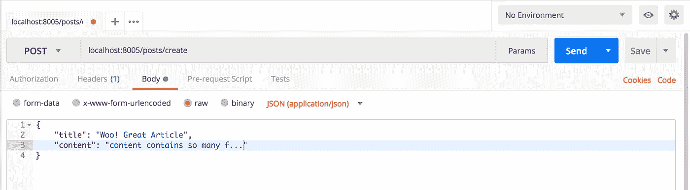

# 使用 Golang、chi 和 MySQL 构建 RESTful web API 服务

> 原文：<https://itnext.io/building-restful-web-api-service-using-golang-chi-mysql-d85f427dee54?source=collection_archive---------2----------------------->

使用 go 创建您的第一个 REST API

在我目前的办公室，我使用微服务架构工作，Golang 最受欢迎的是创建微服务。今天我将为博客文章构建一个简单的 crud API web 服务。写这篇文章的原因是为了帮助初学者构建自己的 REST API。


来源:谷歌

在这个 API 中，我们将使用`dep`作为依赖管理器，`Mysql`作为数据库工作，`chi`包用于路由。将包管理器添加到您的项目中是一个很好的做法。我们将使用 chi 包进行路由，因为它有中间件和一些好的特性。你可以去翻翻他们的 [doc](https://godoc.org/github.com/go-chi/chi) 。

在通用 CRUD 应用程序中，API 如下:

1.  职位/职位
2.  获取/帖子
3.  GET /posts/{id}
4.  上传/发布/{id}
5.  删除/帖子/{id}

*开始之前，确保您的$GOPATH 工作正常。*然后转到$GOPATH/src，做一个名为 **wiki** 的目录。如果您的计算机中之前没有安装 dep 软件包，请使用-

```
$ go get -u github.com/golang/dep/cmd/dep
```

成功安装 dep 后，进入`wiki`目录，初始化 dep，并在那里安装另一个包。

```
$ dep init
$ dep ensure -add github.com/go-chi/chi github.com/go-sql-driver/mysql
```

现在在 wiki 目录中创建 *main.go* 。**在 main.go 中导入 chi 和 SQL 包**如下图。**创建所有路由器和数据库连接凭证**。我已经把我自己的你可以根据你的来改变它。

很漂亮啊！。好吧，让我们建立一个与数据库的连接，并初始化路由器和中间件。这里，我们将使用恢复中间件。因为任何一个请求失败，你的 app 都不会死，不用重启 app 就可以再次请求。

不要担心 catch 函数，我稍后会定义这个函数。dbSource 最完整的形式是`username:password@protocol(address)/dbname?param=value`

现在我们将创建一个基本的`POST`模型，用于发送和检索数据。在 go 中，一个结构通常可以作为你的模型模式。

通过添加 json 标签，我们可以将我们的结构编组到 JSON。这一分钟，我们将从终端或第三方 app 在 MySQL DB 上创建`go-mysql-crud database`和`posts`表。我大多用 sequel pro。

数据库创建

你还记得我们之前创建的路由和句柄函数吗？是时候实施这些措施了。当有人使用带有**标题和内容** json 数据的 **POST** 方法请求**/POST**时，就会执行 **CreatePost** 函数。

在上面的代码中，我们使用了 **json。NewDecoder** 从参数‘r’中捕获 **POST 数据**，并将其解码到我们的 struct post 模型中。然后准备我们的插入查询，并在此之后执行查询。

**title=？意味着我们有动态标题数据要执行，我们将从 post 变量中检索它。不要忘记关闭您的查询。最后，我们使用**respondwithJSON**func**将消息以 JSON 格式发送给客户端。**我们将很快实施。**

让我们实现`UpdatePost`和`DeletePost`函数。

为了捕捉 id，我使用了`chi.URLParam`。尝试实施*全贴*和*细节贴*。如果你需要帮助，请访问我的[**github repo**](https://github.com/s1s1ty/go-mysql-crud/blob/master/main.go)**。你可以在那边找到完整的代码。**

现在该写主函数和一些辅助函数了。

运行这个例子将在端口 8005 上启动一个服务器，并且可以在 [http://localhost:8005](http://localhost:8005) 上访问。(Logger 函数在终端上打印您的每个请求的日志，它在下面的 helper.go 文件中实现。)

我们将拆分 main.go 到 helper.go 来包含我们的 helper 函数。也可以拆分路由器，将路由器功能移到 router.go。

## 助手，去吧

我认为你很聪明，能理解上面的代码；) .

好了，我们现在可以运行代码了吗？在我的 **github repo** 中，我包含了一个 [**makefile**](https://github.com/s1s1ty/go-mysql-crud/blob/v1/makefile) ，它可以帮助我们节省每次构建应用程序的时间。

如果在代码目录中包含 makefile，那么运行

```
make run
```

如果你没有，那就去建造主建筑

```
go build .
```

它将在您的目录中创建一个二进制文件，并运行这个命令`$./wiki`，因为我们的目录名是 wiki。到目前为止，我们的应用程序正在运行并服务于 8005 端口。

要测试 API，请打开 postman 并按顺序运行这些路由。比如说-



用于创建帖子

易！我们已经完成了世俗的任务。同样，你可以从 [github repo](https://github.com/s1s1ty/go-mysql-crud\) 找到完整的源代码。我还在那里添加了 docker 和 docker-compose 文件。

在我的下一个教程中，我将讨论如何美化我们的代码。

[](https://medium.com/@shaonshaonty/beautify-your-golang-project-f795b4b453aa) [## 美化您的 Golang 项目

### 组织你的 golang 项目和代码

medium.com](https://medium.com/@shaonshaonty/beautify-your-golang-project-f795b4b453aa) 

如果你注意到任何错误，请在下面的评论框里给我留言。

**如果你觉得这篇文章有帮助，请关注我的**[***github/s1s1 ty***](https://github.com/s1s1ty)