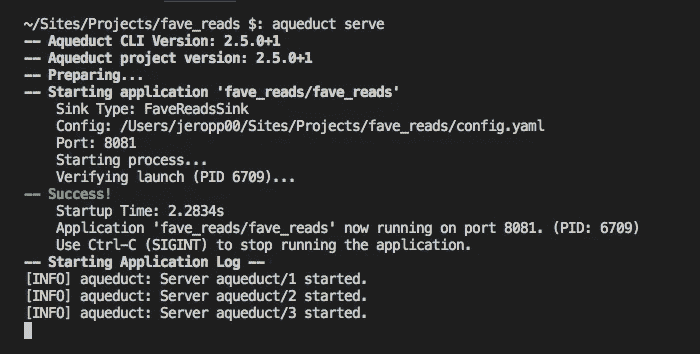
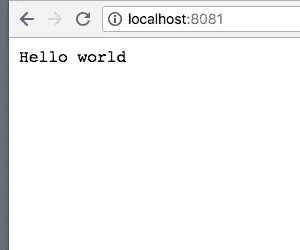
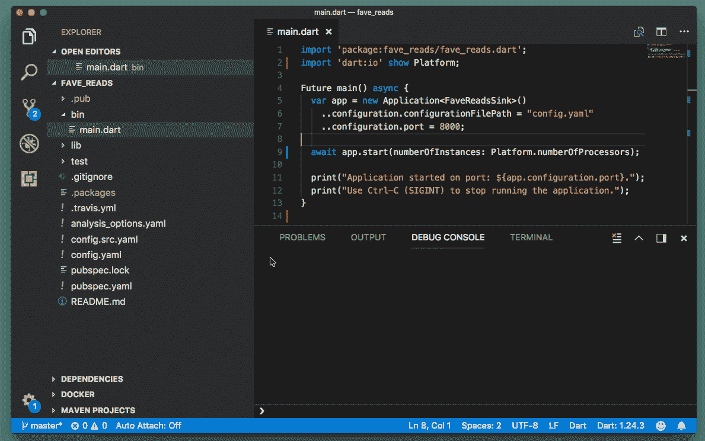

# 用 Dart、Aqueduct 和 PostgreSQL 构建 RESTful Web APIs 第 1 部分

> 原文：<https://itnext.io/building-restful-web-apis-with-dart-aqueduct-and-postgresql-3cc9b931f777?source=collection_archive---------0----------------------->


***请注意:从 Dart 2 开始，导水管的 API 发生了变化，导致了重大变化。本文基于 Dart v1 的 Aqueduct 2.5.0。***

【http://bit.ly/aqueduct-tutorial】[***我已经更新了这个作为新的视频系列***](http://bit.ly/aqueduct-tutorial)

在这个关于另一个 restful api 教程(# yetanotherrat)的新系列中，我们将探索 Dart 平台及其在构建服务器端应用程序方面的贡献。

继我上一篇探索 Dart 语言的文章之后，我还研究了如何用 Dart 构建 RESTful web 服务。进一步挖掘，我偶然发现了 [**导水管**](https://aqueduct.io) 旁的稳仁。我第一眼看到它已经通过了第 2 版时印象深刻，一旦我发现文档很全面，有易于遵循的示例，我就确信要进一步探索。

在经历了如此多产和令人耳目一新的时间来浏览它的文档和跟随他们的例子之后，我现在很高兴带你和我一起踏上构建一个从头到尾都可以工作的 api 的旅程！

# 那么，什么是导水管？

这是一个开源框架，用于在服务器上创建和部署 RESTful web apis。它与*快车*和*哈比神*甚至*有着相似的味道。NET Web API，*提供了一个具有全面特性列表的入口点。

我最喜欢的是:

1.  流体，可链接**路线**。*组成你的路线的函数风格及其处理方法*
2.  一个 **CLI** 工具。*这允许你通过发布命令来搭建你的下一个项目*
3.  **开箱多线程**。*通过 Dart 的“隔离”加速应用程序的多个实例，在服务器上的所有 CPU 内核间扩展。*
4.  具有内置的**表单**。如果你使用关系数据库，这是必备的！还支持数据库迁移。
5.  有一个**集成测试**库。*因为你需要测试所有的东西！与 TravisCI 等工具配合良好。*

在本系列中，我们将为个人阅读列表(*姑且称之为* ***收藏夹*** )构建一个 api📚 *)* ，涵盖这些话题:

*   **第 1 部分:设置并运行示例** ( *我们到了*)
*   [**第 2 部分:用 CRUD 操作实现路由**](/building-restful-web-apis-with-dart-aqueduct-and-postgresql-part-2-routing-with-crud-operations-629fe58114fa)
*   [**第 3 部分:将 Web APIs 连接到 PostgreSQL 数据库**](https://medium.com/@98d967ac6f3a/90ff70742675)
*   [**第 4 部分:编写自动化测试**](/building-restful-web-apis-with-dart-aqueduct-and-postgresql-part-4-testing-de3618515639)
*   [***奖金内容*** DB 迁移和模型关系](/building-restful-web-apis-with-dart-aqueduct-and-postgresql-bonus-content-2fc086b7259a)


通过 [Giphy](https://giphy.com/gifs/door-wife-candles-GSrZUFaPs7yCs/fullscreen)

# 设置和运行示例

如果你还没有，我建议你安装 Dart SDK。有 Windows，Mac，Linux 的使用说明。

您可以通过检查终端来确认 Dart 正在运行:

```
dart --version
```

Dart 附带了一个名为 **pub** 的工具来管理它的包。让我们用这个工具来安装导水管:

```
pub global activate aqueduct
```

这使我们能够访问可执行文件`aqueduct`。转到您的工作目录，让我们创建我们的项目:

```
aqueduct create fave_reads && cd fave_reads
```

现在，您应该位于包含所有项目文件的`fave_reads`目录中。现在，我们将重点关注:

```
bin/
  main.dart
lib/
  fave_reads_sink.dart
pubspec.yaml
```

*   **bin/main.dart** *创建我们的服务器并启动 app*
*   **lib/fave _ reads _ sink . dart**s*用它的配置设置你的应用*
*   **pubspec.yaml** *包含关于项目的元数据。类似于有一个 package.json 用于 Node.js 开发*

让我们使用下面的命令启动应用程序:

```
aqueduct serve # or `dart bin/main.dart`
```

我们开始吧:



我们现在有一个运行在`http://localhost:8081`的服务器，`/example`是唯一创建的路由。访问`http://localhost:8081/example`将返回如下响应:

```
{ "key": "value" }
```

在这一点上，值得一提的是，Aqueduct 有一个 RequestSink 的概念，根据文档:

> 处理应用程序的初始化，包括设置路由、授权和数据库连接。

应用程序需要一个`RequestSink`子类来接收请求。我们的例子有一个扩展基类`RequestSink`的`FaveReadsSink`，使我们能够用自己的实现覆盖它的方法。具体方法有`setupRouter`和`willOpen`。第一种方法将允许我们定义与相关控制器和其他中间件的路由，而后者允许我们在路由建立之后和应用程序接收请求之前执行任何异步初始化。

对于当前请求，默认响应类型设置为 JSON。然而，这可以被设置为适合满足我们需求的任何内容类型。

让我们通过在 setupRouter 方法中创建第二个路由来演示这一点:

```
router.route('/').listen((request) async {
  return new Response.ok('Hello world')
    ..**contentType = ContentType.TEXT**;
});
```

使用方法级联，我们能够将 contentType 属性设置为`text/plain`。`ContentType`工具自带[飞镖](https://api.dartlang.org/stable/1.24.3/dart-io/ContentType-class.html)，可通过以下方式使用:

```
new ContentType(primaryType, subType, {String charset, Map parameters});
```

它已经有了 HTML、JSON 和 TEXT 的常量，所以在大多数情况下你应该使用它们。

现在，通过终止当前进程并再次运行`aqueduct serve`来重启服务器。访问根路径应该会得到以下结果:



答对了。

在总结之前，让我们将应用实例扩展到我们拥有的内核数量。在 **bin/main.dart** 中，当`app.start`被调用时，当前设置为 2:

```
await app.start(numberOfInstances: **2**);
```

为了解决这个问题，我们将从“dart:io”库中导入 Dart 的 [**平台**](https://api.dartlang.org/stable/1.24.3/dart-io/Platform-class.html) 类，并将 **main.dart** 修改如下:

```
import **'dart:io'** show **Platform**;Future main() async {
  ...
  ...
  await app.start(numberOfInstances: **Platform.numberOfProcessors**);
  ...
}
```

# VS 代码的一些开发技巧👈

首先，确保通过 Dart 代码安装 [**Dart**](https://marketplace.visualstudio.com/items?itemName=Dart-Code.dart-code) 扩展，以启用 Dart 和颤振支持。

其次，使用以下设置为 Dart 添加启动配置:

```
{
  "name": "Dart",
  "type": "dart",
  "request": "launch",
  "program": "${workspaceFolder}/bin/main.dart"
}
```

这将允许您通过 VS 代码运行应用程序，并能够添加断点来帮助调试:



本系列的第 1 部分到此结束。源代码[在 github](https://github.com/graphicbeacon/favereads) 上可用，而 [Part 2](/building-restful-web-apis-with-dart-aqueduct-and-postgresql-part-2-routing-with-crud-operations-629fe58114fa) 现在也可用。**如果您喜欢这篇文章，请喜欢并关注我**了解更多关于 Dart 的内容。

# 进一步阅读

1.  [渡槽文件](https://aqueduct.io/docs/)
2.  [开始使用 Pub](https://www.dartlang.org/tools/pub/get-started)
3.  [Joe Conway 在 2016 年 Dart 开发者峰会上的演讲](https://www.youtube.com/watch?v=twr3cDFCeo4)